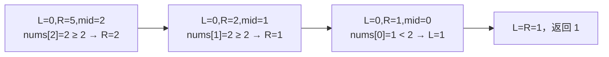

# 二分查找怎么写对？

> 二分翻车几乎都在边界：区间语义不统一，循环不变量一破就死循环或漏答案。

## 前提：单调性与二段性

二分真正依赖的不是「数组看起来有序」，而是**搜索空间能一刀切成两段**。

常见两类：

| 类型     | 例子                         | 怎么排除一半                         |
| -------- | ---------------------------- | ------------------------------------ |
| 下标单调 | 有序数组找 `target`          | `nums[mid]` 与目标比较，一侧必不可能 |
| 答案单调 | 最小速度、最小运力、最少天数 | 猜 `x` 可行时，更大/更小一侧整段同向 |

「爱吃香蕉」里，数组本身不必有序；单调的是**速度越大越容易在时限内吃完**。能对任意候选 `x` 写出 `check(x)`，且 `x` 变大时可行性单调变化，就可以在答案区间上二分。

判断口诀：

1. 在找位置、边界，还是最小/最大可行值？
2. 猜一个 `x`，能否在线性时间内判断是否可行？
3. `x` 变大/变小，可行性是否单调？

## 开闭区间与循环不变量

同一题可以写成闭区间或左闭右开，**关键是语义自洽，不要混用更新规则**。

| 区间              | 初始化       | 循环条件 | 排除 mid                |
| ----------------- | ------------ | -------- | ----------------------- |
| 闭区间 `[L, R]`   | `L=0, R=n-1` | `L <= R` | `L=mid+1` 或 `R=mid-1`  |
| 左闭右开 `[L, R)` | `L=0, R=n`   | `L < R`  | 视 mid 是否仍可能是答案 |

**循环不变量**要在整段循环里成立，例如：

- 闭区间标准查找：`target` 若存在，一定在 `[L, R]` 内；循环结束时区间为空。
- 下界：`[0, L)` 全小于 `target`，`[R, n)` 全 `>= target`；结束时 `L == R`。

中点**防溢出**统一写：

```text
mid = left + (right - left) / 2
```

不要写 `(left + right) / 2`——在大整数下标场景会溢出。向下取整时，若写成 `left = mid` 且区间只剩两个点，可能死循环；左边界模板里更常见的是 `right = mid`、`left = mid + 1`，保证区间严格收缩。

## 下界与上界模板

**下界 lower_bound**：第一个 `>= target` 的下标（可等于 `n`）。

```text
function lowerBound(nums, target):
    left, right = 0, len(nums)          // [left, right)
    while left < right:
        mid = left + (right - left) / 2
        if nums[mid] >= target:
            right = mid                 // mid 仍可能是答案
        else:
            left = mid + 1
    return left
```

**上界 upper_bound**：第一个 `> target` 的下标。最后一个 `<= target` = `upper_bound - 1`。

```text
function upperBound(nums, target):
    left, right = 0, len(nums)
    while left < right:
        mid = left + (right - left) / 2
        if nums[mid] > target:
            right = mid
        else:
            left = mid + 1
    return left
```

记一套就够：**永远找「第一个满足条件的位置」**；右边界用「第一个大于 target」再减一，不必另起一套逻辑。

过程示意：`[1, 2, 2, 2, 4]` 求第一个 `>= 2`：



## 代表题 1：标准查找与搜索插入位置

**标准查找**：闭区间，找到返回下标，否则 `-1`。

```text
function binarySearch(nums, target):
    left, right = 0, len(nums) - 1
    while left <= right:
        mid = left + (right - left) / 2
        if nums[mid] == target: return mid
        if nums[mid] < target:  left = mid + 1
        else:                   right = mid - 1
    return -1
```

**搜索插入位置**：本质就是 lower_bound——返回第一个 `>= target` 的位置。目标已存在时返回其下标；不存在时返回应插入的位置（含插到末尾的 `n`）。

边界自检：

| 输入      | target   | 期望   |
| --------- | -------- | ------ |
| `[]`      | 1        | 插入 0 |
| `[1]`     | 1        | 0      |
| `[1,3,5]` | 4        | 2      |
| `[1,3,5]` | 6        | 3      |
| `[1,1,1]` | 1 的下界 | 0      |

## 代表题 2：答案二分——最小吃香蕉速度

题目：若干堆香蕉，限时 `h` 小时，每小时只吃一堆中的 `k` 根，求最小速度 `k`。

单调性：`k` 越大，总耗时越少（非严格单调下降）。答案范围 `[1, max(piles)]`（在 `h >= 堆数` 的常见约束下，最大堆大小一定可行）。

```text
function minEatingSpeed(piles, h):
    left, right = 1, max(piles)
    while left < right:
        mid = left + (right - left) / 2
        if canFinish(piles, h, mid):
            right = mid                 // mid 可行，试更小
        else:
            left = mid + 1
    return left

function canFinish(piles, h, speed):
    hours = 0
    for pile in piles:
        hours += ceil(pile / speed)     // (pile + speed - 1) / speed
    return hours <= h
```

手写路径建议：

1. 说清搜索空间是答案区间，不是下标。
2. 定义 `check`：给定速度能否在 `h` 内吃完。
3. 可行则收右，不可行则抬左；结束时 `left` 即最小可行值。

同类题还有「在 D 天内送达包裹的最小运力」——框架相同，只换 `check`。

若是**旋转有序数组**找目标：先比 `nums[mid]` 与 `nums[left]`，判断哪一半仍有序，再看目标是否落在有序半段内，从而决定丢弃哪一半。本质仍是「mid 能排除一侧」。

## 复杂度

- 时间：每次砍掉一半搜索空间，`O(log n)`（答案二分是 `O(log R · T_check)`，`R` 为答案上界）。
- 空间：迭代写法 `O(1)`。

## 边界与易错清单

| 场景     | 注意点                                               |
| -------- | ---------------------------------------------------- |
| 空数组   | 先判 `n==0`；下界返回 0                              |
| 单元素   | 闭区间 `L=R=0` 必须能进循环                          |
| 全相等   | 下界到 0、上界到 n，别扫两边退化成 O(n)              |
| 死循环   | `left = mid` 且 mid 向下取整时区间可能不缩           |
| mid 方向 | mid 仍可能是答案 → `right = mid`；已不可能 → `mid±1` |
| 溢出     | mid 用 `left + (right-left)/2`；`check` 累计用 long  |
| 混用区间 | 闭区间用 `<=`，左闭右开用 `<`，更新规则跟着变        |

最容易错的一句：**当 `nums[mid]` 已满足条件时，能不能直接丢掉 mid？** 找精确值可以；找边界/最小可行值通常不能。

## 小结

1. 二分前提是单调性/二段性，不只是「数组有序」。
2. 先定区间语义与循环不变量，再写 `left/right` 更新。
3. 下界、上界记「第一个满足条件的位置」一套模板即可。
4. 答案二分先写对 `check`，再套边界收缩框架。
5. 空、单元素、全相等、mid 取整方向是手写必验点。

## 参考

综合自二分查找边界模板、答案二分与常见变形题整理，并按循环不变量统一了开闭区间写法。
