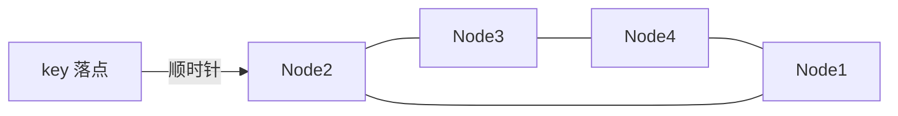

# 哈希冲突和一致性哈希怎么理解？

> 哈希表解决期望 O(1) 查找；一致性哈希解决节点增减时的映射抖动。

面试里这两块常被一起问：进程内用哈希表做快速定位，分布式里用哈希做 key 到节点的路由。名字都带“哈希”，解决的问题却不一样——前者怕冲突与退化，后者怕扩缩容时几乎全量迁移。

## 哈希表的三层结构

哈希表可以拆成三层：

1. **数组桶（bucket）**：真正放数据的地方，下标访问 O(1)。
2. **哈希函数**：把任意 key 映射成整数，再落到数组下标。
3. **冲突策略**：多个 key 落到同一桶时，决定怎么继续存、怎么继续找。

理想路径是“算一次哈希 → 直接命中桶 → 返回 value”，期望复杂度 O(1)。但 O(1) 是**期望/平均**，不是任何输入下的绝对保证：哈希函数偏斜、负载过高、恶意构造冲突，都可能让桶内查找变长。

```text
key ──hash──► 整数 ──映射下标──► bucket[i]
                                   │
                         空 / 单节点 / 链表或树 / 探测序列
```

好的哈希函数要：同一 key 结果稳定、计算足够快、分布尽量散。进程内哈希表关心的是速度和分布，不是密码学抗碰撞。

## 冲突怎么解：链地址 vs 开放寻址

冲突无法完全避免（鸽巢原理），只能设计策略消化。

| 策略           | 做法                   | 优点                   | 代价 / 场景            |
| -------------- | ---------------------- | ---------------------- | ---------------------- |
| 链地址（拉链） | 桶上挂链表或树         | 实现直观，删除简单     | 链表过长会退化         |
| 开放寻址       | 冲突后在数组内继续探测 | 局部性更好、无额外指针 | 删除、聚集、高负载更难 |
| 再哈希         | 换一组哈希函数重算     | 理论可选               | 工程成本高，少见       |

**链地址**：`HashMap` 就是这条路。桶里可能是空、单节点、链表，JDK 8 起链表过长且容量够大时会树化，把极端冲突从近似 O(n) 压到 O(log n)。

**开放寻址**：元素全在数组里。线性探测最简单，但容易形成“连续占用段”（聚集）；二次探测、双重哈希可缓解。删除常要“墓碑”标记，否则探测链会断。

一句话对比：链地址把冲突“摊到桶外结构”，开放寻址把冲突“摊到数组后续空位”。

## 负载因子、扩容与摊还

```text
负载因子 = 元素个数 / 数组容量
```

负载越高，冲突越多；负载越低，空间越浪费。Java `HashMap` 默认 **0.75**：时间和空间的经验折中。超过 `capacity * loadFactor` 就扩容（通常翻倍），然后 rehash 搬迁。

单次触发扩容的插入是 O(n) 的，但多数插入是 O(1)。从**摊还**角度看，n 次插入总成本约 O(n)，平均仍是 O(1)。面试别只背“O(1)”，要补一句：扩容那一下贵，摊还后仍然可接受。

## Java HashMap 只记要点

这篇不展开源码长文，只钉住和“哈希表”直接相关的几刀：

- **容量是 2 的幂**：`hash & (n - 1)` 等价取模，更快，也方便扩容后元素“要么在原位，要么在原位 + 旧容量”。
- **扰动**：`hashCode` 高低位再混一次，避免低位分布差时冲突扎堆。
- **树化阈值**：链表长度达到阈值且数组够大才树化；否则优先扩容更划算。
- **期望 O(1)、最坏可退化**：树化是兜底，不是“永远 O(1)”的护身符。

自定义 key 时 `equals` 与 `hashCode` 必须一致；可变对象当 key 且改了参与哈希的字段，会“找不回自己”。

## 普通取模分片：hash % N 的硬伤

缓存集群、分片存储里，最直观的路由是：

```text
node = hash(key) % N
```

N 固定时没问题：同一 key 永远落同一节点。**N 一变（扩容、缩容、宕机）几乎全盘重算**：

```text
hash(key)=7，N=3 → 7%3=1
N 变成 4         → 7%4=3   // 节点变了
```

节点从 N 变 N±1 时，平均约 (N-1)/N 的 key 映射会变，趋近全量迁移。缓存场景里就是大规模 miss → 穿透打库；存储场景就是大迁移窗口。这就是一致性哈希要砍掉的问题。

## 一致性哈希：把空间拧成环

核心变化：**不再对节点数 N 取模，而对固定大空间取模**（常见 2^32），并把空间看成首尾相接的**哈希环**。

1. 把节点（IP / 主机名）哈希到环上。
2. 把 key 也哈希到环上。
3. 从 key 位置**顺时针**走到第一个节点，就是负责它的节点。



假设环上顺序是 Node1 → Node2 → Node3 → Node4：

- 删 Node2：原先落在 Node1～Node2 区间的数据，改由顺时针后继 Node3 接管；Node1、Node4 不受影响。
- 在 Node1 与 Node2 之间加 Node5：只有 Node1～Node5 这段从 Node2 迁到 Node5。

**增删只扰动相邻区间**，迁移量从“近乎全量”降到“约 1/N 量级”。

## 虚拟节点：治倾斜，也治扩缩不均

节点少时，真实节点在环上可能扎堆：有的节点负责大半个环，有的几乎空转。更糟的是宕机时压力全部砸到**顺时针唯一邻居**，容易连锁过载。

**虚拟节点**：一个物理节点在环上放很多“分身”（如 `ip#1` … `ip#160`），路由先命中虚拟节点，再映射回物理机。

| 效果         | 原因                                   |
| ------------ | -------------------------------------- |
| 分布更均匀   | 环上点更密，区间被切碎                 |
| 宕机压力打散 | 多个虚节点下线，后继可能对应不同物理机 |
| 可做权重     | 机器更强 → 虚节点更多 → 被命中概率更高 |

工程上虚节点数量常上百量级；太少均衡差，太多元数据与查找成本上升，需要按规模权衡。

## 取模 vs 一致性哈希

| 维度       | `hash % N`       | 一致性哈希（+ 虚节点）    |
| ---------- | ---------------- | ------------------------- |
| 映射规则   | 对节点数取模     | 环上顺时针找后继          |
| 增删迁移量 | 近乎 O(全部 key) | 约影响 1/N                |
| 均衡性     | N 固定时通常够用 | 依赖虚节点密度            |
| 实现复杂度 | 极低             | 环结构 + 虚节点 + 元数据  |
| 适用       | 节点几乎不变     | 节点会动态变化的缓存/分片 |

实现环时，节点位置常放进有序结构（如 `TreeMap`），对 key 的哈希做 `ceiling` / 回绕到最小节点，即可完成“顺时针找后继”。

```java
// 示意：TreeMap 当环，virtualNodeHash -> physicalNode
NavigableMap<Integer, String> ring = new TreeMap<>();
// put 多个虚节点哈希...
Map.Entry<Integer, String> e = ring.ceilingEntry(hash(key));
String node = (e != null) ? e.getValue() : ring.firstEntry().getValue();
```

## 工程落地与边界

常见用法：

- **本地缓存分片 / 多实例缓存**：key 稳定打到同一实例，命中率才有意义。
- **部分网关、存储路由、会话亲和**：希望“同一用户/会话尽量落同一后端”，又要容忍后端上下线。

边界要讲清楚：

1. **热点 key 一致性哈希治不好**。一个超级热 key 仍打在一个节点上；需要本地缓存、拆 key、多副本读、限流等单独治理。
2. **Redis Cluster 不是经典一致性哈希**。它用 16384 个**哈希槽**，`CRC16(key) % 16384` 定槽，槽再分配给节点；迁移以槽为单位。思想相近（尽量少动映射），实现是槽表而不是“纯环 + 虚节点”那一套。别在面试里把两者直接等同。
3. **一致性哈希降低迁移比例，不保证零迁移、不保证绝对均衡**；虚节点是工程补丁，不是数学上完美均匀。

## 容易踩的坑

- 把“平均 O(1)”说成“永远 O(1)”，不提冲突与扩容摊还。
- 只画环不提虚节点，被追问倾斜和宕机雪崩时接不住。
- 以为一致性哈希能替代热点治理。
- 把 Redis Cluster 槽位模型背成“标准一致性哈希环”。

## 小结

1. 哈希表 = 数组桶 + 哈希函数 + 冲突策略；期望 O(1)，冲突与高负载会退化。
2. 链地址（含树化）与开放寻址是两条主路；0.75 负载与扩容 rehash 要用摊还视角理解。
3. `hash % N` 节点一变近乎全量迁移；一致性哈希用环把影响压到相邻区间。
4. 虚节点解决倾斜，并让宕机/扩缩压力被多个物理节点分担。
5. 工程用于缓存分片与部分路由；热点 key 另治；Redis Cluster 是哈希槽，不是经典环模型。

## 参考

综合自哈希表冲突与扩容原理、一致性哈希环与虚拟节点资料，并结合 Java `HashMap` 要点与 Redis Cluster 槽模型做了边界核对后重写。
