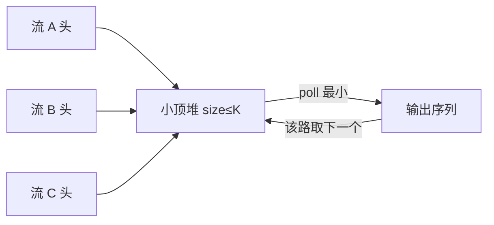

# 堆和 TopK 怎么做？

> TopK 不是先全排再截断，而是用一个大小为 K 的堆守住候选边界。

## 堆到底保证了什么？

堆是一棵满足“父子有序、兄弟不管”的树。常说的二叉堆再加一条：形状上接近完全二叉树，方便用数组存。

- 大顶堆：每个父节点 ≥ 两个子节点，堆顶是全局最大。
- 小顶堆：每个父节点 ≤ 两个子节点，堆顶是全局最小。

注意边界：堆性质只约束父和子，不约束左右兄弟。所以堆不是中序有序的 BST，也不能假设“遍历堆数组就能得到有序序列”。

```text
大顶堆示例              数组下标（从 0 起）
      9                    0: 9
    /   \                1: 7   2: 8
   7     8               3: 3   4: 5   5: 6
  / \   /
 3   5 6
```

数组存完全二叉树时，对下标 `i`：

| 关系 | 下标（0-based） |
| ---- | --------------- |
| 父   | `(i - 1) / 2`   |
| 左子 | `2 * i + 1`     |
| 右子 | `2 * i + 2`     |

不用指针也能在 O(1) 跳到父子，这是工程里几乎都用数组实现二叉堆的原因。

## 上浮、下沉和复杂度

堆的维护动作就两个：上浮（sift up）和下沉（sift down）。

**插入**：新元素先放到数组末尾，再和父节点比；若破坏堆序就交换，一直上浮到合适位置。路径最多是树高，所以 O(log n)。

**删堆顶**：把末尾元素挪到堆顶，再和子节点里“更该上位”的那个比，一直下沉。也是 O(log n)。

**看堆顶**：直接读下标 0，O(1)。

**建堆**：不是 n 次插入。正确做法是从最后一个非叶子节点向前，对每个节点做一次下沉。叶子很多、路径短，总代价是 O(n)，不是 O(n log n)。

| 操作   | 复杂度     | 直觉                        |
| ------ | ---------- | --------------------------- |
| 看堆顶 | O(1)       | 极值就在根                  |
| 插入   | O(log n)   | 末尾放入后上浮              |
| 删堆顶 | O(log n)   | 末尾补顶后下沉              |
| 建堆   | O(n)       | 自底向上批量下沉            |
| 堆排序 | O(n log n) | 建堆 + 反复取顶，不稳定排序 |

和有序数组比：有序数组取最大/最小是 O(1)，但插入删除要挪元素，是 O(n)。堆牺牲了“全序”，换来“反复插删极值”的高效路径。

## 优先队列：堆的接口形态

优先队列（Priority Queue）是“每次取出当前优先级最高元素”的抽象；底层最常见实现就是堆。

Java 里 `PriorityQueue` 默认是**小顶堆**：`peek()` / `poll()` 拿到的是当前最小元素。

```java
// 默认小顶堆
PriorityQueue<Integer> min = new PriorityQueue<>();
min.offer(3);
min.offer(1);
min.offer(2);
// poll 顺序：1, 2, 3

// 大顶堆：比较器反过来
PriorityQueue<Integer> max = new PriorityQueue<>((a, b) -> Integer.compare(b, a));
// 不要写 b - a，Integer.MIN_VALUE 等边界会溢出
```

自定义对象时，比较器必须形成**全序且一致**：`compare(a,b)==0` 应与业务上“同等优先级”一致；同一对元素多次比较结果不能变。`PriorityQueue` 不是线程安全的；多线程场景用 `PriorityBlockingQueue`，或外部加锁。

## TopK：用大小为 K 的堆守边界

经典题：在 n 个数里找最大的 K 个，或第 K 大。

**求最大 K 个 → 用容量 K 的小顶堆。**

原因：小顶堆的堆顶是“当前候选里最弱的那个”。新来的数如果连这个最弱者都打不过，一定进不了 TopK；打得过，就踢掉最弱者、放进新人。遍历结束，堆里就是最大的 K 个，堆顶是第 K 大。

**求最小 K 个 → 用容量 K 的大顶堆。** 对称：堆顶是候选里最大的那个，新数更小才替换。

```java
// 第 K 大：小顶堆，容量 K
int findKthLargest(int[] nums, int k) {
    PriorityQueue<Integer> heap = new PriorityQueue<>();
    for (int x : nums) {
        if (heap.size() < k) {
            heap.offer(x);
        } else if (x > heap.peek()) {
            heap.poll();
            heap.offer(x);
        }
    }
    return heap.peek();
}
```

跑一遍 `[3, 2, 1, 5, 6, 4]`，求第 2 大（K=2）：

```text
3 入堆 → [3]
2 入堆 → [2, 3]   堆顶 2
1 ≤ 2，跳过
5 > 2，踢 2 进 5 → [3, 5]
6 > 3，踢 3 进 6 → [5, 6]
4 ≤ 5，跳过
堆顶 5 即第 2 大
```

复杂度：每个元素最多一次入堆/出堆，堆大小恒为 K，整体 **O(n log k)**，额外空间 O(k)。

## 和全排序、快选怎么比？

| 方案         | 时间                  | 空间      | 特点                                        |
| ------------ | --------------------- | --------- | ------------------------------------------- |
| 全排序后截断 | O(n log n)            | O(1)~O(n) | 简单，但 K 远小于 n 时浪费                  |
| 大小 K 的堆  | O(n log k)            | O(k)      | 实现稳，流式友好，工程默认首选              |
| 快速选择     | 平均 O(n)，最坏 O(n²) | O(1)      | 只要第 K，不需要全部 K 个时更快，但写起来细 |

经验取舍：

- 只要第 K 大一个值，且数据可原地改：快选平均更优。
- 要 TopK 全部元素、数据流、或 K 很小：堆最合适。
- n 不大、代码要极简：直接排序也能过。

前 K 高频是同一套路：先哈希计数 O(n)，再对“词频对”维护大小 K 的小顶堆，整体 O(n + m log k)，m 是不同键个数。

## 工程里堆在干什么？

堆一旦和“反复取最值”挂钩，场景就很多：

| 场景            | 怎么用堆                                         |
| --------------- | ------------------------------------------------ |
| 热点排行榜      | 小顶堆守 TopK；或定时从全量计数里重算            |
| 合并 K 路有序流 | 小顶堆每次弹出全局最小，再把该路下一条压入       |
| 定时 / 延迟任务 | 以到期时间为键的小顶堆（时间堆），堆顶最近要触发 |
| 任务调度        | 按优先级出队；同优先级再按到达时间               |
| 数据流中位数    | 一个大顶堆管较小一半，一个小顶堆管较大一半       |

合并 K 路有序链表/文件就是教科书例子：堆里始终最多 K 个“各路当前头”，总复杂度 O(N log k)，N 是总元素数。



## 海量数据：分片 TopK 再合并

单机内存装不下 n 时，堆仍然有用，但要加一层分治：

1. 把数据按机器 / 文件 / 哈希桶切成 m 片。
2. 每片各自算 TopK（本地小顶堆），得到 m 组候选，共 m·K 个。
3. 对这 m·K 个再跑一次 TopK，得到全局 TopK。

正确性前提：全局 TopK 里的任何一个元素，一定会出现在它所在分片的本地 TopK 里——否则该分片里会有 K 个更大的数，全局也不可能轮到它。注意这是“最大 K”的论证；最小 K 同理换堆型。

若 TopK 基于“词频”而不是“数值本身”，分片前要先保证同一 key 的计数能汇总，否则要先按 key 分区再聚合，不能直接各片截断后合并。

## 容易踩的坑

1. **堆型记反**：求最大 K 用小顶堆，求最小 K 用大顶堆。口诀：堆里装的是“当前答案候选”，堆顶是“最容易被淘汰的边界”。
2. **比较器溢出 / 不一致**：用 `Integer.compare` / `Comparator.comparingInt`，别用减法；`equals` 与 `compare` 不一致时，业务语义会乱。
3. **堆中对象可变**：入堆后若改了参与比较的字段，堆序静默损坏，后续 `poll` 结果错，且很难查。要么入堆用不可变快照，要么删改走“先删后插”而不是原地改。
4. **别当有序结构遍历**：`PriorityQueue` 的迭代器不保证有序；要有序输出只能反复 `poll`，或拷出来再排序。
5. **建堆复杂度**：面试常有人答 O(n log n)。批量建堆是 O(n)；n 次 `offer` 才是 O(n log n)。
6. **K 与 n 边界**：`k == 1` 退化成求极值；`k == n` 时堆法和排序同阶，直接排序更直观；重复元素按“排序位置”的第 K，不是“第 K 个不同值”，除非题目另说。

## 小结

1. 堆只保证父优于子，数组实现完全二叉树，靠上浮/下沉维持，插删 O(log n)，建堆 O(n)。
2. `PriorityQueue` 默认小顶堆；自定义比较器要防溢出、保持一致性。
3. TopK：最大 K 用容量 K 的小顶堆，最小 K 用大顶堆，复杂度 O(n log k)。
4. 比全排序省在 K≪n；比快选稳在流式与要完整 K 个元素时。
5. 工程上覆盖排行、K 路合并、时间堆调度；海量数据用“分片 TopK + 合并”。

## 参考

综合自堆性质、数组实现与优先队列用法，以及 TopK / 分治合并的常见工程实践整理；建堆 O(n)、比较器溢出与可变对象破坏堆序等点按实现语义复核。
