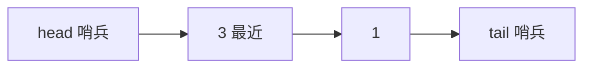

# LRU 怎么实现与应用？

> 缓存空间有限，淘汰谁？LRU 的答案是：淘汰最久没被访问的那一个——不是最早插入的，而是最近最冷的。

## 先把定义钉死

LRU 全称 **Least Recently Used**。核心假设很朴素：刚被访问过的数据，短期内大概率还会再被访问；很久没人碰的，先丢掉。

常见误读：**「最久未访问」≠「最早插入」**。插入时间和最近访问时间是两回事——一个 key 即使很早就放进缓存，只要它最近还被读过，就仍然是「热」的。

用容量为 2 的缓存走一遍（左=最近使用）：

| 操作       | 链表状态 | 说明               |
| ---------- | -------- | ------------------ |
| `put(1,1)` | `1`      | 新节点入头         |
| `put(2,2)` | `2 → 1`  | 2 最新             |
| `get(1)`   | `1 → 2`  | 1 被访问，挪到头部 |
| `put(3,3)` | `3 → 1`  | 超容，淘汰尾部 2   |

`1` 比 `2` 更早插入，但 `get(1)` 之后 `1` 变新了，真正出局的是 `2`。若答成「淘汰 1」，就是把 LRU 和 FIFO 搞混了。

## 为什么是 HashMap + 双向链表

要同时满足：按 key 查 value 是 O(1)；访问后调序、满时删最旧也是 O(1)。单独用一种结构做不到：

| 只用…         | 能做到                 | 做不到               |
| ------------- | ---------------------- | -------------------- |
| HashMap       | O(1) 按 key 取值       | 不知道谁最久未访问   |
| 链表          | 天然有顺序，尾部可淘汰 | 按 key 找节点要 O(n) |
| 数组 + 时间戳 | 能排序找最旧           | 查找/移动都贵        |

经典组合：

- **`HashMap<key, Node>`**：O(1) 定位节点；
- **双向链表**：维护「最近 → 最久」的访问顺序。

节点里要同时存 `key` 和 `value`：淘汰尾节点时手里只有节点指针，必须靠节点上的 key 才能从 map 里删掉对应条目。

## 为什么必须是「双向」，还要哨兵

把节点挪到头部 = 先从原位置摘下，再插到头。摘下要改前驱和后继两边：

```text
node.prev.next = node.next;
node.next.prev = node.prev;
```

单向链表只有 `next`。HashMap 能拿到当前节点，但拿不到前驱——只好从头扫，O(n)。双向的 `prev` 让「删除任意位置」变成 O(1)。

再补一个技巧：**虚拟头尾哨兵**。两端各放一个不存业务数据的哑节点，让「空链表 / 单节点 / 删头删尾」走同一套指针代码，少写 null 分支。

约定：

- **头（head 右侧第一个真实节点）= 最近使用**
- **尾（tail 左侧第一个真实节点）= 最久未使用**
- 满了就删 tail 前面那个



上图对应 `put(3)` 之后：`3` 最新，`1` 次新，`2` 已淘汰。

## 手写 get / put

面试时别一上来堆完整类，先拆动作：

1. `get`：map 查不到返回 -1；查到则 **移到头部** 再返回 value。
2. `put`：key 已存在 → 更新 value 并移头；不存在 → 新节点插头，超容删尾。
3. 链表操作封装成 `addToHead` / `remove` / `moveToHead` / `removeTail`。

最容易漏的一点：**`get` 也要更新顺序**。读也是一次访问，不挪节点就不是 LRU。

```java
class LRUCache {
    private final int capacity;
    private final Map<Integer, Node> map = new HashMap<>();
    private final Node head = new Node(0, 0);
    private final Node tail = new Node(0, 0);

    LRUCache(int capacity) {
        this.capacity = capacity;
        head.next = tail;
        tail.prev = head;
    }

    int get(int key) {
        Node node = map.get(key);
        if (node == null) return -1;
        moveToHead(node);          // 读也算访问
        return node.value;
    }

    void put(int key, int value) {
        Node node = map.get(key);
        if (node != null) {
            node.value = value;
            moveToHead(node);
            return;
        }
        Node created = new Node(key, value);
        map.put(key, created);
        addToHead(created);
        if (map.size() > capacity) {
            Node removed = removeTail();
            map.remove(removed.key); // 链表和 map 一起清
        }
    }

    private void moveToHead(Node n) { remove(n); addToHead(n); }

    private void addToHead(Node n) {
        n.prev = head; n.next = head.next;
        head.next.prev = n; head.next = n;
    }

    private void remove(Node n) {
        n.prev.next = n.next;
        n.next.prev = n.prev;
    }

    private Node removeTail() {
        Node n = tail.prev;
        remove(n);
        return n;
    }

    private static class Node {
        int key, value;
        Node prev, next;
        Node(int k, int v) { key = k; value = v; }
    }
}
```

`get` / `put` 都是 O(1)，空间 O(capacity)。

## 用 LinkedHashMap 偷懒也行

Java `LinkedHashMap` 构造第三个参数 `accessOrder=true` 时按**访问顺序**维护；再重写 `removeEldestEntry`，插入后自动踢最旧的：

```java
class LRUCache extends LinkedHashMap<Integer, Integer> {
    private final int capacity;

    LRUCache(int capacity) {
        super(capacity, 0.75f, true); // true = accessOrder
        this.capacity = capacity;
    }

    @Override
    protected boolean removeEldestEntry(Map.Entry<Integer, Integer> eldest) {
        return size() > capacity;
    }
}
```

两点记牢：`accessOrder=false` 是插入顺序（FIFO 味），`true` 才是 LRU；`LinkedHashMap` **不是线程安全**的，多线程本地缓存要么加锁，要么换成熟库。

## 和其他淘汰策略比一比

| 策略 | 淘汰依据     | 适合场景         | 代价                   |
| ---- | ------------ | ---------------- | ---------------------- |
| FIFO | 最早进入     | 实现极简         | 不管后来热不热         |
| LRU  | 最久未访问   | 有时间局部性     | 扫描流量会挤掉热点     |
| LFU  | 访问次数最少 | 长期热点稳定     | 要维护频率，老化更麻烦 |
| TTL  | 过期时间     | 数据有明确有效期 | 解决时效，不是容量压力 |

LRU 不是银弹。大范围扫表会把真正热点挤出缓存（缓存污染）；预读进来却从未访问的页，也会占着「新」的位置。操作系统 Page Cache、MySQL Buffer Pool 因此做冷热分区（active/inactive、young/old）——这是对经典 LRU 的工程改进，手写一般不要求。

## 工程边界：手写 LRU ≠ 生产缓存

1. **穿透 / 击穿 / 雪崩另治**。LRU 只管「容量满了删谁」，管不了「查不存在的 key 打穿 DB」「热点 key 过期瞬间并发回源」。这些靠空值缓存、互斥加载、多级过期、限流。
2. **单机 LRU ≠ 分布式一致**。每台机器各自维护淘汰顺序，进程重启归零。跨实例共享要走 Redis 等集中缓存；Redis 的 `allkeys-lru` 还是**近似 LRU**（随机采样再挑最旧），不是手写题那种精确双向链表。
3. **容量不是只数条目**。1000 个 1KB 和 1000 个 1MB 完全两回事；还要算对象头、引用。生产更常见按**最大内存/权重**淘汰。
4. **并发、过期、加载、统计** 手写成本高。Java 本地缓存首选 Caffeine：默认 **W-TinyLFU**（窗口 + TinyLFU 频率过滤）做准入，对扫描污染比纯 LRU 稳，还附带过期、权重、统计。手写用来讲原理，线上优先用库。

## 容易踩的坑

- `get` 命中后忘了 `moveToHead`——顺序不更新就退化成半吊子 LRU。
- 更新已有 key 时只改 value，不挪位置。
- 删尾节点后忘了 `map.remove(key)`，map 和链表不一致。
- 节点不存 key，淘汰时没法从 map 里删。
- `LinkedHashMap` 的 `accessOrder` 忘了设 `true`，做成了 FIFO。
- 把 LRU 说成「能解决缓存穿透」——淘汰策略解决不了查询路径问题。

## 小结

1. LRU 淘汰的是**最久未访问**的数据，不是最早插入的；`get` 和 `put` 都会刷新热度。
2. 标准实现是 **HashMap + 双向链表 + 头尾哨兵**：查 O(1)、移头/删尾 O(1)。
3. 单向链表删任意节点找不到前驱，所以必须双向；节点要同时带 key，方便同步删 map。
4. Java 可用 `LinkedHashMap(accessOrder=true)` + `removeEldestEntry` 快速实现；生产更常见 Caffeine / W-TinyLFU。
5. LRU 只管容量淘汰：穿透击穿、分布式一致、对象体积估算都要另案处理。

## 参考

综合自 LRU 经典数据结构实现、Java `LinkedHashMap` 访问序语义、Redis 近似淘汰与本地缓存工程实践整理；手写路径与容量=2 的 walkthrough 按实现语义交叉验证。
