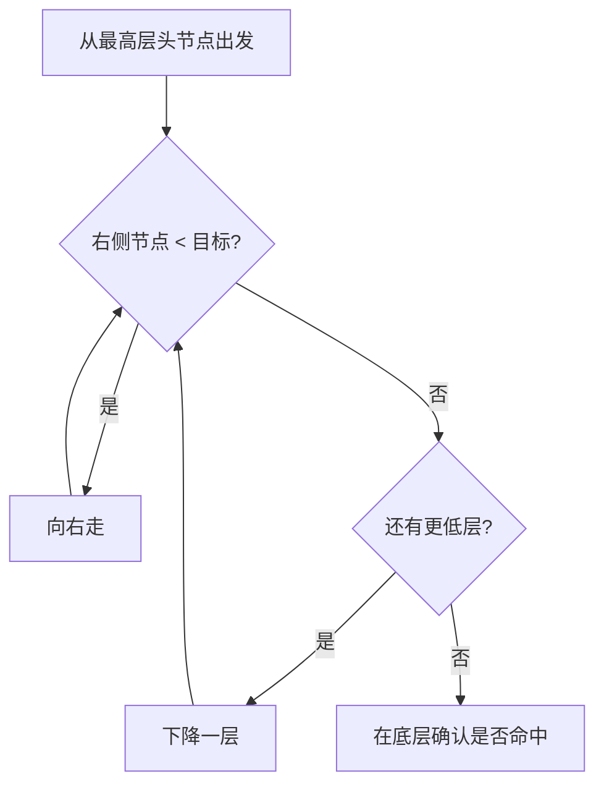

# 跳表和布隆过滤器怎么用？

> 跳表用多层索引换有序范围查询；布隆用位图换“可能存在”的快速判断。两类结构都是空间换时间，但解决的问题完全不同。

日常工程里，这两样经常和 Redis 一起出现：排行榜、按分数取区间会碰到跳表；缓存穿透、海量去重会碰到布隆。面试也常把它们绑在一起问，本质是在考你有没有分清「有序遍历」和「存在性预检」两条线。

## 跳表：有序链表上的多级快车道

普通有序链表要查一个值，只能从头往后扫，复杂度 `O(n)`。跳表的想法很朴素：在底层完整有序链表之上，再叠几层更稀疏的索引，让查询可以“先跳大步，再落细步”。

可以把它想成地铁线路：

- 最底层像每一站都停的慢车，信息最全。
- 上层像快车，只停大站，一次跨过很多节点。
- 查目标时先坐快车逼近，再换慢车精确落地。

抽象节点大致是：

```java
class SkipListNode {
    int value;
    SkipListNode[] forward; // forward[i] = 第 i 层的后继
}
```

一个节点如果出现在第 3 层，说明它在 0、1、2 层都有指针。越高层节点越少，索引越稀疏。

层数怎么定？跳表不靠旋转变色维持平衡，而是插入时用随机函数决定能升到几层：一定进底层；再像抛硬币，正面升一层，反面停。这样从概率上看，高度维持在 `O(log n)` 级别。

## 查找、插入、删除怎么走

查找原则只有一句：**能往右就往右，不能往右就往下。**



插入不是只改底层。先像查找一样走一遍，把**每一层的前驱**记进 `update[]`，再按随机层数把新节点挂到对应层。删除同理：找到各层前驱，把指针绕过目标节点。

| 操作     | 平均复杂度     | 说明                      |
| -------- | -------------- | ------------------------- |
| 查找     | `O(log n)`     | 多层索引跳过中间节点      |
| 插入     | `O(log n)`     | 定位后改多层前驱指针      |
| 删除     | `O(log n)`     | 定位后断开各层指针        |
| 范围查询 | `O(log n + k)` | 先定位起点，再底层扫 k 个 |

范围查询是跳表最舒服的能力：先 `O(log n)` 落到区间左端，再沿着最底层链表顺序吐出 `k` 个结果。这点比“会不会写红黑树中序遍历”更贴近工程。

## 跳表 vs 红黑树

两者查找/插入/删除平均都能到对数级，但取舍不同。

| 对比点   | 跳表                       | 红黑树                |
| -------- | -------------------------- | --------------------- |
| 平衡方式 | 随机层数，概率平衡         | 旋转 + 变色，严格平衡 |
| 实现难度 | 相对直观，调试友好         | 插入删除修复分支多    |
| 范围查询 | 底层链表顺序扫，非常自然   | 中序可做，工程上更绕  |
| 最坏情况 | 依赖随机性，理论不如严格树 | 有明确最坏约束        |
| 工程代表 | Redis ZSet                 | Java `TreeMap`        |

面试别说“跳表一定比红黑树快”。更稳的说法是：**范围遍历多、实现可控性优先时，跳表更合手；要严格最坏保证、标准库现成可用时，红黑树更常见。**

## Redis ZSet 为什么是跳表 + 字典

ZSet 要同时满足：

1. 按 member 快速拿 score
2. 按 score 有序、做范围和排名

单靠跳表，member 定位不够直接；单靠哈希，又没法按分数区间扫。所以大规模 ZSet 常见组合是：

```text
ZSet
├── dict：member -> score
└── skiplist：按 score（同分再按 member）有序
```

- `ZSCORE` 走字典
- `ZRANGE` / `ZRANGEBYSCORE` 走跳表：先定位起点，再连续返回
- 节点上的 `span` 还能在查找过程中累计跨度，支持 `ZRANK`

这正是跳表适合 `ZRANGE` 一类命令的原因：底层本身就是有序链表，范围结果不用额外“拼”出来。细节见站内 [ZSet 与跳表](/database/redis/redis-zset-skiplist.html)。

注意：小 ZSet 可能先用紧凑编码省内存，数据变大后才切到 dict + skiplist。说“ZSet 底层只有跳表”不完整。

## 布隆过滤器：用位图回答“可能存在吗”

跳表回答“有序集合里怎么查、怎么扫区间”；布隆回答另一类问题：海量集合里，某个元素**是否可能出现过**，而且内存必须极省。

结构只有两样：

- 长度 `m` 的位数组（初始全 0）
- `k` 个彼此独立的哈希函数

写入元素时，对它算 `k` 个哈希，把对应下标都置 1。查询时再算同样 `k` 个位置：

- **任意一位是 0** → 一定不存在
- **全部是 1** → 可能存在（也可能是别的元素把这些位“撞”成了 1）

所以标准布隆的边界可以压成一句：

- **有假阳性，无假阴性**
- 说“不存在”可信；说“存在”只能当预检

它不存原始值，只存哈希痕迹，所以空间极省。粗算：百万级 bit 大约一百多 KB 量级，远小于把字符串或 ID 全塞进 HashSet。

## 误判、参数与删除边界

误判率和三个参数绑在一起（定性理解即可）：

| 参数 | 含义         | 调大之后通常会怎样   |
| ---- | ------------ | -------------------- |
| `m`  | 位数组长度   | 冲突变少，误判率下降 |
| `k`  | 哈希函数个数 | 过少/过多都不理想    |
| `n`  | 预期元素个数 | 塞得越满，误判率越高 |

业务先定可接受的误判率 `p` 和规模 `n`，再反推 `m`、`k`。容量预估偏小，后面塞爆了，误判会明显恶化——这不是“坏了”，是参数被突破了。

标准布隆几乎不能删：一个 bit 可能被多个元素共享，清零可能把别人也抹掉。若必须支持删除，可提一句 **Counting Bloom**（位改成计数），代价是更大内存和更复杂维护。

Java 里工程上常用 Guava 的 `BloomFilter`（单机、API 清晰）；跨进程、要和缓存链路绑定时，看 Redis 模块侧的 RedisBloom。用法与穿透治理细节见 [Redis 布隆过滤器](/database/redis/redis-bloom-filter.html)。

```java
// Guava：预期 1500 个元素，目标误判率 1%
BloomFilter<Integer> filter =
    BloomFilter.create(Funnels.integerFunnel(), 1500, 0.01);
filter.put(42);
boolean maybe = filter.mightContain(42); // true 只表示可能
```

方法名 `mightContain` 本身就在提醒：这是概率结构，不是精确集合。

## 工程场景怎么选

| 场景           | 更合适的结构 | 原因                                    |
| -------------- | ------------ | --------------------------------------- |
| 排行榜 / 区间  | 跳表（ZSet） | 有序 + 范围遍历天然                     |
| 缓存穿透预检   | 布隆         | 用极低内存挡掉“一定不存在”的请求        |
| URL / 订单去重 | 布隆         | 海量、允许少量重复进下游                |
| 黑名单初筛     | 布隆         | 先拦明显命中，再做精确校验              |
| 必须 100% 精确 | 不要只靠布隆 | 误判成本不可接受时，要回源精确结构或 DB |

布隆适合的业务特征是：**误判成本可接受，漏判成本不可接受**。例如防穿透时，假阳性只是多查一次库；若把“已存在”的订单判成“一定没有”，就会漏单——标准布隆不会这么干，这正是它能上线的前提。

## 容易踩的坑

1. **把跳表当数组或二叉树。** 底层是链表，靠多层 `forward` 跳，不是二分下标。
2. **说跳表严格 `O(log n)`。** 平均/期望如此，靠随机层数；红黑树才有更硬的最坏约束。
3. **ZSet = 跳表。** 大对象通常是字典 + 跳表；小对象还可能是紧凑编码。
4. **布隆说存在就当真。** 只能当“可能存在”，后续仍要精确查。
5. **布隆当可删集合用。** 标准实现不支持安全删除；容量和误判率要一起规划。

## 小结

1. 跳表 = 有序链表 + 多级索引；查找向右再向下，平均 `O(log n)`，范围查询 `O(log n + k)`。
2. 插入/删除要维护多层前驱；平衡靠随机层数，实现通常比红黑树简单。
3. Redis 大 ZSet 用 dict + skiplist：字典查 member，跳表做有序与 `ZRANGE` 类范围扫描。
4. 布隆 = 位数组 + 多哈希；一定不存在 / 可能存在；标准实现有假阳性、无假阴性，极省内存但难删。
5. 跳表服务有序与范围；布隆服务廉价存在性预检。上布隆前先确认误判成本业务能不能扛。

## 参考

综合自跳表与布隆过滤器经典原理、Redis ZSet/RedisBloom 工程用法，并与站内 [ZSet 跳表](/database/redis/redis-zset-skiplist.html)、[布隆过滤器](/database/redis/redis-bloom-filter.html) 交叉对齐后整理。
