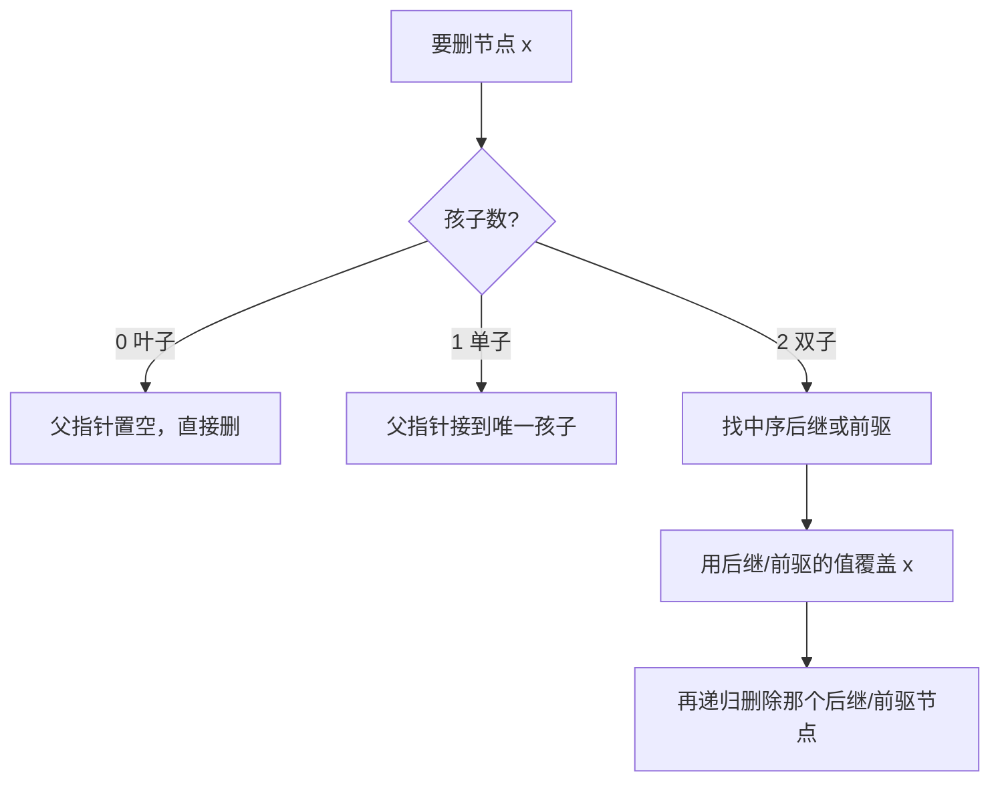

# 二叉树和 BST 要掌握什么？

> 树题真正要会的是：术语别混、遍历模板能写、BST 不变式能用、删除与平衡知道边界。

## 树的基本概念

树是非线性结构，任意两个节点之间有且仅有一条路径，n 个节点恰好 n-1 条边，没有回路。

白板上一棵树，常用术语如下（高度 / 深度都按**边数**定义，和多数教材一致）：

| 术语           | 含义                   | 例子                 |
| -------------- | ---------------------- | -------------------- |
| 根             | 没有父节点的顶层节点   | 整棵树的入口         |
| 叶子           | 没有子节点的节点       | 路径的尽头           |
| 父 / 子 / 兄弟 | 直接上下级、同父的节点 | 递归时的邻接关系     |
| 节点深度       | 根到该节点的边数       | 根深度为 0           |
| 节点高度       | 该节点到最远叶子的边数 | 叶子高度为 0         |
| 树高           | 根的高度               | 决定查找最坏路径长度 |

容易混的点：深度是"从根往下数"，高度是"从叶子往上数"。同一棵树里，根深度最小、高度最大；叶子深度可能各不相同，高度都是 0。

## 二叉树：形状与存储

二叉树每个节点最多两个孩子，且左右有序——左子树和右子树不能随意对调。

三种常考形状：

| 类型       | 直观定义                                 | 一句话用途       |
| ---------- | ---------------------------------------- | ---------------- |
| 满二叉树   | 每层节点数都打满，n = 2^(h+1)-1          | 形状最"整齐"     |
| 完全二叉树 | 除最后一层外都满，最后一层从左往右连续填 | 适合数组存（堆） |
| 平衡二叉树 | 任意节点左右子树高度差 ≤ 1               | 保证路径不退化   |

存储方式两种：

1. **链式存储**：节点里放 `val / left / right`（Java 就是对象引用）。一般二叉树都用它，稀疏时不浪费。
2. **数组存储**：只适合完全二叉树。根下标从 1 起，父节点 i 的左孩子 `2i`、右孩子 `2i+1`，父节点 `i/2`。堆就是靠这套下标在数组上原地调堆。

非完全二叉树硬塞进数组会出现大量空洞，内存利用率差，所以工程里普通树几乎全是链式。

## 遍历：递归模板 + 层序

前中后序本质是同一个递归骨架，差在"访问根"的时机：

```java
void dfs(TreeNode root) {
    if (root == null) return;
    // 前序：先根，适合复制树、构造路径前缀
    dfs(root.left);
    // 中序：左-根-右，BST 上得到有序序列
    dfs(root.right);
    // 后序：先左右再根，适合求高度、删节点、依赖子树结果
}
```

层序是 BFS，靠队列按层推进。很多"每层最大值 / 锯齿形 / 最小深度"都是它的变体：

```java
List<List<Integer>> levelOrder(TreeNode root) {
    List<List<Integer>> ans = new ArrayList<>();
    if (root == null) return ans;
    Queue<TreeNode> q = new ArrayDeque<>();
    q.offer(root);
    while (!q.isEmpty()) {
        int size = q.size();          // 本层节点数
        List<Integer> level = new ArrayList<>();
        for (int i = 0; i < size; i++) {
            TreeNode n = q.poll();
            level.add(n.val);
            if (n.left != null) q.offer(n.left);
            if (n.right != null) q.offer(n.right);
        }
        ans.add(level);
    }
    return ans;
}
```

选遍历的经验：

- 要"先拿到子树结果再算当前节点"→ 后序（高度、直径、是否平衡）。
- 要"路径前缀 / 先处理当前"→ 前序。
- 面对 BST 要有序输出 / 验证有序 → 中序。
- 按层统计、最短层数 → 层序。

## BST 的不变式与基本操作

二叉搜索树（BST）在二叉树之上加了一条硬约束：

> 对任意节点，左子树所有值 **<** 根 **<** 右子树所有值（是否允许等于要看题目；Java `TreeMap` 的 key 不重复）。

这条不变式直接决定操作：

| 操作 | 思路                     | 平均     | 最坏（斜树） |
| ---- | ------------------------ | -------- | ------------ |
| 查找 | 从根比较，小走左、大走右 | O(log n) | O(n)         |
| 插入 | 查到空位挂上去           | O(log n) | O(n)         |
| 删除 | 分三种情况，见下节       | O(log n) | O(n)         |

**中序遍历 BST 一定得到有序序列**——这是验证 BST、找第 K 小、找前驱后继的统一入口。

退化场景要能说清：如果按升序依次插入 `1,2,3,4,5`，每次都挂到最右，树就变成一条右链，等价于链表。平均 O(log n) 全没了。

## 删除：最容易写错的一处

删除按被删节点的孩子数分三种：



- **叶子**：最简单，父节点对应指针改 `null`。
- **只有一个孩子**：把孩子"顶替"上来，相当于链表删中间节点。
- **两个孩子**：不能两边都接上去。标准做法是找**中序后继**（右子树最左节点，值最小且仍 ≥ 原值），或**中序前驱**（左子树最右）。用它的值覆盖当前节点，再去删除那个后继 / 前驱——后继 / 前驱本身最多只有一个孩子，落到前两种情况。

手写时常见 bug：覆盖值之后忘了继续删后继；或者只比较了左右孩子却破坏了整棵子树的 BST 序。

## 平衡为何重要

斜树 = 链表，所有"树优势"归零。自平衡结构就是在插入 / 删除后通过旋转把高度压回 O(log n)。

|            | AVL                      | 红黑树                   |
| ---------- | ------------------------ | ------------------------ |
| 平衡严格度 | 任意节点高度差 ≤ 1，更严 | 靠颜色规则近似平衡，更松 |
| 查询       | 更稳、树更矮             | 仍是 O(log n)，略差一点  |
| 插入删除   | 旋转可能更频繁           | 调整次数通常更少         |
| 工程选型   | 读多写少的检索           | 写也频繁时更香           |

Java 里：

- `TreeMap` / `TreeSet`：红黑树，有序 Map/Set，单线程。
- `ConcurrentSkipListMap`：跳表实现的并发有序 Map，不是红黑树；需要并发有序结构时用它，别和 `TreeMap` 混谈。

面试一般不要求手写红黑旋转，能说清"为什么需要、和 AVL 差在松紧、Java 哪里用"就够。

## 别和 B+ 树搅在一起

|          | 内存里的 BST / 红黑 | 磁盘上的 B+ 树                             |
| -------- | ------------------- | ------------------------------------------ |
| 场景     | 进程内有序集合      | 数据库 / 文件系统索引                      |
| 设计目标 | 比较次数、缓存友好  | **减少磁盘 IO**，一页多 key、树更矮        |
| 数据位置 | 节点即数据          | 数据多在叶子，叶子串成有序链表，范围扫友好 |

一句边界：内存树解决"进程内有序查找"，B+ 树解决"磁盘页级索引"。MySQL InnoDB 用 B+ 树做索引，细节见 [为什么索引选 B+ 树](/database/mysql/mysql-why-bplus-tree.html)。面试时别把红黑性质往 B+ 树上套。

## 容易踩的坑

1. **高度 / 深度定义不统一**：有人按"节点数"算，有人按"边数"。开口先对齐定义，本文和常见实现都按边数。
2. **验证 BST 只比左右孩子**：`[5,1,4,null,null,3,6]` 这种右子树里藏了比根小的值会漏判。正确做法是给子树传上下界，或中序看是否严格递增。
3. **有序插入就退化**：自己实现 BST 却不谈平衡，复杂度别敢写死 O(log n)。
4. **数组下标从 0 还是 1**：完全二叉树公式 `2i / 2i+1` 默认根在 1；从 0 起要改成 `2i+1 / 2i+2`。
5. **TreeMap 当并发容器**：`TreeMap` 非线程安全；并发有序用 `ConcurrentSkipListMap`。

## 小结

1. 术语先对齐：深度从根往下、高度到叶子，按边数计；满 / 完全 / 平衡三种形状别混。
2. 遍历骨架一个递归走天下，中序服务 BST，层序用队列按层扫。
3. BST 不变式是左 < 根 < 右；查找插入删平均 O(log n)，有序插入退化为 O(n)。
4. 删除双子节点用后继或前驱替换，是手写最易错点。
5. 平衡保证最坏仍是对数；AVL 更严、红黑更工程；B+ 树是磁盘索引，别和内存树混谈。

## 参考

综合自树与 BST 基础、自平衡结构对比及 Java `TreeMap` / `ConcurrentSkipListMap` 使用边界，按边数定义统一高度深度，并区分内存树与磁盘 B+ 树场景。
