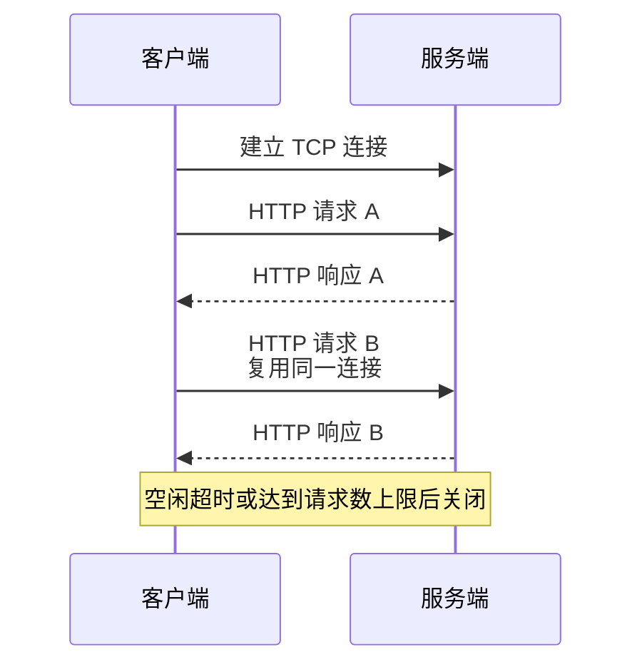
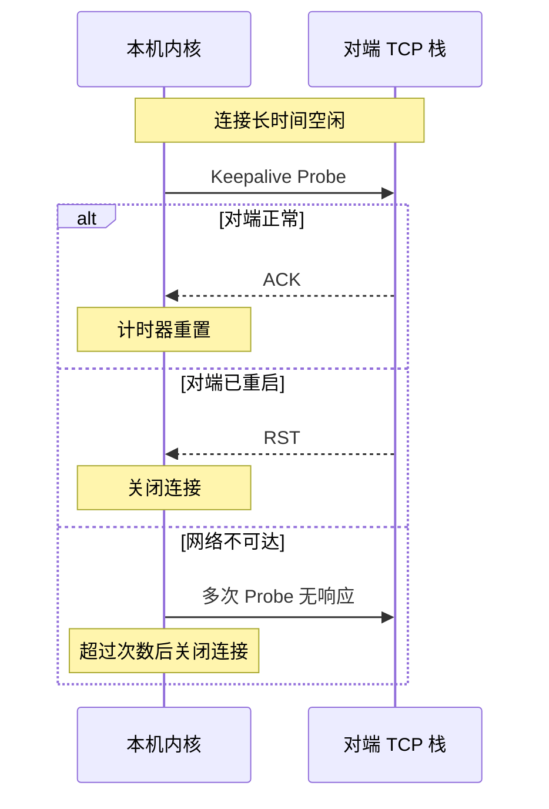

# HTTP Keep-Alive 和 TCP Keepalive 是一回事吗？

> 不是一回事：HTTP Keep-Alive 管连接复用，TCP Keepalive 管空闲 TCP 连接是否还活着。

## 先用一句话区分

| 名称            | 所属层 | 解决的问题                     | 谁实现                   |
| --------------- | ------ | ------------------------------ | ------------------------ |
| HTTP Keep-Alive | 应用层 | 一个连接能否复用多个 HTTP 请求 | 浏览器、Web 服务器、代理 |
| TCP Keepalive   | 传输层 | 空闲 TCP 连接的对端是否还活着  | 操作系统内核             |

一个是“别每个请求都重新建连接”，一个是“长时间没数据时探测对方还在不在”。名字像，但目标完全不同。

## HTTP Keep-Alive 解决什么？

HTTP/1.0 默认短连接：请求一次，响应一次，关闭一次。页面有几十个资源时，重复 TCP 握手、TLS 握手、慢启动和挥手成本很高。

HTTP Keep-Alive 让一条 TCP 连接服务多个 HTTP 请求：



版本边界：

- HTTP/1.0 默认短连接，需要显式 `Connection: Keep-Alive`。
- HTTP/1.1 默认长连接，要关闭才写 `Connection: close`。
- HTTP/2 禁止 `Connection`、`Keep-Alive` 这类连接级头部，改为单 TCP 连接上的多路复用。
- HTTP/3 基于 QUIC，不使用 HTTP/1.x 的 `Connection: Keep-Alive` 机制。

常见服务端参数：

```nginx
keepalive_timeout 75s;
keepalive_requests 1000;
```

这些参数决定连接空闲多久关闭、最多服务多少请求。服务端可以到了阈值就主动关闭，不需要先探测客户端是否在线。

## TCP Keepalive 解决什么？

TCP Keepalive 处理的是另一种问题：一条 TCP 连接长时间没数据，对端主机可能已经崩了、断网了、NAT 表项被清了，本机却不知道。

开启 TCP Keepalive 后，内核会在连接空闲一段时间后发探测包：



Linux 常见默认值：

```bash
sysctl net.ipv4.tcp_keepalive_time
sysctl net.ipv4.tcp_keepalive_intvl
sysctl net.ipv4.tcp_keepalive_probes
```

典型默认是空闲 7200 秒后探测、间隔 75 秒、最多 9 次。也就是说默认发现死连接可能要两个多小时。

还要注意：TCP Keepalive 默认通常不开。应用需要设置 `SO_KEEPALIVE`，否则内核不会对这条 socket 发探测。

## 两者为什么不能互相替代？

HTTP Keep-Alive 不能判断 TCP 对端是否“死了”。它只是连接复用策略，服务端到了空闲超时或请求次数上限，可以直接关。

TCP Keepalive 也不能判断应用是否健康。对端内核能回 ACK，不代表对端应用线程池正常、事件循环没卡、数据库连接池没爆。

所以在线业务常见组合是：

- HTTP Keep-Alive：减少重复建连。
- TCP Keepalive：兜底清理长期空闲死连接。
- 应用层心跳：判断业务进程或协议层是否健康，比如 WebSocket Ping/Pong、gRPC keepalive、业务自定义心跳。

## 和 TIME_WAIT 有什么关系？

HTTP Keep-Alive 配置不当会制造大量短连接，进而放大 `TIME_WAIT`。

比如服务端 `keepalive_requests` 过小，高 QPS 下每条连接服务很少请求就被服务端主动关闭。谁主动关闭，谁进入 `TIME_WAIT`，所以服务端可能出现大量 `TIME_WAIT`。

排查命令：

```bash
ss -tan state time-wait | wc -l
ss -s
grep -R "keepalive" /etc/nginx/nginx.conf /etc/nginx/conf.d 2>/dev/null
```

如果客户端和服务端任意一方禁用 HTTP 长连接，服务端在响应结束后主动关闭也很常见，这时服务端 `TIME_WAIT` 会明显增加。

## 小结

- HTTP Keep-Alive 是应用层长连接复用，减少重复建连和慢启动开销。
- TCP Keepalive 是内核 TCP 保活，探测长时间空闲连接的对端是否还存在。
- HTTP/1.1 默认长连接；HTTP/2/3 不使用 HTTP/1.x 的 `Connection: Keep-Alive` 语义。
- TCP Keepalive 默认探测很慢，而且需要应用显式开启 `SO_KEEPALIVE`。
- 两者都不能替代应用层心跳，也不能单独证明业务服务健康。

## 参考

综合社区资料，并结合 HTTP/2/3 连接级头部边界、Nginx keepalive 参数和 `TIME_WAIT` 排查场景做了整理。
