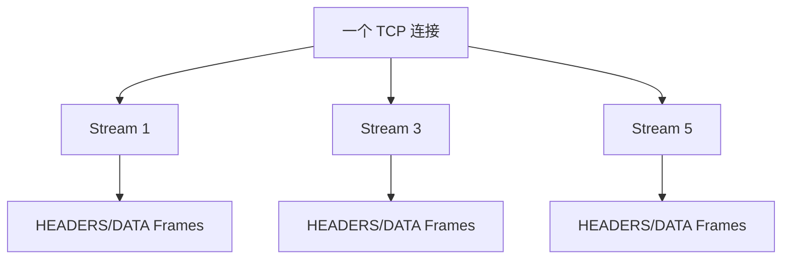

# HTTP/1.1、HTTP/2、HTTP/3 有什么核心区别？

> HTTP 版本演进的主线，是从“减少建连”到“单连接多路复用”，再到“绕开 TCP 层队头阻塞和重连成本”。

## 先用一张表建立全局对比

| 版本     | 底层传输 | 核心改进                                     | 主要瓶颈                         |
| -------- | -------- | -------------------------------------------- | -------------------------------- |
| HTTP/1.1 | TCP      | 默认长连接、Host、缓存、范围请求、管道化     | 请求/响应队头阻塞，头部重复      |
| HTTP/2   | TCP      | 二进制帧、HPACK、Stream 多路复用、优先级     | TCP 丢包会阻塞整条连接           |
| HTTP/3   | QUIC/UDP | QUIC 多路复用、TLS 1.3 集成、连接迁移、QPACK | UDP 可达性、中间设备、实现复杂度 |

HTTP 的语义变化不大，请求方法、状态码、Header 语义仍然延续。真正变化大的是报文如何编码、连接如何复用、丢包时如何恢复。

## HTTP/1.1 解决了什么，又留下什么问题？

HTTP/1.0 常见模式是短连接：一个请求建一次 TCP，响应后关闭。页面资源多时，三次握手和四次挥手开销很大。

HTTP/1.1 默认长连接，同一条 TCP 连接可以复用多个请求：

```text
TCP 建连 -> 请求 A -> 响应 A -> 请求 B -> 响应 B -> 关闭
```

它还支持管道化：客户端可以不等响应就连续发多个请求。但服务端必须按请求顺序返回响应，如果请求 A 很慢，请求 B 即使处理完也要等 A，响应仍然会队头阻塞。现实里浏览器对 HTTP/1.1 管道化支持很弱，工程上更多是靠多开几条 TCP 连接提升并发。

HTTP/1.1 的典型问题：

- Header 文本格式冗长，Cookie、User-Agent 等字段重复发送。
- 单连接请求/响应串行化明显。
- 多连接会增加握手、慢启动和服务端资源压力。

## HTTP/2 为什么快？

HTTP/2 保留 HTTP 语义，但把传输格式改成二进制帧，并引入 Stream。



几个核心点：

1. **二进制帧**：不再按纯文本行解析，帧有类型、长度、标志和 Stream ID。
2. **多路复用**：不同 Stream 的帧可以交错发送，接收方按 Stream ID 组装。
3. **HPACK 头部压缩**：静态表、动态表和 Huffman 编码减少重复 Header。
4. **优先级和服务器推送**：协议层提供能力，但实际浏览器和服务端支持策略会变化。

HTTP/2 解决了 HTTP/1.1 应用层队头阻塞：慢请求不会阻止其他 Stream 的帧在同一连接中传输。

但它没有解决 TCP 层队头阻塞。因为 HTTP/2 仍然跑在一条 TCP 字节流上，如果较低序号的 TCP 段丢了，内核必须等它重传回来，后面的字节即使已经到达，也不能交给上层。于是所有 Stream 都会被影响。

## HTTP/3 为什么换成 QUIC？

HTTP/3 定义在 RFC 9114 中，基于 QUIC。QUIC 是运行在 UDP 之上的传输协议，已标准化为 RFC 9000；QPACK 是 HTTP/3 的头部压缩格式，定义在 RFC 9204。

这也是一个资料纠偏点：一些旧资料会说 HTTP/3 还只是草案，这在现在已经过时。

HTTP/3 主要解决 HTTP/2 的三个痛点：

- TCP 层队头阻塞。
- TCP + TLS 分层握手带来的时延。
- 移动网络切换导致四元组变化后需要重连。

QUIC 的特点：

| 特性            | 说明                                               |
| --------------- | -------------------------------------------------- |
| Stream 独立可靠 | 某个 Stream 丢包只阻塞该 Stream，不阻塞其他 Stream |
| TLS 1.3 集成    | 握手和加密协商在 QUIC 内完成，支持更快建连         |
| Connection ID   | 连接不只绑定四元组，网络切换后有机会迁移           |
| 用户态实现      | 协议迭代更快，但实现和运维复杂度更高               |

需要注意：HTTP/3 不是“UDP 不可靠所以更快”这么简单。可靠性、流量控制、拥塞控制都由 QUIC 自己实现，只是它把这些能力从内核 TCP 移到了 UDP 之上的协议层。

## 怎么在排障时判断版本差异？

常用命令：

```bash
curl -I --http1.1 https://example.com
curl -I --http2 https://example.com
curl -I --http3 https://example.com
```

看 ALPN 协商：

```bash
openssl s_client -connect example.com:443 -alpn h2,http/1.1
```

如果 HTTP/3 不通，要考虑：

- UDP 443 是否被中间网络阻断。
- 服务端是否开启 QUIC/HTTP/3。
- 证书和 TLS 1.3 配置是否满足要求。
- 客户端是否回退到了 HTTP/2 或 HTTP/1.1。

## 小结

- HTTP/1.1 的核心改进是默认长连接，但仍有应用层队头阻塞和头部重复问题。
- HTTP/2 用二进制帧、HPACK 和 Stream 多路复用提升并发能力。
- HTTP/2 仍基于 TCP，丢包会导致整条 TCP 连接上的 Stream 受影响。
- HTTP/3 基于 QUIC/UDP，Stream 间更独立，并支持更快建连和连接迁移。
- HTTP/3 已标准化，旧资料里“还没正式推出”的说法需要纠正。

## 参考

基于 IETF RFC 791、RFC 793、RFC 9293、RFC 9110、RFC 9112、RFC 9113、RFC 9114、RFC 8446、RFC 9000、RFC 9204 以及 Linux man-pages 中网络协议与排障命令相关内容整理。
