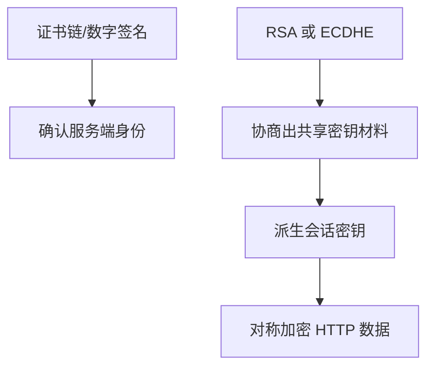
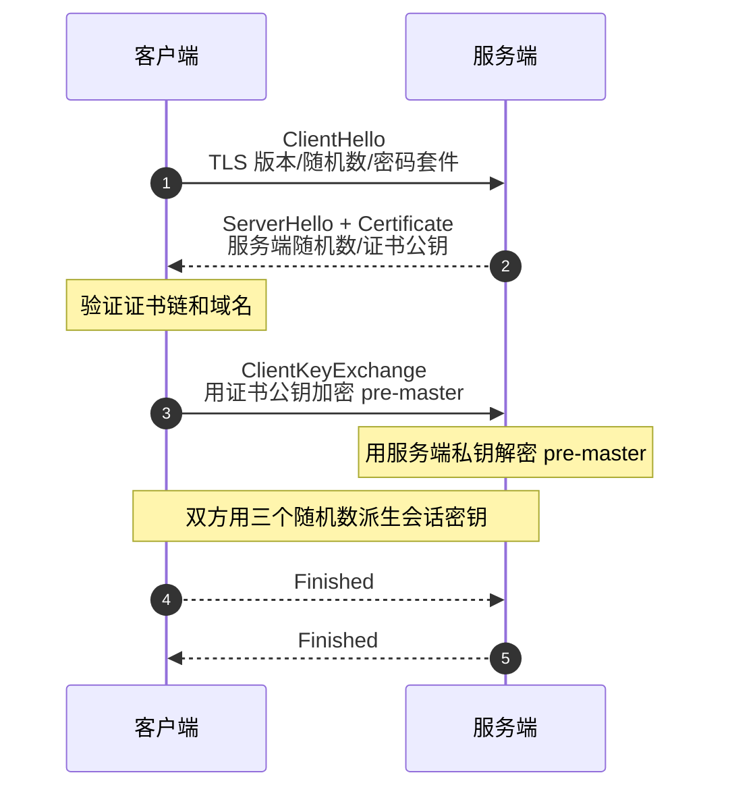
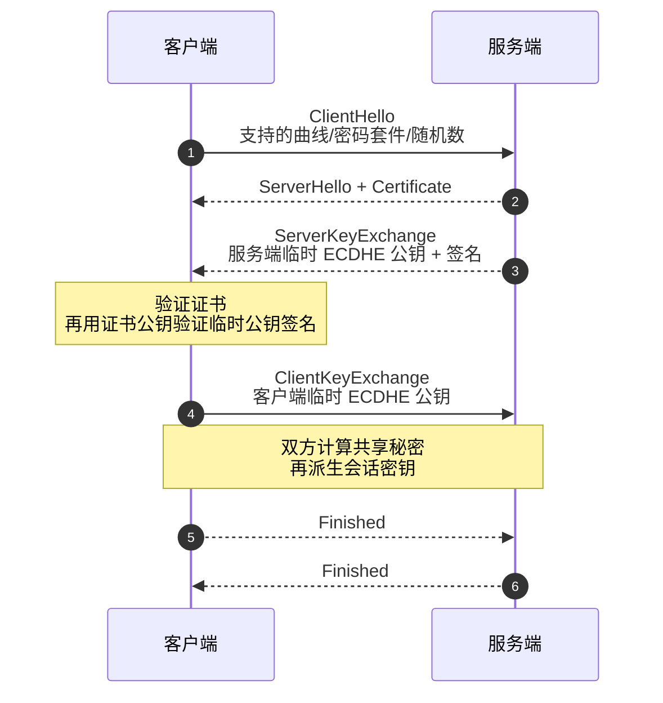

# HTTPS RSA 握手和 ECDHE 握手有什么区别？

> HTTPS 要分清三件事：证书负责身份认证，RSA/ECDHE 负责密钥协商，真正传输 HTTP 数据靠对称加密。

## HTTPS 到底解决了 HTTP 的哪些风险？

HTTP 明文传输时有三类风险：

- 窃听：中间链路能看到请求和响应内容。
- 篡改：中间人能改响应内容。
- 冒充：客户端不知道自己连到的是否是真服务端。

TLS 对应解决：

| 风险 | TLS 机制                       |
| ---- | ------------------------------ |
| 窃听 | 对称加密保护应用数据           |
| 篡改 | 消息认证/AEAD 校验完整性       |
| 冒充 | 证书链和数字签名验证服务端身份 |

很多人把“非对称加密”说成 HTTPS 加密全部内容，这是不准确的。非对称算法主要用于身份认证和密钥协商，真正大流量数据用对称加密。

## TLS 握手里三件事怎么分工？

证书不是“加密数据”的主力。证书里包含服务端公钥、域名、有效期、签发机构、签名等信息。客户端用操作系统或浏览器信任的根证书链验证它，确认“这个公钥确实属于目标域名”。

密钥协商的目标是让两端得到同一个会话密钥，而不让中间人知道。

## RSA 握手怎么协商密钥？

传统 RSA 密钥交换可以简化成：

RSA 的关键是：客户端生成 `pre-master`，用服务端证书里的 RSA 公钥加密，服务端用私钥解密。之后双方用 `Client Random`、`Server Random`、`pre-master` 派生对称密钥。

问题是前向安全。若服务端私钥以后泄漏，攻击者如果曾经录下历史 TLS 握手和密文，就可能解出当时的 `pre-master`，进而解密历史通信。

## ECDHE 握手怎么协商密钥？

ECDHE 的核心是临时椭圆曲线 Diffie-Hellman。每次握手，客户端和服务端都生成临时私钥和临时公钥，交换公钥后各自算出同一个共享秘密。

这里证书公钥不直接用来加密 `pre-master`，而是用来验证“服务端发来的临时 ECDHE 公钥确实是服务端签的”。真正的共享秘密来自双方临时私钥和对方临时公钥。

这就带来了前向安全：即使服务端证书私钥后来泄漏，也不能推出过去每一次握手临时生成的 ECDHE 私钥，历史通信更难被解密。

## RSA 和 ECDHE 怎么对比？

| 维度         | RSA 密钥交换                               | ECDHE 密钥交换                     |
| ------------ | ------------------------------------------ | ---------------------------------- |
| 密钥材料来源 | 客户端生成 pre-master 后用服务端公钥加密   | 双方临时 ECDHE 密钥协商出共享秘密  |
| 证书用途     | 提供加密 pre-master 的公钥，也用于认证身份 | 主要用于认证身份和验证临时公钥签名 |
| 前向安全     | 不支持                                     | 支持                               |
| 现代使用     | 已不推荐作为密钥交换                       | 主流 TLS 1.2/1.3 路线              |
| 私钥泄漏影响 | 可能影响历史抓包密文                       | 通常不影响历史会话密钥             |

TLS 1.3 已经移除了传统 RSA 密钥交换，保留的是基于 Diffie-Hellman/ECDHE 的前向安全路线。实际回答时可以把 TLS 1.2 的 RSA/ECDHE 对比讲清，再补一句 TLS 1.3 的边界。

## 为什么最后还要用对称加密？

非对称计算成本高，不适合加密大量 HTTP 数据。TLS 握手只是协商密钥，握手完成后，HTTP 请求和响应会通过 TLS 记录层用对称加密保护，例如 AES-GCM 或 ChaCha20-Poly1305。

也就是说：

- 证书：证明“你是谁”。
- 密钥协商：安全地产生“我们这次会话用什么密钥”。
- 对称加密：高效保护“后续所有 HTTP 数据”。

这三个职责分开，HTTPS 的逻辑就清楚了。

## 小结

- HTTPS 不是单纯“用非对称加密传输数据”，而是证书认证 + 密钥协商 + 对称加密的组合。
- RSA 密钥交换由客户端生成 `pre-master`，用服务端公钥加密给服务端。
- RSA 密钥交换不支持前向安全，服务端私钥泄漏可能威胁历史密文。
- ECDHE 使用临时密钥协商共享秘密，证书主要用于身份认证和签名验证。
- TLS 1.3 已移除传统 RSA 密钥交换，现代 HTTPS 主流依赖 ECDHE 类前向安全方案。

## 参考

综合社区资料，并结合 TLS 1.2/1.3 的密钥交换边界做了整理。
