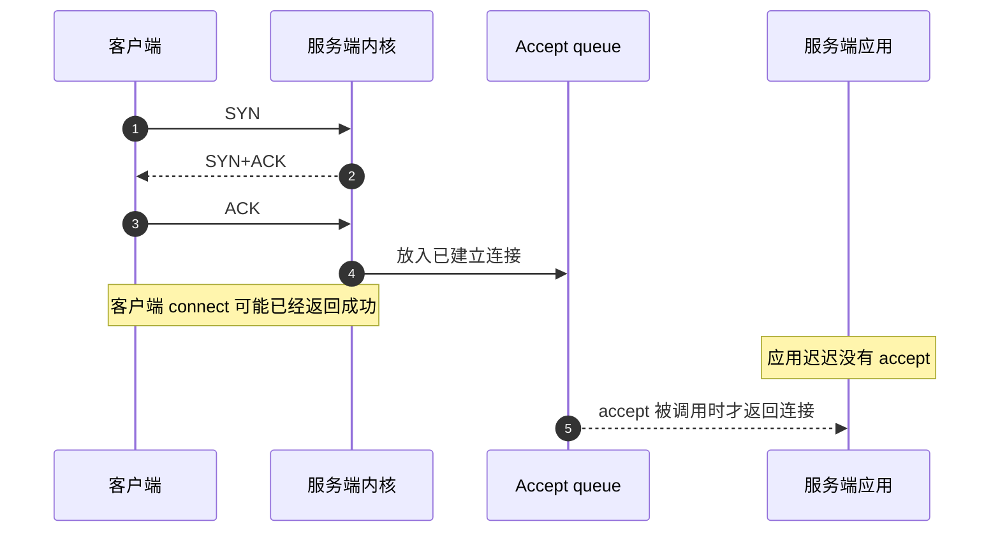
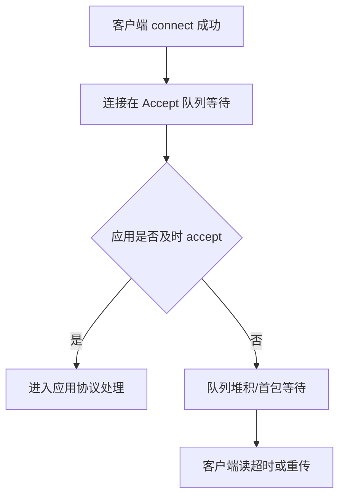

# 服务端没有 accept，客户端连接会怎样？

> `accept()` 不是三次握手的第三步；连接能不能建立由内核先完成，应用不 accept 时，问题会堆在全连接队列。

## 先区分 listen、accept 和三次握手

服务端程序通常是：

```c
socket();
bind();
listen(fd, backlog);
while (true) {
 conn = accept(fd);
}
```

`listen()` 之后，内核已经可以响应客户端 SYN。`accept()` 的作用不是“参与握手”，而是从全连接队列里取出已经完成握手的 socket，交给应用处理。



所以，如果服务端进程已经 `listen()`，但暂时没有 `accept()`，客户端仍可能完成三次握手。

## 客户端会看到什么？

分三种情况。

### 全连接队列没满

客户端 `connect()` 成功，服务端内核把连接放进 Accept 队列。应用还没 accept 时，客户端发出的数据可能先进入内核缓冲区。

这时从客户端看，一切像是连接成功；真正的问题会在后面暴露：请求发出后没有响应，读超时，或者服务端后续关闭连接。

### 全连接队列满了但默认丢 ACK

Linux 默认 `tcp_abort_on_overflow=0` 时，队列满后可能丢弃第三次握手 ACK。

客户端可能已经进入 `ESTABLISHED`，但服务端没有把连接放进全连接队列。客户端继续发送请求时，服务端可能不正常处理，客户端最终表现为超时、重传、偶发连接慢。

### 全连接队列满了并快速 RST

如果 `tcp_abort_on_overflow=1`，队列满时服务端会更倾向于回 RST。客户端能更快失败，常见错误类似：

```text
Connection reset by peer
```

这对快速暴露问题有帮助，但也会让突发流量更容易直接失败。

## 为什么线上会“connect 成功但请求超时”？

这是理解本题的关键。`connect()` 成功只说明 TCP 建连阶段看起来完成了，不代表服务端应用已经拿到这个连接，更不代表业务线程已经准备好处理请求。

常见链路是：



Java 后端里，可能导致“不及时 accept”的因素包括：

- Tomcat/Netty accept 线程被阻塞。
- 进程发生长时间 Full GC。
- CPU 打满，事件循环调度不及时。
- 业务线程池、连接池、下游 RPC 卡住，导致 accept 后处理能力不足。
- 文件描述符耗尽，应用无法创建新连接。

## 怎么排查？

服务端先看监听队列：

```bash
ss -ltn sport = :8080
```

如果 `Recv-Q` 持续接近 `Send-Q`，说明全连接队列压力大。

再看已建立连接和应用读取情况：

```bash
ss -tan sport = :8080 | head
ss -tan state established sport = :8080 | wc -l
```

看队列溢出累计：

```bash
netstat -s | grep -i "listen"
```

看应用线程：

```bash
jstack <pid>
top -H -p <pid>
jcmd <pid> GC.heap_info
```

如果是 Nginx/Tomcat/Netty，还要核对 backlog 和系统上限：

```bash
sysctl net.core.somaxconn
cat /proc/sys/net/ipv4/tcp_abort_on_overflow
```

Java 服务还要看进程 fd：

```bash
ls /proc/<pid>/fd | wc -l
ulimit -n
```

## 和半连接队列满有什么区别？

| 问题         | 卡在哪里                  | 客户端常见现象                   | 服务端观察                          |
| ------------ | ------------------------- | -------------------------------- | ----------------------------------- |
| 半连接队列满 | 第一次 SYN 后，握手未完成 | `connect()` 慢或超时             | `SYN_RECV` 多，SYN 丢弃指标增长     |
| 全连接队列满 | 握手完成后，等待 accept   | `connect()` 可能成功，请求读超时 | `ss -ltn` 的 `Recv-Q` 接近 `Send-Q` |
| 应用处理慢   | accept 后业务处理         | 响应慢、超时、连接堆积           | 线程池满、GC、慢 SQL、下游慢        |

实际故障可能叠加出现。比如服务端 Full GC 时应用不 accept，Accept 队列满；队列满后新连接握手异常；客户端重试又放大连接突刺。

## 小结

- `accept()` 不参与三次握手，握手由内核完成。
- 服务端不 accept 但队列未满时，客户端仍可能 `connect()` 成功。
- 全连接队列满时，客户端可能表现为连接成功但首包超时，也可能被 RST。
- `connect()` 成功不代表服务端应用已经处理连接。
- 排查要看 `ss -ltn`、`netstat -s`、应用线程栈、GC、fd 和 backlog/somaxconn。

## 参考

基于 IETF RFC 791、RFC 793、RFC 9293、RFC 9110、RFC 9112、RFC 9113、RFC 9114、RFC 8446、RFC 9000、RFC 9204 以及 Linux man-pages 中网络协议与排障命令相关内容整理。
