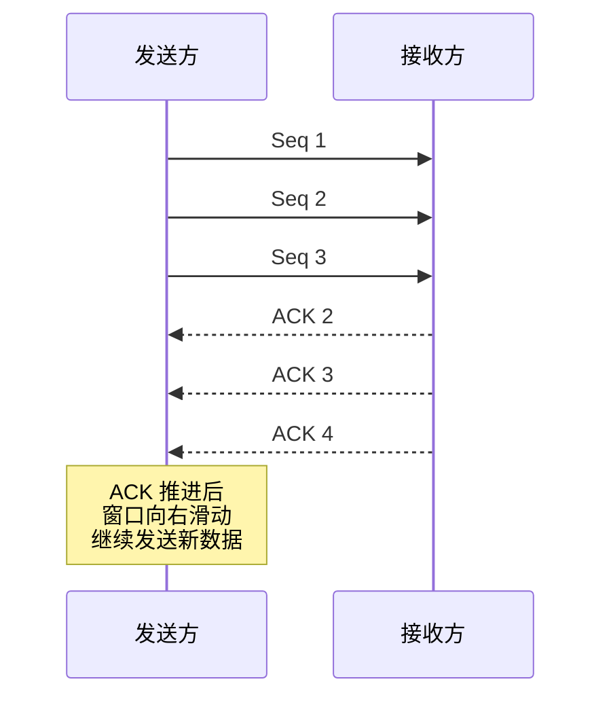
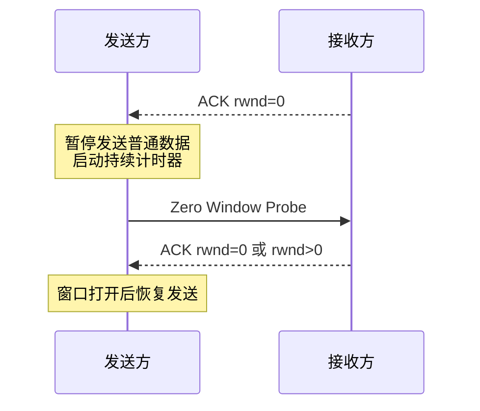

# 滑动窗口、拥塞控制、流量控制分别解决什么问题？

> 滑动窗口提升传输效率，流量控制保护接收方，拥塞控制保护网络；三者都影响发送方到底能发多少数据。

## 先把三个概念分开

| 概念     | 关注对象                 | 解决的问题                 | 核心变量                       |
| -------- | ------------------------ | -------------------------- | ------------------------------ |
| 滑动窗口 | 发送方和接收方的数据进度 | 不必发一段等一段，提高吞吐 | `SND.UNA`、`SND.NXT`、窗口边界 |
| 流量控制 | 接收方                   | 别把接收方缓冲区打满       | `rwnd`                         |
| 拥塞控制 | 网络链路                 | 别把网络打到拥塞恶化       | `cwnd`、`ssthresh`             |

真实发送窗口通常受多因素约束，简化记：

```text
可发送在途数据量 <= min(rwnd, cwnd)
```

`rwnd` 来自接收方通告，`cwnd` 由发送方根据网络拥塞状况维护。

## 滑动窗口为什么能提升效率？

如果每发一个 TCP 段都等 ACK 再发下一个，链路利用率会很低。RTT 越大，浪费越明显。

滑动窗口允许发送方在未收到 ACK 前连续发送一定数量的数据：



发送窗口大致可以分成四段：

1. 已发送且已确认。
2. 已发送但未确认。
3. 未发送但允许发送。
4. 未发送且暂时不允许发送。

ACK 推进后，窗口左边界右移，新的可发送空间被释放出来。

## 流量控制：别把接收方撑爆

接收方应用不一定及时读 socket。如果发送方持续高速发送，接收缓冲区可能被占满。

TCP 通过接收窗口 `rwnd` 做流量控制：

- 接收方在 ACK 中通告自己还有多少接收缓冲区。
- 发送方根据 `rwnd` 限制在途数据。
- 如果接收方通告 `rwnd=0`，发送方暂停发送普通新数据。

零窗口不是死局。发送方会用零窗口探测了解对方窗口是否打开：



Java/Netty 服务里，如果业务线程不消费数据、解码器卡住、下游慢导致 backpressure 失效，就可能看到接收窗口变小、吞吐下降，甚至连接长期小窗口。

## Nagle、延迟 ACK 和小包问题

糊涂窗口综合征指不断发送很小的数据，包头开销远大于负载。

常见缓解手段：

- 接收方不要刚释放一点缓冲就通告很小窗口。
- 发送方用 Nagle 算法，尽量等 ACK 或凑够 MSS 再发。
- 接收方延迟 ACK，减少纯 ACK 数量。

但 Nagle 和延迟 ACK 在小包交互场景可能互相等待，带来几十毫秒延迟。低延迟 RPC、游戏、交互式协议常会设置：

```java
socket.setTcpNoDelay(true);
```

这会减少等待，但可能增加小包数量。是否关闭 Nagle，要看延迟目标和包量压力。

## 拥塞控制：别把网络打爆

流量控制只看接收方，它不知道中间网络是否拥塞。拥塞控制由发送方根据 ACK、丢包、RTT 等信号估计网络承载能力。

经典 Reno 系算法可以按四个阶段理解：

| 阶段     | 行为                                                  |
| -------- | ----------------------------------------------------- |
| 慢启动   | `cwnd` 从小开始，随 ACK 快速增长，通常每 RTT 近似翻倍 |
| 拥塞避免 | 达到 `ssthresh` 后，`cwnd` 线性增长                   |
| 快速重传 | 收到 3 个重复 ACK，提前重传疑似丢失段                 |
| 快速恢复 | 认为网络不是完全不可用，降低窗口后进入拥塞避免        |

超时重传和快速重传对窗口影响不同：

- RTO 超时通常说明拥塞更严重，窗口会更激烈下降。
- 3 个重复 ACK 说明后续包还能到达，通常不必完全回到慢启动起点。

现代 Linux 常见默认拥塞控制可能是 CUBIC，也可以使用 BBR 等算法。面试答经典慢启动/拥塞避免没问题，但线上调优要看具体内核版本和参数。

查看命令：

```bash
ss -tin
sysctl net.ipv4.tcp_congestion_control
sysctl net.ipv4.tcp_available_congestion_control
```

`ss -tin` 能看到部分连接的 RTT、拥塞窗口、重传等信息，对定位“是对端慢、网络拥塞还是本机发送受限”有帮助。

## 流量控制和拥塞控制怎么区分？

用一句话：

- 流量控制怕**接收方扛不住**。
- 拥塞控制怕**网络扛不住**。

比如：

- 服务端应用线程卡住，socket 不读数据，接收窗口变小，这是流量控制相关。
- 跨机房链路丢包、RTT 抖动、重传升高，发送方降低 `cwnd`，这是拥塞控制相关。

排障时不要只看“吞吐低”。要同时看：

```bash
ss -tin dst <ip>
netstat -s | grep -i retrans
sar -n TCP,ETCP 1
tcpdump -i eth0 host <ip> and port <port>
```

如果重传高、RTT 抖动大，多看网络路径；如果窗口很小、应用读慢，多看接收端线程、GC、下游依赖和反压。

## 小结

- 滑动窗口允许未确认数据在途，避免一发一等，提高链路利用率。
- 流量控制由接收方 `rwnd` 驱动，目标是保护接收缓冲区。
- 拥塞控制由发送方 `cwnd` 驱动，目标是保护中间网络。
- 实际可发送量通常受 `min(rwnd, cwnd)` 约束，还会受 MSS、发送缓冲区等影响。
- 线上吞吐低要区分接收方慢、网络拥塞、重传高、小包等待和应用线程卡顿。

## 参考

综合社区资料，并结合 Linux `ss`、拥塞控制参数和 Java Socket 小包场景做了工程化整理。
