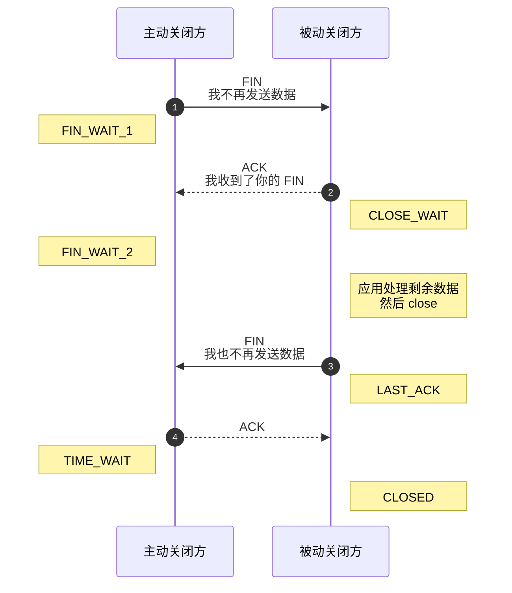
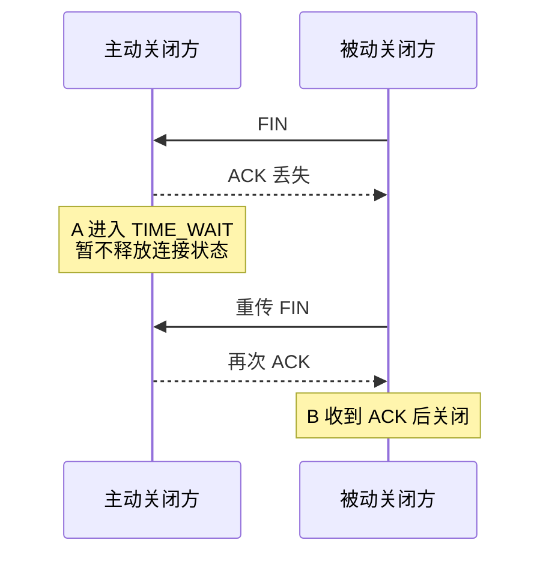

# TCP 四次挥手为什么需要 TIME_WAIT？

> 四次挥手的本质是两个发送方向分别关闭；TIME_WAIT 的价值是兜住最后 ACK 丢失和旧报文干扰新连接这两个风险。

## 四次挥手每一步做了什么？

以客户端主动关闭为例：



这里要记住：谁主动关闭，谁通常进入 `TIME_WAIT`。这和客户端、服务端角色没有必然关系。服务端主动断开长连接时，服务端也会出现大量 `TIME_WAIT`。

## 为什么通常需要四次？

TCP 是全双工的。A 发 `FIN` 只表示“A 这一侧不再发送数据”，不代表 B 也没有数据要发。

所以被动关闭方通常要分两步：

1. 内核马上回 ACK，表示“我收到了你的 FIN”。
2. 应用处理完剩余数据并调用 `close()` 后，内核再发自己的 FIN。

ACK 是内核收到 FIN 后触发的确认动作，FIN 是本端应用决定关闭发送方向后触发的动作。两者触发时机不同，所以通常分开发。

## 为什么抓包有时只有三次挥手？

三次挥手不是少了关闭步骤，而是被动关闭方把 ACK 和 FIN 合并成了一个 `FIN+ACK`。

可能条件是：

- 被动关闭方没有剩余数据要发送。
- 应用很快调用 `close()` 或 `shutdown()`。
- 对 FIN 的 ACK 还没有被内核单独发出，有机会和本端 FIN 合并。

所以看到三次挥手不代表 TCP 违反全双工关闭语义，只是报文合并了。

## TIME_WAIT 为什么要等 2MSL？

主动关闭方收到对端 FIN 后，会回复最后一个 ACK，然后进入 `TIME_WAIT`。这个等待主要解决两个问题。

### 兜住最后一个 ACK 丢失



如果主动关闭方发完最后 ACK 就立刻消失，对端重传 FIN 时，本机没有连接状态，可能只能回 RST，导致对端看到异常关闭。

### 避免旧连接报文污染新连接

TCP 连接由四元组标识。如果旧连接刚关闭，马上用相同四元组建立新连接，网络里滞留的旧报文可能晚到。`TIME_WAIT` 等待一段时间，是为了尽量让旧连接的报文在网络中自然消失。

MSL 是 Maximum Segment Lifetime，表示报文段在网络中的最大生存时间。2MSL 可以理解成一个保守等待窗口：既覆盖最后 ACK 丢失后的 FIN 重传，也尽量覆盖两个方向的旧报文残留。

Linux 常见 `TIME_WAIT` 保留时间是 60 秒，对应内核常量，并不是 `tcp_fin_timeout` 控制的。

## TIME_WAIT 多了说明什么？

先判断谁在主动关闭。

| 现象                   | 常见含义                                    | 排查方向                                |
| ---------------------- | ------------------------------------------- | --------------------------------------- |
| 客户端大量 `TIME_WAIT` | 客户端频繁主动断开到同一目标的短连接        | 连接池、HTTP Keep-Alive、本地端口范围   |
| 服务端大量 `TIME_WAIT` | 服务端主动关闭大量连接                      | Nginx keepalive、长连接超时、短连接请求 |
| 大量 `CLOSE_WAIT`      | 本机作为被动关闭方，但应用没及时关闭 socket | 应用异常分支、线程卡住、连接池漏关      |

常用命令：

```bash
ss -tan state time-wait | wc -l
ss -tan state close-wait
ss -tan state fin-wait-2
ss -s
```

`CLOSE_WAIT` 尤其要警惕。它通常不是靠调内核参数解决，而是应用没有及时调用 `close()`，或者业务线程卡在慢 SQL、外部 RPC、锁等待里，导致连接无法进入后续关闭流程。

## 容易踩的坑

**第一，`tcp_fin_timeout` 不是用来缩短 TIME_WAIT 的。**

它主要影响部分 `FIN_WAIT_2` 场景。想缓解 `TIME_WAIT` 压力，应该优先看连接复用、HTTP Keep-Alive、连接池、端口范围和主动关闭方设计。

**第二，不要一看到 TIME_WAIT 就调参数。**

`TIME_WAIT` 是 TCP 正常状态。它多不一定有问题，关键看是否造成端口耗尽、文件描述符压力、连接建立失败，或者是否暴露了短连接过多。

**第三，RST 关闭不是常规优化手段。**

通过 `SO_LINGER` 等方式让连接跳过四次挥手，可能让对端看到连接重置，也可能丢未发送完的数据。除非明确知道协议语义和风险，否则不要把它当成通用优化。

## 小结

- 四次挥手来自 TCP 全双工：两个发送方向要分别关闭、分别确认。
- ACK 和 FIN 通常分开发，是因为内核确认和应用关闭的触发时机不同。
- 三次挥手只是 ACK 与 FIN 合并，不代表少了关闭语义。
- `TIME_WAIT` 用来处理最后 ACK 丢失后的 FIN 重传，并降低旧报文污染新连接的概率。
- 大量 `CLOSE_WAIT` 多半是应用问题，大量 `TIME_WAIT` 要先判断谁主动关闭和是否真的造成资源压力。

## 参考

综合社区资料，并结合 Linux `TIME_WAIT`、`CLOSE_WAIT`、`tcp_fin_timeout` 常见误区做了排障化整理。
