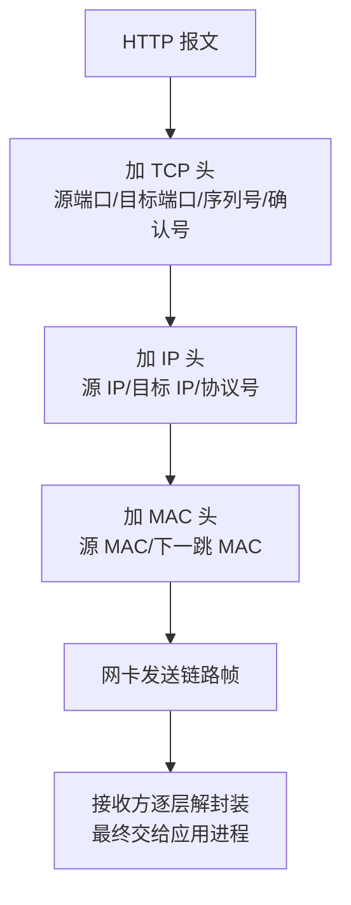

# TCP/IP 四层模型怎么理解？和 OSI 七层有什么关系？

> 网络分层不是为了背名词，而是把“应用表达什么、进程怎么通信、包怎么找路、帧怎么过链路”这几件事拆开。

## 为什么网络要分层？

两台机器通信时，问题其实很多：

- 应用要表达什么语义？比如 HTTP 请求、DNS 查询、MySQL 协议包。
- 数据要交给对端哪个进程？靠端口区分。
- 数据要去往哪台主机？靠 IP 寻址和路由。
- 在当前这段链路上要发给哪个下一跳？靠 MAC 地址和链路层帧。

如果所有问题都揉在一个协议里，协议会很难演进。分层之后，每一层只暴露相对稳定的接口，上层不需要关心下层具体怎么送，下层也不需要理解上层业务语义。

## TCP/IP 四层分别负责什么？

可以先用这张表建立整体图：

| TCP/IP 层级 | 常见协议/技术          | 解决的问题                   | 常见数据单位 |
| ----------- | ---------------------- | ---------------------------- | ------------ |
| 应用层      | HTTP、DNS、SMTP、MySQL | 应用之间要表达什么           | 报文/消息    |
| 传输层      | TCP、UDP               | 进程到进程怎么通信           | 段/数据报    |
| 网络层      | IP、ICMP               | 主机到主机怎么寻址和选路     | 包           |
| 网络接口层  | 以太网、Wi-Fi、ARP     | 同一链路上怎么把帧交给下一跳 | 帧           |

一句话记忆：

- **应用层**：定义业务语义。
- **传输层**：用端口找到进程，并决定可靠性、顺序、流量控制等传输行为。
- **网络层**：用 IP 地址和路由把包送到目标网络。
- **网络接口层**：在当前链路上把数据帧交给下一跳设备。

## IP、TCP、HTTP 的分工怎么讲？

面试里最容易混成一句“HTTP 基于 TCP，TCP 基于 IP”。这句话不够，最好讲出分工：

| 协议 | 它关心什么                 | 它不关心什么                         |
| ---- | -------------------------- | ------------------------------------ |
| IP   | 目标主机在哪、下一跳怎么走 | 数据属于哪个业务请求、是否可靠到达   |
| TCP  | 字节流可靠、有序交给进程   | HTTP 报文语义、页面资源是什么        |
| HTTP | 请求方法、路径、头、响应码 | 包怎么路由、丢包怎么重传、MAC 怎么变 |

比如浏览器请求一个接口：

1. HTTP 组织出 `GET /api/orders` 这样的请求语义。
2. TCP 把这段字节流交给目标 IP 的 443 端口，并用序列号、ACK、重传保证有序交付。
3. IP 决定包往哪个网关、哪条路径走。
4. 以太网/Wi-Fi 在每一跳用帧把包交给下一台设备。

## 封装和解封装是怎么发生的？

发送端的数据会从上往下“加头”，接收端再从下往上“拆头”。

这里有两个细节很常见：

- IP 头里的目标 IP 表示最终目的主机，跨路由转发时通常保持不变；但经过 NAT、代理或负载均衡时可能被改写。
- MAC 头里的目标 MAC 表示当前链路的下一跳，每过一跳通常都会重新封装。

所以抓包时不要看到 MAC 变了就以为请求目标变了，链路层和网络层看的目标不是同一层含义。

## TCP/IP 四层和 OSI 七层是什么关系？

OSI 七层模型更适合教学，把职责拆得更细；TCP/IP 四层模型更贴近真实协议栈实现。

| OSI 七层   | TCP/IP 四层中的大致位置 | 说明                         |
| ---------- | ----------------------- | ---------------------------- |
| 应用层     | 应用层                  | HTTP、DNS 等协议语义         |
| 表示层     | 应用层                  | 编码、压缩、加密等表达形式   |
| 会话层     | 应用层                  | 会话管理，常由应用协议承担   |
| 传输层     | 传输层                  | TCP、UDP                     |
| 网络层     | 网络层                  | IP、ICMP、路由               |
| 数据链路层 | 网络接口层              | 以太网帧、MAC、ARP           |
| 物理层     | 网络接口层              | 网线、光纤、无线电信号等介质 |

不要把这张表理解成严格的一一对应。比如 TLS 通常夹在应用协议和传输层之间，QUIC 又把可靠传输、拥塞控制和 TLS 握手放进了用户态协议里。分层模型是帮助理解边界，不是给所有现代协议强行找格子。

## 容易踩的坑

**第一，别说“应用层一定在用户态，传输层以下一定在内核态”。**

常见操作系统的 TCP/IP 协议栈确实主要在内核里，应用协议在用户态里。但用户态协议栈、DPDK、QUIC 这类方案会打破这个简化说法。面试里说“常见 Linux TCP/IP 栈中，TCP/IP 主要由内核协议栈处理”更稳。

**第二，别把 ARP 泛化到所有 IP 网络。**

ARP 用于 IPv4 场景下根据 IP 找链路层地址。IPv6 使用 NDP，不是 ARP。

**第三，别说 HTTP 永远基于 TCP。**

HTTP/1.1 和 HTTP/2 通常跑在 TCP 上；HTTP/3 跑在 QUIC 上，而 QUIC 基于 UDP。

## 小结

- TCP/IP 分层的价值是拆职责：应用语义、进程通信、主机寻址、链路转发分别处理。
- 应用层看业务报文，传输层看端口和可靠传输，网络层看 IP 和路由，网络接口层看 MAC 和帧。
- 封装是发送端逐层加头，解封装是接收端逐层拆头。
- OSI 七层偏教学，TCP/IP 四层偏工程实现，两者是大致映射，不是严格等价。
- 现代协议会突破简单分层，比如 HTTP/3/QUIC、用户态协议栈和代理/NAT。

## 参考

综合社区资料，并结合 HTTP/3、IPv6 NDP、用户态协议栈等现代协议边界做了纠偏和补充。
