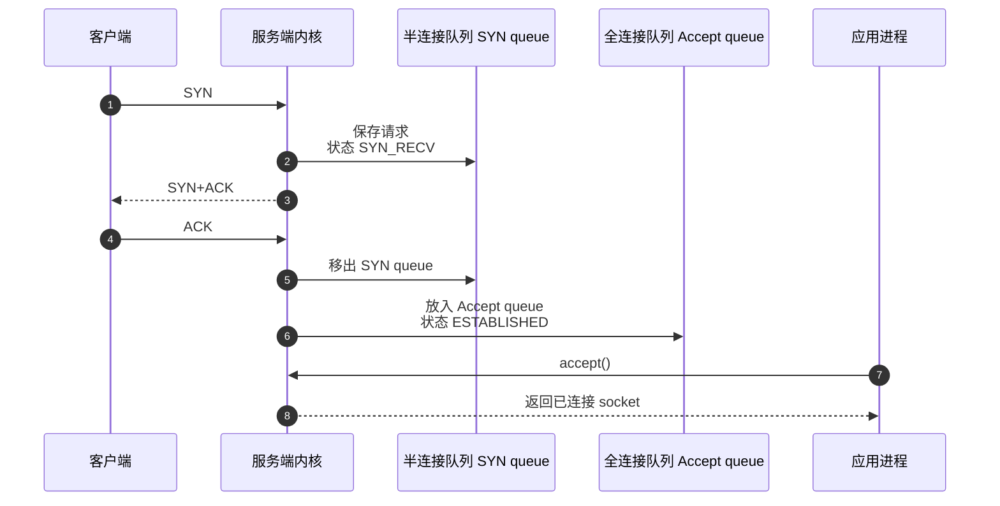
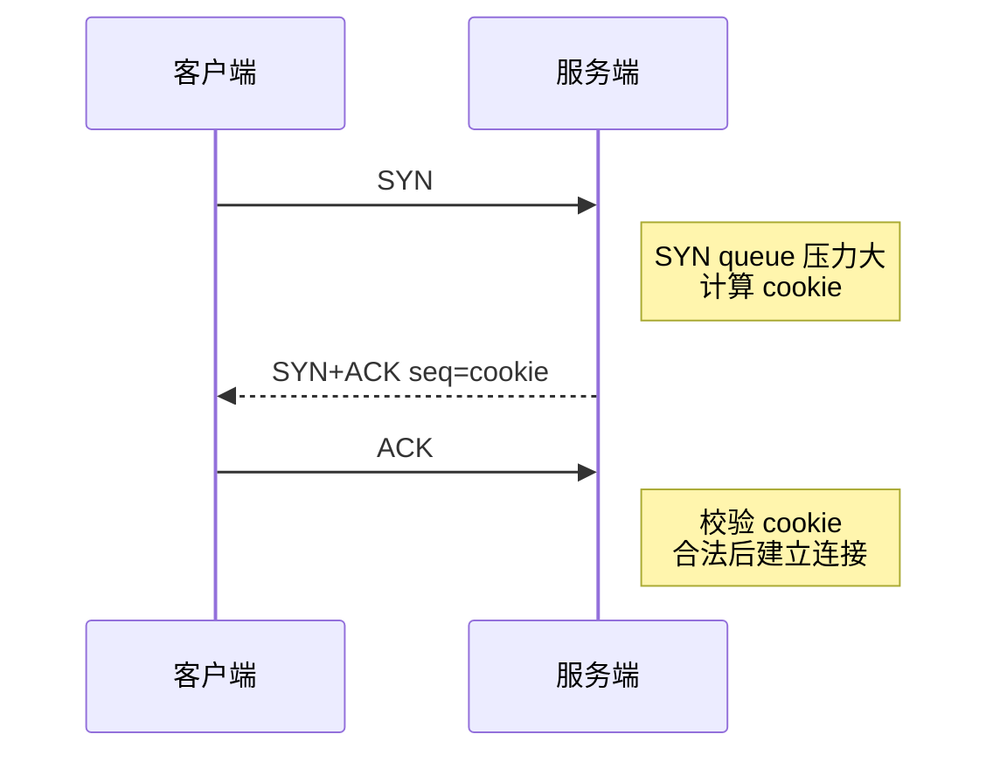

# 半连接队列和全连接队列满了会发生什么？

> 建连失败不一定是网络不通，也可能是服务端 SYN 队列或 Accept 队列顶住了；排查时要区分握手卡在哪一步。

## 两个队列分别在三次握手的哪里？

服务端 `listen()` 之后，内核会维护两类等待队列：



| 队列       | 保存什么                                        | 典型状态      | 谁来消费                      |
| ---------- | ----------------------------------------------- | ------------- | ----------------------------- |
| 半连接队列 | 收到 SYN、已回 SYN+ACK、还没收到最终 ACK 的请求 | `SYN_RECV`    | 内核收到第三次握手 ACK 后迁移 |
| 全连接队列 | 三次握手完成、等待应用 `accept()` 的连接        | `ESTABLISHED` | 应用进程调用 `accept()`       |

半连接队列压力常见于 SYN Flood、网络丢包、客户端迟迟不回 ACK。全连接队列压力常见于应用 `accept()` 不及时、业务线程或事件循环卡住、短连接突刺。

## 全连接队列满了会怎样？

全连接队列满时，客户端可能已经认为 `connect()` 成功，但服务端没有把这个连接交给应用。

Linux 行为受 `net.ipv4.tcp_abort_on_overflow` 影响：

| 参数值 | 行为                                                     | 客户端表现                               |
| ------ | -------------------------------------------------------- | ---------------------------------------- |
| `0`    | 默认倾向于丢弃第三次握手 ACK，服务端后续可能重传 SYN+ACK | 客户端可能以为连接已建立，首包卡住或超时 |
| `1`    | 队列满时直接回 RST                                       | 客户端更快看到 `connection reset`        |

生产上不要一上来把它改成 `1`。如果只是短暂突刺，默认丢弃 ACK 还有机会在队列腾出后恢复；如果长期溢出，才需要结合业务目标评估快速失败。

观察全连接队列：

```bash
ss -ltn
netstat -s | grep -i "listen"
sysctl net.core.somaxconn
```

`LISTEN` 状态下，`ss` 的 `Recv-Q` 通常表示当前等待 accept 的连接数，`Send-Q` 表示队列上限相关值。若 `Recv-Q` 持续接近 `Send-Q`，就要看应用为什么不及时 accept。

全连接队列上限不能只看 `listen(backlog)`。常见 Linux 上可以近似理解为：

```text
全连接队列上限 ≈ min(backlog, net.core.somaxconn)
```

所以只改应用里的 backlog，不调 `somaxconn`，可能没有效果；只调 `somaxconn`，应用没重新 `listen()` 或服务没重启，也可能看不到变化。

## 半连接队列满了会怎样？

半连接队列满时，服务端收到新的 SYN 后，可能丢弃，也可能启用 SYN Cookie 后不再为每个 SYN 保存完整状态。

观察半连接队列没有全连接队列那么直接，通常看 `SYN_RECV`：

```bash
ss -tan state syn-recv
ss -tan state syn-recv | wc -l
netstat -s | grep -i "SYN"
sysctl net.ipv4.tcp_max_syn_backlog
sysctl net.ipv4.tcp_syncookies
sysctl net.ipv4.tcp_synack_retries
```

容易答错的一点：半连接队列大小不一定只由 `tcp_max_syn_backlog` 决定。不同 Linux 内核版本实现不同，还会和 `somaxconn`、应用 backlog、SYN Cookie 状态、队列是否接近阈值有关。

所以更稳的说法是：`tcp_max_syn_backlog` 是重要参数，但不是唯一因素；排查时要看当前内核版本和实际观测，而不是背一个固定公式。

## SYN Cookie 是扩容吗？

不是。SYN Cookie 是防护手段。

启用后，半连接队列压力过大时，服务端把必要信息编码到 `SYN+ACK` 的序列号里，暂时不为这个 SYN 保存完整半连接状态。客户端回 ACK 时，服务端校验 cookie，合法才重建连接信息。



SYN Cookie 能缓解 SYN Flood 对半连接队列的冲击，但它不是无限扩容：CPU、带宽、后端全连接队列仍然可能成为瓶颈，部分 TCP 选项能力也可能受影响。

## Java 服务排查应该按什么顺序？

可以按这条链路查：

1. 看监听队列是否顶满：

```bash
ss -ltn sport = :8080
```

2. 看半连接是否异常堆积：

```bash
ss -tan state syn-recv sport = :8080
```

3. 看应用是否 accept 不及时：

```bash
jstack <pid>
top -H -p <pid>
```

4. 看线程池、GC、慢 SQL、下游 RPC 是否卡住业务线程。
5. 看内核累计丢弃指标是否增长：

```bash
netstat -s
```

如果是 Netty/Tomcat 服务，全连接队列满常常不是“内核参数太小”这么简单，背后可能是 boss 线程卡住、worker 线程被阻塞、业务线程池满、Full GC 或下游慢导致 accept 后处理跟不上。

## 小结

- 半连接队列保存未完成三次握手的请求，全连接队列保存已完成握手、等待 `accept()` 的连接。
- 全连接队列满时，客户端可能以为连接成功，但首包阻塞或被 RST。
- 半连接队列满时，新 SYN 可能被丢弃；SYN Cookie 能缓解但不是扩容。
- 全连接队列上限通常受 `backlog` 和 `somaxconn` 共同影响。
- 排查要结合 `ss`、`netstat -s`、内核参数、应用线程栈和 GC/下游依赖，不能只调一个参数。

## 参考

基于 IETF RFC 791、RFC 793、RFC 9293、RFC 9110、RFC 9112、RFC 9113、RFC 9114、RFC 8446、RFC 9000、RFC 9204 以及 Linux man-pages 中网络协议与排障命令相关内容整理。
