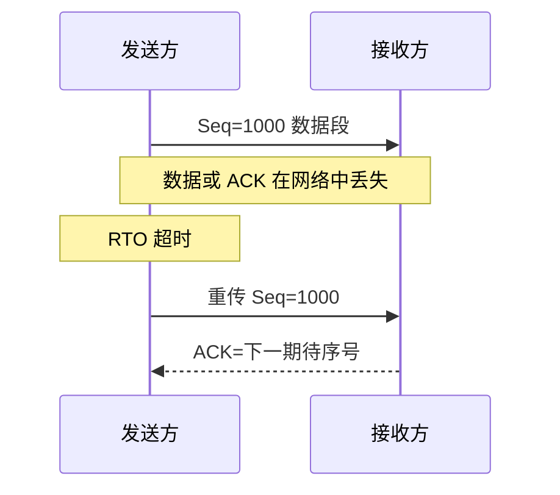

# TCP 如何保证可靠传输？

> TCP 不是让网络不丢包，而是在不可靠的 IP 之上，用编号、确认、重传、排序去重和窗口机制拼出可靠字节流。

## 先纠正一个说法：可靠的是字节流

TCP 面向字节流，不保留应用层消息边界。应用写入的两次数据，接收方可能一次读到；应用一次写入的数据，接收方也可能多次读到。

这就是 Java 网络编程里常说的“粘包/拆包”根源：TCP 只保证字节按序交付，不知道你的业务消息从哪里开始、到哪里结束。HTTP、MySQL 协议、RPC 协议都要自己定义消息边界，比如长度字段、分隔符或报文格式。

## TCP 可靠性靠哪些机制？

| 机制           | 解决的问题                               |
| -------------- | ---------------------------------------- |
| 序列号         | 标识每段字节在流中的位置，解决乱序和重复 |
| ACK 确认       | 告诉发送方哪些字节已经收到               |
| 校验和         | 发现传输过程中的常见比特错误             |
| 重传           | 丢包或 ACK 丢失时重新发送数据            |
| 接收端排序去重 | 乱序到达先缓存，重复到达直接丢弃         |
| 流量控制       | 避免把接收方缓冲区打满                   |
| 拥塞控制       | 避免把网络打爆                           |

这几类机制配合起来，应用层看到的才是有序、无重复的字节流。

## ACK 为什么能确认“之前的数据都收到了”？

TCP 常用累计确认。假设接收方期待的下一个字节序号是 5000，它回 `ACK=5000`，含义是：

> 5000 之前的字节我已经按序收到了，下一段请从 5000 开始。

如果 `[5000,6000)` 丢了，但 `[6000,7000)` 先到了，接收方仍然只能回 `ACK=5000`，因为中间有洞。发送方连续收到相同 ACK，就能推测中间可能有段丢了。

## 超时重传：可靠性的兜底

发送方发出数据后会等待 ACK。如果超过 RTO 还没收到确认，就会重传。



RTO 不能太小，也不能太大：

- 太小：只是网络抖动也会误重传，加重拥塞。
- 太大：真丢包时恢复慢，接口延迟升高。

现代 TCP 会根据 RTT 样本和平滑后的抖动动态计算 RTO。发生连续超时时，还会指数退避，避免网络已经拥塞时继续猛发。

## 快速重传：不用等到超时

超时重传可靠但慢。快速重传利用重复 ACK 更早发现丢包。

假设接收方已经收到 0-999，期待 1000：

1. `[1000,2000)` 丢了。
2. `[2000,3000)`、`[3000,4000)`、`[4000,5000)` 先到。
3. 接收方因为 1000 这个洞没补上，只能连续回 `ACK=1000`。
4. 发送方收到 3 个重复 ACK，通常会认为 1000 之后的数据段丢了，于是提前重传。

3 个重复 ACK 是折中：一个重复 ACK 可能只是轻微乱序，不一定丢包；等 RTO 又太慢。

## SACK 和 D-SACK 解决什么？

普通 ACK 只能表达“某个序号之前都收到了”，不能表达“后面的哪些区间已经乱序收到了”。SACK 就是在 ACK 选项里补充这些区间。

例子：

- 发送方发 `[0,1000)`、`[1000,2000)`、`[2000,3000)`、`[3000,4000)`。
- `[1000,2000)` 丢了，后两段到了。
- 接收方累计 ACK 仍然是 `ACK=1000`，但 SACK 可以报告“我已经收到 `[2000,4000)`”。
- 发送方只需重传 `[1000,2000)`，不用把后面都重发。

D-SACK 则告诉发送方“某段数据我重复收到了”。它可以帮助判断 ACK 丢失、网络乱序、RTO 过小导致的误重传，但不能单独证明具体原因。

Linux 相关参数：

```bash
sysctl net.ipv4.tcp_sack
sysctl net.ipv4.tcp_dsack
```

## 校验和是不是强一致性保证？

不是。TCP 校验和能发现常见传输错误，但它不是密码学完整性校验，也不能防恶意篡改。HTTPS/TLS 里的 AEAD、应用层 hash、存储校验，解决的是更强的完整性和安全问题。

所以“TCP 可靠”不要扩展成“绝对不会错”。它的含义是在协议能力范围内尽力做到有序、无重复、可靠交付；超出重试、连接中断、应用协议错误仍然需要上层处理。

## 小结

- TCP 可靠的是字节流，不是应用层消息边界。
- 序列号和 ACK 是可靠传输的底座，用来确认、排序、去重和重传。
- 超时重传是兜底，快速重传用重复 ACK 更快恢复丢包。
- SACK 让发送方知道哪些乱序区间已收到，减少无效重传；D-SACK 可辅助识别误重传。
- TCP 校验和不是安全完整性保证，HTTPS/TLS 和应用层校验仍然有必要。

## 参考

综合社区资料，并结合 SACK/D-SACK、RTO 与应用层消息边界做了边界整理。
