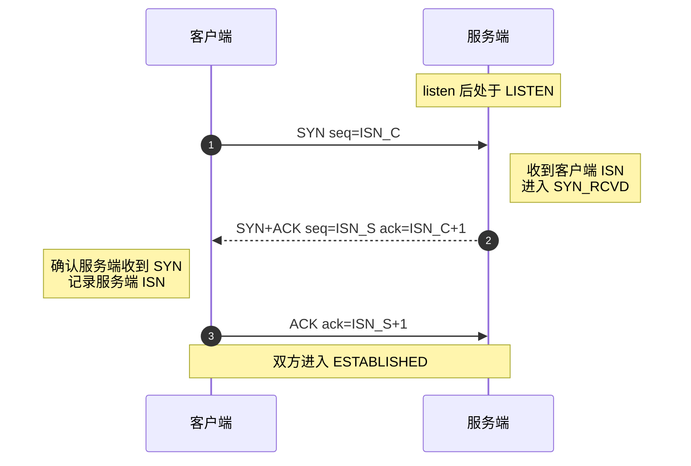
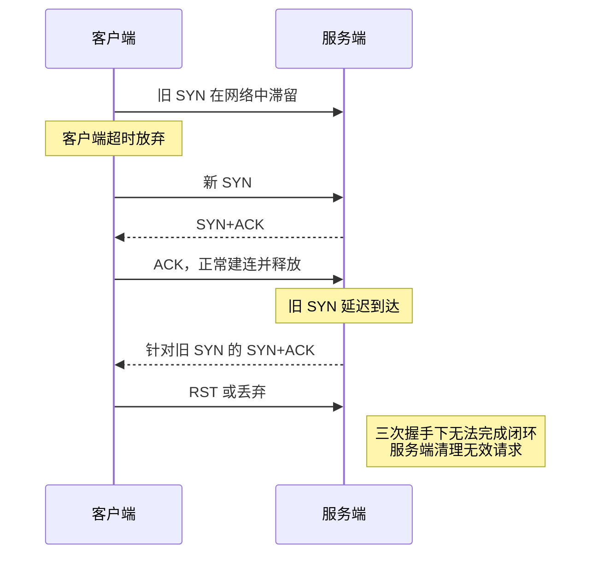
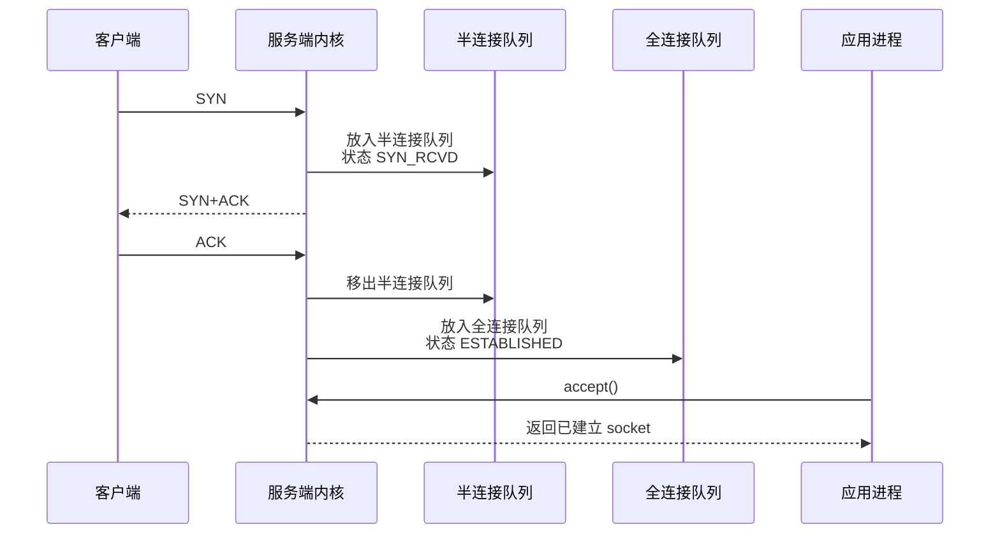

# TCP 三次握手到底解决什么问题？

> 三次握手不是为了凑“三次”，而是同步双方初始序列号，确认双向路径可用，并避免历史 SYN 把服务端带进错误连接。

## TCP 连接本质上是什么？

TCP 连接不是两台机器之间拉了一根真实的线，而是两端内核维护的一组状态。

核心状态包括：

- 四元组：源 IP、源端口、目标 IP、目标端口。
- 双方初始序列号，也就是 ISN。
- 发送窗口、接收窗口、拥塞窗口等传输控制状态。
- 当前连接状态，比如 `SYN_SENT`、`SYN_RCVD`、`ESTABLISHED`。

所以建立连接的重点不是“打个招呼”，而是让双方对这些状态达成一致。

## 三次握手每一步做了什么？



三步分别解决：

| 步骤 | 报文           | 关键作用                                             |
| ---- | -------------- | ---------------------------------------------------- |
| 1    | C → S：SYN     | 客户端同步自己的 ISN，服务端知道 C 到 S 方向可达     |
| 2    | S → C：SYN+ACK | 服务端确认客户端 ISN，同时同步自己的 ISN             |
| 3    | C → S：ACK     | 客户端确认服务端 ISN，服务端确认 S 到 C 方向也闭环了 |

注意：第二次握手后，客户端已经知道服务端能收也能发；但服务端还不知道客户端是否收到了自己的 `SYN+ACK`。服务端只有收到第三次 ACK，才敢把连接视为建立完成。

## 为什么不是两次握手？

只答“为了确认双方收发能力”太浅。两次握手最大的问题是服务端可能因为一个旧 SYN 建立无效连接。



如果两次握手就算建立连接，服务端收到旧 SYN 并回 `SYN+ACK` 后，就可能直接进入已建立状态，白白分配连接资源。三次握手要求客户端再确认一次服务端 ISN，旧请求无法完成这个闭环。

## 为什么不是四次握手？

第二次握手把服务端的 `SYN` 和对客户端的 `ACK` 合并在一个报文里：

- `ACK`：我收到了你的 `SYN`。
- `SYN`：我也要同步我的初始序列号。

这两件事没有必要拆成两个包，所以三次就足够完成双方 ISN 同步和确认闭环。四次可以，但多一次往返没有必要。

## 第三次握手能不能带数据？

普通 TCP 中，第三次握手的 ACK 可以携带数据。因为客户端收到服务端 `SYN+ACK` 后，已经确认服务端的 ISN，客户端这一侧认为连接可用。

但前两次握手通常不携带应用数据。尤其第一次 SYN 携带应用数据属于 TCP Fast Open 的语境，需要客户端、服务端和系统配置支持，不能当成普通 TCP 默认行为。

## 服务端队列发生了什么？

三次握手不仅是网络包交互，也会影响服务端内核队列。



两个队列要分清：

| 队列       | 保存什么                           | 常见问题                            |
| ---------- | ---------------------------------- | ----------------------------------- |
| 半连接队列 | 收到 SYN、已回 SYN+ACK、未完成 ACK | SYN Flood、`SYN_RCVD` 堆积          |
| 全连接队列 | 握手完成、等待应用 `accept()`      | 应用 accept 慢、线程池卡住、GC 抖动 |

排查命令：

```bash
ss -ltn
ss -tan state syn-recv
sysctl net.ipv4.tcp_max_syn_backlog
sysctl net.core.somaxconn
sysctl net.ipv4.tcp_syncookies
```

`ss -ltn` 看监听端口时，`Recv-Q` 常用于观察等待应用 accept 的连接数，`Send-Q` 是 backlog 上限相关信息。若 `Recv-Q` 长时间贴近 `Send-Q`，就要怀疑应用层没有及时 accept。

## 小结

- TCP 连接是四元组、序列号、窗口和状态的组合，不是一根真实的线。
- 三次握手核心是同步双方 ISN，确认双向路径闭环，并防止历史 SYN 误建连接。
- 两次握手不够，因为服务端无法确认自己的 `SYN+ACK` 是否被客户端收到。
- 四次握手没必要，因为服务端的 `SYN` 和 `ACK` 可以合并。
- 服务端握手阶段涉及半连接队列和全连接队列，排查建连慢、SYN Flood、accept 慢时必须看队列。

## 参考

基于 IETF RFC 791、RFC 793、RFC 9293、RFC 9110、RFC 9112、RFC 9113、RFC 9114、RFC 8446、RFC 9000、RFC 9204 以及 Linux man-pages 中网络协议与排障命令相关内容整理。
