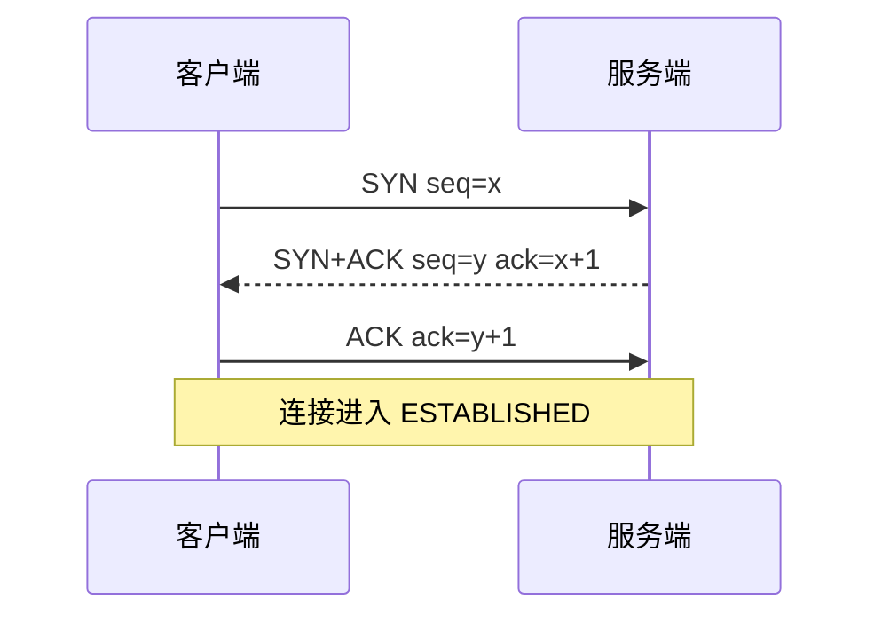
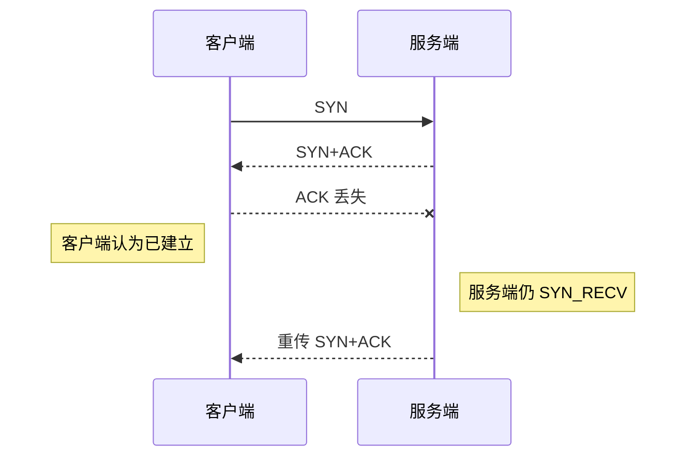
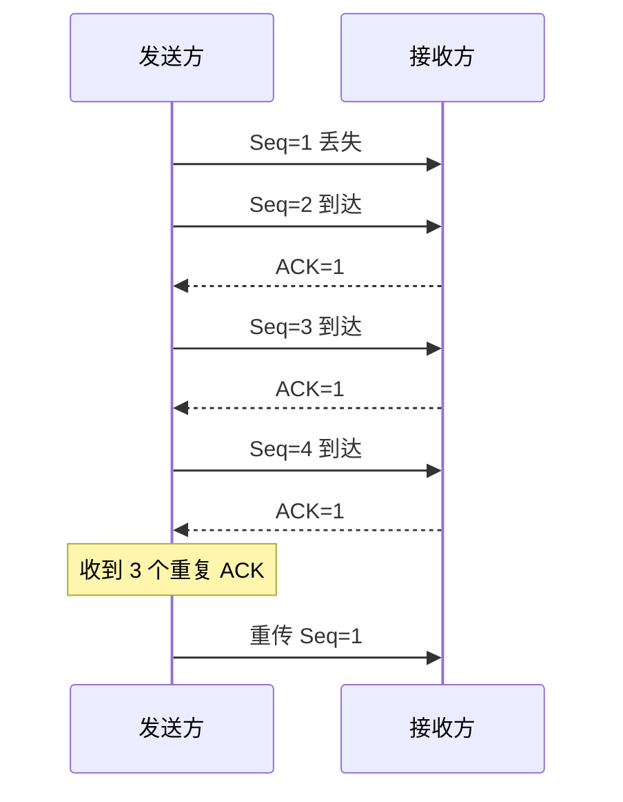

# tcpdump 抓包应该怎么看三次握手和重传？

> 抓包不是为了截图好看，而是把“建连慢、请求超时、重传高、窗口变小”这些现象拆成可验证的报文证据。

## 先掌握最常用抓包命令

在服务器上抓某个目标和端口：

```bash
sudo tcpdump -i eth0 -nn host 10.0.0.12 and port 443
```

保存成 pcap，后续用 Wireshark 分析：

```bash
sudo tcpdump -i eth0 -nn -s 0 -w /tmp/https.pcap host 10.0.0.12 and port 443
```

常用选项：

| 选项               | 含义                                       |
| ------------------ | ------------------------------------------ |
| `-i eth0`          | 指定网卡                                   |
| `-i any`           | 不确定入口网卡时抓所有网卡，方向判断会更粗 |
| `-nn`              | 不解析域名和端口名，避免 DNS 干扰          |
| `-s 0`             | 抓完整包                                   |
| `-w file.pcap`     | 写入文件                                   |
| `-G/-W/-C`         | 按时间、数量或大小切分文件                 |
| `host/ip/port/tcp` | 过滤表达式                                 |

生产抓包要控制范围和时长，避免 pcap 过大或包含敏感数据。

如果是 HTTPS，只能从包长、方向、握手、重传、RST、FIN、窗口等角度判断网络问题，不能直接看到 HTTP 明文内容。涉及账号、Cookie、Token、业务请求体的环境，保存 pcap 前要先评估敏感数据范围。

## tcpdump 文本输出怎么看？

一行典型 TCP 输出可以拆成几段：

```text
10:01:02.123456 IP 10.0.0.1.54321 > 10.0.0.2.443: Flags [S], seq 100, win 64240, options [mss 1460,sackOK,TS val 1 ecr 0,wscale 7], length 0
```

| 字段                            | 含义                                                           |
| ------------------------------- | -------------------------------------------------------------- |
| `10.0.0.1.54321 > 10.0.0.2.443` | 源 IP/端口到目的 IP/端口                                       |
| `Flags [S]`                     | TCP 标志位，`S` 是 SYN，`.` 常表示 ACK，`F` 是 FIN，`R` 是 RST |
| `seq` / `ack`                   | 序列号和确认号，用来判断是否重传、是否推进                     |
| `win`                           | 对端通告窗口，持续变小或为 0 要看接收方消费能力                |
| `options`                       | MSS、SACK、时间戳、窗口扩大等 TCP 选项                         |
| `length`                        | TCP 负载长度，握手 ACK 通常为 0                                |

tcpdump 不会像 Wireshark 一样自动标注“这是快速重传”。你要自己看同方向、同序列号、相近长度的数据是否重复出现，以及 ACK 是否一直停在同一个位置。

## 三次握手怎么看？

过滤 SYN：

```bash
sudo tcpdump -i eth0 -nn 'tcp[tcpflags] & (tcp-syn|tcp-ack) != 0 and host 10.0.0.12 and port 443'
```

典型三次握手：



在 Wireshark 里常看到相对序列号从 0 开始，这是工具为了方便显示做的转换，不是真实 ISN。需要看真实序列号时，可以关闭 Relative Sequence Numbers。

握手阶段还要顺手看 TCP 选项：

- MSS 是否符合链路 MTU 预期。
- 是否协商 SACK，后续丢包恢复会受影响。
- 是否有 Window Scale，高 BDP 链路吞吐会受窗口限制影响。
- 时间戳选项是否存在，排查 RTT、重传和 PAWS 时有帮助。

## SYN 丢包或服务端不回包怎么看？

如果客户端发出 SYN 后没有收到 SYN+ACK，会看到 SYN 按 RTO 重传：

```text
C -> S SYN
C -> S SYN Retransmission
C -> S SYN Retransmission
```

Linux 客户端 SYN 重试次数常看：

```bash
sysctl net.ipv4.tcp_syn_retries
```

这类现象可能是：

- 目标 IP/端口不可达。
- 防火墙或安全组丢包。
- 服务端没监听。
- 回程路径不通。
- SYN 队列压力大。

不要只在客户端抓包。必要时客户端和服务端同时抓：客户端看到发出 SYN，服务端没看到，问题在中间；服务端看到 SYN 且回了 SYN+ACK，客户端没收到，问题在回程或中间设备。

双端抓包时最好同步机器时间，或者用同一个请求的五元组、SYN 序列号、时间戳选项做对齐。否则只看“客户端 10:01 发了，服务端 10:01 没收到”很容易被时钟偏差误导。

## 第二次握手丢了怎么看？

第二次握手 `SYN+ACK` 丢失时，会出现两端都重传：

- 客户端收不到 `SYN+ACK`，重传 SYN。
- 服务端收不到第三次 ACK，重传 `SYN+ACK`。

服务端相关参数：

```bash
sysctl net.ipv4.tcp_synack_retries
```

如果服务端 `SYN_RECV` 很多：

```bash
ss -tan state syn-recv
```

要结合半连接队列、SYN Flood、防火墙、回程路径一起查。

## 第三次握手 ACK 丢了怎么看？

第三次 ACK 丢失时，客户端可能已经进入 `ESTABLISHED`，服务端仍停在 `SYN_RECV`，并重传 `SYN+ACK`。



如果客户端随后发送应用数据，服务端可能把携带 ACK 的数据包当作握手确认；如果服务端半连接已经超时清掉，客户端可能遭遇超时或 RST。

## 重传怎么看？

Wireshark 会标记 `TCP Retransmission`、`Fast Retransmission`、`Dup ACK`。tcpdump 原始输出不会直接替你判断原因，需要看序列号、ACK 和时间间隔。

快速重传常见形态：



建立连接后的数据重传上限可看：

```bash
sysctl net.ipv4.tcp_retries2
```

重传高时，还要配合：

```bash
ss -tin dst 10.0.0.12
netstat -s | grep -i retrans
sar -n TCP,ETCP 1
```

判断重传原因时可以按这个顺序拆：

| 抓包现象                     | 常见含义                          | 下一步                               |
| ---------------------------- | --------------------------------- | ------------------------------------ |
| 同一方向同一 `seq` 反复出现  | 发送方认为对端没收到或 ACK 没回来 | 双端抓包确认是去程丢还是回程 ACK 丢  |
| 大量 `Dup ACK`，随后快速重传 | 中间有数据段缺口，后续段已到达    | 看链路丢包、乱序、网卡丢包和中间设备 |
| RTO 间隔逐步拉大             | 超时重传，发送方拿不到有效 ACK    | 看防火墙、对端卡死、队列满、路由黑洞 |
| `RST` 突然出现               | 一方拒绝或重置连接                | 看谁发的 RST，以及应用日志/内核队列  |

## 零窗口和窗口探测怎么看？

如果接收方应用不读数据，接收缓冲区变满，ACK 里会通告窗口变小，甚至为 0。

Wireshark 常见标记：

- `TCP ZeroWindow`
- `TCP Window Update`
- `TCP Keep-Alive` 或窗口探测相关报文

这里容易混淆：抓包里某些窗口探测报文可能被标为 Keep-Alive，但它解决的是零窗口探测，不等同于“HTTP Keep-Alive”。

如果看到窗口长期为 0，要查接收端应用为什么不读：

```bash
ss -tin sport = :8080
jstack <pid>
top -H -p <pid>
```

这类问题经常不是网络带宽不够，而是应用线程、下游依赖或 GC 导致消费不动。

## FIN、RST 和超时怎么区分？

连接关闭也要看报文证据：

- `FIN`：一方正常关闭发送方向，常见于应用主动 close 或 HTTP 长连接空闲超时。
- `RST`：连接被重置，常见于端口未监听、应用强制关闭、队列溢出快速失败、中间设备重置。
- 没有 `FIN/RST`，只有重传直到超时：更像黑洞、丢包、防火墙静默丢弃或对端长时间无响应。

如果服务端日志说“客户端断开”，但抓包看到是服务端先发 `FIN`，就要回头查服务端空闲超时、连接池、网关策略，而不是只怪客户端。

## 小结

- 抓三次握手要看 SYN、SYN+ACK、ACK 是否完整，以及哪一端在重传。
- SYN 重传看 `tcp_syn_retries`，SYN+ACK 重传看 `tcp_synack_retries`，建连后数据重传看 `tcp_retries2`。
- 客户端和服务端同时抓包，能区分去程丢、回程丢、服务端未响应和中间设备丢包。
- tcpdump 文本输出重点看五元组、Flags、seq/ack、win、options 和 length。
- Wireshark 的相对序列号是显示优化，不是真实 ISN；TLS 加密后不能直接看到 HTTP 明文。
- 零窗口通常指接收方应用消费慢，排查要回到线程、GC、下游依赖和 socket 缓冲区。

## 参考

基于 IETF RFC 791、RFC 793、RFC 9293、RFC 9110、RFC 9112、RFC 9113、RFC 9114、RFC 8446、RFC 9000、RFC 9204 以及 Linux man-pages 中网络协议与排障命令相关内容整理。
