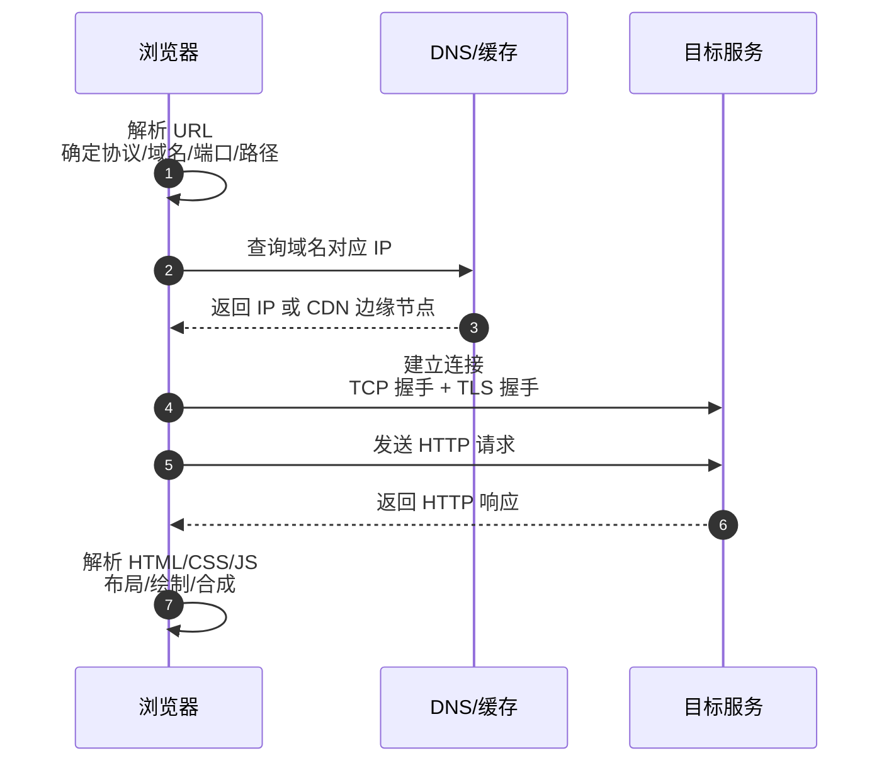
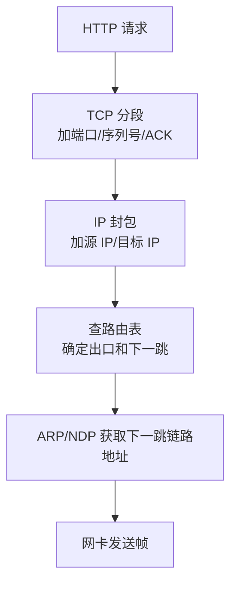

# 输入 URL 到页面展示，中间发生了什么？

> 这道题不是让你背流水账，而是看你能不能把浏览器、DNS、TCP/TLS、HTTP、服务端和渲染串成一条证据链。

## 先把全流程画出来

输入 `https://www.example.com/orders?id=1` 后，可以按六段讲：



真实浏览器会并行做很多事，比如缓存命中、预连接、子资源加载、HTTP/2 多路复用。面试回答可以先讲主链路，再补这些优化。

## 第一步：浏览器解析 URL

浏览器先拆 URL：

| 部分 | 示例              | 含义                         |
| ---- | ----------------- | ---------------------------- |
| 协议 | `https`           | 使用 HTTPS，默认端口 443     |
| 域名 | `www.example.com` | 需要解析成 IP                |
| 路径 | `/orders`         | 服务端路由或静态资源路径     |
| 查询 | `id=1`            | 请求参数，由服务端按协议解析 |

如果 URL 没写路径，浏览器通常请求 `/`。至于最终返回 `index.html`、重定向到登录页，还是由应用网关转到某个后端接口，这是服务端路由决定的，不能简单说“一定访问 index.html”。

## 第二步：DNS 找到目标 IP

浏览器拿到域名后，需要知道要连哪个 IP。DNS 查询不一定每次都从根域开始，通常会先看缓存：

1. 浏览器 DNS 缓存。
2. 操作系统缓存和 `hosts`。
3. 本地递归 DNS。
4. 根 DNS、顶级域 DNS、权威 DNS 逐级指路。

递归 DNS 返回的也不一定是源站 IP。生产环境经常会返回 CDN 边缘节点、负载均衡 VIP，或者根据地域、运营商、健康检查结果给不同 IP。

排查时常用：

```bash
dig www.example.com
nslookup www.example.com
curl -v https://www.example.com/
```

需要注意，现代浏览器还可能使用 DoH/DoT，DNS 不一定完全走系统配置的传统 UDP 53 查询。

## 第三步：建立 TCP/TLS 连接

如果是 HTTP/1.1 或 HTTP/2 over TLS，浏览器通常先建立 TCP 连接，再做 TLS 握手：

1. TCP 三次握手：同步双方初始序列号，确认连接可用。
2. TLS 握手：校验证书、协商密钥、确定后续对称加密参数。
3. 连接建立后，HTTP 请求才会在这个安全通道里发送。

如果是 HTTP/3，情况不同：HTTP/3 基于 QUIC，QUIC 运行在 UDP 之上，并把可靠传输、拥塞控制和 TLS 1.3 握手整合在一起。所以回答时要加版本边界，不能说“HTTP 一定基于 TCP”。

## 第四步：协议栈封装并发出去

浏览器生成 HTTP 请求后，会交给操作系统协议栈：



几个关键点：

- TCP 会按 MSS 拆分字节流，丢了哪个段就重传哪个段。
- IP 根据路由表决定下一跳，不保证可靠到达。
- IPv4 常用 ARP 找下一跳 MAC；IPv6 用 NDP。
- 每一跳的 MAC 头会变，目标 IP 通常不变；但 NAT、代理、负载均衡会改写 IP 或端口。

排查路径时常用：

```bash
ip route get 1.1.1.1
traceroute www.example.com
ping www.example.com
```

`ping` 只能说明 ICMP 层面的可达性，不能证明 TCP 443 或应用接口一定正常。

## 第五步：服务端处理请求

服务端网卡收到帧后，反向解封装：

1. 链路层校验帧并交给 IP 层。
2. IP 层确认目标地址和协议号。
3. TCP 层根据四元组找到连接，把字节流交给监听端口对应的进程。
4. Web 服务解析 HTTP 请求。
5. 应用可能访问缓存、数据库、RPC，再生成响应。

这就是为什么“接口慢”不一定是网络慢。它可能慢在：

- DNS 解析慢。
- TCP/TLS 握手慢。
- 网关排队。
- 应用线程池满。
- Redis/MySQL 慢。
- 响应体过大或客户端下载慢。

Java 服务排障时，`curl -v` 可以拆出 DNS、connect、TLS 和首字节时间；应用侧还要结合连接池、线程池、GC、数据库慢查询一起看。

## 第六步：浏览器解析并渲染页面

浏览器收到 HTML 后，不是“直接展示”，还要走渲染流水线：

1. 解析 HTML，构建 DOM。
2. 解析 CSS，构建 CSSOM。
3. 执行 JavaScript，可能修改 DOM/CSSOM，也可能发起新的网络请求。
4. 合并成渲染树。
5. Layout 计算位置和大小。
6. Paint 绘制像素。
7. Composite 合成图层并显示。

HTML 中的 CSS、JS、图片、字体会继续触发子资源请求。HTTP 缓存、强缓存/协商缓存、HTTP/2 多路复用、浏览器连接数限制，都会影响最终加载表现。

## 小结

- 输入 URL 后，主链路是 URL 解析、DNS、连接建立、HTTP 请求响应、服务端处理、浏览器渲染。
- DNS 不一定每次从根域开始，真实环境还会受缓存、CDN、TTL、DoH/DoT 影响。
- HTTP/1.1 和 HTTP/2 通常基于 TCP，HTTPS 还要 TLS；HTTP/3 基于 QUIC/UDP。
- 跨网络转发时 MAC 每跳变化，IP 通常保持目标语义，但 NAT/代理会改写地址或端口。
- 接口慢要分段定位，不要把 DNS、连接、TLS、应用处理、数据库和浏览器渲染混成一个“网络慢”。

## 参考

基于 IETF RFC 791、RFC 793、RFC 9293、RFC 9110、RFC 9112、RFC 9113、RFC 9114、RFC 8446、RFC 9000、RFC 9204 以及 Linux man-pages 中网络协议与排障命令相关内容整理。
