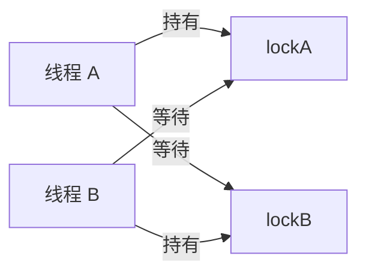

# 死锁产生的条件是什么？线上怎么避免？

> 死锁不是“慢”，而是一组执行流形成等待环：每个人都拿着别人需要的资源，同时又不释放自己手里的资源。

## 一个最小例子

线程 A 先拿锁 `lockA`，再拿锁 `lockB`；线程 B 先拿 `lockB`，再拿 `lockA`。如果 A 拿到 `lockA` 后等待 `lockB`，B 拿到 `lockB` 后等待 `lockA`，两边都不会继续往下走。

这就是等待环：

```text
线程 A 持有 lockA -> 等待 lockB
线程 B 持有 lockB -> 等待 lockA
```

更一般地说，死锁里的“执行流”不一定只是 Java 线程，也可以是进程、数据库事务、分布式任务；“资源”也不一定只是互斥锁，还可能是行锁、文件锁、连接、队列槽位、线程池工作线程。

判断是不是死锁，不要只看“卡住了”，而要看有没有等待环：



## 四个必要条件怎么讲？

死锁要同时满足四个条件：

| 条件       | 白话解释                           | 例子                       |
| ---------- | ---------------------------------- | -------------------------- |
| 互斥       | 一个资源同一时间只能被一个线程使用 | 一把互斥锁只能一个线程持有 |
| 持有并等待 | 拿着已有资源，还继续等新资源       | 拿着 `lockA` 等 `lockB`    |
| 不可剥夺   | 别人不能强行抢走已持有资源         | 锁只能由持有者释放         |
| 环路等待   | 等待关系形成闭环                   | A 等 B，B 等 A             |

理论上，破坏任意一个条件，死锁就不会成立。工程里最常处理的是“持有并等待”和“环路等待”：要么拿不到第二个资源就释放已持有资源，要么规定所有执行流按同一顺序拿资源。

比如账户转账里有两个账户锁。线程 1 转 A -> B，线程 2 转 B -> A，如果都按“先锁转出账户，再锁转入账户”，就可能形成等待环。更稳的做法是按账户 ID 从小到大加锁：

```java
Object first = from.id() < to.id() ? from : to;
Object second = first == from ? to : from;

synchronized (first) {
    synchronized (second) {
        transfer(from, to, amount);
    }
}
```

## Java 线上怎么定位？

先用 `jstack` 或 `jcmd` 打线程栈：

```bash
jcmd <pid> Thread.print > /tmp/threads.txt
jstack -l <pid> > /tmp/threads.txt
```

如果 JVM 检测到 Java monitor 死锁，线程栈底部通常会出现 deadlock 相关提示，并指出哪些线程互相等待。即使没有自动识别，也可以顺着线程状态和调用栈找等待关系。

这里要区分两类常见锁：

| 锁类型                     | 线程栈常见表现                                 | 观察重点                     |
| -------------------------- | ---------------------------------------------- | ---------------------------- |
| `synchronized` / monitor   | `BLOCKED`，等待进入某个对象监视器              | 哪个线程持有 monitor         |
| `ReentrantLock` / AQS 类锁 | `WAITING`、`TIMED_WAITING`、`LockSupport.park` | park 在哪个业务栈、谁持有锁  |
| 连接池、线程池、队列等资源 | 可能不是锁等待，而是业务方法长时间等待资源     | 资源池上限、等待队列、调用链 |

排查顺序建议：

1. 看是否有明确 deadlock 提示。
2. 找 `BLOCKED`、`WAITING`、`TIMED_WAITING` 集中的业务栈。
3. 对比“持有资源的线程”和“等待资源的线程”。
4. 回到代码里检查加锁顺序、锁粒度、外部调用是否放在锁内。
5. 如果线程栈看不出 Java 锁，继续查数据库锁、分布式锁、连接池和 native 栈。

JVM 自动识别能力有边界。它更擅长识别 Java monitor 之间的死锁，看不到数据库事务互锁、Redis 分布式锁互锁、native mutex、连接池资源等待，也看不到跨服务调用链形成的等待环。

如果怀疑 native 线程或系统库卡住，可以补充：

```bash
pstack <pid>
gdb -p <pid>
(gdb) info threads
(gdb) thread apply all bt
```

这类命令侵入性更强，线上使用要结合权限、环境和变更窗口，优先在故障现场副本或低峰期执行。

## 数据库死锁怎么理解？

数据库死锁也按等待环理解，只是资源从 Java 锁换成行锁、间隙锁、元数据锁或事务持有的其他资源。

一个典型例子：

1. 事务 T1 先更新订单 1，再更新订单 2。
2. 事务 T2 先更新订单 2，再更新订单 1。
3. T1 等 T2 持有的订单 2 行锁，T2 等 T1 持有的订单 1 行锁。

数据库通常会检测死锁，并回滚其中一个事务。应用层不能把这当成“数据库偶发失败”，而要做三件事：

- 识别死锁错误码或异常类型。
- 保证业务操作幂等，允许有限重试。
- 缩短事务时间，统一更新顺序，不在事务里做慢 RPC 或长时间计算。

## 怎么避免？

常用办法有几类：

- 固定加锁顺序：多个锁按资源 ID、表名、账户 ID 排序后再获取，破坏环路等待。
- 一次性申请或拿不到就释放：减少“持有并等待”。
- 缩小锁范围：不要在锁内做远程调用、慢 SQL、文件 IO。
- 使用尝试锁和超时：`tryLock(timeout)` 比无限等待更容易恢复。
- 减少嵌套锁：能拆成无共享、队列串行、CAS 就别层层加锁。
- 保持事务短小：数据库事务里不要夹杂耗时业务逻辑。

`tryLock` 的意义不是让死锁神奇消失，而是让等待有退出路径：

```java
if (lockA.tryLock(200, TimeUnit.MILLISECONDS)) {
    try {
        if (lockB.tryLock(200, TimeUnit.MILLISECONDS)) {
            try {
                doWork();
            } finally {
                lockB.unlock();
            }
        }
    } finally {
        lockA.unlock();
    }
}
```

这种写法要配合业务补偿或重试。拿不到锁直接吞掉任务，同样会造成数据不一致。

## 线程池饥饿死锁算不算死锁？

多数线程池耗尽只是资源饥饿：请求太多、任务太慢、线程数太小，队列排不上。但如果任务之间形成等待环，也会演化成线程池饥饿死锁。

典型场景是：线程池只有 2 个工作线程，任务 A 和任务 B 已经占满线程池；它们又各自提交子任务到同一个线程池，并同步等待子任务结果。子任务排在队列里，却永远没有空闲工作线程执行。

排查这种问题时，线程栈里不一定出现 Java monitor deadlock，而是大量线程卡在 `Future.get()`、`CompletableFuture.join()`、队列 `take()` 或连接池 `borrow` 上。治理思路是拆线程池、避免在工作线程里同步等待同池任务、给等待设置超时，并对线程池队列和拒绝策略做监控。

## 容易踩的坑

不要把所有卡顿都叫死锁。连接池耗尽、下游无响应、慢 SQL、GC 暂停都会让请求卡住，但未必有等待环。死锁的关键证据是“互相等待对方持有的资源”。

也不要只靠增大线程池解决死锁。普通锁死锁里线程不是不够，而是等待关系错了；加线程只会让更多请求堆进去。线程池饥饿问题则要看是否存在同池同步等待、队列堆积和资源池上限。

## 小结

- 死锁成立需要互斥、持有并等待、不可剥夺、环路等待四个条件同时满足。
- 工程上最常通过统一加锁顺序、超时退出、短事务和资源隔离来降低死锁风险。
- Java 死锁优先用 `jcmd Thread.print` 或 `jstack -l` 定位等待关系，但它们看不到所有外部资源死锁。
- `synchronized` 常见 `BLOCKED`，AQS 锁和资源池等待常见 `WAITING` 或 `TIMED_WAITING`。
- 数据库死锁也要按资源等待环理解，并配合短事务、有限重试和幂等。
- 线程池饥饿死锁的核心是同池任务互相等待，不能简单靠加线程解决。

## 参考

基于 Linux man-pages、Linux kernel documentation、OpenJDK 线程诊断工具文档、POSIX 线程同步规范与数据库事务锁相关行为整理，并核对了 Java monitor、AQS 锁、native 栈和数据库死锁的观察边界。
