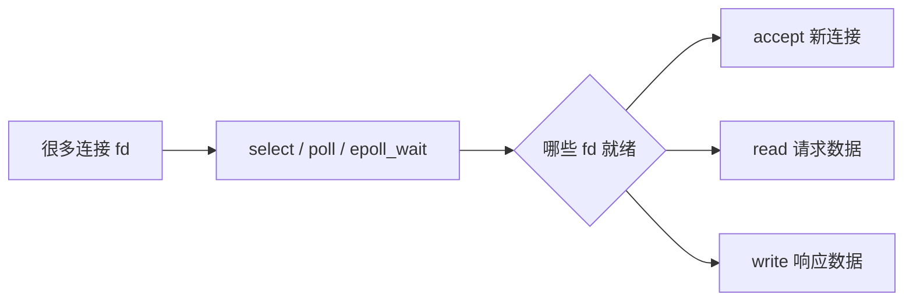

# select、poll、epoll 的区别是什么？

> IO 多路复用让少量线程等待大量 socket 的就绪事件，关键差别在于“怎么告诉内核关注谁”和“怎么拿到已就绪的谁”。

## 为什么需要 IO 多路复用？

最朴素的服务端模型是一个连接一个线程。连接少时简单，连接上万后，线程栈、上下文切换、调度队列和文件描述符都会成为瓶颈。

一次网络读取可以拆成两个阶段：

```text
等待数据到达内核缓冲区
  ↓
把数据从内核缓冲区拷到用户缓冲区
```

阻塞 IO 的问题主要卡在第一步：线程为某一个连接等待数据。IO 多路复用把很多 fd 交给内核，让一个线程阻塞在 `select/poll/epoll_wait` 上。哪个 fd 可读、可写，内核返回就绪事件，应用再处理对应 fd。

所以它解决的是“等 IO”这件事，不是让一次 `read` 本身更快。真正把数据从内核缓冲区拷到用户缓冲区，仍然需要应用调用 `read/recv`，因此 IO 多路复用仍属于同步 IO。



Netty、Nginx、Redis 都在这个基础上做了不同的事件模型。它们不是让 IO 消失，而是把大量“等待”集中到少量线程里。

## select 和 poll 为什么不够好？

`select` 用 `fd_set` 表达关注的文件描述符集合，可以理解成一张 bitmap。每次调用大致会做这些事：

```text
用户态准备 fd_set
  ↓
拷贝到内核
  ↓
内核线性扫描 fd_set，标记就绪 fd
  ↓
拷回用户态
  ↓
用户态再扫描一遍，找出具体就绪 fd
```

它的问题有：

- 文件描述符数量受用户态 `FD_SETSIZE` 这类固定结构影响，常见默认值是 1024。
- 每次调用都要传完整集合，并在用户态和内核态之间拷贝。
- 内核要线性扫描，返回后用户态还要再线性扫描。
- `fd_set` 是输入也是输出，返回后集合被改写，下一轮要重建。

`poll` 把 bitmap 换成 `pollfd` 数组：

```c
struct pollfd {
    int fd;
    short events;
    short revents;
};
```

它改进了两个点：不再受 `fd_set` 固定大小限制；`events` 和 `revents` 分开，下一轮不用像 `select` 那样重建全部关注集合。

但它没有改变性能模型：每次调用仍要传完整数组，内核仍要线性扫描，应用也通常要遍历数组找 `revents`。

## 三者横向对比

| 维度         | select                       | poll                         | epoll                                   |
| ------------ | ---------------------------- | ---------------------------- | --------------------------------------- |
| 关注集合     | 固定 bitmap                  | `pollfd` 数组                | 内核长期维护 interest list              |
| fd 数量限制  | 常受 `FD_SETSIZE` 限制       | 主要受进程 fd 上限限制       | 主要受进程 fd、内存和内核参数限制       |
| 每次等待传参 | 传完整集合，返回后集合被改写 | 传完整数组，内核写 `revents` | `epoll_wait` 只取就绪事件               |
| 查找就绪 fd  | 线性扫描                     | 线性扫描                     | 只遍历本轮就绪事件                      |
| 触发模式     | LT                           | LT                           | LT，支持 ET                             |
| 适合场景     | 少量 fd、跨平台简单场景      | fd 数量稍多但规模不大的场景  | 大量连接、活跃连接占比较低的 Linux 服务 |

## epoll 改进在哪里？

`epoll` 把“注册关注对象”和“等待就绪事件”拆开：

- `epoll_ctl`：增删改要关注的 fd。
- `epoll_wait`：等待并返回已经就绪的事件。

内核维护关注集合和就绪队列。应用不用每次把全部 fd 传进去，也不用每次扫描全部连接，只处理就绪事件。

对大量连接但活跃连接较少的场景，`epoll` 的优势非常明显。这也是高并发网络服务在 Linux 上普遍使用 epoll 的原因。

需要纠正一个常见误区：`epoll_wait` 返回就绪事件时，并不是靠 mmap 让用户态和内核态共享一块就绪列表。它仍然要把就绪事件拷到用户态数组。epoll 省掉的是 `select/poll` 每次调用都重复传完整 fd 集合的开销，不是完全没有任何用户态/内核态拷贝。

epoll 也不是任何场景都更快。如果只有几十个 fd，而且几乎每次都全部活跃，维护关注集合、回调和就绪队列的固定成本也要算进去。它的主场是“连接很多，但同一时刻只有少数连接活跃”。

## LT 和 ET 怎么理解？

epoll 支持两种触发模式：

| 模式        | 行为                         | 编程要求                               |
| ----------- | ---------------------------- | -------------------------------------- |
| LT 水平触发 | 只要条件还满足，就会反复通知 | 编程更简单                             |
| ET 边缘触发 | 状态变化时通知一次           | 必须配合非阻塞 IO，循环读写到 `EAGAIN` |

举例：socket 接收缓冲区里有数据。LT 模式下，只要你没读完，`epoll_wait` 还会继续提醒；ET 模式下，数据从无到有时提醒一次，如果你没一次读干净，后续可能不再提醒。

所以 ET 更容易减少通知次数，但也更容易写出 bug。

ET 的典型读法是：

```c
while (1) {
    ssize_t n = read(fd, buf, sizeof(buf));
    if (n > 0) {
        // 处理这批数据，然后继续读
        continue;
    }
    if (n == 0) {
        close(fd);
        break;
    }
    if (errno == EAGAIN || errno == EWOULDBLOCK) {
        break;
    }
    if (errno == EINTR) {
        continue;
    }
    close(fd);
    break;
}
```

如果 fd 是阻塞的，最后一次没有数据可读时会卡死在线程里；如果没有读到 `EAGAIN` 就退出，剩余数据可能长期躺在内核缓冲区里。因此 ET 通常必须配合非阻塞 IO，并把读写、短写、`EPOLLERR`、`EPOLLHUP`、`EPOLLRDHUP` 等边角处理完整。

## 生产排障看哪些证据？

连接上不去或延迟异常时，可以按这条线查：

```bash
# 单进程 fd 上限
ulimit -n
cat /proc/<pid>/limits

# 当前进程打开了多少 fd
ls /proc/<pid>/fd | wc -l

# 连接状态分布
ss -ant | awk '{print $1}' | sort | uniq -c

# 监听队列和丢包统计
ss -lnt
netstat -s | grep -i listen
```

常见问题不是“没用 epoll”，而是：

- fd 上限太小。
- EventLoop 或 IO 线程被业务逻辑阻塞。
- ET 模式漏读、短写没处理。
- listen backlog、全连接队列或半连接队列配置不合理。
- 连接都很活跃，IO 线程 CPU 打满。

## 和 Java/Netty 怎么连接？

Java NIO 的 `Selector` 是多路复用的 Java 封装，在 Linux 上底层通常会使用 epoll。Netty 的 `EpollEventLoopGroup` 则直接使用 Linux epoll 能力，适合 Linux 生产环境。

但 Netty 的性能不只来自 epoll，还来自事件循环、缓冲区、Pipeline 和线程模型。排障时不要只盯系统调用：

- 连接数上不去，先看文件描述符限制：`ulimit -n`。
- EventLoop 线程被业务逻辑阻塞，会导致它负责的连接都延迟。
- 使用 ET 时必须非阻塞读写到 `EAGAIN`，否则会丢事件感知。
- Java 侧还要看 Selector 空轮询、GC 停顿、直接内存和业务线程池是否阻塞。

## 小结

- IO 多路复用让少量线程等待大量 fd 的就绪事件。
- `select` 常受固定 bitmap 限制，每次需要拷贝和扫描集合。
- `poll` 放宽数量表达，但仍然要传完整数组并线性扫描。
- `epoll` 拆分注册和等待，用就绪队列减少无效扫描。
- epoll ET 模式通常要配合非阻塞 IO，并循环读写到 `EAGAIN`。
- epoll 不是银弹，它适合大量连接、少量活跃的 Linux 网络服务。

## 参考

基于 Linux man-pages、Linux kernel documentation、OpenJDK 工具文档与 POSIX 相关规范中进程、线程、内存、文件系统、I/O、epoll、sendfile 等内容整理。
