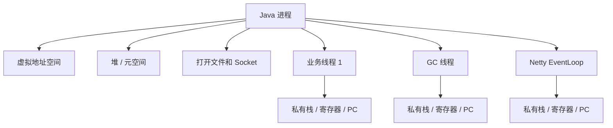
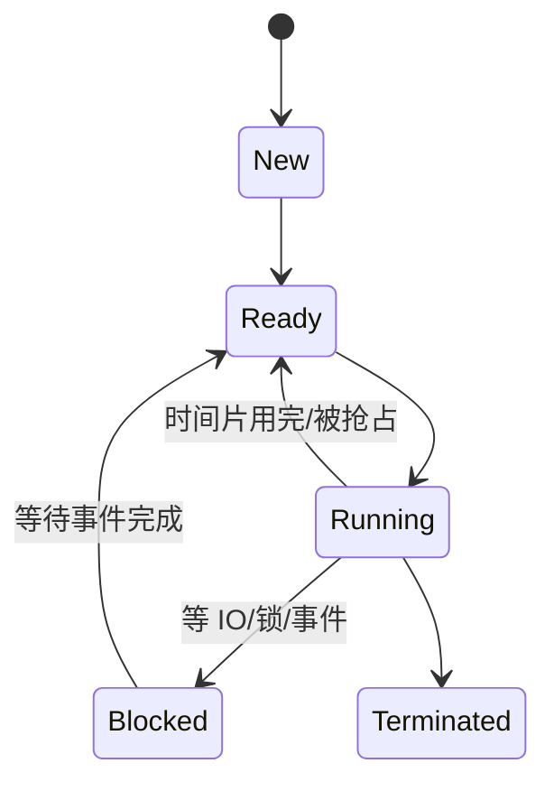

# 进程和线程有什么区别？为什么线程更轻量？

> 进程像一个运行中的应用容器，线程像容器里的执行流；线程轻，是因为它少带一套资源边界。

## 先用一个 Java 服务理解

启动一个 Spring Boot 应用后，操作系统看到的是一个 Java 进程。这个进程有自己的虚拟地址空间、打开的文件描述符、环境变量、堆、代码段和一组内核维护的数据结构。

进程里会有很多线程：主线程、GC 线程、JIT 编译线程、业务线程池、Netty EventLoop 线程等。它们共享同一个进程里的堆、方法区、打开文件和 socket，但每个线程有自己的栈、寄存器现场和程序计数位置。

所以可以这样记：

| 维度     | 进程                                 | 线程                         |
| -------- | ------------------------------------ | ---------------------------- |
| 角色     | 资源分配的基本单位                   | CPU 调度的基本单位           |
| 地址空间 | 默认相互隔离                         | 同进程内共享                 |
| 私有内容 | 进程控制信息、地址空间、文件表等     | 线程栈、寄存器、程序计数位置 |
| 崩溃影响 | 一个进程崩溃通常不直接破坏另一个进程 | 一个线程异常可能拖垮整个进程 |
| 通信成本 | 需要 IPC 或 socket                   | 共享内存变量即可，但要同步   |

可以再换个角度记：

进程更像“资源容器”，线程更像“执行路径”。资源容器决定边界和隔离，执行路径决定 CPU 调度和并发。

## 为什么说线程更轻量？

创建进程时，操作系统要准备一套进程级资源：虚拟地址空间、页表、文件描述符表、信号处理信息等。创建线程时，很多资源可以复用所属进程，只需要给线程准备执行现场和栈空间。

切换时也是类似。进程切换不仅要切 CPU 寄存器，还可能切换地址空间和页表上下文；同进程内线程切换通常不需要换整套地址空间，所以成本更低。

但“轻量”不是“免费”。一个 Java 平台线程通常对应一个操作系统线程，需要栈空间，也要参与调度。线程很多时，调度、内存和锁竞争都会变成问题。

在 Linux 上还要加一个实现边界：进程和线程不是内核里两套完全割裂的东西，它们都可以用任务结构来描述。差异更多来自创建时是否共享地址空间、文件表、信号处理等资源。所以“进程是资源分配单位、线程是调度单位”适合作为面试入口，但不是 Linux 内核实现的完整描述。

Linux 里常见的 `pthread_create()` 底层会通过类似 `clone()` 的机制创建执行实体，并用不同标志决定共享哪些资源。比如共享地址空间、文件表、信号处理等，就更像线程；不共享这些资源，就更像传统进程。理解这个边界后，就不会把“进程/线程”背成两种完全无关的内核对象。

## 进程和线程有哪些状态？

进程常见五状态可以这样记：

线程也有类似的运行、就绪、阻塞状态。Java 里看到的 `RUNNABLE`、`BLOCKED`、`WAITING`、`TIMED_WAITING` 是 JVM 对线程状态的表达，不能和 Linux 调度状态一一硬套，但排障时很有用。

比如 `jstack` 里大量线程处于：

- `BLOCKED`：通常和锁竞争有关。
- `WAITING`：可能在等队列、条件变量、`park` 或线程 join。
- `TIMED_WAITING`：可能在 `sleep`、超时等待、连接池等待。

状态本身不是根因，根因要继续看栈顶方法、锁对象、线程池和下游调用。

## fork、exec、wait 分别在做什么？

这组概念经常和进程一起问：

- `fork()`：创建子进程。现代 Linux 通常用写时复制降低成本，父子进程先共享物理页，谁写谁复制。
- `exec()`：不创建新进程，而是把当前进程的程序映像替换成另一个程序。
- `wait()` / `waitpid()`：父进程回收子进程退出状态，避免子进程变成僵尸进程。

这能解释为什么 Shell 执行命令时常见流程是：先 `fork` 出子进程，再在子进程里 `exec` 目标程序，父进程 `wait` 等它结束。

还有两个工程细节：

1. `fork()` 后父子进程有独立的虚拟地址空间，但现代系统通常使用写时复制。刚 fork 时不急着复制所有物理页，谁写某一页才复制那一页。
2. `fork()` 后文件描述符表会被复制，但对应 fd 可能指向同一个打开文件对象，所以文件偏移量等状态可能共享。生产程序常用 close-on-exec 避免无关 fd 泄漏给子进程。

多线程程序里直接 `fork()` 更要谨慎。子进程里通常只保留调用 `fork()` 的那个线程，其他线程不存在了，但锁、内存分配器、stdio 等状态可能被复制成“看起来已被占用”的样子。稳妥做法是 fork 后尽快 exec，避免在子进程里做复杂逻辑。

## 线程共享资源带来什么代价？

线程共享堆和全局数据，意味着修改共享变量时必须考虑并发安全。

比如两个线程同时执行 `count++`，看起来是一句代码，底层可能是读内存、加一、写回三步。只要中间发生调度切换，就可能丢失更新。这也是 Java 里需要 `synchronized`、`Lock`、`AtomicInteger`、并发集合的原因。

进程之间默认隔离，安全边界更强；线程之间共享更多，通信方便但更容易出错。

线程共享资源不只带来“数据错”的问题，还会带来性能问题：

- 锁竞争会让线程从运行态进入等待态。
- 缓存行在多个 CPU 核之间来回失效，会拖慢吞吐。
- 线程很多时，调度器要频繁做选择，上下文切换变多。
- 一个线程触发进程级崩溃或 `System.exit`，整个 JVM 进程都会受影响。

所以“线程通信更方便”要和“同步成本更高”一起说，才是完整答案。

## 用户线程、内核线程和虚拟线程怎么区分？

线程还可以按“谁调度”来区分：

| 类型       | 谁负责调度               | 优点                     | 边界                         |
| ---------- | ------------------------ | ------------------------ | ---------------------------- |
| 用户级线程 | 语言运行时或线程库       | 切换不一定进入内核，轻量 | 阻塞系统调用可能拖住承载线程 |
| 内核级线程 | 操作系统内核             | 能利用多核，阻塞互不拖累 | 创建、阻塞、唤醒和切换更重   |
| 虚拟线程   | JVM 调度，挂载到平台线程 | 适合大量 IO 等待任务     | CPU 密集任务仍受核心数限制   |

Java 平台线程通常是一对一映射到底层 OS 线程。Java 虚拟线程表现上仍是 `Thread`，但不会长期独占一个 OS 线程；当它在支持挂起的阻塞点等待时，JVM 可以把它从平台线程上卸载，让平台线程去跑别的虚拟线程。

这也解释了虚拟线程的边界：它适合大量“等 IO”的任务，不会让 CPU 密集计算突破 CPU 核数限制。如果虚拟线程长时间执行 `synchronized` 临界区、native 调用或无法挂起的阻塞操作，也可能占住承载它的平台线程，影响扩展性。

## 和 Java 后端怎么连接？

线程模型直接影响服务的吞吐和稳定性：

- Tomcat、Dubbo 这类请求线程池把请求映射到业务线程，线程数太小会排队，太大会切换和内存开销飙升。
- Netty 用少量 EventLoop 线程处理大量连接，避免“一个连接一个线程”的成本。
- Redis 主线程处理命令很快，靠事件循环和内存操作降低线程同步成本，而不是堆线程数。
- JVM 里一个进程崩了，堆、线程和 socket 都会被操作系统回收；但进程内一个线程死锁，可能让整个服务请求卡住。
- Java 虚拟线程不是一个虚拟线程对应一个 OS 线程。它由 JVM 调度，适合大量 IO 等待场景，但不会让 CPU 密集计算突破 CPU 核数限制。

## 容易踩的坑

不要说“线程一定比进程快”。如果线程共享数据导致大量锁竞争，性能可能比多进程隔离更差。也不要说“进程之间不能共享内存”，共享内存、mmap、Unix domain socket 都能让进程协作，只是要经过明确机制。

还要避免这些说法：

- “进程只能并行，线程只能并发”：并发/并行取决于 CPU 核数和调度，不取决于进程或线程名字。
- “线程崩溃只影响自己”：普通 Java 异常通常只结束当前线程，但 native 崩溃、进程退出、严重资源耗尽会影响整个 JVM。
- “虚拟线程就是更快的 OS 线程”：虚拟线程提升的是大量等待型任务的承载能力，不是单个 CPU 任务的运行速度。

## 小结

- 进程是资源容器，线程是执行流。
- 同进程线程共享堆、代码、文件描述符等资源，私有栈和寄存器现场。
- 线程更轻量，是因为创建和切换时复用进程资源，但并不免费。
- 线程共享数据会带来并发安全问题，需要锁、原子类或无共享设计。
- Linux 上进程和线程更像共享资源程度不同的 task，不是两套完全割裂的内核对象。
- Java 后端线程池、虚拟线程、Netty EventLoop、Redis 事件循环都建立在这组取舍上。

## 参考

基于 Linux man-pages、Linux kernel documentation、OpenJDK 工具文档与 POSIX 相关规范中进程、线程、内存、文件系统、I/O、epoll、sendfile 等内容整理。
