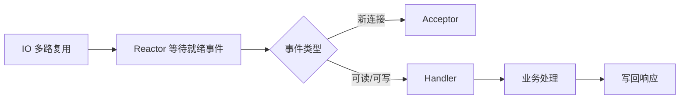
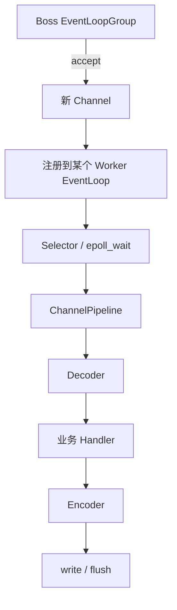

# Reactor 模型为什么支撑 Netty？

> Reactor 的本质是事件分发：少量线程监听 IO 就绪事件，再把连接、读写和业务处理组织成可扩展的流水线。

## 从一个连接一个线程说起

如果每个 TCP 连接都创建一个线程，连接数上来后会遇到三个问题：

- 线程栈占内存。
- 上下文切换变多。
- 大量线程阻塞在 `read` 上，CPU 利用率不稳定。

epoll 解决了“少量线程等待大量连接就绪”的问题，但直接写 epoll 代码很偏过程式。Reactor 模型在它上面抽象了一层：监听事件、分发事件、处理事件。



Reactor 不是某个系统调用，它是把 IO 多路复用组织成可维护程序结构的一种模式。

## Reactor 里有哪些角色？

可以把它拆成三类：

| 角色     | 职责                 |
| -------- | -------------------- |
| Reactor  | 等待 IO 事件并分发   |
| Acceptor | 处理新连接           |
| Handler  | 处理读、写、业务回调 |

事件来了，Reactor 不自己做完所有事，而是根据事件类型分发给对应处理器。这让网络 IO 和业务处理的边界更清晰。

一个完整连接通常会经历：

```text
listen fd 可读
  ↓
Acceptor accept 新连接
  ↓
把 connected fd 注册到某个 Reactor
  ↓
fd 可读时回调 Handler
  ↓
Handler read -> decode -> 业务处理 -> encode -> write
```

这里的关键是“可读”只是就绪事件。应用仍然要自己调用 `read` 把数据取出来，所以 Reactor 是同步非阻塞 IO 之上的事件分发模式。

## 三种常见 Reactor 模型

**单 Reactor 单线程**
一个线程负责 accept、read、write 和业务处理。实现简单，适合业务极快的场景，比如 Redis 的经典事件循环思路。

**单 Reactor 多线程**
一个 Reactor 负责 IO 事件，业务处理丢给工作线程池。问题是 Reactor 自己仍可能成为瓶颈，而且主线程和工作线程之间需要协调响应写回。

**主从 Reactor 多线程**
主 Reactor 负责接收新连接，从 Reactor 负责已连接 socket 的读写事件。多个 IO 线程分摊连接，业务耗时任务再交给业务线程池。这是 Netty 常见线程模型的基础。

可以横向记：

| 模型                | 分工                                 | 优点           | 风险                         |
| ------------------- | ------------------------------------ | -------------- | ---------------------------- |
| 单 Reactor 单线程   | 一个线程包办连接、读写和业务         | 简单、无锁     | 不能利用多核，业务慢会拖全局 |
| 单 Reactor 多线程   | Reactor 做 IO，业务给线程池          | 业务可并行     | Reactor 本身仍可能成为瓶颈   |
| 主从 Reactor 多线程 | 主 Reactor 接连接，从 Reactor 管读写 | 连接和读写分摊 | 线程边界、任务投递要设计好   |

多 Reactor 不是越多越好。线程数通常要结合 CPU 核数、连接数、事件处理耗时和业务线程池配置。

## Netty 怎么落地？

Netty 里常见配置是：

- BossGroup：接收新连接，类似主 Reactor。
- WorkerGroup：处理连接上的读写事件，类似从 Reactor。
- EventLoop：一个线程绑定一个事件循环，管理一批 Channel。
- ChannelPipeline：把解码、编码、业务 handler 串成处理链。

可以把 Netty 的线程模型理解成：



关键点是：不要在 EventLoop 线程里做阻塞业务。比如慢 SQL、远程 RPC、大文件压缩都不应该直接占住 IO 线程，否则这个 EventLoop 管理的其他连接也会被拖慢。

如果业务确实耗时，可以把它丢到业务线程池或 Netty 的独立 executor 中，让 EventLoop 尽快回到事件循环。否则表现出来可能是：连接还在、CPU 不一定满，但同一 EventLoop 上的请求延迟一起升高。

## 为什么 EventLoop 不能阻塞？

一个 EventLoop 往往管理一批 Channel。它大致重复：

```text
等待 IO 事件
  ↓
处理 selected keys / epoll events
  ↓
执行任务队列中的任务
  ↓
处理定时任务
```

如果某个 handler 在 EventLoop 里执行慢 SQL、同步 RPC、复杂 JSON 序列化或大文件压缩，这个线程就无法及时处理其他 Channel 的读写事件。影响范围不是一个请求，而是这个 EventLoop 负责的所有连接。

排障时可以看：

```bash
jstack <pid> | grep -A30 -E "nioEventLoopGroup|epollEventLoopGroup"
```

如果 EventLoop 线程栈长期停在业务代码、数据库驱动、锁等待或外部 RPC，就要把阻塞逻辑挪走。

## Reactor 和 Proactor 怎么区分？

Reactor 感知的是“可以读/可以写”的就绪事件，应用还要主动调用读写。Linux 高性能网络编程常用这一套。

Proactor 感知的是“读写已经完成”的完成事件，内核负责完成 IO 后再通知应用。Windows IOCP 更接近完整 Proactor。Linux 上网络 socket 的主流高性能模型仍然是 Reactor。

| 模型     | 通知的是什么            | 数据拷贝谁发起            | 典型落点                     |
| -------- | ----------------------- | ------------------------- | ---------------------------- |
| Reactor  | fd 就绪，可以读/写      | 应用主动调用 `read/write` | Linux epoll、Java NIO、Netty |
| Proactor | IO 已完成，可以处理结果 | 内核完成后回调            | Windows IOCP                 |

所以不要把 Reactor 说成“异步 IO”。它通常是同步非阻塞 IO + 事件分发；异步的是应用结构，不是内核读写语义。

## 和 Nginx、Redis 有什么关系？

Reactor 是一种模式，不只属于 Netty：

- Redis 经典模型是单线程事件循环，命令执行很快，所以单 Reactor 思路可以成立。
- Nginx 常见是多进程事件模型，每个 worker 用事件驱动处理连接。
- Netty 是 Java 里的主从 Reactor 多线程工程化实现。

差别在于业务特性。Redis 命令主要在内存里执行，适合短平快事件循环；Netty 承载业务 RPC 时，IO 线程必须和业务线程边界清楚；Nginx 静态文件和反向代理更关注连接事件、缓冲和转发效率。

## 线上怎么判断 Reactor 被拖慢？

可以按这几类证据查：

| 现象                         | 可能方向                               |
| ---------------------------- | -------------------------------------- |
| 少数 EventLoop CPU 很高      | 连接分布不均、热点连接、单线程处理太重 |
| EventLoop 线程栈卡在业务代码 | IO 线程执行了阻塞业务                  |
| 连接数高但吞吐上不去         | fd 限制、backlog、线程模型或业务池瓶颈 |
| P99 抖动和 GC 停顿重合       | JVM 停顿影响事件循环                   |
| 直接内存持续上涨             | ByteBuf 泄漏或堆外内存配置不合理       |

常用排查动作：

```bash
# 看 EventLoop 线程栈是否阻塞
jstack <pid> > /tmp/jstack.txt

# 看 fd 数和连接状态
ls /proc/<pid>/fd | wc -l
ss -ant | awk '{print $1}' | sort | uniq -c

# Netty 堆外内存问题还要结合 JVM/NMT 和组件指标
jcmd <pid> VM.native_memory summary
```

## 容易踩的坑

- 不能把 Reactor 简化成“就是 epoll”。epoll 是机制，Reactor 是事件分发模式。
- EventLoop 不是业务线程池，不要执行长时间阻塞任务。
- Netty 线程少不是因为连接少，而是因为连接等待 IO 的时间远大于真正处理事件的时间。
- 多 Reactor 不是越多越好，线程数通常要结合 CPU 核数和业务处理方式配置。
- Reactor 不是 Proactor；前者通知“可读写”，后者通知“已完成”。
- BossGroup 也不是越大越好，accept 压力通常远小于连接上的读写和业务处理。

## 小结

- Reactor 用事件分发模型组织 IO 多路复用，让少量线程管理大量连接。
- 单 Reactor 简单但容易被业务处理拖慢。
- 主从 Reactor 把接连接和处理读写拆开，更适合高并发网络服务。
- Netty 的 BossGroup、WorkerGroup、EventLoop 是 Reactor 思路的工程化实现。
- EventLoop 线程必须避免阻塞，否则会拖慢同一事件循环上的所有连接。
- Reactor 感知就绪事件，Proactor 感知完成事件，二者不要混成一个概念。

## 参考

基于 Linux man-pages、Linux kernel documentation、OpenJDK 工具文档与 POSIX 相关规范中进程、线程、内存、文件系统、I/O、epoll、sendfile 等内容整理。
