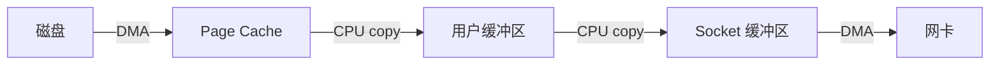
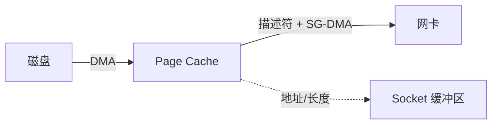

# 零拷贝到底少拷了什么？

> 零拷贝不是一次拷贝都没有，而是尽量避免数据在用户态和内核态之间来回搬运，减少 CPU 参与的数据复制。

## 先说清楚前提

讨论“几次拷贝”时要先限定场景。这里默认是：服务端把一个普通文件通过 TCP socket 原样发出去，不做压缩、加密、格式转换，文件数据一开始不在 Page Cache 里，硬件支持常见 DMA。

如果开启 TLS、要修改响应内容、Page Cache 已经命中、硬件不支持 SG-DMA，拷贝次数都会变化。所以面试里不要把数字背成永恒常量，要说清楚模型。

零拷贝里的“零”，指的是尽量让 CPU 不搬运 payload。磁盘到内存、内存到网卡这些物理搬运通常仍然存在，只是交给 DMA 做。

## 传统文件传输有几次拷贝？

最普通的文件发送代码类似：

```c
read(file, buf, len);
write(socket, buf, len);
```

数据路径大致是：

```text
磁盘 -> 内核 Page Cache -> 用户缓冲区 -> socket 缓冲区 -> 网卡
```

这里通常有 4 次数据搬运：

| 次数 | 路径                          | 谁搬运 |
| ---- | ----------------------------- | ------ |
| 1    | 磁盘 -> 内核 Page Cache       | DMA    |
| 2    | 内核 Page Cache -> 用户缓冲区 | CPU    |
| 3    | 用户缓冲区 -> socket 缓冲区   | CPU    |
| 4    | socket 缓冲区 -> 网卡         | DMA    |

真正浪费的是中间两次 CPU 拷贝：应用只是原样转发文件，却让数据从内核进用户态，再从用户态回内核。再加上 `read` 和 `write` 两次系统调用，通常会有 4 次用户态/内核态模式切换。



## mmap + write 少了什么？

`mmap` 把文件页映射到用户空间，应用不用再通过 `read` 把数据从内核 Page Cache 拷贝到用户缓冲区。

路径变成：

```text
磁盘 -> 内核 Page Cache ==映射== 用户空间 -> socket 缓冲区 -> 网卡
```

它减少了一次内核到用户的数据拷贝，但仍然需要 `write`，也仍然需要把数据送到 socket 缓冲区。

这里还有两个细节：

1. `mmap` 本身主要是建立虚拟地址映射，不一定立刻读盘；真正访问映射页时，如果 Page Cache 没有命中，才会触发缺页并把文件页读进来。
2. 如果文件在映射期间被截断，继续访问旧映射区可能触发 `SIGBUS`。这也是生产上使用 mmap 要额外小心的原因。

所以 `mmap + write` 适合“应用需要看到或处理映射内存”的场景，比如某些消息存储、索引文件或内存映射读写；如果只是原样把文件发到网络，`sendfile` 通常更直接。

## sendfile 少了什么？

`sendfile` 把“读文件”和“写 socket”合并成一个系统调用，数据不用进入用户空间：

```text
磁盘 -> 内核 Page Cache -> socket 缓冲区 -> 网卡
```

它少了一次系统调用，也让 payload 不经过用户态。基础路径下通常是 2 次模式切换、3 次数据拷贝，其中还剩一次 Page Cache 到 socket 缓冲区的 CPU 拷贝。

如果网卡支持 scatter-gather DMA，内核可以把缓冲区描述信息交给网卡，进一步避免 Page Cache 到 socket 缓冲区的数据复制。此时 CPU 主要负责描述和调度，不再搬运大块文件内容。

这就是常说的零拷贝：少的是用户态/内核态之间不必要的数据拷贝，以及部分 CPU 内存拷贝。



这里要注意：socket 缓冲区并不是完全不存在，它可能只保存缓冲区描述信息，而不是复制一份完整 payload。

## splice 又解决什么？

`sendfile` 主要服务文件到 socket 的传输。如果要在更一般的 fd 之间转发，比如 socket 到 socket，Linux 还提供了 `splice`。

`splice` 借助 pipe 传递内核页引用，常见路径是：

```text
file/socket -> pipe -> socket/file
```

它的核心也是避免 payload 进入用户空间。区别是：通常需要两次 `splice` 系统调用，工程复杂度比 `sendfile` 高，还要处理非阻塞、短传输和 `EAGAIN`。面试里可以记住：`sendfile` 更常见于文件到网络，`splice` 更偏通用 fd 转发。

## 几种方式怎么对比？

| 方式           | CPU payload 拷贝       | DMA 拷贝 | 模式切换          | 适合场景                     |
| -------------- | ---------------------- | -------- | ----------------- | ---------------------------- |
| `read + write` | 2                      | 2        | 通常 4 次         | 逻辑简单、需要用户态处理数据 |
| `mmap + write` | 1                      | 2        | 取决于映射和缺页  | 需要读写映射内存             |
| `sendfile`     | 0 或 1，取决于发送路径 | 通常 2   | 通常 2 次         | 文件原样发送到 socket        |
| `splice`       | 通常可避免             | 通常 2   | 常见路径通常 4 次 | 更通用的 fd 到 fd 转发       |

这张表只用于理解机制。真正线上表现还受 Page Cache 命中率、文件大小、网卡能力、TLS、内核版本和 JDK 版本影响。

## 哪些项目会用到？

- Kafka 文件日志发送常通过 Java NIO `FileChannel#transferTo` 利用底层 `sendfile`。
- Nginx 静态文件传输可以开启 `sendfile on`。
- Netty 提供 `DefaultFileRegion` 等能力来利用零拷贝发送文件。
- RocketMQ 这类消息存储常会用 mmap 思路管理 CommitLog。

这些场景有共同点：数据从文件到网络，中间不需要业务代码逐字节加工。如果要压缩、加密、改写内容，就很难完全走 sendfile 路径。

Java 里常见两个入口：

```java
// mmap：把文件映射成内存区域
MappedByteBuffer buffer = fileChannel.map(FileChannel.MapMode.READ_ONLY, 0, size);

// sendfile 路线：文件到 SocketChannel，底层可能走零拷贝优化
long transferred = fileChannel.transferTo(position, count, socketChannel);
```

`transferTo` 不保证一次传完，调用方要根据返回值循环发送剩余部分。是否真的走到底层零拷贝，也要结合 JDK、操作系统、目标 Channel 类型和是否启用 TLS 判断。

## Page Cache 和大文件边界是什么？

零拷贝常依赖 Page Cache。传输大量冷大文件时，Page Cache 可能被大文件冲掉，影响热点小文件或数据库缓存命中。某些大文件场景会考虑 Direct IO、异步 IO 或专门的缓存策略。

Page Cache 的价值主要有两个：

- 缓存最近访问的数据。
- 预读相邻数据，提升顺序读性能。

但如果是很大的冷文件，缓存命中率低，还会挤掉热点页。此时“读进 Page Cache 再发出去”可能不划算，反而要考虑直接 IO、异步 IO 或分层缓存。

所以不要把零拷贝答成“所有文件 IO 都更快”。它适合文件内容不加工、顺序传输、能利用 Page Cache 的场景。

## 容易踩的坑

- 零拷贝不是没有 DMA 拷贝，而是尽量没有 CPU payload 拷贝。
- `mmap` 不是调用时立刻把整个文件读进内存，首次访问可能触发缺页。
- 开 TLS、压缩、加密、内容过滤时，payload 往往要进用户态，sendfile 路径可能退化。
- `transferTo` 不是一次必然传完，要循环处理短传输。
- Page Cache 被大文件污染时，零拷贝收益可能被缓存抖动抵消。

## 小结

- 传统 `read + write` 会让数据在内核缓冲区、用户缓冲区和 socket 缓冲区之间多次搬运。
- `mmap + write` 少一次内核到用户的数据拷贝。
- `sendfile` 合并系统调用，并避免文件内容进入用户空间。
- 支持 SG-DMA 时，可以进一步减少 CPU 参与的内核内拷贝。
- Kafka、Nginx、Netty 文件传输是零拷贝的典型落点，但 TLS、压缩和大冷文件会影响收益。

## 参考

基于 Linux man-pages、Linux kernel documentation、OpenJDK 工具文档与 POSIX 相关规范中进程、线程、内存、文件系统、I/O、epoll、sendfile 等内容整理。
