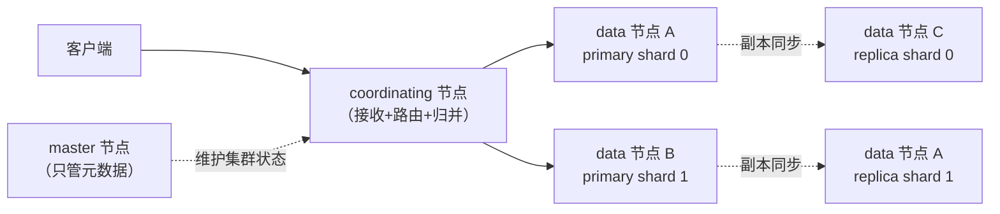

# Elasticsearch 的核心概念是什么，和 MySQL 怎么对应？

> 一句话点题：ES 不是"另一个 MySQL"，它是搭在 Lucene 之上的分布式搜索引擎。学它的概念，最省力的办法是先把 index / document / shard / node 这些词和关系库对上号，再死死记住它们哪里对不上——尤其是那个已经被删掉的 type。

很多后端同学第一次接触 Elasticsearch，会被一堆"看起来眼熟、意思却变了"的词绕晕：MySQL 里 index 是索引，ES 里 index 却更像是"表"甚至"库"；MySQL 里一条记录就是一行，ES 里叫 document。这节就把这套词汇表理清楚，并顺手把几个常被答错的版本事实纠正掉。

## 先把概念和关系库对上号

Elasticsearch 的底层是 Lucene（一个单机全文检索库），ES 在它外面套了一层分布式能力。所以它的概念分两层：一层是"数据怎么组织"（Lucene 那层），一层是"怎么把数据分散到多台机器"（分布式那层）。

先看数据组织层，和 MySQL 类比一下：

| MySQL           | Elasticsearch    | 说明                                                                     |
| --------------- | ---------------- | ------------------------------------------------------------------------ |
| database        | （index 的前缀） | ES 没有"库"这层概念，早期靠 type 模拟，现在直接用 index 区分业务         |
| table           | index            | ES 的 index 才是真正的"数据集合"，一个 index 放一类文档                  |
| row             | document         | 一条文档就是一个 JSON，是 ES 写入和检索的最小单位                        |
| column          | field            | document 里的一个字段，对应一个键值                                      |
| schema / 表结构 | mapping          | 定义每个 field 的类型、是否分词、怎么索引                                |
| SQL             | Query DSL        | ES 用 JSON 描述查询，叫 DSL                                              |
| index（索引）   | （倒排索引）     | ES 每个 text 字段默认建倒排索引，概念上对应 MySQL 的索引，但实现完全不同 |

最容易踩的第一个坑就在这张表里：**MySQL 的 index 和 ES 的 index 根本不是一回事**。MySQL 的 index 是加速查询的数据结构（B+ 树），ES 的 index 却是"一堆文档的逻辑集合"，地位更像 MySQL 的 table。别被同一个英文词骗了。

一个 document 长这样，本质就是一个 JSON：

```json
{
  "title": "MySQL 索引为什么用 B+ 树",
  "author": "拾级",
  "views": 1024,
  "tags": ["database", "mysql"],
  "publish_at": "2026-06-20T10:00:00Z"
}
```

每个 document 有一个 `_id`（不指定 ES 会自动生成），加上这些 field，就组成了一条可被搜索的记录。

## type 去哪了——一个被淘汰的概念

这是面试里高频的"版本纠偏题"。如果你看过老教程，会发现 ES 里一个 index 下面还能分多个 type，像数据库里"一个库下有多张表"。但**这个设计已经没了**，时间线是这样：

| 版本       | type 的处境                               |
| ---------- | ----------------------------------------- |
| 5.x 及以前 | 一个 index 可以有多个 type                |
| 6.x        | 一个 index 只允许**一个** type            |
| 7.x        | type 标记废弃，API 里的 type 路径不再推荐 |
| 8.x        | type **彻底删除**，多 type 写法直接报错   |

为什么要删？因为"一个 index 多个 type"是个假装很美、实际很别扭的设计。Lucene 底层一个 index（对应 ES 的一个 shard）只有**一份映射**：不同 type 里如果都有同名字段，它们在底层会被合并成同一个字段定义。比如 type A 的 `status` 是整数、type B 的 `status` 是字符串，这在 Lucene 里没法共存；就算类型一样，两个 type 的字段稀疏程度不同，也会浪费存储、让打分失真。

所以官方的结论是：**要分多类数据，就建多个 index，别再用 type**。现在说"index"就是一类文档的集合，没有 type 这一层了。如果你在简历或回答里还提"ES 的 type"，至少要补一句"8.x 已经移除"，否则显得停留在老版本。

## 集群与节点：cluster / node / 角色

数据组织完了，看分布式层。一个 ES 集群（cluster）就是一组节点（node），它们共用同一个集群名。节点按职责分角色：

| 角色              | 职责                                                                               |
| ----------------- | ---------------------------------------------------------------------------------- |
| master-eligible   | 有资格被选成主节点。**master 只管元数据**（建/删 index、分片分配），不参与数据读写 |
| data              | 真正存数据、干活的节点，承载分片，读写请求都落到它                                 |
| coordinating only | 接收请求、路由、归并结果，自己不存数据                                             |
| ingest            | 写入前做预处理（类似管道转换），对文档做富化/转换                                  |
| ml / transform 等 | 机器学习、数据转换等高级功能，一般小集群用不上                                     |

有两个点特别容易被忽略：

1. **master 不碰数据读写**。很多人以为主节点最忙、压力最大，其实恰恰相反——data 节点才是干活的，master 只维护集群状态（哪些 index、分片在哪个节点）。所以大集群会把 master 和 data 物理隔离，master 用小机器保稳定。
2. **每个节点默认都是 coordinating 节点**。你发给 ES 的查询，落到哪个节点，那个节点就当协调者：它把请求拆给相关分片，等结果回来再归并排序返回给你。协调这一步不挑角色，谁都干。



## shard 和 replica：分布式的基本单位

一个 index 的数据通常不会塞在一个节点上，而是切成多份分散存放，每一份就是一个 **shard（分片）**。每个 shard 本质上是一个**独立的 Lucene 索引实例**——也就是说，一个 ES 的 index，其实是"一群 Lucene index 的逻辑组合"。

分片分两种：

- **primary shard（主分片）**：原始数据。一个 index 有几个主分片，建 index 时就定好，**之后不能改**（改数量会破坏文档路由）。
- **replica shard（副本分片）**：主分片的拷贝，用来容灾和分担读请求。副本数**可以动态调整**。

为什么主分片数不能改？因为 ES 用一个固定公式决定一篇文档落在哪个分片：

> `shard = hash(路由值) % 主分片数`

主分片数一变，取模结果全变，所有文档要重新分配——等于全量 reindex。所以主分片数要在建索引时就想清楚。这点和具体细节（分片数怎么定、副本怎么用）会在[分片与副本](./es-shard-replica.html)那篇展开。

## 近实时：写进去不会立刻能搜到

这是 ES 和 MySQL 一个很根本的差异。MySQL 事务提交后，数据立刻对后续查询可见；ES 不是——你写进去一条文档，**默认要等约 1 秒（一次 refresh）后才出现在搜索结果里**。所以叫"近实时"（near real-time），而不是实时。

原因在于 ES 的写入机制：写进来的数据先进内存 buffer + translog，refresh 时才生成一个新的可搜索 segment。这个机制决定了"1 秒可见"这条默认线。背后的 refresh / flush / segment merge 细节，是理解 ES 写流程的关键，放到[倒排索引原理](./es-inverted-index.html)和[读写流程](./es-read-write-flow.html)两篇里讲透。

先记住一个结论：**如果你要"写完立刻查到"，得手动 refresh，或者接受 1 秒延迟**；强求事务级的即时一致，ES 不是合适的工具。

## 什么时候该用 ES，什么时候别用

把概念和 MySQL 对上之后，更实际的问题是：什么场景用 ES，什么场景别用。ES 的强项是**搜索和分析**，不是事务和主存。

| 适合 ES                                | 不适合 ES                                     |
| -------------------------------------- | --------------------------------------------- |
| 全文检索（搜标题、内容、模糊匹配）     | 强事务、要求 ACID 的核心业务数据              |
| 日志、指标、行为数据的存储与检索       | 频繁单点更新、需要行级锁的场景                |
| 多维度聚合统计（按时间/标签/分类下钻） | 作为唯一数据源（通常 ES 数据从 MySQL 同步来） |
| 前缀搜索、纠错、相关性排序             | 对写入即时可见有强要求                        |

工程里的典型分工是：**MySQL 当主存**，承担事务和一致性；**ES 当检索和分析引擎**，通过 Canal/Logstash/Flink 把 MySQL 数据同步过来，专门扛搜索和多维聚合。Redis 则补缓存和计数。三者各司其职，而不是互相替代。

## 容易踩的坑

- **把 ES 的 index 当成 MySQL 的 index**：两者同名不同义，ES 的 index 是数据集合（≈ table），MySQL 的 index 是查询加速结构。
- **回答里还在用 type**：8.x 已彻底删除，提它至少要标注"已废弃"，否则暴露版本停留在 5.x。
- **以为 master 节点扛读写**：master 只管元数据，data 节点才干活，别把 master 当成最重的角色。
- **以为主分片数能随时改**：主分片数建索引时定死，改它要 reindex，靠路由公式保证文档落点稳定。
- **拿 ES 当实时库用**：写入默认 1 秒后才可搜，强实时需求要么手动 refresh，要么换工具。

## 小结

- 概念对应：ES 的 index≈MySQL 的表、document≈行、field≈列、mapping≈表结构；但 ES 的 index 和 MySQL 的 index 同名不同义，别混。
- **type 在 8.x 已彻底删除**，原因是 Lucene 一个分片只有一份映射，多 type 会字段冲突、浪费存储；要分类就建多个 index。
- 节点角色：master 只管元数据不碰读写，data 承载分片干活，每个节点默认都是 coordinating 协调者。
- shard 是分布式基本单位，主分片数建索引时定死不可改（路由公式），副本可动态调。
- ES 是近实时（默认 1 秒可见），强项是搜索和分析，通常和 MySQL 分工配合而非替代。

## 参考

本篇以 Elasticsearch 官方文档为权威源重写，关键版本事实（type 在 6.x/7.x/8.x 的演进、节点角色职责、近实时机制）均依据官方文档核对。过时或不严谨的说法已在正文中点明。
