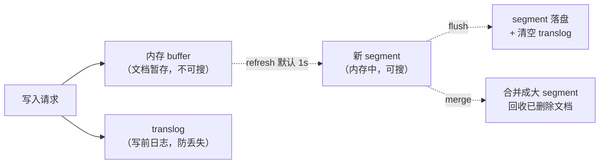

# 倒排索引为什么让 Elasticsearch 搜索这么快？

> 一句话点题：MySQL 用 `LIKE '%关键词%'` 搜全文得逐行扫，慢得没法用；ES 之所以快，是因为它把"文档→词"的正排关系反过来，建成了"词→文档"的倒排索引，查一个词能直接拿到它出现在哪些文档里。

理解 ES 的搜索能力，绕不开倒排索引。这篇就把倒排索引到底长什么样、ES 怎么靠 segment + translog 把它做成"近实时"的，一步步讲清楚。讲完你会明白为什么 ES 写入有 1 秒延迟，以及它和 MySQL 的 B+ 树在定位上的根本区别。

## 先看正排索引为什么不行

假设有 3 篇文章，存在 MySQL 里，title 字段是这样的：

| id  | title                |
| --- | -------------------- |
| 1   | MySQL 索引设计与优化 |
| 2   | Redis 缓存三大问题   |
| 3   | MySQL 主从复制原理   |

现在要搜"包含 MySQL 的文章"。在 MySQL 里你只能写 `WHERE title LIKE '%MySQL%'`，引擎只能**从第 1 行扫到最后一行**，对每一行的 title 做子串匹配。表小无所谓，表一上规模就是全表扫描，根本没法用。

问题出在存储结构：MySQL 按"行"组织数据，要知道"哪些行包含某个词"，只能挨个翻。这种"文档→内容"的结构叫**正排索引**。它擅长"给我 id，我给你整行"，但不擅长"给我一个词，告诉我哪些文档有它"。

## 倒排索引：把关系反过来

倒排索引干的事就是把上面那层关系反过来：先对所有文档分词，再建一张"词→文档列表"的表。

对上面 3 篇文章分词后（先忽略中文分词细节，后面[分词器](./es-analyzer.html)那篇细讲）：

| 词（term） | 出现在哪些文档（posting list） |
| ---------- | ------------------------------ |
| mysql      | [1, 3]                         |
| 索引       | [1]                            |
| redis      | [2]                            |
| 缓存       | [2]                            |
| 主从       | [3]                            |
| ...        | ...                            |

现在再搜"mysql"，引擎不用扫任何文档原文，**直接查这张表，拿到 [1, 3] 就完了**。这就是倒排索引快的本质——把"扫描文档找词"变成了"查表拿文档号"，时间复杂度从和文档总数相关，降到和"包含该词的文档数"相关。

一张完整的倒排索引，在 Lucene 里由三部分拼出来：

| 组成                        | 作用                                                                   |
| --------------------------- | ---------------------------------------------------------------------- |
| **Term Dictionary**（词典） | 存所有出现过的词，能快速判断一个词存不存在、在哪个位置                 |
| **Posting List**（倒排表）  | 每个词对应一个列表，记录这个词出现在哪些文档、出现几次、在文档里的位置 |
| **Term Index**（词典索引）  | 帮助在巨大的 Term Dictionary 里快速定位，ES 用 FST 实现                |

## 三个让查询起飞的组件

光有"词→文档列表"还不够，ES 之所以能在海量数据上秒级响应，靠的是对这三部分的工程优化。

**1. Term Dictionary 怎么找词**：词典本身要能快速查找。Lucene 把 term 按字典序排好，查找时可以先定位到一段再细找。但 term 数量动辄上千万，纯靠二分不够，于是有了 Term Index。

**2. Term Index 用 FST 压进内存**：FST（Finite State Transducer，有限状态转换器）是一种高度压缩的字典结构。它把大量 term 的公共前缀/后缀合并成一条状态机路径，**几千万个 term 可能只占几十 MB 内存**。查询时先在内存里的 FST 走一遍，快速定位到 term 在磁盘上 Term Dictionary 的位置，再读那一小块。这是 ES 查询低延迟的关键之一：**大部分定位工作在内存里完成，磁盘只读必要的一小块**。

**3. Posting List 用 FRAME OF REFERENCE 压缩**：一个热门词可能出现在上亿篇文档里，posting list 直接存文档号会很大。Lucene 把有序的文档号序列做差值编码（存相邻差值而非原始值）再按块压缩，让 posting list 既小又能快速跳转（skip list）。这样即便一个词命中几百万文档，也能高效取回。

一句话概括：**FST 在内存里快速找到词 → 压缩的 posting list 高效取回文档号 → 再去对应的 segment 取原文**。

## segment：写一次就不可变

倒排索引建好后，Lucene 还有个关键设计：**它把索引切成一个个 segment（段），每个 segment 一旦写入就不可变**。

为什么不可变？因为倒排索引一旦固定下来，就能做大量优化（压缩、缓存、并发读不用加锁）。新写入的文档不会去改老 segment，而是攒在内存里，攒够或到时间了，就生成一个**全新的小 segment**。

这也意味着三件事：

1. **文档更新不是原地改**：ES 里"更新"一篇文档，实际是标记老文档删除、再写一篇新文档。老文档的删除只是打个 tombstone 标记，真正回收要等 segment 合并。
2. **删除也不是立刻消失**：和更新一样，先打删除标记，查询时跳过，物理空间等 merge 时才释放。
3. **查询会扫多个 segment**：一个 shard 上有很多 segment，查询时每个 segment 都要查一遍再合并结果。segment 太多会拖慢查询，所以需要合并。

## 近实时是怎么来的：translog + refresh + flush + merge

把 segment 不可变和"写入"串起来，就理解了 ES 的近实时机制。一次写入的完整流程：

四个动作，各自负责不同的事：

| 动作         | 干了什么                                                                        | 默认频率                     |
| ------------ | ------------------------------------------------------------------------------- | ---------------------------- |
| **refresh**  | 把内存 buffer 里的文档生成一个新 segment，**清空 buffer**，这之后文档才可被搜索 | 默认 1 秒一次                |
| **flush**    | 把内存里的 segment **持久化到磁盘**，并**清空 translog**                        | 默认每 30 分钟或 translog 满 |
| **translog** | 写入前先记一条日志，保证 refresh 之间进程崩了数据不丢                           | 每次写都记                   |
| **merge**    | 把多个小 segment 合并成大的，**物理删除**带删除标记的文档                       | 后台自动进行                 |

现在回到上一篇那个"为什么 1 秒后才可搜"的结论：因为文档先进 buffer（不可搜），要等一次 refresh 把 buffer 转成 segment 才可搜，而 refresh 默认 1 秒一次。这就是"近实时"的根因——**不是写不进去，是还没生成可搜索的 segment**。

几个容易混的点单独拎出来：

- **refresh vs flush 别搞反**：refresh 只是生成内存 segment 让数据可搜，**不落盘**；flush 才是真正持久化到磁盘并清 translog。一个管"可见性"，一个管"持久性"。
- **translog 保的是 refresh 之间的数据**：refresh 之前的文档只在 buffer + translog 里，buffer 在内存，进程崩了 buffer 会丢，但 translog 在磁盘（可配置同步刷盘），所以重启后能从 translog 恢复。这也是 ES 写可靠性比"纯内存"强的地方。
- **refresh 越频繁，segment 越多越碎**：默认 1 秒 refresh 一次，写入很猛时会产生大量小 segment，反而拖慢查询。所以写入密集场景常把 `refresh_interval` 调大（比如 30s）甚至临时设成 -1，写完再调回来。

## 和 MySQL 的 B+ 树不是一回事

讲完倒排索引，顺带回答一个常被顺口问的问题：ES 的倒排索引和 MySQL 的 B+ 树有什么区别？它们根本不是同一种东西：

| 维度       | MySQL B+ 树                           | ES 倒排索引                          |
| ---------- | ------------------------------------- | ------------------------------------ |
| 解决的问题 | 精确查找 + 范围扫描 + 排序            | 全文检索、按词找文档                 |
| 数据组织   | 按主键/索引键有序的树，叶子存整行     | 词→文档号的反向表                    |
| 擅长       | `WHERE id = ?`、`BETWEEN`、`ORDER BY` | 搜"包含某个词的文档"、相关性排序     |
| 不擅长     | 模糊匹配、全文检索                    | 事务、精确等值查询（也能做但不特长） |

一句话：**MySQL 的索引为"精确和范围查询"优化，ES 的倒排索引为"按内容找文档"优化**。这正是它们各管一摊、常常配合使用的原因——MySQL 管事务和主存，ES 管搜索。B+ 树的细节在 [MySQL 索引为什么用 B+ 树](../mysql/mysql-why-bplus-tree.html)那篇讲过，这里不重复。

## 容易踩的坑

- **以为 ES 更新是原地修改**：ES 没有"改一个字段"，更新=标记删除+重新写入整篇文档，频繁更新成本不低。
- **refresh 和 flush 分不清**：refresh 管可见性（生成内存 segment，1s），flush 管持久性（落盘+清 translog），别把"可搜"当成"已落盘"。
- **以为 translog 是 binlog**：translog 是短期恢复日志，refresh/flush 后会被清空，不像 MySQL binlog 那样长期保留用于复制。
- **refresh_interval 调到 1s 就不管了**：写入猛时小 segment 爆炸会拖慢查询，密集写入场景要调大或临时关闭。
- **拿倒排索引和B+树比谁快**：两者解决不同问题，没有可比性，正确的对比是"各自适合什么场景"。

## 小结

- 倒排索引把"文档→词"反过来成"词→文档"，让"找包含某词的文档"从全表扫描变成查表，这是 ES 全文检索快的根本。
- 一张倒排索引 = Term Dictionary（词典）+ Posting List（倒排表）+ Term Index（FST 压进内存快速定位）；FST 在内存定位、压缩的 posting list 高效取文档号。
- Lucene 按 segment 组织索引，segment 一旦写入不可变；更新和删除都是打标记，物理回收靠 merge。
- 近实时根因：文档先进 buffer + translog，**refresh（默认 1s）生成可搜 segment，flush 才落盘清 translog**；refresh 管可见性，flush 管持久性，别混。
- 倒排索引和 MySQL B+ 树不是一类东西：B+ 树为精确/范围查询优化，倒排索引为按内容找文档优化，二者配合而非替代。

## 参考

本篇以 Elasticsearch 官方文档（Inverted Index、Near Real-Time、Segments 与 translog 机制）和 Lucene 文档为权威源重写。FST、posting list 压缩（FOR 编码）、segment merge 等机制依据 Lucene 实现说明核对。过时或不严谨的说法已在正文中点明。
