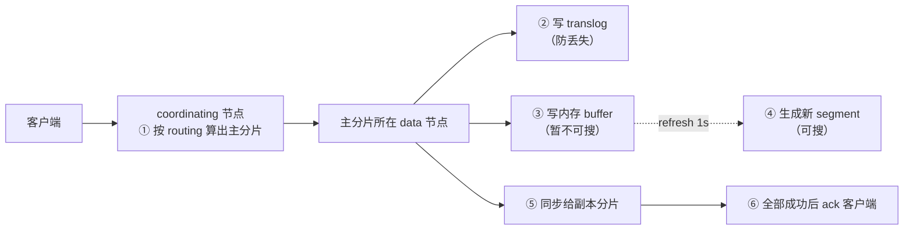
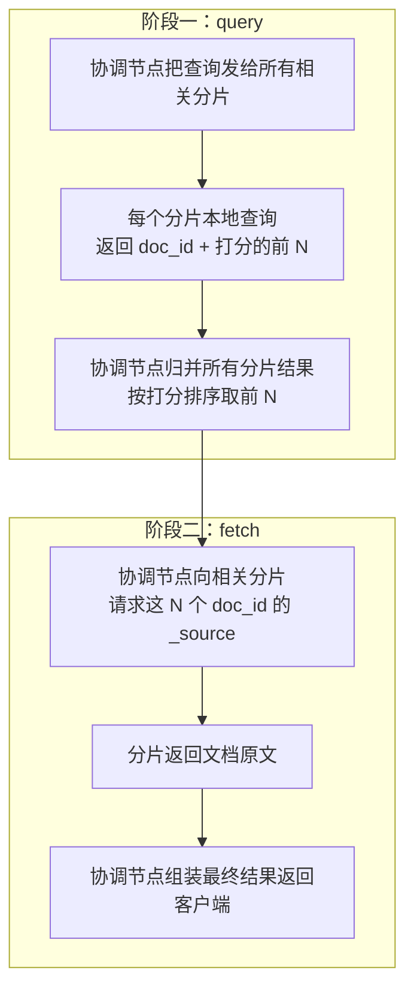

# 写入和查询在集群里是怎么流转的？

> 一句话点题：ES 是分布式的，一次写入不只落在一台机器——它要先路由到主分片、写 translog、生成 segment，再同步给副本。查询更绕，要分"问哪些分片有候选"和"把候选文档捞出来"两阶段。理解这两条流程，才能解释为什么 ES 写入有延迟、为什么深翻页会拖垮协调节点。

上一篇讲了分片和副本的静态结构，这篇讲数据在它们之间怎么动。写流程和读流程是两套完全不同的路径，分开讲。

## 写流程：从请求到可搜

假设一个 3 主 1 副的 index，客户端写入一篇文档，完整路径是这样：

逐步拆解：

1. **路由**：请求先到任意一个节点（它就是这次的 coordinating 节点），它用 `hash(routing) % 主分片数` 算出这篇文档该去哪个主分片，转发过去。
2. **写 translog**：主分片先把这次写入记进 translog（磁盘日志），保证进程崩了能恢复。
3. **写内存 buffer**：文档进内存 buffer，这时还**搜不到**（buffer 不可搜）。
4. **refresh 生成 segment**：默认 1 秒一次 refresh，把 buffer 转成一个新的内存 segment，清空 buffer——这之后文档才可被搜索。这就是"近实时 1 秒"的来源。
5. **同步副本**：主分片把写入转发给所有副本分片，副本走同样的 translog + buffer 流程。
6. **ack**：等主分片和副本都成功（按一致性要求），协调节点才向客户端返回成功。

注意第 5 步——**副本同步是写流程的一部分**，写主分片后要等副本也写完才算这次写入成功。这直接关系到写延迟和一致性。

## refresh / flush / merge：别再搞混

这三个动作上一篇倒排索引原理提过，这里从集群写流程的视角再钉一次，因为太容易混：

| 动作      | 触发                       | 作用                                          | 影响             |
| --------- | -------------------------- | --------------------------------------------- | ---------------- |
| `refresh` | 默认每 1 秒                | buffer → 新 segment，**文档变可搜**           | 管可见性，不落盘 |
| `flush`   | 默认 30 分钟或 translog 满 | segment 落盘 + **清空 translog**              | 管持久性         |
| `merge`   | 后台自动                   | 多个小 segment 合并成大的，**回收已删除文档** | 降碎片、回收空间 |

一句话区分：**refresh 管可不可搜，flush 管落不落盘，merge 管碎不碎**。写入密集时，频繁 refresh 会产生大量小 segment，所以常把 `refresh_interval` 调大（如 30s）或临时设 `-1` 关闭，批量写完再开回来——这是写入优化的标配手段。

## 写一致性：one / quorum / all

第 6 步的"等副本成功"有个度的问题：要等几个副本成功才算这次写入成功？这由 `wait_for_active_shards`（早期叫 consistency）控制：

| 级别     | 含义                     | 取舍                         |
| -------- | ------------------------ | ---------------------------- |
| `one`    | 只要主分片写入成功即可   | 最快，但副本可能还没同步     |
| `quorum` | 需大多数分片可用（默认） | 平衡速度和可靠性             |
| `all`    | 主分片 + 所有副本都成功  | 最安全，但任一副本慢就拖慢写 |

默认是 quorum。注意这控制的是"有多少分片**可用**才接受写入"，不是"等多少副本写完"——语义上偏向可用性判断。生产里一般保持默认 quorum，对可靠性要求极高的场景用 all，但要做好写入变慢的心理准备。

## 读流程：query then fetch 两阶段

读比写更绕，因为数据散在多个分片上。ES 的搜索分**两阶段**完成，这是理解读性能的关键：

**阶段一 query**：协调节点收到搜索请求，把它发给**所有相关分片**（默认是 index 的每个分片都查，主或副本都行）。每个分片在本地执行查询，但不返回文档原文，只返回**命中文档的 doc_id 和打分**，且只返回前 N 条（N = from + size）。协调节点把这些候选归并、按打分排序，留下最终要返回的那一页。

**阶段二 fetch**：协调节点拿着这一页的 doc_id 列表，去对应分片**真正取文档原文**（`_source`），组装成最终结果返回给客户端。

为什么要分两阶段？因为如果每个分片都直接返回完整文档，数据量太大、网络浪费严重。先轻量地用 doc_id + 打分筛出"要哪几篇"，再精准去取这几篇的原文，省掉大量无用传输。

## 深翻页为什么拖垮协调节点

两阶段流程里藏着深翻页的坑，这里点到，下一篇详讲：query 阶段每个分片返回的是 **from + size** 条候选，协调节点要归并 `分片数 × (from + size)` 条。`from` 越大（翻得越深），协调节点要排序归并的候选越多，内存和 CPU 飙升。这正是 `from + size` 默认上限 10000（`max_result_window`）的原因，也是深分页必须换方案的根本。

## routing：让查询少扇出

默认情况下，一次查询要发给 index 的**每个分片**（因为不知道文档在哪个分片），这叫广播。分片多时扇出开销大。

如果写入时用了**自定义 routing**（`routing` 参数），让同一类文档落在同一分片，查询时带上相同 routing，ES 就知道只查那一个分片，不用广播。比如按用户 id 路由，查某用户的数据只查一个分片，大幅降低扇出。代价是数据可能不均匀（某些 routing 对应分片特别大），要权衡。

## 容易踩的坑

- **把 refresh 当成落盘**：refresh 只生成可搜 segment，数据还在内存；真正落盘是 flush。以为 refresh 完就持久化，进程崩了可能丢。
- **以为副本同步是异步不影响写延迟**：默认 quorum 下，写主分片后要等副本可用，副本慢会拖慢整体写入。
- **深翻页用 from + size 硬扛**：协调节点要归并 `分片数×(from+size)` 候选，from 大了直接打爆，超过 10000 还会报错。
- **查询默认广播所有分片**：分片多时扇出大，能用 routing 精确定位分片的场景别浪费。
- **搞混 query 和 fetch 两阶段**：query 只取 doc_id+打分筛候选，fetch 才取原文，理解这个才知道为什么深翻页和取大字段都费资源。

## 小结

- 写流程：协调节点路由 → 主分片写 translog + buffer → refresh 生成可搜 segment → 同步副本 → 按一致性 ack。
- **refresh 管可见性（1s）、flush 管持久性（落盘+清 translog）、merge 管碎片回收**，三者别混；写入密集时调大 `refresh_interval`。
- 写一致性 one/quorum/all：默认 quorum，可靠性优先用 all 但写入变慢。
- 读流程是 **query then fetch 两阶段**：query 阶段各分片返回 doc_id+打分的前 N、协调节点归并排序；fetch 阶段按 doc_id 取原文。
- 深翻页的根因：query 阶段每个分片返回 from+size 条，协调节点归并 `分片数×(from+size)` 候选，from 越大越爆；自定义 routing 能减少查询扇出。

## 参考

基于 Elasticsearch 官方文档与 Apache Lucene 官方文档中核心概念、索引、映射、分词、查询、评分、聚合、分页、分片副本和读写流程相关内容整理。
