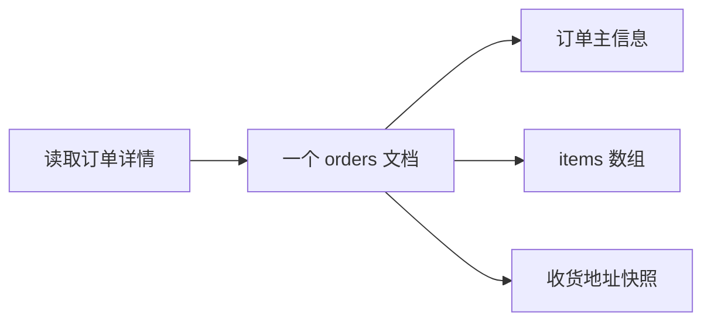

# MongoDB 文档模型怎么设计？和 MySQL 怎么选？

> MongoDB 不是“没有表结构的 MySQL”，它的核心价值是把同一个业务对象的数据尽量放在一个文档里，用文档模型换读取路径和水平扩展能力。

很多人面试答 MongoDB，会停在“文档数据库、BSON、无模式、支持分片”这几个词上。这样答只能说明知道名字，不足以支撑选型。

真正要讲清楚的是：

1. MongoDB 的数据组织方式和 MySQL 到底差在哪；
2. 文档模型为什么适合某些业务，也会坑到某些业务；
3. 什么场景该优先选 MongoDB，什么场景别硬上。

## MongoDB 里的数据到底长什么样？

MongoDB 的基本结构可以粗略对齐到关系库：

| MySQL       | MongoDB      | 直觉理解                         |
| ----------- | ------------ | -------------------------------- |
| database    | database     | 数据库                           |
| table       | collection   | 一类文档的集合                   |
| row         | document     | 一条业务记录                     |
| column      | field        | 文档里的字段                     |
| primary key | `_id`        | 文档唯一标识，默认是 ObjectId    |
| join table  | embedded doc | 嵌套对象或数组，常用于一对多数据 |

但这个表只能帮你建立直觉，不能把 MongoDB 当成“列可以随便变的表”。MongoDB 里的记录是 **BSON 文档**，看起来像 JSON，但它是二进制格式，能表达 `ObjectId`、日期、二进制、Decimal 等 JSON 没有的类型。

比如一个订单在 MySQL 里常拆成两张表：

```sql
orders(id, user_id, status, total_amount, created_at)
order_items(id, order_id, sku_id, name, price, quantity)
```

在 MongoDB 里，如果业务经常“查订单详情时顺手带出明细”，就可能建成一个文档：

```json
{
 "_id": ObjectId("..."),
 "userId": 10086,
 "status": "PAID",
 "totalAmount": 23900,
 "createdAt": ISODate("2026-06-28T10:00:00Z"),
 "items": [
 { "skuId": 1, "name": "机械键盘", "price": 19900, "quantity": 1 },
 { "skuId": 2, "name": "键盘轴体", "price": 4000, "quantity": 1 }
 ]
}
```

这个设计的含义是：订单和订单明细通常一起读、一起展示、生命周期接近，所以把它们放进一个文档，应用查一次就能拿到完整聚合根。

## “无模式”不是没有设计

MongoDB 常被说成 schema-less，但更准确的说法是：**数据库不强制你像关系库那样提前定义每一列，但应用仍然需要稳定的数据契约**。

不设计会带来几个问题：

- 同一个字段有时叫 `userId`，有时叫 `uid`，查询和索引都会混乱；
- 同一个字段有时是数字，有时是字符串，范围查询和排序会出现不可预期结果；
- 老版本文档和新版本文档混在一起，应用代码到处写兼容判断；
- 写入很自由，后期治理成本会转移到业务代码、数据迁移和排障上。

所以 MongoDB 建模仍然要回答这些问题：

1. 这个集合里放的是哪类业务对象？
2. 文档字段的类型、含义、默认值是什么？
3. 哪些字段必须存在，哪些字段允许为空？
4. 哪些字段会作为查询条件、排序条件、分片键？
5. 文档结构变更时如何兼容旧数据？

MongoDB 也支持集合级别的 schema validation。它不是为了把 MongoDB 变成 MySQL，而是给关键集合加底线，避免脏数据把查询和索引拖垮。

## 什么时候嵌入，什么时候引用？

文档模型最核心的取舍是：相关数据要不要嵌入到同一个文档里。

### 适合嵌入的情况

适合嵌入的数据通常有这些特征：

- 一起读取多，一起单独查询少；
- 子对象数量可控，不会无限增长；
- 子对象生命周期依附于父对象；
- 更新通常发生在同一个业务对象内部；
- 业务天然是一对一或一对少量。

比如订单和订单明细、文章和少量标签、用户和收货地址，都可以考虑嵌入。



这样设计的好处很直接：少一次 join，少一次网络往返，也少了一组跨表一致性问题。

### 适合引用的情况

适合引用的数据通常有这些特征：

- 子对象数量不受控，会持续增长；
- 子对象经常被独立查询、分页或统计；
- 多个父对象共享同一个子对象；
- 子对象更新很频繁，嵌入会造成大量重复更新；
- 文档可能接近 16MB 上限。

比如用户和海量行为日志、商品和评论、文章和点赞记录，通常不适合全部嵌进一个文档。

```json
// comments 集合里只引用 articleId，而不是把所有评论嵌到 article 文档中
{
 "_id": ObjectId("..."),
 "articleId": ObjectId("..."),
 "userId": 10086,
 "content": "写得很清楚",
 "createdAt": ISODate("2026-06-28T10:00:00Z")
}
```

这时你是在用“引用 + 索引 + 分页查询”控制文档大小和写入热点。

## MongoDB 和 MySQL 怎么选？

一个实用判断是：**先看数据关系和一致性，再看查询形态，最后看扩展方式**。

| 维度     | 更偏 MongoDB                       | 更偏 MySQL                         |
| -------- | ---------------------------------- | ---------------------------------- |
| 数据模型 | 对象层次明显，字段经常演进         | 表关系稳定，结构强约束             |
| 查询形态 | 围绕单个业务对象读写，少量关联     | 多表 join、复杂报表、强 SQL 分析   |
| 一致性   | 单文档原子性足够，跨文档事务较少   | 多表事务是核心路径                 |
| 扩展方式 | 大文档量、希望靠分片水平扩展       | 关系清晰，读写可通过索引和分库治理 |
| 团队成本 | 能接受文档建模、索引和数据版本治理 | 团队 SQL 能力强，关系建模成熟      |

典型适合 MongoDB 的场景：

- 内容管理、配置中心、表单系统，字段变化快；
- 用户画像、设备信息、商品扩展属性，结构半固定；
- 订单详情、工单详情这类“按对象整体读取”的业务；
- 大规模事件、日志、轨迹类数据，需要水平扩展。

典型不适合 MongoDB 硬扛的场景：

- 核心财务账务、强事务对账；
- 大量临时 SQL 分析和复杂 join；
- 高度规范化、约束复杂、外键关系很重的系统；
- 团队没有 MongoDB 运维和建模经验，只是因为“无模式”想省设计。

## 事务不是 MongoDB 建模的免死金牌

MongoDB 支持事务，这个说法没问题，但面试里要补上边界。

MongoDB 单文档写入天然具备原子性。多文档事务后来也支持副本集和分片集群，但官方文档明确提醒：分布式事务通常比单文档写入成本更高，不能替代良好的数据建模。

所以 MongoDB 的建模思路不是：

> 反正有事务，随便拆集合。

而是：

> 能通过合理嵌入把一致性收敛到单文档，就不要把每次写入都变成跨文档事务。

这点和 MySQL 的思路不一样。MySQL 里多表事务是常态，MongoDB 更鼓励你围绕访问模式组织文档，让常见读写落在一个文档或少数几个集合上。

## 容易踩的坑

### “MongoDB 无模式，所以不用设计表结构”

不对。MongoDB 不强制固定列，但业务仍然需要字段规范、版本演进和数据校验。否则只是把 schema 的成本从数据库转移到了代码和排障里。

### “MongoDB 可以代替 MySQL”

太绝对。MongoDB 可以替代某些以对象读取为主、关系不复杂的场景，但不适合把强事务、多表 join、复杂约束系统一股脑搬过去。

### “能嵌入就都嵌入”

不对。嵌入的前提是子对象数量可控、访问路径一致。数组无限增长、频繁局部更新、需要独立分页的数据，应该拆集合引用。

### “MongoDB 有事务，所以和关系库事务一样用”

事务能力存在，但使用成本和设计目标不同。MongoDB 的优先思路仍然是用文档模型减少跨文档事务，而不是把事务当常规建模手段。

## 小结

1. MongoDB 的核心是文档模型，不是“表结构更松的 MySQL”。
2. 嵌入适合一起读、数量可控、生命周期一致的数据；引用适合无限增长、独立查询、频繁更新的数据。
3. “无模式”不等于不建模，关键集合仍然要有字段规范、索引规划和数据校验。
4. MongoDB 适合对象型、半结构化、水平扩展场景；MySQL 更适合强事务、复杂关系和 SQL 分析。
5. 多文档事务是兜底能力，不应该替代文档建模本身。

## 参考

基于 MongoDB Manual 中 Data Modeling、Indexes、Aggregation、Replication、Sharding、Read Preference、Write Concern 与 Transactions 等相关官方章节整理。
