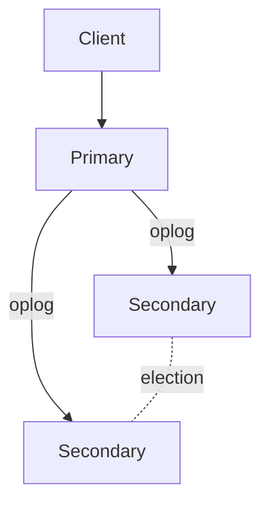
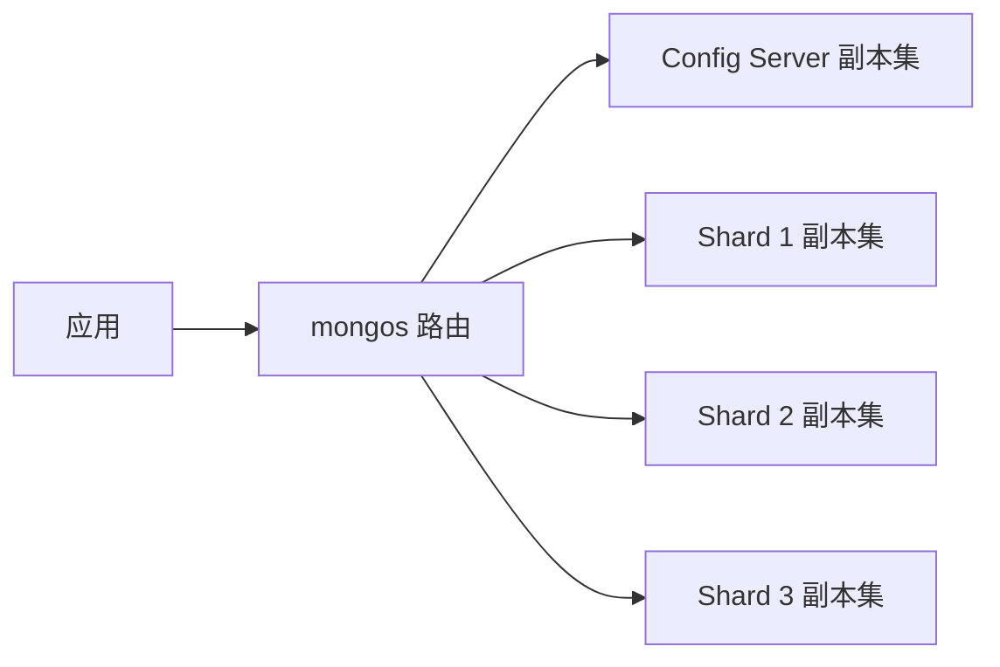

# MongoDB 副本集和分片集群怎么理解？

> 副本集解决“节点挂了还能不能服务”，分片集群解决“单机容量和吞吐不够怎么办”。一个偏高可用，一个偏水平扩展，别把它们混成一个概念。

MongoDB 的集群能力经常被一句“支持副本集和分片”带过。面试真正会追问的是：

- Primary 挂了怎么切换？
- Secondary 能不能读？读到旧数据怎么办？
- oplog 是什么，和 MySQL binlog 像不像？
- 分片键怎么选？选错会怎样？
- 哈希分片和范围分片怎么取舍？

这篇把这些问题串成一条线。

## 副本集：先解决高可用

副本集是一组保存同一份数据的 `mongod` 进程。典型结构是：



角色大概分三类：

| 角色      | 作用                                         |
| --------- | -------------------------------------------- |
| Primary   | 接收写入，记录 oplog                         |
| Secondary | 从 Primary 拉取 oplog 并回放，必要时参与选举 |
| Arbiter   | 只投票不存数据，用于选举，但不承担读写       |

正常情况下，写入走 Primary。Primary 把写操作写入自己的数据和 oplog，Secondary 持续拉取 oplog 并回放，最终追上 Primary。

Primary 故障时，副本集会触发选举，选出新的 Primary。客户端驱动感知拓扑变化后，把后续写入路由到新 Primary。

## oplog 像 binlog，但别完全等同

oplog 是 `local` 数据库里的一个特殊集合，用来记录写操作的增量日志。Secondary 通过读取并回放 oplog 来复制数据。

它和 MySQL binlog 有相似点：都是复制链路里的日志来源。但也有关键差异：

- oplog 是副本集内部复制用的循环日志，有固定空间，旧日志会被覆盖；
- binlog 常用于复制、恢复、订阅等更多场景，保留策略和使用方式不同；
- oplog 窗口太小会导致 Secondary 落后太多后追不上，只能重新同步。

所以面试里可以类比帮助理解，但不要说“oplog 就是 MongoDB 的 binlog”。更准确是：**它在复制链路里的角色类似 binlog，但实现和运维边界不同**。

## Secondary 读：能减压，也可能读旧数据

MongoDB 默认读偏好是 `primary`，也就是读操作走 Primary。你可以配置读偏好，让读请求走 Secondary，例如 `secondary`、`secondaryPreferred`、`nearest`。

但只要读 Secondary，就必须接受一个事实：**Secondary 通过异步复制追数据，可能读到旧值**。

比如：

```text
T1: 客户端写入订单状态 PAID 到 Primary
T2: Primary 返回成功
T3: Secondary 还没回放这条 oplog
T4: 另一个读请求从 Secondary 查订单，看到旧状态 CREATED
```

这不是 bug，而是异步复制的自然结果。

如果业务要“写完马上读到自己的写入”，常见做法是：

- 读 Primary；
- 配合 `writeConcern: "majority"` 和 `readConcern: "majority"`；
- 使用因果一致性会话；
- 对强一致链路避免读 Secondary。

读写分离不是免费午餐。它能分摊读压力，但会引入读延迟、路由复杂度和一致性判断。

## writeConcern 和 readConcern 在问什么？

MongoDB 的一致性口径里，有两个很重要的参数：

- `writeConcern`：写到什么程度才算成功返回；
- `readConcern`：读数据时要求看到什么确认级别的数据。

常见写关注：

| 写关注          | 含义                             | 适用感受                     |
| --------------- | -------------------------------- | ---------------------------- |
| `w: 1`          | Primary 写入后返回               | 延迟低，但故障窗口内可能回滚 |
| `w: "majority"` | 多数有投票权的数据节点确认后返回 | 更稳，但延迟更高             |

常见读关注：

| 读关注     | 含义                                 |
| ---------- | ------------------------------------ |
| `local`    | 读本节点已经有的数据，不保证多数提交 |
| `majority` | 读多数节点确认过的数据               |
| `snapshot` | 事务里常见，读一个一致性快照         |

可以这样理解：

```text
writeConcern 管“写成功的门槛”
readConcern 管“读到的数据可信到什么程度”
readPreference 管“从哪个节点读”
```

这三个别混在一起。`readPreference=secondary` 只是决定读哪个节点，不代表数据一定新；`readConcern=majority` 提高读到已多数确认数据的概率，但如果你读 Secondary，仍要考虑复制应用延迟和版本行为。

## 分片集群：再解决容量和吞吐

副本集保存的是同一份数据，主要解决高可用和读扩展。如果单个副本集容量、写吞吐、热点压力扛不住，就要考虑分片。

MongoDB 分片集群由三类角色组成：



| 组件          | 作用                                    |
| ------------- | --------------------------------------- |
| `mongos`      | 查询路由，不存业务数据                  |
| Config Server | 保存集群元数据，如分片、chunk、路由信息 |
| Shard         | 真正保存数据的分片，生产上通常是副本集  |

分片之后，集合的数据会按分片键拆成多个范围，每个范围称为 chunk。Balancer 会在后台迁移 chunk，让各分片尽量均衡。

## 分片键是分片成败的核心

分片键决定文档落在哪个分片，也决定查询能不能精准路由。

官方文档里有个非常关键的点：如果查询包含分片键或复合分片键前缀，`mongos` 可以把请求路由到特定分片；如果不包含，可能要广播到所有分片，也就是 scatter/gather。

对一个订单集合，如果分片键是 `userId`：

```javascript
db.orders.find({ userId: 10086, status: "PAID" });
```

可以比较容易定位到相关分片。

但如果查询是：

```javascript
db.orders.find({ status: "PAID" });
```

没有分片键，`mongos` 可能要问所有分片。数据量越大，越像分布式全表扫描。

一个好的分片键通常要满足：

- **基数高**：取值足够多，避免大量数据挤在少数值上；
- **分布均匀**：避免某个分片明显更热或更大；
- **查询常带上**：让路由可以精准定位；
- **避免单调热点**：比如纯自增时间戳可能让新写入集中到最后一个范围；
- **未来稳定**：后续虽可 reshard，但迁移成本仍然需要规划。

## 范围分片和哈希分片怎么选？

MongoDB 常见分片策略有两类。

### 范围分片

范围分片按分片键值的范围切 chunk。

优点：

- 范围查询更友好；
- 查询带分片键时更容易精准路由；
- 适合按地区、租户、业务范围切分。

缺点：

- 分片键单调递增时容易写热点；
- 分布不均会造成 chunk 倾斜；
- 选错键会让后期迁移很痛。

### 哈希分片

哈希分片先对分片键取哈希，再按哈希值范围分布。

优点：

- 数据更容易均匀分散；
- 能缓解单调递增键带来的写热点；
- 适合随机等值访问。

缺点：

- 范围查询通常无法只打一个分片；
- 如果业务经常按时间范围查，哈希分片可能让查询广播到多个分片；
- 哈希后的值不再保留原始顺序。

一句话取舍：

> 写入要打散、查询多为等值，可以考虑哈希；范围查询重要、分片键分布本身健康，可以考虑范围。

## 什么时候不该急着分片？

分片不是性能按钮，它会引入很实在的复杂度：

- 部署组件变多，故障面扩大；
- 分片键一旦选错，后续治理成本很高；
- 跨分片查询、聚合和事务成本更高；
- chunk 迁移、balancer、热点 chunk 都需要运维能力；
- 应用查询如果不带分片键，容易变成广播查询。

所以更稳的顺序通常是：

1. 先做好文档模型和索引；
2. 再用副本集解决高可用；
3. 单副本集容量或写入明显到瓶颈，再规划分片；
4. 分片前先用真实查询评估分片键，而不是凭字段名拍脑袋。

## 容易踩的坑

### “副本集就是分片”

不对。副本集是同一份数据的多个副本，解决高可用；分片是把数据拆到不同 shard，解决容量和吞吐。

### “Secondary 读一定更好”

不一定。Secondary 读可能读到旧数据，也可能因为复制压力、索引缺失、长查询影响节点健康。强一致链路要谨慎使用。

### “多数写成功就任何地方马上都能读到”

不严谨。`w: "majority"` 提高持久性和回滚安全，但如果应用立即读 Secondary，还要考虑 Secondary 是否已经应用该写入。需要结合读关注、读偏好和会话语义一起看。

### “分片键以后可以改，所以不用太纠结”

不对。新版本支持 resharding，但这不是零成本操作。分片键仍然是分片集群最重要的前期设计。

## 小结

1. 副本集解决高可用，分片集群解决水平扩展，两者目标不同。
2. oplog 支撑副本集复制，角色类似复制日志，但不能简单等同于 MySQL binlog。
3. Secondary 读能分摊压力，但异步复制会带来旧读风险。
4. `writeConcern`、`readConcern`、`readPreference` 分别回答写入确认、读取可信度和读取节点三个问题。
5. 分片键决定数据分布和查询路由，选错会导致热点、倾斜和广播查询。

## 参考

- 综合自 `docs/JavaGuide/docs/database/mongodb/mongodb-questions-02.md` 中副本集、oplog、分片集群、分片键与分片策略相关内容，并重写为高可用与扩展主线。
- 对照 MongoDB 官方文档 Sharding、Read Preference、Write Concern 与 Transactions，校准了精准路由、Secondary 旧读、`majority` 语义和分片键选择边界。
- 对资料中“读写分离”“分片键可重新选择”等容易答得过满的说法补充了工程代价和版本边界。
