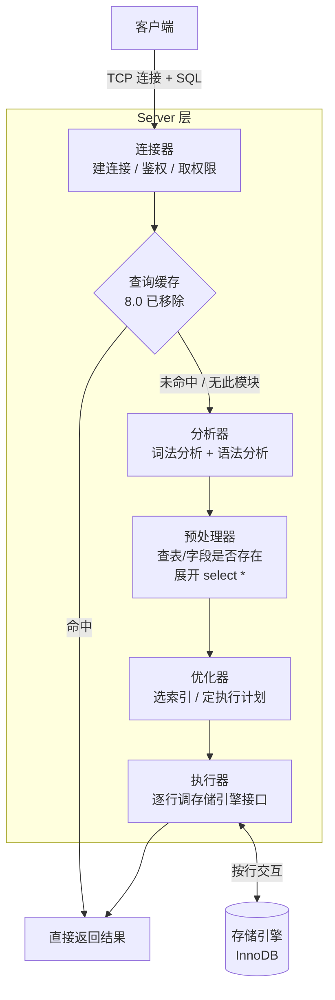

# 一条 SQL 查询语句是怎么执行的？

> 你敲下 `select * from product where id = 1` 回车，到屏幕上蹦出一行结果，这中间 MySQL 内部其实跑了一条挺长的流水线。把这条流水线拆开，你就把 MySQL 的整体架构也顺手摸清了。

这道题几乎是 MySQL 八股的开场白，但它的价值不在于背流程，而在于：把每个环节是"谁、做什么、为什么"讲明白之后，后面索引、事务、日志的题你都能往这张图上挂。所以我习惯先把架构画出来，再让一条 SQL 在上面"走一遍"。

## 先看大图：MySQL 分两层

MySQL 不是铁板一块，它在逻辑上分成两层，这是理解一切的起点：

| 层             | 干什么                                                   | 关键模块                                                 |
| -------------- | -------------------------------------------------------- | -------------------------------------------------------- |
| **Server 层**  | 负责连接、解析、优化、执行 SQL，以及所有跨引擎的通用功能 | 连接器、查询缓存、分析器、优化器、执行器，还有 binlog 等 |
| **存储引擎层** | 负责数据真正怎么存、怎么取                               | InnoDB、MyISAM、Memory……可插拔                           |

几个一定要记住的点：

- **跨引擎的功能都在 Server 层实现**：存储过程、触发器、视图、内置函数（日期、加密这些）、binlog 日志，都跟具体用哪个引擎无关，所以放在上层。
- **索引是存储引擎层实现的**，不是 Server 层。这就是为什么不同引擎支持的索引类型不一样——InnoDB 默认用 B+ 树，主键索引、二级索引都是 B+ 树结构。后面聊索引时这点很关键。
- **存储引擎是插件式的，共用一个 Server 层**。从 MySQL 5.5 开始，InnoDB 成了默认引擎（在这之前是 MyISAM）。

画成流程图大概是这样：



下面顺着这条线一个个说。

## 第一步：连接器——先把门卫这关过了

任何 SQL 都得先有连接。连接器干三件事：

1. **跟客户端完成 TCP 三次握手**（MySQL 走 TCP，服务没起来你连不上）；
2. **校验用户名密码**，不对就甩你一个 `Access denied for user`；
3. **对了就把这个用户的权限读出来缓存在连接里**。

第 3 点有个常被问的细节：**权限是在建连接那一刻读取并固定下来的**。也就是说，连接建好之后，哪怕管理员中途改了你的权限，对这条已有连接是不生效的，必须重新建连接才会用上新权限。

### 长连接 vs 短连接

跟 HTTP 一样，连接分长短：

- **短连接**：连一次、执行一条、断开。频繁建连断连，开销大。
- **长连接**：连一次，连着执行很多条，最后才断。省掉了反复握手的成本，**所以一般推荐长连接**（连接池本质就是复用一批长连接）。

但长连接有个坑：MySQL 执行查询时会用一些临时内存来管理连接对象，**这些内存要等连接断开才释放**。长连接攒多了，内存越占越大，极端情况下进程会被操作系统 OOM 杀掉，表现为 MySQL "莫名其妙重启"。

两种治法：

- **定期主动断开长连接**，让内存有机会释放；
- **客户端调 `mysql_reset_connection()`**（MySQL 5.7 提供的接口，注意是 C 接口不是 SQL 命令）。它把连接重置到刚创建的干净状态，但不用重连、不用重新鉴权，比断开重连轻。

> 顺带两个常考参数：空闲连接由 `wait_timeout` 控制，默认 8 小时（28800 秒）超时自动断开；最大连接数由 `max_connections` 控制，超了报 `Too many connections`。

## 第二步：查询缓存——记住一句话，8.0 已经把它删了

连接建好后，客户端把 SQL 发过来。在 **MySQL 8.0 之前**，如果这是一条 select，MySQL 会先去查询缓存碰碰运气。

它的逻辑很直白：把 SQL 语句当 key、结果集当 value，存在内存里（实际是对 SQL 文本算 Hash 当 key）。命中就直接把结果丢回客户端，连解析、优化、执行都省了；没命中就往下走，执行完顺手把结果塞进缓存。

听起来很美，**实际很鸡肋**，原因就一个核心矛盾：

> **缓存按表失效，而且是"整表清空"。** 只要某张表发生任何更新（数据、表结构、索引变化都算），这张表相关的所有查询缓存全部作废。

对写得比较勤的表，命中率低到可怜——你刚缓存了一个大结果集还没用上，表一更新缓存就被清了，等于"缓存了个寂寞"。更要命的是它底层只有**一把全局互斥锁 `LOCK_query_cache`**：读要持锁检查命中，写要持锁让整表缓存失效。高并发下大家抢这一把锁，排队、上下文切换的开销直接成了性能瓶颈，反而拖慢系统。

所以演进路线是：**MySQL 5.7.20 起默认弃用 → MySQL 8.0 直接删除**。8.0 之后这个阶段根本不存在了，一条查询连"看一眼缓存"都不会做。

这里有两个容易混的边界，面试时点清楚能加分：

- **8.0 移除的是 Server 层的查询缓存，不是 InnoDB 的 Buffer Pool。** Buffer Pool 缓存的是数据页，照样在、照样关键，别搞混。
- **8.0 之前想关，把 `query_cache_type` 设成 0/OFF，或更彻底地把 `query_cache_size` 设为 0**（直接跳过缓存的内存分配和检查路径）。

至于"真正想用缓存怎么办"——实践里都用应用层的本地缓存（Caffeine）或分布式缓存（Redis），比 Query Cache 灵活、可控得多。

## 第三步：分析器——看懂你想干嘛，顺便挑语法错

没命中（或 8.0 压根没这一步），SQL 进入分析器，做两件事：

- **词法分析**：把 SQL 字符串拆成一个个 token，认出关键字（select、from、where），认出表名、字段名、条件，构建出一棵 **SQL 语法树**，方便后面模块直接读取"这是什么类型的语句、查哪张表、什么条件"。
- **语法分析**：拿着词法分析的结果，按 MySQL 语法规则判断你这句写得合不合法。比如把 `from` 敲成了 `form`，就会在这里报错。

### 一个值得点明的坑：表/字段存不存在，不在分析器里查

这是两份资料讲得不一致、也是最容易答错的地方，必须说清楚：

> **分析器（解析器）只负责构建语法树和检查语法，它不去检查表、字段到底存不存在。**

《MySQL 45 讲》里说这个检查在解析器做，但对照 MySQL 5.7 / 8.0 源码，结论是：**检查表和字段是否存在，是在后面的预处理阶段（prepare）做的**（在 8.0 里由 `get_table_share()` 这类函数在 prepare 阶段触发）。所以 `select * from 不存在的表` 报的 `Table ... doesn't exist`，不是语法错误，而是预处理阶段的错误。

记法：**语法错 = 分析器抓的（form 写错）；对象不存在 = 预处理器抓的（表/字段没有）。** 两者报错阶段不同。

## 第四步：执行 SQL——预处理、优化、执行

过了分析器，进入真正"执行 SQL"的流程，内部又分三个小阶段：**prepare（预处理）→ optimize（优化）→ execute（执行）**。

### 预处理器

它补上分析器没做的事：

- **检查 SQL 里的表、字段是否真实存在**（上面说的那个检查就在这）；
- **把 `select *` 里的 `*` 展开成表上所有具体列**。

### 优化器：决定"怎么查最划算"

优化器负责**把执行计划定下来**。最典型的工作就是：一张表上有多个索引能用时，**基于查询成本估算，选一个代价最小的索引**；多表 join 时还要决定表的连接顺序。

举个直观例子，product 表上有主键索引 `id` 和普通索引 `name`：

```sql
select id from product where id > 1 and name like 'i%';
```

这条用主键索引、用普通索引都能查出结果，但成本不一样。这其实是**覆盖索引**场景——要查的 `id` 就在二级索引 `name` 的 B+ 树叶子节点里（二级索引叶子存的就是主键值），直接在二级索引上就拿到了，不用回主键索引那棵更"重"的 B+ 树。优化器算下来，会选成本更小的普通索引，`explain` 的 `Extra` 会显示 `Using index`，表示走了覆盖索引。

> 想看优化器最终选了哪个索引，在 SQL 前面加 `explain`：`key` 列就是用到的索引，`key = PRIMARY` 是主键索引；`key = NULL` 且 `type = ALL` 就是全表扫描（最慢那档）。
>
> 提醒一句：优化器选的是"它认为"最优的方案，**不一定真最优**（统计信息不准、估算偏差都可能让它选错索引），这也是后面"索引失效""强制索引 hint"那些问题的根。

### 执行器：真正去存储引擎拿数据

执行计划定好，执行器登场。它开始**和存储引擎按"行"为单位交互**（注意先要校验这个用户对目标表有没有操作权限，没有就报错）。

下面用三种典型方式看执行器和引擎怎么配合。

**① 主键等值查询** `select * from product where id = 1`

主键唯一、等值，优化器选 `const` 访问类型：

1. 执行器调引擎的索引查询接口，把 `id = 1` 交给 InnoDB，让它定位符合条件的第一条记录；
2. InnoDB 沿主键 B+ 树找到这条记录，找到就返回给执行器，找不到就报"记录不存在"；
3. 执行器拿到记录，再核对一遍是否满足查询条件，满足就发给客户端。

因为是唯一等值，找到一条就到头了，循环结束。

**② 全表扫描** `select * from product where name = 'iphone'`

没用上索引，优化器选 `ALL`：

1. 执行器调引擎"读第一条记录"的接口；
2. 引擎返回一条，执行器判断 `name` 是不是 `iphone`，是就发客户端，不是就跳过；
3. 执行器在一个 while 循环里不停向引擎要"下一条"，引擎逐条吐，执行器逐条判断；
4. 直到引擎报"读完了"，循环退出。

这里有个反直觉但常考的点：**Server 层每从引擎读到一条满足条件的记录就立刻发给客户端**，并不是攒齐了再发。你在客户端看到"唰"地一次性出现全部结果，只是因为客户端等查询结束后才统一渲染而已。

**③ 索引下推（ICP，MySQL 5.6 引入）**

这是讲"下推到底下推到哪"的最佳例子。假设联合索引 `(age, reward)`，查询：

```sql
select * from t_user where age > 20 and reward = 100000;
```

联合索引遇到范围查询 `>` 就停止往后用索引，所以 **`age` 能走索引，`reward` 走不到索引**（但 `reward` 这列本身是包含在联合索引里的）。

- **没有索引下推时**：引擎在二级索引上每定位到一条 `age > 20` 的记录，就**立刻回表**取完整行返回给 Server 层，再由 Server 层判断 `reward` 是否等于 100000。不满足的记录也已经白白回表了一次。
- **有索引下推时**：引擎在二级索引上定位到记录后**先不回表**，先用索引里自带的 `reward` 列判断 `reward = 100000` 是否成立——不成立直接跳过，成立才回表取完整行。

效果：把本该 Server 层做的过滤"下推"给了存储引擎层，**省掉大量不必要的回表**。`explain` 的 `Extra` 显示 `Using index condition` 就是用上了索引下推。

> 一句话抓住本质：索引下推就是"能在二级索引上提前过滤掉的行，就别回表了"。

## 容易踩的坑

- **把"查询缓存"和"Buffer Pool"混为一谈**：8.0 移除的是 Server 层 Query Cache，InnoDB 的 Buffer Pool（缓存数据页）一直都在，是两回事。
- **以为表/字段不存在的报错是分析器抛的**：实际在预处理（prepare）阶段。语法错才归分析器。
- **以为查询缓存还能用**：8.0 已删除，5.7.20 起默认弃用。回答时直接强调这一点，别给出"建议开启查询缓存"这种过时结论。
- **以为优化器一定选最优索引**：它是基于成本估算的，统计信息偏差会让它选错，这正是索引失效类问题的源头。
- **以为结果是查完一次性返回的**：Server 层是逐行从引擎读、逐行发客户端的，客户端只是最后统一显示。
- **把权限校验只想成连接时那一次**：连接器建连时取一次权限并固定，执行器真正操作前还会再校验一次表权限。

## 小结

- MySQL 分**两层**：Server 层（连接器、查询缓存、分析器、优化器、执行器 + binlog 等通用功能）和**存储引擎层**（InnoDB 等，索引在这一层实现）。
- 一条 SELECT 的完整链路：**连接器**（建连/鉴权/取权限）→ **查询缓存**（8.0 已删）→ **分析器**（词法+语法）→ **预处理器**（查表/字段、展开 `*`）→ **优化器**（选索引、定执行计划）→ **执行器**（逐行调引擎接口拿数据）。
- **查询缓存因"整表失效 + 全局锁竞争"而鸡肋，5.7.20 默认弃用、8.0 直接移除**；要缓存请用 Redis/Caffeine。
- **表/字段是否存在在预处理阶段检查，不在分析器**——这是《MySQL 45 讲》讲法与源码不一致之处，记准了。
- **索引下推（5.6+）**把过滤动作下推到存储引擎，在二级索引上提前过滤、减少回表，`Using index condition` 即是标志。

## 参考

基于 MySQL 8.0 Reference Manual 中 InnoDB、Optimizer、Replication、EXPLAIN、Data Types、Online DDL 等相关官方章节整理。
