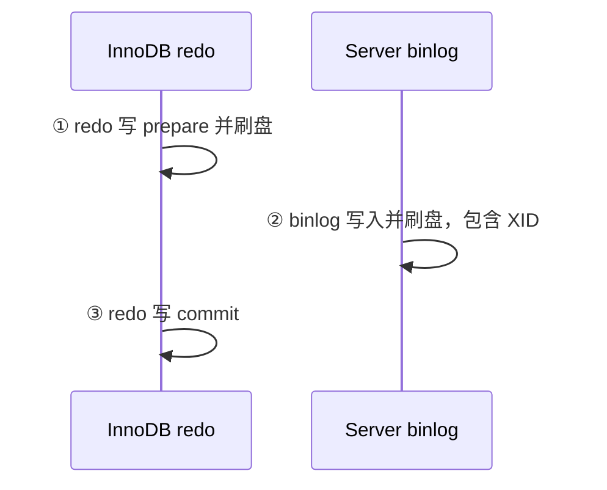

# redo log、undo log、binlog 怎么配合保证崩溃恢复？

> 崩溃恢复不是“看到 redo 就提交”，而是看 redo 状态、binlog 是否完整，以及 undo 能不能把未提交事务回滚掉。

已有日志篇讲过三种日志的职责。这篇只回答一个更工程的问题：MySQL 在提交过程中任意时刻崩溃，重启后怎么判断这个事务该提交还是回滚？

## 先明确三个角色

| 角色     | 恢复中的职责                           |
| -------- | -------------------------------------- |
| redo log | 把已提交或应提交的物理页修改重放回来   |
| undo log | 把未提交事务回滚掉，也支撑 MVCC 旧版本 |
| binlog   | 判断事务是否已经进入复制/备份链路      |

undo log 也需要 redo 保护，因为 undo 页本身也是被修改的页。未提交事务的 redo 可能已经刷盘，但这不代表事务一定提交，重启时还要结合事务状态和 binlog 决策。

## 两阶段提交留下了哪些崩溃点？

开启 binlog 且使用 InnoDB 时，事务提交内部会走两阶段提交：

可能崩在三个位置：

- redo prepare 之前：事务还没进入可提交状态。
- redo prepare 之后、binlog 成功之前：主库不能单方面提交，否则从库和备份看不到。
- binlog 成功之后、redo commit 之前：binlog 已经会被复制或用于恢复，主库必须提交。

## 恢复时怎么判定？

重启扫描 redo 时，可以按这张表记：

| redo 状态      | binlog 中是否有同 XID | 恢复动作  | 原因                       |
| -------------- | --------------------- | --------- | -------------------------- |
| 已 commit      | 不需要再查            | 提交/重放 | InnoDB 已确认提交          |
| prepare        | 有完整 XID            | 提交      | binlog 已进入复制/恢复链路 |
| prepare        | 没有 XID              | 回滚      | binlog 没有，主库也不能有  |
| 未进入 prepare | 无                    | 回滚      | 事务未完成提交             |

关键句：**binlog 写成功是处于 prepare 状态事务是否最终提交的重要标志**。这样主库恢复后的数据，才能和从库重放 binlog 后的数据对齐。

## 为什么误删不能靠 redo log 恢复？

redo log 是循环写的，只用于崩溃恢复那些“数据页还没刷盘但事务应当生效”的修改。它不是历史归档。

误删表、误执行 `DELETE` 并提交后，redo 会忠实地保证这个删除生效。要做时间点恢复，应该靠：

1. 最近一次全量备份。
2. 从备份时间点之后的 binlog。
3. 截止到误操作前的位点或时间。

所以面试里别说“redo 可以恢复误删数据”。redo 保证数据库崩溃后一致，不负责撤销已经提交的业务误操作。

## 和主从不一致有什么关系？

如果没有两阶段提交，就可能出现：

- 主库 redo 有，binlog 没有：主库恢复后有新值，从库没有。
- binlog 有，redo 没有：从库有新值，主库恢复后没有。

两阶段提交用 XID 把两份日志绑在一起，让恢复时能做出和复制链路一致的决定。

## 小结

- 崩溃恢复要同时看 redo 状态、binlog XID 和 undo 回滚能力。
- redo prepare + binlog 有完整 XID，恢复时提交；redo prepare + binlog 无 XID，恢复时回滚。
- 未提交事务的 redo 可能已经落盘，但不会因此直接提交。
- undo 页本身也需要 redo 保护，否则崩溃后回滚信息可能丢。
- redo 不能恢复误删，时间点恢复要靠全量备份 + binlog。

## 参考

综合社区资料，并结合本站 `mysql-logs.md` 的两阶段提交内容，单独抽出崩溃恢复判定边界。
