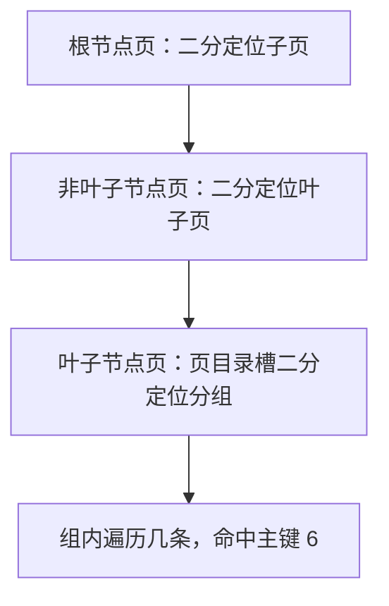

# 数据页是怎么组织记录的？

> 上一页讲了一行记录怎么存，这一页接着往上走一层：很多行记录是怎么被装进一个「数据页」的，页内又怎么快速找到某一行。

很多人背 B+ 树时只记「叶子节点存数据」，却说不清这个「节点」到底长什么样、一个节点里几百行记录怎么快速定位。这一篇就把数据页拆开看：页的内部结构、页内记录怎么串、页与页怎么连，以及它和 B+ 树到底是什么关系。

## 为什么读写要按「页」来，而不是按行

如果磁盘 IO 以「行」为单位，读一行就跑一次磁盘，效率会低到不可用。所以 InnoDB 把数据按**页**为单位读写：要读某一行时，不是把这行单独捞出来，而是把**整页**（默认 16KB）读进内存；写回去也是整页刷盘。

- 数据页默认大小 **16KB**（`innodb_page_size`，5.7 起也支持 4K / 8K / 16K，但建库后不能改）。
- 一次磁盘 IO 至少搬 16KB，相邻的行能顺带进内存，后续命中就走内存，不用再 IO。

这也是为什么 Buffer Pool 缓存的是「页」而不是「行」——下一页会接着讲。

## 一个数据页里装了什么

一个 16KB 的数据页，内部并不是把记录随便堆进去，而是分成 7 个部分：

| 部分               | 作用                                                                 |
| ------------------ | -------------------------------------------------------------------- |
| File Header        | 页的通用信息，最关键是**前后页的指针**（见下文双向链表）             |
| Page Header        | 页内的统计信息，比如槽的数量、本页记录数                             |
| Infimum + Supremum | 两个虚拟记录，分别是页内「最小记录」和「最大记录」，用于界定链表边界 |
| User Records       | 真正的用户记录，按主键顺序排成单向链表                               |
| Free Space         | 还没被使用的空闲空间，新记录往这里插                                 |
| Page Directory     | 页目录，存的是「槽」，是页内二分查找的关键                           |
| File Trailer       | 校验信息，用于把页刷盘后、再读回来时校验这页有没有损坏               |

重点记住三个：**User Records（记录链表）、Page Directory（页目录/槽）、File Header 里的前后页指针**。其余是管理和校验用的。

## 页内的记录：一条单向链表

页里的用户记录不是数组，而是按主键从小到大串成一条**单向链表**。每条记录的头信息里存着「下一条记录」的地址偏移量。

- 插入、删除很方便：改指针就行，不用搬动整块数据。
- 但查找很慢：最坏要遍历整条链表。

所以光有链表不够，还得有个「目录」来加速——这就是页目录。

## 页与页之间：双向链表

`File Header` 里有两个指针，分别指向上一个页和下一个页，于是所有页串成一条**双向链表**。

> 这里要纠正一个常见误解：**页与页之间是逻辑连续，不是物理连续。** 有的资料顺口说成「数据页在磁盘上连续存放」，这并不准确——页在磁盘上的物理位置可以乱序，靠双向链表指针维持逻辑上的先后顺序。这一点很重要，因为它解释了为什么范围扫描也要靠指针跳转、而不是顺序读物理块。

## 页目录和槽：页内怎么二分查找

页内几百条记录如果纯靠链表遍历，太慢。InnoDB 的做法是给页内记录**分组**，再把每组的「最大记录地址」存进页目录，每一项就叫一个**槽（slot）**。

分组的规则（记住这个比例，面试常问）：

- 第一个组（靠 Infimum 那侧）只有 **1** 条记录；
- 最后一个组（靠 Supremum 那侧）记录数在 **1–8** 条之间；
- 中间的组，记录数在 **4–8** 条之间。

因为记录按主键有序，槽也按主键有序，所以**在页内找记录时用二分法先定位到槽，再在槽对应的那个小组里遍历几条**——小组最多 8 条，遍历成本很低，整体接近 O(log n)。

举个具体例子，假设一个页有 0–4 号共 5 个槽，各槽最大记录的主键分别是 `5 / 8 / 12 / 20 / 30`，要找主键为 `11` 的记录：

1. 二分，中间槽 2 号，最大主键 8。`11 > 8`，往右半边继续；
2. 在 2 号和 4 号之间二分，落到 3 号槽，最大主键 12。`11 < 12`，所以目标在 3 号槽的组里；
3. 3 号槽的组里从「上一槽最大记录的下一条」开始遍历，几步就定位到主键 11。

关键细节：**槽存的是「本组最大记录」的地址**，所以进入一个组后，要从「上一槽最大记录的下一条」开始往后找，因为组内是单向链表。

## B+ 树的节点就是数据页

把上面三件事拼起来，就理解 B+ 树了：**InnoDB 的 B+ 树，每个节点都是一个数据页**。

- 叶子节点（最底层）的数据页，装的是完整的用户记录；
- 非叶子节点的数据页，装的是「目录项」（主键 + 子页指针），不装用户记录；
- 叶子节点之间用双向链表串起来，支撑范围查询。

查一条主键为 `6` 的记录，过程是「两层二分」：

也就是说，先在页与页之间二分（靠非叶子节点的目录项），定位到目标叶子页；再在叶子页内部二分（靠页目录的槽），定位到具体记录。这和上一节讲的「页内查找」是同一套机制，只是用到了不同层级的页上。

> 聚簇索引、二级索引、回表、覆盖索引这些概念，本质上都是「叶子页里装了什么」的区别，在[索引设计篇](./mysql-index-design.html)和[为什么用 B+ 树篇](./mysql-why-bplus-tree.html)里专门讲，这里不展开。

## 页分裂：什么时候发生

页里的 `Free Space` 用完之后，再插入新记录就要**分裂**：

1. 在已满的页里，把大约一半记录搬到一个新页里；
2. 更新前后页的双向链表指针，让新页插到链表正确位置；
3. 在父节点（非叶子页）里加一个目录项，指向新页。

页分裂的代价不小：要搬数据、要改指针、可能引起随机 IO，还会留下碎片。所以**顺序插入（主键自增）比随机插入（用 UUID 之类无序主键）友好得多**——顺序插入基本只往最后一个页追加，很少触发分裂；随机插入会让页频繁分裂、页填充率也低。

反过来，删除记录后页里空间变多，InnoDB 也会择机**合并**相邻的页，释放空间。这就是页的动态伸缩。

## 容易踩的坑

- **把「页间连续」理解成「物理连续」**：页是靠双向链表逻辑连续，磁盘上可以不连续。范围扫描是沿指针跳，不是顺序读物理块。
- **以为页内查找是遍历链表**：页内有页目录和槽，是二分查找，不是 O(n) 遍历。别忘了槽存的是「本组最大记录」地址，进组要从上一槽的下一条开始。
- **以为非叶子节点也存用户数据**：InnoDB 的 B+ 树只有叶子节点存完整用户记录，非叶子节点只存目录项。
- **忽略页大小可配置但不可改**：`innodb_page_size` 只能在初始化时定，4K/8K/16K，之后不能改，选型时要先想好。
- **用无序主键导致频繁页分裂**：UUID 当主键会让插入随机落点，页分裂和碎片明显，自增整型主键在这一点上更优。

## 小结

- InnoDB 按**页**读写，默认页大小 **16KB**；要读某行就把整页读进内存。
- 一个页分 7 部分，核心是 **User Records（单向链表）**、**Page Directory（槽）**、**File Header（前后页指针）**。
- 页内记录按主键串成**单向链表**，靠**页目录的槽**做二分查找；槽分组规则是「首组 1 条、末组 1–8 条、中间组 4–8 条」。
- 页与页之间是**双向链表**，逻辑连续而非物理连续。
- **B+ 树的节点就是数据页**：非叶子页存目录项，叶子页存记录，查找是「页间二分 → 页内槽二分」两层。
- 页满会**分裂**、页空会**合并**；顺序主键比无序主键更不容易触发分裂。

## 参考

基于 MySQL 8.0 Reference Manual 中 InnoDB、Optimizer、Replication、EXPLAIN、Data Types、Online DDL 等相关官方章节整理。
