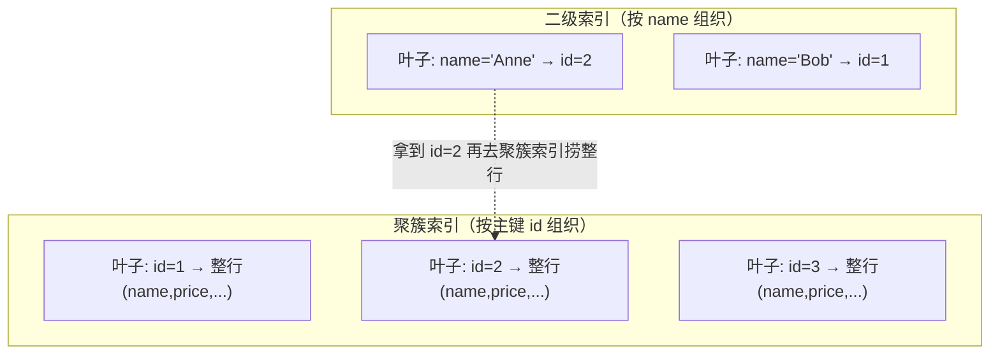
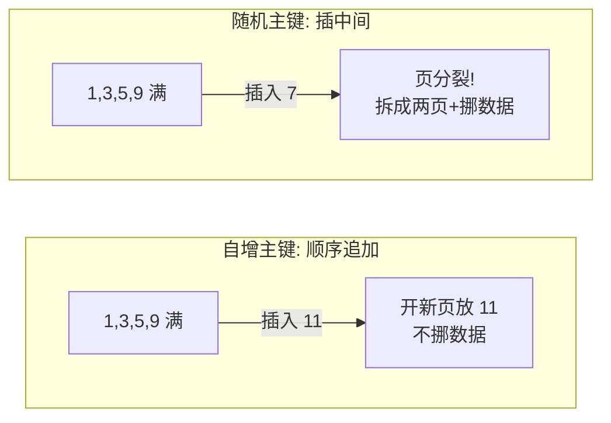

# 索引是怎么设计和使用的？

> 索引就是数据的"目录"——用一点额外的空间，换查询时少扫一大堆数据。这篇把索引怎么分类、聚簇索引和二级索引差在哪、为什么会回表、怎么用覆盖索引和联合索引避开它，一次讲清楚。

上一篇我们聊了索引底层为什么选 B+ 树、单表大概多少行该考虑分表（不记得的可以回去翻 [上一篇](/database/mysql/mysql-why-bplus-tree.html)）。这篇不再纠结数据结构本身，而是站在"用"的角度：面试和实际工作里，索引真正绕不开的就是聚簇索引、回表、覆盖索引、联合索引这几块。把这几块吃透，索引这一关基本就稳了。

## 索引到底是什么

一句话：索引是帮存储引擎快速定位数据的一种**排好序**的数据结构。

类比就是查字典。没有目录你只能一页页翻；有了目录（按拼音/部首排好序），先在目录里定位，再直接翻到那一页。索引的核心价值就在"排好序"这三个字上——有序才能二分、才能定位、才能做范围查询。

代价也很直白：索引要占磁盘空间，而且增删改的时候得跟着维护（B+ 树要保持有序，插入可能触发页分裂）。所以索引不是越多越好，是"该建的建，不该建的别瞎建"。

## 索引怎么分类

光说"聚簇索引、唯一索引、联合索引……"是一堆零散名词。其实它们是从**不同维度**去切的，理清维度就不乱了。常见的有四个角度：

| 分类维度   | 包含哪些                                              |
| ---------- | ----------------------------------------------------- |
| 按数据结构 | B+Tree 索引、Hash 索引、全文（Full-Text）索引         |
| 按物理存储 | 聚簇索引（主键索引）、二级索引（辅助索引/非聚簇索引） |
| 按字段特性 | 主键索引、唯一索引、普通索引、前缀索引                |
| 按字段个数 | 单列索引、联合（组合/复合）索引                       |

注意这几个维度是**交叉**的，不是互斥的：比如一个唯一索引，从字段特性看叫"唯一索引"，从物理存储看它属于"二级索引"，从数据结构看它通常是"B+Tree 索引"。同一个索引可以同时戴好几顶帽子。

下面挑几个容易混的展开说。

### 按数据结构：B+Tree / Hash / 全文

- **B+Tree 索引**：MySQL 默认、最常用。InnoDB 和 MyISAM 都用它（实现细节不同）。支持等值、范围、排序、最左前缀，全能型选手。
- **Hash 索引**：等值查询接近 O(1)，贼快，但**不支持范围查询和排序**——因为哈希打散后数据是无序的。InnoDB 不让你手动建普通哈希索引，它内部有个"自适应哈希索引（Adaptive Hash Index）"是引擎根据访问热点自动建的，不需要你管。
- **全文索引（Full-Text）**：对文本分词后检索关键词，只能建在 `CHAR`/`VARCHAR`/`TEXT` 上。实际项目里大文本搜索一般直接上 Elasticsearch，很少用 MySQL 自带的全文索引。

> 这里提醒一个资料里常见的说法："MyISAM 才支持全文索引"。这是老黄历了——**InnoDB 从 MySQL 5.6 起也支持全文索引**，看到旧文档说只有 MyISAM 支持的，留个心眼。

### 按字段特性：主键 / 唯一 / 普通 / 前缀

| 类型     | 能否重复   | 能否为 NULL           | 一张表能有几个 |
| -------- | ---------- | --------------------- | -------------- |
| 主键索引 | 不能       | 不能                  | 只有 1 个      |
| 唯一索引 | 不能       | 可以（NULL 不算重复） | 多个           |
| 普通索引 | 可以       | 可以                  | 多个           |
| 前缀索引 | 取决于约束 | ——                    | 多个           |

有个细节值得记一下：唯一索引允许 NULL，而且**多个 NULL 不算"重复"**——因为在 SQL 里 `NULL != NULL`，所以唯一约束对 NULL 是放行的。主键则两样都不行：不能重复、不能 NULL。

前缀索引是给字符串字段用的，只对前 N 个字符建索引，比如 `INDEX(email(10))`。好处是索引项更小、一个索引页能塞更多值；坏处是它**不能当覆盖索引用、也没法配合 `ORDER BY`**（因为它只存了前缀，拿不到完整值）。

## 聚簇索引 vs 二级索引：叶子节点里到底放了啥

这是整篇最关键的一组对比，回表、覆盖索引全是从这里推出来的。区别就一句话——**叶子节点存的东西不一样**：

|                 | 聚簇索引（主键索引） | 二级索引（辅助索引） |
| --------------- | -------------------- | -------------------- |
| 叶子节点存什么  | **整行完整数据**     | **主键值**           |
| InnoDB 里谁是它 | 主键索引             | 除主键外的所有索引   |
| 一张表有几棵    | 只有 1 棵            | 可以有多棵           |



InnoDB 的表数据本身就是按主键组织成一棵 B+ 树存的——所以**主键索引就是数据本身**，这就是"聚簇"（数据和索引聚在一起）的含义。一张表只能有一棵聚簇索引，因为整行数据只能按一种顺序物理存放一份。

补一个常被忽略的点：如果你建表时**没指定主键**，InnoDB 不会摆烂，它会按这个顺序找替身——先找第一个"非空 + 唯一"的列当聚簇索引键；还没有的话，它会偷偷生成一个 6 字节的隐藏自增列（`row_id`）来当聚簇索引。所以"InnoDB 表一定有聚簇索引"是成立的。

而二级索引的叶子节点存的是**主键值**，不是整行。这就埋下了"回表"的伏笔。

> 顺便说说 MyISAM：它的主键索引和二级索引叶子节点存的都是**数据记录的地址（行指针）**，数据和索引是分开两个文件存的，所以 MyISAM 压根没有聚簇索引这回事，它的主键索引也算非聚簇索引。本篇后面讲回表/覆盖索引默认都以 InnoDB 为准。

## 回表 vs 覆盖索引

理解了上面那张表，回表就是顺理成章的事。

**回表**：用二级索引查询时，先在二级索引这棵 B+ 树上找到叶子节点，拿到主键值，然后**再拿这个主键值跑去聚簇索引那棵树上**捞出整行数据。一次查询走了两棵 B+ 树，这个"再查一次主键索引"的动作就叫回表。

```sql
-- product_no 上有二级索引，但要 select *（要拿整行）
SELECT * FROM product WHERE product_no = '0002';
-- 流程：二级索引找到 product_no='0002' → 得到主键 id → 回聚簇索引捞整行
```

**覆盖索引**：如果你要查的列，**全都能在二级索引这棵树上拿到**，那就不用回表了，只查一棵树就完事。这种"索引刚好覆盖了你要的所有字段"的情况，就叫覆盖索引。

```sql
-- 只要 id，而二级索引叶子本来就存着主键 id，直接返回，不回表
SELECT id FROM product WHERE product_no = '0002';

-- 建联合索引 (product_no, name) 后，下面这条也覆盖了，不回表
SELECT product_no, name FROM product WHERE product_no = '0002';
```

判断有没有用上覆盖索引，看执行计划 `Extra` 列：出现 **`Using index`** 就说明走了覆盖索引（注意别和表示用了索引下推的 `Using index condition` 搞混，那是两码事，下面会讲）。

所以覆盖索引是一个非常实用的优化思路：**与其 `SELECT *` 然后疯狂回表，不如把高频查询要的几个列做成联合索引，让它能被覆盖。** 少了回表的随机 I/O，性能差距在大表上会很明显。

## 联合索引与最左前缀匹配

联合索引就是把多个字段拼成一个索引，比如 `(a, b, c)`。它的排序规则是"先按 a 排，a 相同再按 b 排，b 还相同再按 c 排"——这点决定了它怎么用。


### 最左前缀原则

因为是这么排的，所以查询必须**从最左列开始、连续地用**，索引才使得上劲。这就是"最左前缀匹配原则"。建一个 `(a, b, c)` 联合索引，相当于白送你 `(a)`、`(a,b)`、`(a,b,c)` 这三个前缀组合都能走索引。

来看经典面试题，假设有联合索引 `(a, b, c)`：

| 查询条件              | 能用上索引吗 | 说明                                    |
| --------------------- | ------------ | --------------------------------------- |
| `a=1`                 | ✅ 用到 a    | 命中最左列                              |
| `a=1 AND b=2`         | ✅ 用到 a、b | 连续前缀                                |
| `a=1 AND b=2 AND c=3` | ✅ 全用上    | 完整前缀                                |
| `a=1 AND c=3`         | ⚠️ 只用到 a  | 跳过了 b，c 接不上，只能 a 定位后过滤 c |
| `b=2 AND c=3`         | ❌ 用不上    | 缺最左列 a，整个索引废了                |
| `c=3`                 | ❌ 用不上    | 同上                                    |
| `b=2 AND a=1 AND c=3` | ✅ 全用上    | 写的顺序不重要，优化器会重排成 a→b→c    |

最后一行要划重点：**WHERE 里条件的书写顺序不影响**，优化器会自动重排，只要"集合上"凑齐了从最左开始的连续前缀就行。真正卡住索引的是"缺了最左列"或"中间断了"。

> 多说一句：MySQL 8.0.13 起有个"索引跳跃扫描（Index Skip Scan）"，能让某些不满足最左前缀的查询也勉强用上索引，但它适用面窄、还出过 bug，知道有这么个东西即可，别指望它救场。

### 遇到范围查询会被截断

最左前缀有个重要的"刹车点"：**一旦遇到范围查询，它后面的列就用不上索引了**（但范围查询那一列本身还是用得上的）。

为什么？还是排序惹的祸。以 `(a, b)` 为例，执行 `WHERE a > 1 AND b = 2`：满足 `a > 1` 的记录是一段连续区间没错，但在这段区间里 b 是**全局无序**的（a=5 时 b 可能是 8，a=6 时 b 可能是 10，a=7 时 b 又变 5）。既然无序，就没法用 `b=2` 再去缩小扫描范围，所以 b 用不上索引。

这里有个很多人忽略、但 `>` 和 `>=` 真的不一样的细节：

| 查询                          | b 能否用上索引  | 原因                                                         |
| ----------------------------- | --------------- | ------------------------------------------------------------ |
| `a > 1 AND b = 2`             | ❌ b 用不上     | `>` 是纯范围，b 在区间内全局无序                             |
| `a >= 1 AND b = 2`            | ✅ b 也能用上   | `>=` 含了 `a = 1` 这个**等值**部分，在 a=1 这段里 b 是有序的 |
| `a BETWEEN 2 AND 8 AND b = 2` | ✅ b 也能用上   | MySQL 的 BETWEEN 含两端边界，等价于 `>= AND <=`，含等值      |
| `name LIKE 'j%' AND age = 22` | ✅ age 也能用上 | 前缀匹配能定位到 name='j' 这段有序区间，age 在里面有序       |

直觉上 `>` 和 `>=` 差不多，但 `>=` 因为"夹带"了等值边界，在那个等值点上后续列恢复了有序，所以后面的列能继续用索引。怎么验证用了几列？看执行计划的 **`key_len`**——它会告诉你优化器实际用了几个字段来形成扫描区间，字段越多 key_len 越大（每个允许 NULL 的字段还要 +1 字节）。

### 顺手解决排序

联合索引还能省掉文件排序。比如：

```sql
SELECT * FROM `order` WHERE status = 1 ORDER BY create_time ASC;
```

只给 `status` 建单列索引的话，筛完还得对 `create_time` 单独排序，执行计划会出现 `Using filesort`（慢）。但建 `(status, create_time)` 联合索引后，`status=1` 筛出来的数据**天然就是按 create_time 排好序的**，直接顺着读就行，省掉排序。这就是利用了 B+ 树的有序性。

## 索引下推（ICP）

索引下推（Index Condition Pushdown，MySQL 5.6 引入）是和联合索引、回表配套的一个优化。名字里的"下推"，指的是把本该 Server 层做的过滤，**下推到存储引擎层**，在遍历索引时就顺手做掉。

还用 `(a, b)` 和 `WHERE a > 1 AND b = 2` 举例。我们已经知道 `a > 1` 是范围查询、b 用不上索引定位。但 b=2 这个判断在哪儿做？

- **没有 ICP（5.6 之前）**：引擎层只按 `a > 1` 找出一堆主键，挨个回表捞出整行，**全部丢给 Server 层**，再由 Server 层逐行判断 `b = 2`。哪怕 b 用不上索引"定位"，但 b 的值其实就摆在联合索引的叶子节点里啊，白白回了一堆没用的表。
- **有了 ICP（5.6 起）**：引擎层在遍历索引时，**先用叶子节点里现成的 b 值判断 `b = 2`**，不满足的直接扔掉，只有满足的才回表。

效果：**减少回表次数 + 减少引擎层传给 Server 层的数据量**。执行计划 `Extra` 出现 **`Using index condition`** 就是用了它（再强调一次，别和覆盖索引的 `Using index` 混了）。

几个使用边界记一下：只对 InnoDB 的**二级索引**有意义（聚簇索引整行已经在缓冲区了，下推省不了 I/O），子查询、存储函数这些场景用不了。原理更细的部分会在执行计划那一篇再呼应。

## 索引设计的实用建议

知道了原理，落到"到底该怎么建"，下面这些是性价比最高的几条。

**1. 选区分度高的列。** 区分度 = 不同值个数 / 总行数。性别（就男女两个值）区分度极低，建了也基本没用——优化器一看某个值占了一大半行（经验阈值 30% 左右），干脆全表扫描了。UUID、订单号这种区分度高的才适合。

**2. 联合索引把高频 / 高区分度的列放最左边。** 因为越靠左的列被用于过滤的概率越高（最左前缀决定的），同时区分度高的列放前面能更快缩小范围。

**3. 索引列尽量 `NOT NULL`。** NULL 会让优化器的选择更复杂（统计、比较、`count` 都要特殊处理），而且 InnoDB 的 COMPACT 行格式还要花空间维护 NULL 值列表。避不开 NULL 的话，用 0、''、false 这种有明确语义的默认值替代会更省心。

**4. 主键最好用自增整数。** 自增主键插入是"追加"，页写满就开新页，不挪动已有数据；非自增（比如随机 UUID）插入会插到数据页中间，可能触发**页分裂**——挪数据、产生碎片、索引变松散，查询和写入都受影响。另外主键越短越好，因为**所有二级索引的叶子都存着主键值**，主键长了所有二级索引都跟着变胖。



**5. 频繁更新的列别乱建索引。** 索引列每改一次，B+ 树都要为保持有序而调整。像电商用户余额这种改得飞快又很少单独查的字段，建索引纯属添乱。

**6. 优先联合索引、避免冗余索引。** 一个字段一棵 B+ 树，索引一多磁盘和维护成本都上去了。能用联合索引覆盖多个查询就别拆成一堆单列索引。还要注意冗余：已经有 `(name, city)` 了，再单独建 `(name)` 就是冗余——能命中 `(name, city)` 的查询必然能命中 `(name)`，大多数时候应该**扩展已有索引**而不是新建。

**7. 字符串长字段考虑前缀索引。** 对长字符串只取前几个字符建索引，省空间、一页能装更多。但记住前缀索引不能做覆盖索引、也帮不了 `ORDER BY`，要权衡。

**8. 单表索引别太多。** 经验上建议单表不超过 5 个左右。索引越多，优化器评估执行计划的耗时越长，写入维护成本也越高。

## 容易踩的坑

- **`SELECT *` 把覆盖索引白白浪费掉**：明明建了能覆盖的联合索引，结果一个 `*` 让它必须回表。要什么列写什么列。
- **以为 WHERE 顺序要和索引顺序一致**：不需要，优化器会重排。真正要紧的是"有没有从最左列开始的连续前缀"。
- **`>` 和 `>=` 一视同仁**：`a > 1 AND b = 2` 里 b 用不上索引，但 `a >= 1 AND b = 2` 里 b 能用上，差别就在那个等值边界。
- **把 `Using index` 和 `Using index condition` 当成一回事**：前者是覆盖索引（不回表），后者是索引下推（减少回表），是两个优化。
- **照抄"全文索引只有 MyISAM 支持"**：InnoDB 5.6 起也支持了，别被旧资料带偏。
- **在区分度极低的列上建索引**：性别、状态位这种，建了优化器也大概率不用。

## 小结

1. 索引是"排好序的数据结构"，用空间换时间；分类有四个维度（数据结构 / 物理存储 / 字段特性 / 字段个数），同一个索引可以同时属于多个维度。
2. 聚簇索引叶子存**整行**、二级索引叶子存**主键值**——这一条差异推导出了回表和覆盖索引。
3. 二级索引查不到的列要回聚簇索引捞数据叫**回表**；要的列全在索引里就是**覆盖索引**（`Using index`），是最实用的优化之一。
4. 联合索引遵循**最左前缀**，遇到范围查询截断后续列（`>=`/`BETWEEN`/`LIKE 'x%'` 因含等值边界不截断，`>`/`<` 会）；**索引下推**（`Using index condition`）能在引擎层提前过滤、减少回表。
5. 建索引记住：选高区分度列、高频列放联合索引左边、尽量 NOT NULL、自增短主键、别在频繁更新列乱建、避免冗余、单表别超 5 个。

## 参考

基于 MySQL 8.0 Reference Manual 中 InnoDB、Optimizer、Replication、EXPLAIN、Data Types、Online DDL 等相关官方章节整理。
