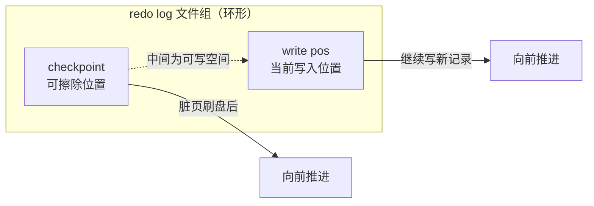
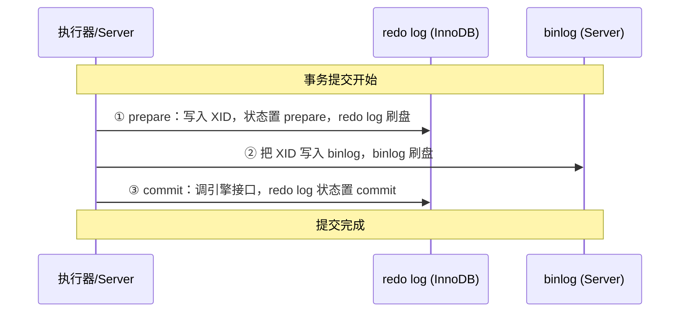

# redo log、undo log、binlog 分别有什么用？

> 一条 update 背后藏着三种日志：undo log 让你能回滚（原子性），redo log 让你崩溃后还能恢复（持久性），binlog 让主从和备份能对上账。把这三个串在一条更新语句里讲，比一个个背概念清楚得多。

很多人记日志是分开背的：undo 是回滚、redo 是重做、binlog 是归档。背完一考"两阶段提交"就懵了，因为它们在一条 update 语句里其实是有先后顺序、互相配合的。所以这篇我换个讲法——盯着一条最简单的更新语句，看 MySQL 内部依次干了哪些事，三种日志自然就串起来了。

```sql
UPDATE t_user SET name = 'alice' WHERE id = 1;
```

## 先看一条 update 的全过程

这条语句走的流程和查询语句前半段是一样的：连接器认人 → 解析器拆 SQL → 预处理器查表和字段存不存在 → 优化器挑索引（这里 id 是主键，走主键索引）→ 执行器真正去改。MySQL 8.0 之后查询缓存已经被移除了，所以中间没有查缓存这一步。

关键是执行器调用 InnoDB 之后这一段，我按时序列一下，三种日志的出场顺序就藏在里面：

1. 执行器通过主键索引找到 `id=1` 这一行。如果这行所在的数据页已经在 **Buffer Pool**（缓冲池）里就直接拿，不在就从磁盘把整页（默认 16KB）读进来。
2. 比较一下旧值新值是否相同，相同就直接结束（这是个小优化）；不同才往下走，把新旧记录交给 InnoDB。
3. InnoDB 先写 **undo log**：把这一列的旧值记下来，写进 Buffer Pool 的 Undo 页。注意——改 Undo 页本身也是改内存页，所以这步还会顺带产生一条 redo log（后面解释为什么 undo 也要被 redo 保护）。
4. InnoDB 改 Buffer Pool 里的数据页（把 name 改成 'alice'），把这个页标成**脏页**，同时把"对这个页做了什么修改"写进 **redo log buffer**。到这一步，从用户视角看更新就算"完成"了，脏页不急着落盘，后台线程会挑时机刷。这就是 WAL。
5. 执行器生成这条语句的 **binlog**，先放进 binlog cache，还没落盘。
6. 提交事务，进入**两阶段提交**：redo log 先写成 prepare → binlog 落盘 → redo log 置为 commit。

下面把三种日志各自拆开讲，最后再回到第 6 步把两阶段提交讲透。

## undo log：回滚日志（InnoDB 层）

undo log 由 InnoDB 存储引擎产生，它干两件事：**保证原子性**和**支撑 MVCC**。

事务执行到一半，无论是程序报错、还是你手敲了 ROLLBACK、还是 MySQL 直接崩了，都得能退回到事务开始前的样子——要么全做，要么全不做，这就是原子性。靠的就是"改之前先把旧样子记下来"。具体记什么取决于操作类型：

- **insert** 一行：记下这行的主键值，回滚时按主键把它删掉。
- **delete** 一行：把整行内容记下来，回滚时再 insert 回去。
- **update** 一行：把被改的列的旧值记下来，回滚时改回旧值。

可以看出 undo log 记的是"反向操作"，回滚就是照着 undo log 反着做一遍。

第二个作用是 MVCC。每条记录上有两个隐藏列：`trx_id`（哪个事务改的）和 `roll_pointer`（指向上一个版本的 undo log）。一行被改很多次，这些 undo 通过 `roll_pointer` 串成一条**版本链**。快照读（普通 select）时，事务拿自己的 Read View 和记录上的 `trx_id` 比对，看不到当前版本就顺着版本链往回找到一个该看的旧版本。读已提交和可重复读的区别只在于 Read View 什么时候生成——读已提交每次 select 都生成新的，可重复读整个事务用同一个。这块细节在事务隔离那篇展开，这里知道 undo log 是 MVCC 的版本库就够了。

**什么时候被清理（purge）？** undo log 不是事务一提交就能删的。insert 产生的 undo，事务提交后就没人需要它了（没有别的事务会读一个刚插入还没提交的行的旧版本），可以直接清。但 update/delete 产生的 undo 不行——可能还有更早开启的事务正靠着版本链读旧版本，删早了就破坏 MVCC 了。所以这类 undo 提交后会先挂到 **history list** 上，由后台的 **purge 线程**判断"确实没有任何活跃事务还需要这个版本了"再清理。这也是为什么长事务危害大：它迟迟不结束，导致一大片 undo 没法 purge，undo 表空间越涨越大。

## redo log：重做日志（InnoDB 层）

redo log 也是 InnoDB 的，作用是**保证持久性**，让 MySQL 有崩溃恢复（crash-safe）的能力。

为什么需要它？因为更新是先改 Buffer Pool 里的内存页，标成脏页，并不立刻落盘。万一脏页还没刷下去就断电了，这部分改动就丢了。redo log 就是为这个兜底的：改完内存页，把"对某表空间某数据页某偏移量做了什么物理修改"记进 redo log 并落盘，那么就算脏页丢了，重启后照着 redo log 把这些修改重新做一遍，数据还在。

这就是 **WAL（Write-Ahead Logging，预写日志）**：写操作不直接落数据页，而是先写日志、日志落盘，数据页之后再慢慢刷。它带来两个好处：

- **崩溃后能恢复**：已提交事务的修改即使没刷数据页，也能靠 redo log 重放回来。
- **把随机写变顺序写**：数据页散落在磁盘各处，刷脏页是随机写，慢；而且一个页 16KB，可能就改了几个字节，刷整页太亏。redo log 是一条几十字节的小记录、追加着写，是顺序写，快得多。打个比方，顺序写像在本子上一页页往下写，随机写像每写一个字都要先翻到对应那页。

> 说明：redo log 记的是"物理上对页做了什么修改"，不是行级的逻辑语句，这点和 binlog 不一样，下面会对比。

**redo log buffer 和刷盘**。redo log 也不是每条都直接捅到磁盘（那样 I/O 太频繁），先进 **redo log buffer**（默认 16MB，`innodb_log_buffer_size` 调）。落盘时机主要有：MySQL 正常关闭时；buffer 用量超过一半时后台主动刷；后台线程每秒刷一次；以及事务提交时——提交时怎么刷由 `innodb_flush_log_at_trx_commit` 控制：

| 取值          | 提交时的动作                                                    | 安全性                                                                  | 性能 |
| ------------- | --------------------------------------------------------------- | ----------------------------------------------------------------------- | ---- |
| **0**         | 提交时什么都不做，redo log 留在 buffer 里，靠后台线程每秒刷一次 | 最差，MySQL 进程崩溃就可能丢最近 1 秒的事务                             | 最好 |
| **1**（默认） | 每次提交都把 redo log 直接落盘（fsync）                         | 最好，提交成功就一定在磁盘上，不丢                                      | 最差 |
| **2**         | 每次提交只 write 到操作系统的 page cache，由 OS 决定何时 fsync  | 居中，MySQL 进程崩溃不丢（数据在 OS 缓存里），但整机断电会丢最近约 1 秒 | 居中 |

安全性 1 > 2 > 0，性能 0 > 2 > 1。要数据不丢就设 1（这也是默认），能容忍崩溃丢 1 秒、追性能就 0，折中选 2。

这里有个常被问的点：**没提交的事务，redo log 会落盘吗？** 会。因为后台线程每秒会把 redo log buffer 整体刷一次，不管里面的事务提没提交。那崩溃了不就脏了？不会——没提交的事务 binlog 还没落盘，重启时按两阶段提交的规则会把它回滚掉（下面讲）。

**循环写、固定大小、write pos 与 checkpoint**。redo log 文件是固定大小、循环写的（写到末尾绕回开头），不像 binlog 无限追加。它用两个指针管理这个环：

- **write pos**：当前写到哪了，一边写一边往前移。
- **checkpoint**：当前可以擦除到哪了，对应"这之前的脏页都已经刷盘、redo 记录可以覆盖"。

write pos 和 checkpoint 之间空着的部分用来写新记录。一旦 write pos 追上 checkpoint，说明 redo log 写满了，这时 MySQL 必须停下来：先把一批脏页刷盘，把 checkpoint 往前推、腾出空间，再继续。所以并发量大的系统，redo log 设太小会频繁触发这种停顿，要适当调大（MySQL 8.0.30 之后用 `innodb_redo_log_capacity` 配置，老版本的 `innodb_log_file_size`/`innodb_log_files_in_group` 已废弃）。



正因为 redo log 是循环写、会被擦除，它只保留"还没刷盘的脏页对应的物理日志"。所以**误删整个库不能靠 redo log 恢复**——旧记录早被覆盖了，得靠 binlog。

## binlog：归档日志（Server 层）

binlog 由 MySQL Server 层产生，**不管用什么存储引擎，只要改了数据就会写 binlog**。它记录所有改表结构和改数据的操作（不记 select、show 这种只读操作），主要用于两件事：**主从复制**和**数据备份/恢复**。

为什么有了 redo log 还要 binlog？这是历史原因：MySQL 最早自带的引擎是 MyISAM，没有 crash-safe 能力，binlog 只能拿来归档；InnoDB 是后来以插件形式引入的，它自己搞了 redo log 来实现崩溃恢复。所以两者出身不同、职责也不同，并存到了今天。

**三种格式**，由 `binlog_format` 控制：

- **statement**：直接记 SQL 原文。优点是日志小（一条批量 update 就记一条语句）。缺点是有"动态函数"问题——比如 SQL 里用了 `now()`、`uuid()`、`rand()`，主库执行得到的值和从库重放时不一样，会导致主从数据不一致。
- **row**：记每一行被改成了什么具体的值，不记 SQL。优点是没有动态函数问题，可靠。缺点是占空间——批量更新 10 万行就记 10 万行的变化，binlog 暴涨，I/O 也更高。
- **mixed**：折中，MySQL 自己判断这条 SQL 会不会引起主从不一致，会就用 row，不会就用 statement。

MySQL 5.7.7 之前默认 statement，之后默认 row。实际生产为了数据一致性，基本都用 row。

**binlog 的写入和刷盘**。事务执行中先写 binlog cache（每个线程一块，`binlog_cache_size` 控制大小，超了暂存磁盘），提交时整个事务的 binlog 一次性写进 binlog 文件——一个事务的 binlog 不能被拆开。这里 write 和 fsync 是两回事：write 只是写到 OS 的 page cache，快；fsync 才真正落盘，慢。由 `sync_binlog` 控制：

- **0**：每次提交只 write，由 OS 决定何时 fsync。性能最好，但宕机会丢 page cache 里的 binlog。
- **1**（默认）：每次提交都 write + fsync，最安全，最多丢一个还没提交的事务，但写性能损耗大。
- **N（>1）**：每次提交都 write，攒够 N 个事务才 fsync。性能和风险折中，宕机可能丢最近 N 个事务的 binlog。

主从复制就是把主库的 binlog 传到从库重放：主库写 binlog 并提交 → 从库 I/O 线程拉取 binlog 写进 relay log（中继日志）→ 从库 SQL 线程读 relay log 重放、更新数据。默认是异步的，所以主库提交快但从库会有延迟。

## redo log vs binlog 对比

这俩最容易混，面试也爱让你对比。一张表说清：

| 维度               | redo log                             | binlog                                      |
| ------------------ | ------------------------------------ | ------------------------------------------- |
| 所属层             | InnoDB 存储引擎层                    | MySQL Server 层（所有引擎通用）             |
| 日志性质           | 物理日志（对某页某偏移做了什么修改） | 逻辑日志（statement 记 SQL / row 记行变化） |
| 写入方式           | 循环写，大小固定，写满覆盖旧的       | 追加写，写满建新文件，不覆盖，保全量        |
| 保存内容           | 只保留未刷盘脏页对应的记录           | 所有数据变更的全量历史                      |
| 主要用途           | 崩溃恢复（crash-safe）、保证持久性   | 主从复制、数据备份与恢复                    |
| 能否恢复误删的整库 | 不能（旧记录会被擦除）               | 能（保存全量日志）                          |

## 两阶段提交：为什么需要，怎么做

回到 update 时序的第 6 步。一个事务提交时，redo log 和 binlog 都要落盘，但它们是两份独立的日志、两次独立的落盘，万一中间崩了，就可能出现"一个写了一个没写"的半成功状态，导致两份日志对不上。

举例：`UPDATE t_user SET name='alice' WHERE id=1`，原值是 'jay'。如果不做特殊处理：

- 假如 **redo log 落盘后、binlog 还没写** 就崩了：重启后 redo log 把主库这行恢复成 'alice'，但 binlog 里没这条记录，复制到从库后从库还是 'jay'——**主从不一致**。
- 假如 **binlog 落盘后、redo log 还没写** 就崩了：主库这边事务因 redo 没写而无效，还是 'jay'，但 binlog 已经有这条记录，从库重放后变成 'alice'——**还是主从不一致**。

根因在于：redo log 决定主库数据，binlog 决定从库数据，两者必须同生共死。MySQL 用**两阶段提交**来保证这一点——本质是一个内部 XA 事务，binlog 当协调者，InnoDB 当参与者。它把 redo log 的写入拆成 prepare 和 commit 两步，中间夹着写 binlog：



三步：

1. **prepare**：把内部 XA 事务的 XID 写进 redo log，状态标为 prepare，刷盘。
2. **写 binlog**：把同一个 XID 写进 binlog，binlog 刷盘。
3. **commit**：调用 InnoDB 接口，把 redo log 状态改成 commit。

**崩溃恢复时怎么判断提交还是回滚？** 重启后 MySQL 扫 redo log，碰到 prepare 状态的记录，就拿它的 XID 去 binlog 里找：

- **binlog 里没有这个 XID** → 说明崩在 binlog 落盘之前（对应上面第一步之后、第二步没完成）→ **回滚**这个事务。因为 binlog 没记，从库不会有这条，主库也不能有，才一致。
- **binlog 里有这个 XID** → 说明 binlog 已经完整落盘（崩在第二步之后、第三步 commit 标记还没打上）→ **提交**这个事务。因为 binlog 已经会被从库消费，主库必须也提交才能对上。

所以一句话：**两阶段提交以 binlog 写成功为事务最终提交的标志**。redo log 处于 prepare 时，是提交还是回滚，完全看 binlog 里有没有对应的 XID。这就把两份日志的一致性锁死了。

> 补一句**组提交（group commit）**：双 1 配置下每个事务提交要刷两次盘（redo 一次、binlog 一次），并发高时 I/O 是瓶颈。MySQL 把多个事务的 binlog 攒到一起合并成一次 fsync 刷盘（分 flush/sync/commit 三个排队阶段），原本 10 个事务刷 10 次，现在近似刷 1 次，大幅降低刷盘次数——这就是组提交。

## 容易踩的坑

- **以为 undo log 是物理日志。** undo log 是逻辑层面的"反向操作"（记旧值/反向 SQL 思路），而 redo log 才是物理日志（记对页的物理修改）。两个别记反了。
- **以为 undo log 不用持久化。** 改 Undo 页同样是改内存页，也会被 redo log 保护。否则崩溃后连"怎么回滚"的信息都没了。
- **以为事务一提交 undo 就删了。** insert 的 undo 提交后能删，但 update/delete 的 undo 要等 purge 线程确认没有活跃事务还需要它了才能清。长事务会卡住 purge、撑大 undo 空间。
- **把 `innodb_flush_log_at_trx_commit=2` 当成会丢数据的设置。** 设为 2 时 MySQL 进程崩溃不丢数据（数据在 OS page cache 里），只有整机断电才可能丢约 1 秒。0 才是进程崩溃就丢 1 秒。
- **以为误删库能用 redo log 救回来。** redo log 循环写会擦旧记录，只能崩溃恢复未落盘的脏页；恢复历史数据得靠 binlog（全量、追加、不覆盖）。
- **背两阶段提交只会背"prepare-commit 两步"。** 重点是中间夹着 binlog 落盘，以及崩溃恢复时靠 "redo 的 prepare/commit 状态 + binlog 里有没有 XID" 来决策，这才是考点。
- **statement 格式不一定省事。** 它日志小，但 `now()`/`uuid()` 这类动态函数会导致主从不一致，所以生产基本用 row。

## 小结

1. 一条 update：改 Buffer Pool 脏页 → 写 undo log（记旧值，可回滚）→ 写 redo log（记物理修改，可恢复，先 prepare）→ 写 binlog → redo log 置 commit。盯着这条线就能串起全部三种日志。
2. undo log（InnoDB 层）保原子性、撑 MVCC 版本链；redo log（InnoDB 层）保持久性、靠 WAL 把随机写变顺序写、循环写有 write pos 和 checkpoint；binlog（Server 层）用于主从复制和备份恢复、追加写不覆盖。
3. redo log 是物理日志、循环写、崩溃恢复用；binlog 是逻辑日志、追加写、复制备份用。误删整库只能靠 binlog 救。
4. `innodb_flush_log_at_trx_commit`（0/1/2）和 `sync_binlog`（0/1/N）控制各自刷盘策略，双 1 最安全也最费 I/O。
5. 两阶段提交（prepare → 写 binlog → commit）保证 redo log 和 binlog 一致，避免主从数据不一致；崩溃恢复时以 binlog 里有没有对应 XID 为准来决定提交还是回滚。

## 参考

基于 MySQL 8.0 Reference Manual 中 InnoDB、Optimizer、Replication、EXPLAIN、Data Types、Online DDL 等相关官方章节整理。

<!-- @include: ./_article-footer.snippet.md -->
