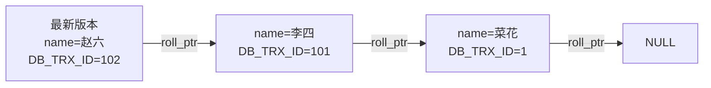

# MVCC 和 ReadView 是怎么工作的？

> 一句话：MVCC 让"读"不用加锁也能读到一份一致的快照，靠的是每条记录留着多个历史版本（版本链）+ 一张"谁的修改我能看见"的判定表（ReadView）。

## MVCC 到底解决了什么

先说痛点。如果没有 MVCC，事务 A 在读一行，事务 B 想改这行，要么 B 等 A 读完，要么 A 读到 B 改了一半的脏数据。读写互相卡，并发就上不去。

MVCC 的思路很朴素：**写的时候不把旧值直接丢掉，而是把旧值留在 undo log 里，让读操作去读"属于自己那个时间点"的那一份**。这样：

- 读不加锁，写也不互相等（指普通 select 和正常的增删改），两边不会互相阻塞；
- 每个事务读到的是一份"一致性快照"，整个事务期间（在可重复读下）看到的世界是稳定的。

所以你会经常听到一句话：MVCC 实现了"一致性非锁定读"。这里的"读"特指普通 `select`，也叫**快照读**。注意它不是万能的，下面会讲它管不到的地方。

## 三个隐藏字段

InnoDB 给每一行聚簇索引记录都偷偷塞了几个隐藏列，MVCC 全靠它们：

| 字段          | 大小   | 干嘛的                                                                                              |
| ------------- | ------ | --------------------------------------------------------------------------------------------------- |
| `DB_TRX_ID`   | 6 字节 | 最近一次"改"这行的事务 id。注意 `delete` 内部也算一次更新，只是在记录头打了个 `deleted_flag` 标记。 |
| `DB_ROLL_PTR` | 7 字节 | 回滚指针，指向 undo log 里这行的**上一个版本**。顺着它就能往回翻历史。                              |
| `DB_ROW_ID`   | 6 字节 | 只有在**没主键、也没唯一非空索引**时才有，InnoDB 拿它当聚簇索引的隐式主键。                         |

这里要拎清一个常见误读：有的资料把 `DB_TRX_ID` 说成"最后一次插入或更新该行的事务 id"。"插入"当然也算，但更准确的说法是**最近一次改动该行的事务 id**（插入、更新、删除都算改动）。另外 `DB_ROW_ID` 跟 MVCC 其实没啥关系，它纯粹是没主键时用来兜底建聚簇索引的，别把它当成版本控制的一部分。

## undo log 版本链

每次修改一行，InnoDB 会把**修改前的样子**写进 undo log，然后用新记录的 `DB_ROLL_PTR` 指向这个旧版本。同一行被改了好几次，这些旧版本就被 `roll_pointer` 串成一条链——链头是当前最新值，往后越翻越老。

举个例子：一行数据 `name = 菜花`（最早由事务 1 写入），先后被事务 101、102 改过，链就长这样：

一个事务来读这行时，到底应该停在链上的哪一节？这就要靠 ReadView 来判断了。

> 顺带一提：`insert` 产生的 undo log 在事务提交后就能直接删，因为提交前别人看不到这条新行、提交后也没人需要它的旧版本（它本来就没旧版本）。而 `update`/`delete` 的 undo log 要留着给 MVCC 用，得等没有任何活跃事务可能再读它时，由 purge 线程清理。

## ReadView 的四个字段

ReadView 是事务在某个时刻给"整个数据库的活跃事务状态"拍的一张快照照片。它记的不是数据，而是**当下有哪些事务还没提交**。四个字段：

- `m_ids`：生成这个 ReadView 时，还**活跃（已启动、未提交）**的事务 id 集合。注意不包含自己，也不包含已经提交的。
- `min_trx_id`：`m_ids` 里**最小**的那个 id（`m_ids` 为空时等于 `max_trx_id`）。
- `max_trx_id`：**下一个将要分配**的事务 id，也就是当前最大事务 id + 1。常叫它"高水位"。注意它不是 `m_ids` 的最大值，而是一个还没人用的、未来的 id。
- `creator_trx_id`：创建这个 ReadView 的事务**自己**的 id。

> 旧资料（比如 InnoDB 源码）里这几个字段叫 `m_up_limit_id`（小于它都可见）和 `m_low_limit_id`（大于等于它都不可见），对应到这里就是 `min_trx_id` 和 `max_trx_id`。换个名字而已，含义一样，看到别懵。

## 可见性判断：拿 DB_TRX_ID 跟 ReadView 比

读一行时，取出这个版本的 `DB_TRX_ID`，跟 ReadView 比，分三种情况（自己改的总是可见，这条优先）：

1. `DB_TRX_ID < min_trx_id`：改这行的事务在我拍快照**之前就已经提交**了 → **可见**。
2. `DB_TRX_ID >= max_trx_id`：改这行的事务是在我拍快照**之后才开启**的 → **不可见**。
3. `min_trx_id <= DB_TRX_ID < max_trx_id`：处在中间地带，再看它在不在 `m_ids` 里：
   - **在** `m_ids` 里 → 拍快照那一刻它还没提交 → **不可见**；
   - **不在** `m_ids` 里 → 说明它已经提交了 → **可见**。

如果当前版本判定为**不可见**，就顺着 `DB_ROLL_PTR` 翻到 undo log 里更老的那个版本，拿它的 `DB_TRX_ID` 再跑一遍上面的判断，直到找到一个可见的版本为止（或者翻到头，返回空）。

### 带数字走一遍

设有一行 `name=菜花`（最早事务 1 写入，早就提交了）。现在系统里：

- 事务 101 把它改成 `李四`，**未提交**；
- 事务 102 把它改成 `赵六`，**未提交**；
- 事务 103 来读这行。

事务 103 此刻生成 ReadView：活跃的有 101、102，所以 `m_ids = [101, 102]`，`min_trx_id = 101`，`max_trx_id = 104`（下一个待分配的 id），`creator_trx_id = 103`。

版本链（链头是最新）：

事务 103 从链头开始判断：

1. 最新版本 `DB_TRX_ID=102`，落在 `[101, 104)` 区间，去查 `m_ids`——在里面（102 未提交）→ **不可见**，翻下一版。
2. 下一版 `DB_TRX_ID=101`，同样落在区间内，查 `m_ids`——也在里面（101 未提交）→ **不可见**，再翻。
3. 再下一版 `DB_TRX_ID=1`，`1 < min_trx_id(101)` → **可见**！

所以事务 103 读到的是 `name=菜花`。哪怕 101、102 正在热火朝天地改，103 也看不见它们没提交的成果。这就是"读不到未提交数据"的实现方式。

## RC 和 RR 的关键差异：ReadView 什么时候生成

RC（读已提交）和 RR（可重复读）都用 MVCC，可见性算法完全一样，**唯一的区别是 ReadView 的生成时机**：

- **RC：每次快照读都重新生成一个新的 ReadView。**
- **RR：事务里第一次快照读时生成一个，之后整个事务一直复用它。**

就这一个时机差，解释了两个隔离级别的全部行为差异。

接着上面的例子往下走，看一条完整时间线：

- T4：事务 103 第一次读，结果如上，读到 `菜花`。
- T5：事务 101 提交。
- T6：事务 103 第二次读。
- T8：事务 102 提交。
- T9：事务 103 第三次读。

**RC 下（每次重新生成 ReadView）：**

- T6 读：101 已提交，重新生成 ReadView → `m_ids = [102]`，`min_trx_id = 102`，`max_trx_id = 104`。判断链头 102 在 `m_ids` 里不可见，翻到 101 的版本，`101 < 102` 可见 → 读到 `李四`。和 T4 的 `菜花` **不一样了 → 不可重复读**。
- T9 读：101、102 都提交了，重新生成 ReadView → `m_ids = []`，此时 `min_trx_id = max_trx_id = 104`。链头 102 满足 `102 < 104` 可见 → 读到 `赵六`。又变了。

每次都拿最新的活跃事务名单去比，所以别人一提交你下次就看得见，于是同一事务里前后读不一致。

**RR 下（一直用第一次的 ReadView）：**

- T4 生成 `m_ids = [101, 102]`，`min_trx_id = 101`，`max_trx_id = 104`，之后**不再变**。
- T6 读：还是这张 ReadView，101、102 在 `m_ids` 里都不可见，一路翻到 `DB_TRX_ID=1` 可见 → 读到 `菜花`。
- T9 读：依旧用这张 ReadView，结果还是 `菜花`。

哪怕 101、102 中途都提交了，对 103 来说它们在"拍照那一刻"是活跃的，就永远不可见。所以 RR 下整个事务读到的世界是冻结的——**可重复读**。

一句话记忆：**RC 是"现拍现看"，RR 是"开局拍一张看到底"。**

## 快照读 vs 当前读

这俩概念是 MVCC 的边界，面试常被追问。

- **快照读（snapshot read）**：普通 `select ... from ...`。走 MVCC，读的是某个时间点的历史版本，**不加锁**。
- **当前读（current read）**：读最新版本并**加锁**。包括：
  - `select ... for update`（对记录加 X 锁）
  - `select ... lock in share mode`（加 S 锁）
  - `update` / `delete` / `insert`（本质都要先定位到最新行再改）

当前读不走 ReadView 那套，它直接读最新已提交版本，并把读到的记录锁住。

## 一个要点：RR 没有"完全解决"幻读

很多资料一句话带过"RR 解决了幻读"，这话不严谨，得拆开看：

- **快照读下的幻读**：由 MVCC 解决。因为 RR 整个事务用同一张 ReadView，别人新插入的行 `DB_TRX_ID >= max_trx_id`，永远不可见，你 select 多少次都查不出那条新行，自然没有幻读。
- **当前读下的幻读**：MVCC 管不到。因为当前读读的是**最新**数据，别人插进来的行如果落在你的查询范围里，你 `for update` 一查就看见了。这种幻读靠的是 **next-key lock（记录锁 + 间隙锁）**——把范围连同间隙一起锁住，不让别人往里插。

所以严格说法是：**RR 下，快照读靠 MVCC、当前读靠 next-key lock，两者配合才把幻读压住，而且也只是"很大程度避免"而非数学上彻底消灭**（典型反例：先快照读一条不存在的行、之后又对同一条做 update，update 是当前读，可能让后续快照读"突然看见"了之前看不见的行）。next-key lock 的细节放在《MySQL 有哪些锁？》那篇讲。

## 容易踩的坑

- **把 `DB_ROW_ID` 当成 MVCC 的一环**。它只在没主键时兜底建聚簇索引，跟版本可见性无关。
- **以为 `max_trx_id` 是 `m_ids` 里的最大值**。不是，它是"下一个待分配的 id"，是个比所有现存事务都大的高水位。
- **以为 begin 了事务就生成了 ReadView**。RR 下是事务里**第一条快照读语句**才生成 ReadView，不是 `begin` 那一刻（除非用 `start transaction with consistent snapshot` 强制立即开启）。
- **把"自己的修改"忘进可见性判断**。事务对自己改过的行总是可见的，这条优先于上面四步比较。
- **以为 RR 就彻底没幻读**。只对快照读成立；当前读那条线得靠锁。

## 小结

- MVCC = 版本链（undo log 串起来的历史版本）+ ReadView（可见性判定表），让快照读不加锁也能读到一致快照，读写不互相阻塞。
- 三个隐藏字段：`DB_TRX_ID`（最近改这行的事务 id）、`DB_ROLL_PTR`（指向上一版本的回滚指针）、`DB_ROW_ID`（无主键时兜底）。
- 可见性判断核心：`< min_trx_id` 可见、`>= max_trx_id` 不可见、中间地带看在不在 `m_ids` 里；不可见就顺 `roll_pointer` 往老版本翻。
- RC 与 RR 的唯一差异是 ReadView 生成时机：RC 每次 select 现拍，RR 一个事务复用一张——这就是 RC 不可重复读、RR 可重复读的根因。
- "RR 完全解决幻读"不准确：快照读靠 MVCC，当前读靠 next-key lock，两者配合且也只是很大程度避免。

## 参考

- 《MySQL 技术内幕：InnoDB 存储引擎（第 2 版）》
- MySQL 官方文档：[InnoDB Multi-Versioning](https://dev.mysql.com/doc/refman/8.0/en/innodb-multi-versioning.html)、[Consistent Nonlocking Reads](https://dev.mysql.com/doc/refman/8.0/en/innodb-consistent-read.html)
- MySQL 官方文档：[InnoDB Undo Logs](https://dev.mysql.com/doc/refman/8.0/en/innodb-undo-logs.html)
