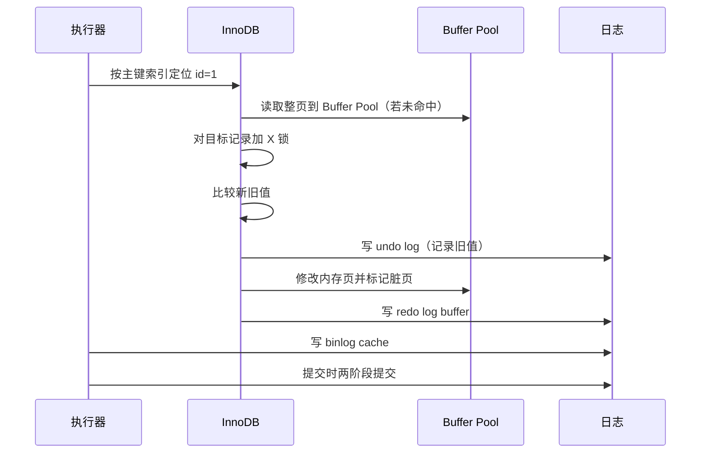

# 一条 UPDATE 语句在 MySQL 里怎么执行？

> UPDATE 的前半段像 SELECT，真正的分叉点在执行器调用 InnoDB 后：定位页、加锁、写 undo、改 Buffer Pool、写 redo、写 binlog、提交。

用这条语句做例子：

```sql
UPDATE t_user SET name = 'alice' WHERE id = 1;
```

如果只答“先写 undo，再写 redo，再写 binlog”，还是太散。更好的答法是把它放进一条执行时序里。

## Server 层先做什么？

UPDATE 也要经过 MySQL 的通用 SQL 流水线：

1. 连接器复用或建立连接，校验权限。
2. 解析器做词法、语法分析。
3. 预处理器检查表和字段是否存在。
4. 优化器选择执行计划，比如这里走主键索引。
5. 执行器开始调用存储引擎接口。

MySQL 8.0 已经移除查询缓存，所以不要把“UPDATE 清空查询缓存”写成通用流程。它只适用于 8.0 之前开启查询缓存的历史行为。

## InnoDB 真正怎么改这一行？

执行器把“按主键找 `id=1` 并修改”交给 InnoDB 后，大致是这条线：



几个细节要说清：

- Buffer Pool 按页缓存，InnoDB 不是只把目标行读进内存；默认页大小通常是 16KB。
- UPDATE 会对要修改的记录加 X 锁，锁一般到事务提交才释放。
- 如果新旧值完全相同，MySQL 可能跳过后续真实修改，但权限检查、解析、优化这些前置步骤仍然会发生。
- 数据页被改后先变成脏页，不会每次 UPDATE 都立刻刷到磁盘。

## 三种日志在时序里分别干什么？

这篇不重复展开三大日志定义，只放到 UPDATE 时序里看职责：

| 日志     | UPDATE 中的作用  | 为什么要在这个位置出现                       |
| -------- | ---------------- | -------------------------------------------- |
| undo log | 记录旧值         | 事务失败时能回滚，快照读也能沿版本链找旧版本 |
| redo log | 记录页的物理修改 | 脏页没刷盘也能崩溃恢复                       |
| binlog   | 记录事务变更     | 用于复制和基于时间点恢复                     |

注意：undo 页本身也是 Buffer Pool 里的页，写 undo 也会产生 redo。否则崩溃后连“怎么回滚”的信息都可能丢。

## 为什么更新成功不等于数据页已经落盘？

InnoDB 用 WAL：先把 redo log 持久化，再择机刷脏页。这样一次 UPDATE 不必立刻随机写数据页，提交延迟主要受日志顺序写影响。

这能解释两个线上现象：

- 提交成功后，磁盘上的数据页可能还是旧的，但 redo log 已经足够让重启恢复到新值。
- 写入高峰时如果 redo 空间不够、checkpoint 推不动，MySQL 会被迫刷脏页，写延迟会抖动。

## 大事务为什么危险？

一条 UPDATE 改百万行，本质是一个大事务。它会同时放大：

- undo：回滚信息和 MVCC 版本链变长。
- redo：短时间写入大量物理变更。
- binlog：ROW 格式下每行变化都要记录。
- 锁：长时间持有大量行锁，阻塞其他事务。
- 主从延迟：从库要回放完整事务。

所以批量 UPDATE/DELETE 要分批执行，每批几千到几万行，结合业务低峰和主从延迟观察动态调整。

## 小结

- UPDATE 前半段走连接、解析、预处理、优化、执行器，和 SELECT 的通用流程类似。
- 真正更新发生在 InnoDB：定位索引页、加锁、写 undo、改 Buffer Pool、写 redo。
- Buffer Pool 按页缓存，修改后数据页先变脏，不会立刻落盘。
- undo 保回滚和 MVCC，redo 保崩溃恢复，binlog 保复制和备份恢复。
- 大事务会放大日志、锁和主从延迟，线上批量改数据必须拆批。

## 参考

综合社区资料，并结合本站 `mysql-logs.md` 的已有内容做了时序化拆分和 MySQL 8.0 查询缓存边界说明。
