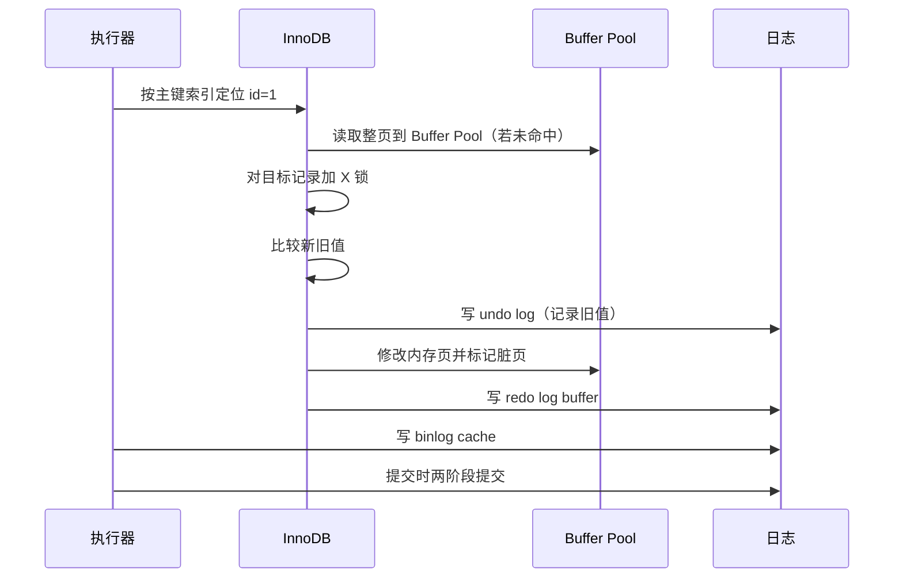
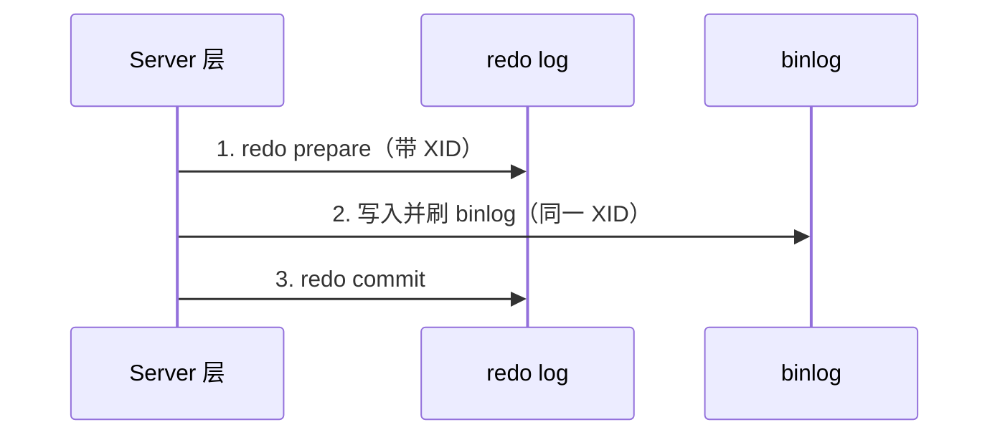

# 一条 UPDATE 语句在 MySQL 里怎么执行？

> UPDATE 的前半段像 SELECT，真正的分叉点在执行器调用 InnoDB 后：定位页、加锁、写 undo、改 Buffer Pool、写 redo、写 binlog、提交。

用这条语句做例子：

```sql
UPDATE t_user SET name = 'alice' WHERE id = 1;
```

如果只答“先写 undo，再写 redo，再写 binlog”，还是太散。更好的答法是把它放进一条执行时序里。

## Server 层先做什么？

UPDATE 也要经过 MySQL 的通用 SQL 流水线：

1. 连接器复用或建立连接，校验权限。
2. 解析器做词法、语法分析。
3. 预处理器检查表和字段是否存在。
4. 优化器选择执行计划，比如这里走主键索引。
5. 执行器开始调用存储引擎接口。

MySQL 8.0 已经移除查询缓存，所以不要把“UPDATE 清空查询缓存”写成通用流程。它只适用于 8.0 之前开启查询缓存的历史行为。

## InnoDB 真正怎么改这一行？

执行器把“按主键找 `id=1` 并修改”交给 InnoDB 后，大致是这条线：



几个细节要说清：

- Buffer Pool 按页缓存，InnoDB 不是只把目标行读进内存；默认页大小通常是 16KB。
- UPDATE 会对要修改的记录加 X 锁，锁一般到事务提交才释放。
- 如果新旧值完全相同，MySQL 可能跳过后续真实修改，但权限检查、解析、优化这些前置步骤仍然会发生。
- 数据页被改后先变成脏页，不会每次 UPDATE 都立刻刷到磁盘。

## WHERE 条件会怎么影响锁和扫描？

`UPDATE t_user SET name = 'alice' WHERE id = 1` 是最简单的主键等值更新。线上真正危险的 UPDATE，往往危险在 WHERE 条件没有精准命中索引。

| WHERE 形态            | 典型执行               | 锁风险                                 |
| --------------------- | ---------------------- | -------------------------------------- |
| 主键/唯一索引等值命中 | 精确定位一条记录       | 通常是记录锁，影响范围小               |
| 唯一索引等值未命中    | 定位插入位置           | 可能锁住目标间隙，阻止其他事务插入     |
| 普通二级索引范围      | 沿二级索引扫描，再回表 | 扫到的二级索引和聚簇索引记录都可能加锁 |
| 没走有效索引          | 扫描大量记录           | 锁范围和执行时间都会放大，容易造成阻塞 |

所以面试里答 UPDATE 流程时，要补一句：**更新不是只看“改哪一行”，还要看优化器怎么找到这一行**。同样是改一行，主键命中和无索引扫描的锁影响完全不同。

上线前可以先看执行计划：

```sql
EXPLAIN UPDATE t_user SET name = 'alice' WHERE id = 1;
```

如果是批量更新，还要特别关注 `rows`、`type`、是否使用了预期索引，以及 WHERE 条件是否会被隐式转换、函数计算或字符集转换破坏索引。

## 三种日志在时序里分别干什么？

这篇不重复展开三大日志定义，只放到 UPDATE 时序里看职责：

| 日志     | UPDATE 中的作用  | 为什么要在这个位置出现                       |
| -------- | ---------------- | -------------------------------------------- |
| undo log | 记录旧值         | 事务失败时能回滚，快照读也能沿版本链找旧版本 |
| redo log | 记录页的物理修改 | 脏页没刷盘也能崩溃恢复                       |
| binlog   | 记录事务变更     | 用于复制和基于时间点恢复                     |

注意：undo 页本身也是 Buffer Pool 里的页，写 undo 也会产生 redo。否则崩溃后连“怎么回滚”的信息都可能丢。

## 提交阶段为什么要两阶段提交？

事务提交时，redo log 和 binlog 都要参与，但它们不在同一层：

- redo log 在 InnoDB 层，决定主库崩溃恢复后这次修改是否存在。
- binlog 在 Server 层，决定主从复制和基于时间点恢复能不能看到这次修改。

如果二者只是一前一后普通写入，中间崩溃就可能出现主库恢复结果和 binlog 不一致。MySQL 用两阶段提交把它们绑在一起：



崩溃恢复时，如果遇到 redo 处于 prepare 状态，就去 binlog 里找同一个 XID：

- 找不到：说明 binlog 没完整落盘，事务回滚。
- 找得到：说明 binlog 已经对外可见，事务提交。

这就是为什么“提交成功”不能只看某一种日志。主从一致性依赖 redo 和 binlog 在提交点对齐。

## 为什么更新成功不等于数据页已经落盘？

InnoDB 用 WAL：先把 redo log 持久化，再择机刷脏页。这样一次 UPDATE 不必立刻随机写数据页，提交延迟主要受日志顺序写影响。

这能解释两个线上现象：

- 提交成功后，磁盘上的数据页可能还是旧的，但 redo log 已经足够让重启恢复到新值。
- 写入高峰时如果 redo 空间不够、checkpoint 推不动，MySQL 会被迫刷脏页，写延迟会抖动。

## 大事务为什么危险？

一条 UPDATE 改百万行，本质是一个大事务。它会同时放大：

- undo：回滚信息和 MVCC 版本链变长。
- redo：短时间写入大量物理变更。
- binlog：ROW 格式下每行变化都要记录。
- 锁：长时间持有大量行锁，阻塞其他事务。
- 主从延迟：从库要回放完整事务。

所以批量 UPDATE/DELETE 要分批执行，每批几千到几万行，结合业务低峰和主从延迟观察动态调整。

## UPDATE 慢应该先看什么？

排查更新慢，不要直接归因到“磁盘慢”。先拆成四类：

| 方向       | 现象                       | 常用观察                                                               |
| ---------- | -------------------------- | ---------------------------------------------------------------------- |
| 执行计划差 | 扫描行数远大于实际更新行数 | `EXPLAIN UPDATE`、慢日志、`rows_examined`                              |
| 锁等待     | SQL 卡住但 CPU 不高        | `SHOW PROCESSLIST`、`performance_schema.data_locks`、`data_lock_waits` |
| 日志刷盘慢 | 提交阶段抖动               | `innodb_flush_log_at_trx_commit`、`sync_binlog`、磁盘 fsync 延迟       |
| 脏页压力   | 写高峰周期性卡顿           | checkpoint 推进、redo 容量、Buffer Pool 脏页比例                       |

MySQL 8.0.30 之后 redo 容量推荐看 `innodb_redo_log_capacity`，老版本常看 `innodb_log_file_size` 和 `innodb_log_files_in_group`。如果 redo 空间太小，写高峰更容易逼着 InnoDB 刷脏页，表现为 UPDATE 延迟周期性升高。

## 小结

- UPDATE 前半段走连接、解析、预处理、优化、执行器，和 SELECT 的通用流程类似。
- 真正更新发生在 InnoDB：定位索引页、加锁、写 undo、改 Buffer Pool、写 redo。
- WHERE 条件和索引决定扫描路径，也决定锁影响范围，UPDATE 前要看执行计划。
- Buffer Pool 按页缓存，修改后数据页先变脏，不会立刻落盘。
- undo 保回滚和 MVCC，redo 保崩溃恢复，binlog 保复制和备份恢复，两阶段提交负责让 redo/binlog 对齐。
- 大事务会放大日志、锁和主从延迟，线上批量改数据必须拆批。

## 参考

基于 MySQL 8.0 Reference Manual 中 InnoDB、Optimizer、Replication、EXPLAIN、Data Types、Online DDL 等相关官方章节整理。
