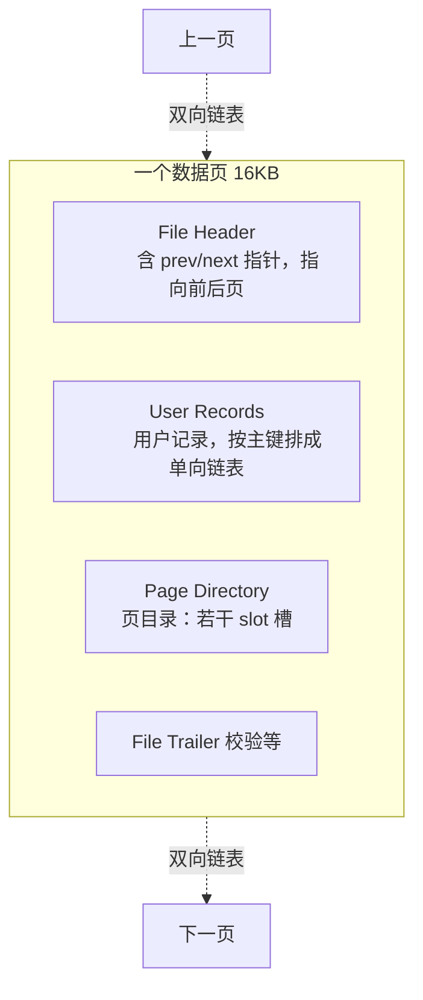

# 索引为什么用 B+ 树？单表多少行该分表？

> 一句话点题：MySQL 的数据在磁盘上，磁盘慢得离谱，所以索引的全部目标就是“用最少的磁盘 IO 次数把数据捞出来”。树的高度约等于 IO 次数，B+ 树就是被刻意压成“矮胖”的那棵树。

面试里这道题经常被问成“为什么用 B+ 树”，但它真正想考的是你脑子里有没有一条逻辑链：**瓶颈是磁盘 IO → IO 次数 ≈ 树高 → 怎么把树压矮 → 一步步淘汰别的结构 → 最后落到 B+ 树**。下面我就按这条链子，像在白板上给同事讲一样捋一遍。

## 先搞清楚为什么纠结磁盘 IO

内存访问是纳秒级，磁盘访问是毫秒级，差了几万倍甚至几十万倍。MySQL 的数据（索引 + 记录）都持久化在磁盘上，断电不丢。所以你查一行数据，本质是“从磁盘把相关的页搬到内存，再比较”。**搬一次就是一次 IO，IO 越多越慢。**

再补一个关键前提：树存在磁盘上，**访问一个节点就对应一次磁盘 IO**（前提是节点大小不超过一次 IO 能读的量）。把这两点连起来就得到那句核心结论：

> 树有多高，查一条数据最多就要做多少次磁盘 IO。

所以一个“好的索引结构”至少要满足两条：

1. 能用尽量少的 IO 定位单条记录；
2. 范围查询也要快（MySQL 大量是 `where id between ...`、`order by`、分页这种）。

记住这两条，下面淘汰其他结构就有标准了。

## 一步步淘汰：为什么不用别的树

### 数组 / 二分查找：查得快，但改不动

有序数组配二分查找，单点查询是 O(log n)，看着挺香。问题出在写：插入一个元素要把后面所有元素整体后移一位。这事如果发生在磁盘上就是灾难——磁盘本来就慢，还要挪一大片。所以线性结构直接出局。

### 二叉查找树（BST）：会退化成瘸子

把二分查找用到的中间节点用指针串起来，就成了二叉查找树：左子树都比它小，右子树都比它大，查找时不用算中间位置，直接比大小往下走，插入也不用挪数据。

但它有个致命的极端情况：**如果插入的值一直是当前最大的（比如自增 id 顺序插），它会退化成一条链表**，查找直接从 O(log n) 掉到 O(n)，树高 = 元素个数 = IO 次数爆炸。出局。

### 平衡二叉树 / 红黑树：不退化了，但还是太高

AVL 树加了约束（左右子树高度差不超过 1），红黑树用染色 + 旋转维持近似平衡，都能把查询稳在 O(log n)，解决了退化问题。

但它们的根本毛病改不了：**还是二叉，每个节点只有 2 个孩子**。元素一多，树就长得很高。一棵高度为 5 的平衡树，查最底层就要 5 次磁盘 IO。

那解法其实已经呼之欲出了：**别让一个节点只生 2 个孩子，让它生 M 个**。同样的节点数，分叉越多，树越矮。这就是从二叉走向多叉的动机。

### B 树：矮了，但非叶子节点“夹带私货”

B 树就是 M 叉树（M 叫阶），一个节点可以有 M 个孩子、M-1 个 key，满了就分裂。树一下子矮了很多，IO 次数大降，比平衡二叉树强。

但 B 树有两个让它在“数据库索引”这个场景里不够理想的点：

- **每个节点既存索引 key、又存这一行的完整记录**。可一行记录往往比 key 大得多。结果是单个 16KB 的页里，能塞下的分支（key + 指针）变少了——分叉数被记录数据挤掉了，树又会被迫长高一点。而且你查 A 记录时，路过的那些“非 A 节点”里的整行数据也会被一起读进内存，纯属浪费 IO 和内存。
- **范围查询难受**：B 树要范围查只能中序遍历，在树里上上下下跳，涉及多个节点的 IO，慢。

所以 B 树不是不能用（MongoDB 这种以单点查询为主的就用类 B 树），但对“又要范围查、又要省 IO”的关系型数据库，还差一口气。

### B+ 树：把数据全赶到叶子，叶子再串成链表

B+ 树是对 B 树的针对性升级，差异就三刀，刀刀打在上面的痛点上：

| 维度         | B 树                         | B+ 树                                      |
| ------------ | ---------------------------- | ------------------------------------------ |
| 数据放哪     | 每个节点都存记录             | **只有叶子节点存记录**，非叶子只存索引 key |
| 索引出现位置 | 散落在各层                   | 所有 key 都会在叶子出现，非叶子是冗余索引  |
| 叶子之间     | 没有横向连接                 | **叶子用（双向）链表串起来**               |
| 单点查询     | 可能在非叶子就命中，快慢不稳 | 一律走到叶子，稳定                         |

这三刀带来的好处，正好对上前面那两条标准：

- **更矮 → IO 更少**：非叶子节点不存记录、只存 key + 指针，所以同样 16KB 的页能塞下多得多的分支。分叉越多，树越矮，单点查询的 IO 次数就越少。这是 B+ 树对 B 树最核心的优势。
- **范围查询 / 排序起飞**：要查 12 月 1 日到 12 月 12 日的订单，先定位到 12 月 1 日所在的叶子，然后**顺着叶子链表往右一路扫**到 12 月 12 日就行，不用再回到根节点重新往下找。`order by`、分页同理，叶子本身就是有序链表。
- **查询稳定**：B 树可能在非叶子就命中、也可能要到叶子，单点查询耗时忽快忽慢；B+ 树永远走到叶子才拿到数据，每次 IO 次数基本一致，性能可预测。
- **增删更平滑**：非叶子全是冗余索引，删叶子时往往不用动上层结构，分裂/合并最多影响一条路径，比 B 树那种动根节点就满树变形要稳。

> 小提醒：原始资料说“单点查询 B 树平均比 B+ 树稍快”，这话要辩证看。理论上 B 树有概率在非叶子提前命中，但在 InnoDB 这种“非叶子节点常驻 Buffer Pool、真正吃 IO 的是叶子”的现实里，B+ 树更矮、叶子定位更稳，综合表现通常更好。别把“理论平均”当成“实际更快”。
>
> 还有个易混点：资料里说“非叶子节点有多少子节点就有多少索引”，这是 **MySQL/InnoDB 的实现习惯**；而教科书/维基百科常见定义是“M 个子节点对应 M-1 个索引”。两种说法都对，只是来源不同，面试时点一句“这取决于定义口径”就够了。

## 换个视角：每个 B+ 树节点其实就是一个数据页

只讲结构还不够，得知道节点里到底装了啥。InnoDB 读写的最小单位不是“行”而是“页”，**一页默认 16KB**。**B+ 树的每个节点，就是一个数据页。**

一个数据页大致长这样（7 个组成部分，挑重点说）：

几个关键点：

- **页内记录按主键排成单向链表**：插入删除方便，但纯链表检索是 O(n)，所以还需要页目录。
- **页目录 = 一堆 slot（槽）**：把页内记录分组，每个槽指向一组里主键最大的那条记录。因为记录按主键有序，所以**先在槽上二分**定位到组，再在组内顺序扫几条（InnoDB 规定每组就 4~8 条，第一组 1 条、最后一组 1~8 条），整体很快。
- **页与页之间用双向链表连**：靠 File Header 里的 prev/next 指针。物理上不连续没关系，逻辑上连续就行——叶子链表的范围查询就是靠这个。

所以一次查询的完整动作是：**从根页二分定位到下一层的页 → 一层层往下 → 到叶子页 → 页内用槽二分定位分组 → 组内顺序扫到目标行**。每下一层就是一次磁盘 IO（如果该页不在内存里）。

> 顺带把聚簇索引和二级索引点一下：聚簇索引的叶子放整行数据（一张表必有且只有一个）；二级索引的叶子放主键值，查到主键后还要回聚簇索引取整行，这一步叫**回表**；如果要查的列二级索引里就有（比如只查主键），不用回表，叫**索引覆盖**。

## 用树高推算单表能放多少行

理解了“节点 = 16KB 页”，就能反过来估算一棵 B+ 树到底能装多少数据。公式很简单：

> **总行数 ≈ x^(z-1) × y**
>
> x = 非叶子页能放多少个指针（分叉数）
> y = 叶子页能放多少行数据
> z = 树的层数

**算 x（非叶子页的分叉数）**：页 16KB，扣掉 File Header、Page Header、Infimum/Supremum、File Trailer、页目录等固定开销约 1KB，剩 15KB 装索引项。非叶子页里一条索引项 = 主键 + 页号。假设主键是 `bigint`（8 字节），页号固定 4 字节，一条就是 12 字节。

$$x \approx \frac{15 \times 1024}{12} \approx 1280$$

**算 y（叶子页能放多少行）**：叶子页同样约 15KB 放真实行数据。这一项波动很大，取决于行的大小。先按一行 1KB 估：

$$y \approx \frac{15 \times 1024}{1000} \approx 15$$

**代进公式**：

| 层数 z | 计算       | 总行数                       |
| ------ | ---------- | ---------------------------- |
| 2 层   | 1280¹ × 15 | 19,200（约 1.9 万）          |
| 3 层   | 1280² × 15 | 24,576,000（约 **2457 万**） |

看到没——3 层 B+ 树差不多就是 2400 万行，**这正是“单表别超 2000 万”这个经验值的由来**。一般 B+ 树就到 3 层，再往上到 4 层会变成 1280³ × 15 ≈ 300 多亿行，那个量级既不现实、查询又要多一次 IO，所以 3 层是个甜点。

## 2000 万不是红线，是“保持 3~4 次 IO”的副产品

这个数字千万别背成硬指标，它的本质是：**在保持树为 3 层（也就是查询稳定在 3~4 次 IO）的前提下，单表大概能装多少**。它跟行的大小强相关：

| 单行大小 | 叶子页能放 y 行 | 3 层总行数（1280² × y） |
| -------- | --------------- | ----------------------- |
| 1 KB     | ≈ 15            | ≈ 2457 万               |
| 5 KB     | ≈ 3             | ≈ 491 万                |

同样保持 3 层，行从 1KB 涨到 5KB，能装的就从 2400 万掉到 500 万。**行越大，单页放得越少，红线越低。** 反过来，行很小（比如一张窄表），单表撑到三四千万也未必有问题。

所以更准确的说法是：当数据量大到 B+ 树要长到第 4 层、或者大到索引装不进 Buffer Pool（查询开始频繁打磁盘）时，性能才会明显下降。2000 万只是一个“1KB 行 + 3 层”凑出来的整数经验值，影响因素还有 MySQL 版本、服务器配置、SQL 写法、内存大小等。把它当“该开始关注分库分表了”的信号，而不是“到点必须拆”的法律。

## 容易踩的坑

- **把“树高 = IO 次数”说漏**：这是整道题的题眼，没有它，后面所有“矮胖”的论证都悬空。
- **混淆 B 树和 B+ 树的数据位置**：B 树每个节点都存记录，B+ 树只有叶子存记录、非叶子全是冗余索引。这点说反就全错了。
- **以为 2000 万是硬上限**：它是经验估算，跟单行大小直接挂钩，行大就该往下调。
- **忘了范围查询靠叶子链表**：很多人只会说“B+ 树矮所以快”，漏掉范围/排序这个 B+ 树相对 B 树的杀手锏。
- **把 x≈1280、y≈15 当成精确值背**：这些是基于“1KB 固定头 + bigint 主键 + 1KB 行”的估算，换个假设数字就变了，理解推导过程比记数字重要。

## 小结

- 磁盘 IO 是瓶颈，**树高 ≈ 查询的 IO 次数**，索引的目标就是把树压矮压胖。
- 淘汰链：数组（改不动）→ BST（会退化）→ 平衡树/红黑树（不退化但太高）→ B 树（多叉变矮但非叶子夹带记录）→ **B+ 树**（数据全在叶子、叶子链表串联）。
- B+ 树四大好处：**更矮（IO 少）、叶子链表让范围/排序快、单点查询稳定走到叶子、非叶子只存 key 所以单页能塞更多分叉**。
- 每个 B+ 树节点就是一个 16KB 数据页：页内记录按主键排链表、用页目录 slot 二分、页间用双向链表连。
- 3 层 B+ 树按 1KB 行估算约 2457 万行，这就是“单表 2000 万”的来历；它**不是红线**，行越大上限越低，本质是“保持 3~4 次 IO”。

## 参考

- 《MySQL 单表不要超过 2000W 行，靠谱吗？》（原文 https://my.oschina.net/u/4090830/blog/5559454 ）
- MySQL 官方文档：How MySQL Uses Indexes
