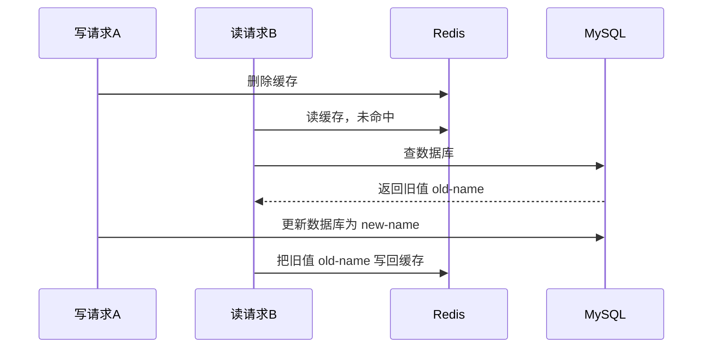

# 如何保证缓存和数据库一致性？

> 这道题真正想问的，不是你会不会背“先更新数据库再删缓存”，而是你知不知道它为什么这么选、它并不绝对安全、出了故障该怎么补。

很多人一上来就说：“缓存一致性嘛，Cache Aside，更新数据库后删除缓存。”这句话不能算错，但只说到这里，面试官基本都会继续追问：

- 为什么不是更新缓存？
- 为什么不是先删缓存再更新数据库？
- 更新数据库后删缓存就万无一失了吗？
- 如果删缓存失败怎么办？

这篇就把这条链路完整讲透。你会发现，所谓“保证一致性”，绝大多数业务里说的其实都是**尽量缩小不一致窗口，并把异常场景补齐，最终达到最终一致**，而不是像事务那样追求强一致。

## 先把目标说准：大多数场景追求的是最终一致

只要你把 Redis 当缓存，而不是唯一数据源，数据库才是最终真相。缓存的职责是抗读流量、降延迟，不是独立承担一致性语义。

所以这道题第一句话最好先立边界：

| 场景                       | 一致性目标     | 常见做法                                         |
| -------------------------- | -------------- | ------------------------------------------------ |
| 商品详情、用户资料、配置项 | 最终一致       | Cache Aside + 过期时间 + 异常补偿                |
| 库存、余额、优惠券扣减     | 强一致要求更高 | 减少缓存参与，或把关键写路径收敛到数据库/队列/锁 |
| 热点计数、榜单、埋点聚合   | 允许短暂不一致 | Redis 先抗流量，再异步落库                       |

如果面试时不先把这个边界说出来，后面所有方案都会被追着问：“那是不是还能读到旧值？”答案通常是：**能，只是概率、窗口和容忍度不同。**

## 为什么一般不直接更新缓存，而是删除缓存

很多人的第一反应是：数据库改了，那我把缓存也改掉不就完了？问题在于，真实项目里“更新缓存”比“删除缓存”更容易出事。

先看一个并发写场景。假设商品价格原来是 100：

1. 请求 A 要把价格改成 120。
2. 请求 B 要把价格改成 150。
3. A 先更新数据库为 120。
4. B 再更新数据库为 150。
5. B 把缓存更新为 150。
6. A 因为网络抖动或线程调度更晚，最后把缓存更新为 120。

结果就是：数据库里是 150，缓存里却回退成了 120。

所以“更新数据库 + 更新缓存”有两个天然问题：

- 写路径更重：你不仅要改库，还要构造和写回缓存对象。
- 并发更脆弱：两个写请求谁最后落到缓存，不一定和数据库提交顺序一致。

删除缓存就简单很多。写请求只做一件轻量操作：**把旧缓存清掉**。下次有人来读，再按最新数据库结果回填。

这也是旁路缓存（Cache Aside）能成为默认方案的原因。

## Cache Aside 到底是怎么工作的

Cache Aside 其实就是把“读缓存”和“写数据库”拆开看：

### 读

1. 先查 Redis。
2. 命中就直接返回。
3. 没命中就查数据库。
4. 把数据库结果回填到 Redis。
5. 返回结果。

### 写

1. 先更新数据库。
2. 再删除 Redis 里的对应 key。

这个策略的关键不是“删缓存”三个字，而是**谁是主数据源**。Cache Aside 的本质是：数据库负责正确性，缓存负责加速，缓存永远允许被动重建。

## 为什么不能先删缓存，再更新数据库

这是最经典的坑，而且很好举例。

假设用户昵称原来是 `old-name`，现在请求 A 要把它改成 `new-name`：

最后数据库里是新值，缓存里却被读请求重新写回旧值，这个脏数据可能会一直存在到缓存过期。

所以“先删缓存，再更新数据库”的问题，不在删缓存本身，而在于它给并发读请求打开了一个窗口：**读请求可能趁数据库还没更新时，把旧值重新种回缓存。**

## 为什么大家都选先更新数据库，再删除缓存

因为两种顺序里，它的风险更小。

还是看一个读写并发场景。假设缓存里原本没有这条数据：

1. 读请求 A 查 Redis，未命中。
2. A 去数据库查到旧值，还没来得及写回缓存。
3. 写请求 B 把数据库更新成新值，并删除缓存。
4. A 把刚才查到的旧值写回缓存。

看起来还是会不一致，对吧？没错，**先更新数据库，再删除缓存也不是绝对安全的**。这一点很多资料会讲得太绝对，甚至直接说它“可以保证一致性”，这其实不严谨。

准确说法应该是：

- 它仍然存在不一致窗口。
- 但这个窗口通常比较短，需要“读旧值”和“写请求完成更新删缓存”刚好撞上。
- 相比“先删缓存再更新数据库”，它更不容易把旧值长时间留在缓存里，所以工程上更常用。

面试时最好把这句话说完整：**这不是强一致方案，而是现实系统里性价比最高的最终一致方案。**

## 删除缓存失败，才是线上真正麻烦的地方

前面的并发时序问题，很多团队靠“概率低、TTL 兜底”也许还能扛一阵。真正容易把故障放大的，往往是第二步根本没做成。

比如你已经把数据库从 `1` 改成 `2` 了，但删 Redis 时超时了、网络断了、线程异常退出了，那么缓存里可能还一直保留旧值 `1`。

这时问题就不是“短暂读到旧值”，而是：

- 只要这个 key 还没过期，读流量就会稳定命中旧缓存。
- 业务看起来像“数据库明明改了，但页面迟迟不生效”。

所以真正的重点是：**怎么提高“更新数据库后删缓存”这一步的成功率，以及失败后怎么补。**

## 常见补偿手段怎么选

### 1. 重试 + 告警，是最基本的兜底

如果删除缓存失败，至少要有重试机制。

常见做法是：

1. 先更新数据库。
2. 删除缓存。
3. 如果删除失败，记录日志并进入重试队列。
4. 后台任务继续删，重试多次还失败就告警。

这套方案适合大多数业务，因为实现成本低，能覆盖瞬时故障，比如 Redis 抖动、网络闪断、线程池满了。

要注意两个工程点：

- 删除缓存要设计成幂等操作，重复删同一个 key 没问题。
- 告警不能省，否则重试一直失败你根本不知道。

### 2. 用 MQ 异步补偿，适合把失败处理从主链路拆出去

如果你不想让业务线程承担太多补偿逻辑，可以把“删缓存任务”投递到消息队列：

1. 业务线程更新数据库。
2. 发送一条“删除某个缓存 key”的消息。
3. 消费者执行删除。
4. 失败则重试、进入死信队列或人工处理。

它的好处是把补偿链路做标准化了，缺点是系统复杂度会上升，而且你仍然要面对消息投递失败、重复消费这些问题。

所以它不是“用了 MQ 就自动一致”，而是让补偿机制更可控。

### 3. 订阅 binlog 做最终修正，适合重要核心数据

再往前走一步，可以把数据库变更日志作为事实来源。比如通过 Canal 之类的方式订阅 MySQL binlog，在监听到某条记录变更后，再去删除或刷新对应缓存。

这个思路的价值在于：

- 业务线程只要把数据库事务提交成功，后面就一定能从 binlog 里看到这次变更。
- 即使应用层那次删缓存漏掉了，后面也有机会被 binlog 订阅链路再修正一次。

但代价也很明显：

- 你得维护字段到缓存 key 的映射关系。
- 解析 binlog、消费变更、定位缓存 key 都会增加系统复杂度。
- 时延通常高于主链路直接删缓存，所以它更适合“补偿修正”，不适合拿来吹成实时强一致。

## 延迟双删怎么看

很多资料喜欢把延迟双删当面试标准答案，但它其实更像一个经验性补丁。

所谓延迟双删，就是：

1. 先删缓存。
2. 更新数据库。
3. 休眠一小段时间。
4. 再删一次缓存。

它想解决的是“先删缓存再更新数据库”时，读请求把旧值回填进缓存的问题。第二次删除，确实有机会把这个旧值再清掉。

但它有两个明显问题：

- 睡多久没有标准答案，太短可能来不及，太长又拖慢链路。
- 它本质上还是在赌时序，只是把命中概率往下压，不是严格保证。

所以延迟双删可以知道，但别把它说成银弹。大多数情况下，还是**先更新数据库，再删缓存，再配补偿机制**更稳。

## 业务里到底该怎么落

如果面试官问“项目里怎么做”，不要只答一句策略名，最好直接按业务分层说：

### 读多写少，允许短暂不一致

这是最典型的 Redis 缓存场景，比如商品详情、用户资料、运营配置。

可以直接用：

- Cache Aside
- 更新数据库后删除缓存
- 合理 TTL
- 删除失败重试或 MQ 补偿

### 写很多，缓存命中率非常重要

如果每次写都删缓存，可能导致频繁 miss，数据库压力反而上来。

这时有些团队会选择“更新数据库后同步更新缓存”，但前提是你已经准备好处理并发覆盖问题，比如：

- 按 key 串行化更新
- 加分布式锁
- 用版本号/CAS 防止旧值覆盖新值

这种方案不是不能做，而是复杂度明显比删缓存高，别把它当默认方案。

### 一致性要求极高

比如余额、库存、资格校验这类场景，如果错一次代价很大，那重点就不该是“怎么把缓存玩到极致”，而是**尽量别让缓存介入关键写判断**。

常见做法反而是：

- 关键写路径只认数据库或强约束存储
- 缓存只做非关键读优化
- 必要时接受性能下降，换正确性

这才是工程判断，不是所有地方都该套 Redis。

## 面试里最容易答错的几个点

### “先更新数据库，再删除缓存”能保证强一致吗？

不能。它只能说是工程上更常用、更稳妥的最终一致方案。

### “删除缓存失败不是有过期时间吗？”

TTL 只是兜底，不是主方案。过期时间过长会让脏数据持续更久，过短又会影响命中率。

### “是不是一定比更新缓存好？”

也不是。对于某些超热点且写后立刻要读到新值的场景，确实可能选择更新缓存，但那通常需要更强的并发控制和版本管理。

## 小结

- 大多数“缓存一致性”问题，追求的是最终一致，不是强一致。
- 默认方案通常是 Cache Aside：读时缓存未命中再回填，写时先更新数据库再删除缓存。
- “先更新数据库，再删除缓存”并不绝对安全，只是比“先删缓存再更新数据库”风险更低。
- 真正要重点防的是删缓存失败，所以要有重试、MQ 补偿或 binlog 订阅修正。
- 延迟双删可以了解，但它不是银弹；一致性要求特别高时，应该先考虑减少缓存介入关键路径。

## 参考

- 综合多份 Redis 缓存一致性资料重写，并补充了双写时序、删除缓存顺序和失败补偿的边界说明。
- 结合常见缓存读写策略的工程实践，对 Cache Aside、延迟双删和最终一致性的表述做了收敛与修正。
