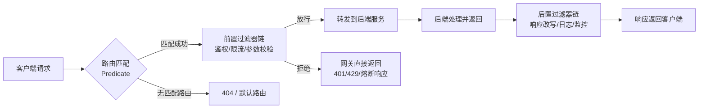
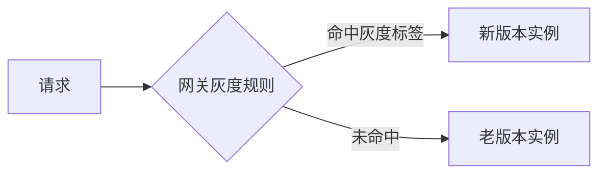
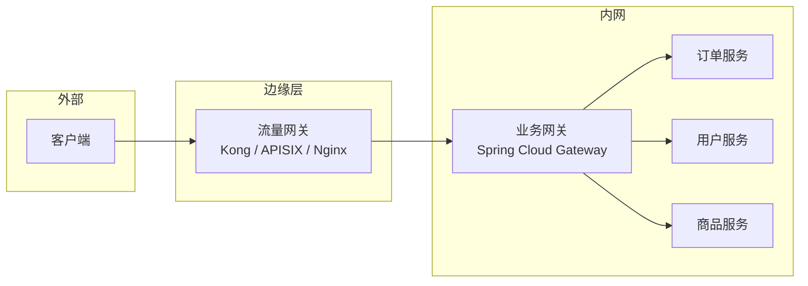
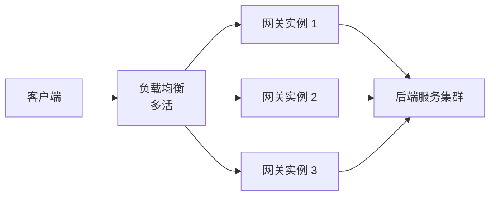

# API 网关做了什么？鉴权、限流、路由为什么放在入口？

> 面试里问“网关有什么用”，很多人会背一串功能清单：路由、鉴权、限流、熔断……清单没错，但更容易被追问的是：为什么这些事要放在网关这一层做，而不是各自的服务里？网关又为什么不能什么都做？

## 先想一个问题：没有网关会怎样

假设一个系统拆成了订单、用户、商品、支付四个微服务，客户端要直接对接它们。马上会遇到几件麻烦事：

- 每个服务都要自己写一遍登录校验、签名校验。
- 每个服务都要自己接限流组件，规则还可能不一致。
- 客户端要知道四个服务各自的地址、端口，还要处理服务下线、扩容带来的地址变化。
- 想统一看一眼"今天多少请求失败了"，得去四个服务分别翻日志。

这些事本质上和订单、用户、商品的业务逻辑没关系，纯粹是"进门要做的公共动作"。网关做的就是把这些公共动作收敛到一个入口，业务服务只管自己的业务。

可以类比小区的门禁前台：门禁核对身份、控制进出节奏，但不会替你决定去几楼找谁办事——那是各个"业务楼层"自己的事。

## 网关到底是什么

**API 网关（API Gateway）是客户端和后端服务之间的统一入口**，所有外部请求先到网关，网关判断该转发给哪个服务，转发前后还能做一堆通用处理。

拆开看，网关做的事可以归成两类：

| 职责     | 说的是什么                 | 典型手段                     |
| -------- | -------------------------- | ---------------------------- |
| 请求转发 | 把请求送到正确的目标服务   | 路由匹配、负载均衡、协议转换 |
| 请求过滤 | 请求到达服务前后做统一处理 | 鉴权、限流、熔断、日志       |

网关自己不产出业务结果，它是一层"通道 + 关卡"。

## 一个请求进网关之后经历了什么



关键点只有两个：

1. **路由先判断该去哪**：按路径、host、header 等条件匹配到具体服务，匹配不上就直接拦下，不会白白转发一次。
2. **过滤器链能在请求真正到达业务服务之前就把它挡住**：鉴权失败、被限流、参数不对，网关自己就把响应吐回去了，业务服务根本不会收到这个请求。这也是网关能保护后端服务的原因——脏请求、超量请求先被过滤掉一批。

## 核心能力逐个讲

### 路由：网关最基础的活

路由回答的是"这个请求该转发给谁"。常见匹配维度：

```text
Path=/api/order/**        按路径前缀匹配到订单服务
Method=GET                按 HTTP 方法匹配
Header=X-Tenant, vip.*    按请求头匹配，做多租户分流
```

生产上路由规则通常不是写死在配置文件里重启生效，而是配合注册中心（Nacos、Eureka）动态拉取服务列表，服务上下线、扩缩容网关能自动感知，不用人工改配置、重启网关。

### 鉴权：能拦的请求不要放进内网

网关层鉴权解决的是"这个请求到底是谁发的、有没有资格进来"，常见做法是校验 Token（JWT、OAuth2）、校验签名、做基础的黑白名单。

要注意的是，网关鉴权解决的是**身份认证**（Authentication，你是谁）和**粗粒度授权**（Authorization，你能不能访问这个接口），不是"你能不能看这条订单数据"这种**细粒度业务授权**——那需要结合具体业务数据判断，应该留给业务服务自己做。网关把明显没资格进门的请求挡在外面，省得它们浪费内网资源。

### 限流熔断：保护后端不被打垮

限流控制的是"某个时间窗口内最多放多少请求进来"，熔断控制的是"下游已经不行了，就别再往它身上加压"。两者经常放在一起讲，但机制不同：

| 机制 | 解决什么问题                           | 常见实现                                                           |
| ---- | -------------------------------------- | ------------------------------------------------------------------ |
| 限流 | 控制流量峰值，防止打垮自己或下游       | 令牌桶、漏桶，网关内置或接 Sentinel                                |
| 熔断 | 下游已经出问题时快速失败，避免连锁故障 | 失败率统计 + 状态机（关闭/打开/半开），常接 Sentinel、Resilience4j |

具体的限流算法选型、单机限流和分布式限流的取舍，属于另一个专题，这里不展开，可以参考 [限流怎么选：令牌桶、漏桶、滑动窗口？](/high-availability/high-availability-rate-limiting.html)。这里只需要记住一点：**限流放在网关这一层，是因为它离流量入口最近，能在请求进入内网之前就把多余的流量挡住**，如果等请求打到某个业务服务内部才限流，前面的网络和网关处理开销已经白花了。

### 灰度发布：网关是分流的天然位置

网关知道每个请求的来源信息（用户 ID、设备、header），也知道后端有哪些服务实例、哪些版本，天然适合做灰度路由：把一部分流量按规则（比如用户尾号、灰度标签）转发到新版本实例，其余走老版本。



网关能做的是最基础的一种灰度（按规则分流），更复杂的灰度策略（按指标自动回滚、多维度灰度、金丝雀分析）通常需要配合发布平台一起做。这块内容可以看 [灰度发布、金丝雀和蓝绿怎么落地？](/distributed-system/distributed-gray-release.html)。

### 协议转换：屏蔽后端的技术栈差异

客户端只会说 HTTP/JSON，但后端服务可能有的用 Dubbo、有的用 gRPC、有的走消息队列。网关可以在入口统一转成客户端能理解的协议，后端服务之间用什么协议是内部的事，不需要暴露给外部。

### 日志监控：统一的观测入口

所有请求都过网关，这里天然是做统一日志、链路追踪、指标采集的好位置：请求量、响应时间、错误率、每个路由的流量分布，在网关一层就能看全局，不用去每个服务分别拼。

## 网关不该做什么：警惕"巨石网关"

网关能力越加越多，最容易踩的坑是把业务逻辑也塞进网关，比如：

- 在网关里做多个服务接口的响应聚合、字段拼装。
- 在网关里写复杂的业务规则校验。
- 在网关里维护和具体业务强相关的细粒度权限判断。

这么做的后果是网关变成了一个"谁都要改、谁都不敢碰"的巨石应用：任何一个业务方要加个字段、改个逻辑，都得改网关代码、走网关发布流程，网关团队成了全公司的瓶颈，网关本身的稳定性也被业务代码的 bug 拖累。

更合理的分工：

| 层               | 该做什么                                             | 不该做什么                       |
| ---------------- | ---------------------------------------------------- | -------------------------------- |
| API 网关         | 协议级、通用型、跨服务的能力：路由、认证、限流、日志 | 复杂业务编排、强业务规则、长事务 |
| BFF / GraphQL 层 | 面向特定客户端的响应聚合、字段裁剪                   | 承担网关的基础设施职责           |
| 业务服务         | 具体业务逻辑、细粒度权限、事务处理                   | 重复实现认证、限流这类通用能力   |

一句话记：**网关做"进门要做的事"，业务编排和聚合应该回到 BFF 或业务服务，不要沉淀在基础设施层。**

## 双层网关：南北向和东西向

系统规模变大之后，单一网关往往同时承担了两类完全不同性质的流量：

- **南北向流量**：外部客户端进来的流量，需要 SSL 终止、WAF、全局限流、IP 黑白名单这类偏基础设施的能力。
- **东西向流量**：内部服务之间调用的流量，更关心细粒度路由、灰度、服务发现、业务侧可观测性。

这两类关注点差异很大，混在一层网关里容易互相干扰：内网的灰度规则改动，不该影响外部流量的稳定性；外部的 WAF 策略调整，也不该经过内部业务团队审批。中大型系统常见做法是拆成两层：



- **流量网关**：部署在边缘，负责 SSL 终止、WAF、全局限流、协议适配，常用 Kong、APISIX、Nginx/OpenResty、Envoy。
- **业务网关**：部署在内网，负责微服务路由、细粒度鉴权、灰度、业务侧观测，常用 Spring Cloud Gateway 或自研网关。

小系统、单一业务域没必要一上来就拆两层，单层网关更简单；等外部流量治理和内部业务路由的职责开始互相干扰了，再拆也不迟。如果团队已经全面上了 Service Mesh，也可以考虑直接用 Envoy/Istio Ingress 承担南北向入口，减少代理层级。

网关和服务发现之间也有直接关系：业务网关做动态路由，很大程度上依赖注册中心（Nacos、Eureka、Consul）提供的服务列表和健康状态，网关本质上是注册中心信息的一个消费方。

## 网关自己的高可用和性能代价

引入网关之后，请求路径上多了一跳，同时网关自己也成了新的单点。这两点都要正面回答：

**性能损耗**：多一次网络转发，在内网环境下通常可以忽略，但网关做的鉴权、限流、日志这些处理也会带来 CPU 开销，路由数量、过滤器链长度、请求体大小都会影响吞吐，具体数值要靠压测，不能凭感觉估。

**高可用**：网关是全部流量的必经之路，一旦挂了影响面是全局性的，所以网关本身必须做成无状态、可水平扩展的集群，前面再挂一层负载均衡（Nginx 或云厂商 LB）做流量分发，负载均衡自身也要考虑多活，避免又变成新的单点。



## 常见网关怎么选：点到为止

| 网关                 | 定位                               | 什么时候选它                                                  |
| -------------------- | ---------------------------------- | ------------------------------------------------------------- |
| Spring Cloud Gateway | Java 技术栈的业务网关              | 已经是 Spring Cloud 生态，要和 Eureka/Nacos/Config 无缝集成   |
| Kong                 | 基于 OpenResty 的通用网关          | 插件生态成熟、需要多语言插件开发能力                          |
| APISIX               | 基于 OpenResty + etcd 的云原生网关 | 追求路由动态热更新、云原生部署、和 Prometheus/SkyWalking 集成 |

三者的性能差异高度依赖版本、部署拓扑、插件链长度这些具体因素，不建议直接照搬任何一方的宣传数据，选型前最好按自己的真实流量画像做一次基准测试，重点看 P99 延迟和错误率，而不是只看 QPS 峰值。

Spring Cloud Gateway 内部值得记住的两点：一是它基于 Spring WebFlux（Reactor + Netty），异步非阻塞，性能明显好于早期 Zuul 1.x；二是它内置的限流过滤器 `RequestRateLimiter` 只是一个简单实现，真要做生产级限流，常见做法是接入 Sentinel 这类专门的流控组件。

## 一个容易说错的点：Zuul 还能用吗

面试里经常有人把 Zuul 当成"现在还在用的主流网关"来讲，这个说法需要纠正一下：

- **Zuul 1.x** 基于 Servlet 同步阻塞架构，性能有限，且 Spring Cloud Netflix 生态（Zuul 1.x、Ribbon、Hystrix）早已进入维护模式，官方不再推荐新项目使用。
- **Zuul 2.x** 虽然基于 Netty 做了异步化改造，性能大幅提升，但它没有被集成进 Spring Cloud 主流发行版，实际上属于 Netflix 自己的存量技术栈。

所以准确的说法是：**新项目不建议再选 Zuul 1.x，Spring Cloud 技术栈下 Spring Cloud Gateway 是更主流的选择；存量用着 Zuul 1.x 的老项目，应该结合重构窗口逐步往 Spring Cloud Gateway 或其他现代网关迁移**，而不是简单说"Zuul 性能差所以被淘汰了"——真正的原因是生态维护状态，不只是性能。

## 面试里怎么组织这个答案

按这条线回答比较完整：

1. **先说网关是什么**：客户端和后端服务之间的统一入口，核心是转发 + 过滤两件事。
2. **展开核心能力**：路由、鉴权、限流熔断、灰度、协议转换、日志监控，能各举一个具体例子最好。
3. **划清边界**：网关不该做复杂业务编排和聚合，那是 BFF / GraphQL 层或业务服务的事，避免"巨石网关"。
4. **谈规模化**：中大型系统常见双层网关（流量网关 + 业务网关），网关自己要考虑高可用和性能损耗。
5. **选型有判断**：Spring Cloud Gateway / Kong / APISIX 各自适合什么场景，性能结论建议压测而不是背数字。

## 小结

1. API 网关的本质是统一入口，核心职责就是请求转发和请求过滤链，其余功能都是围绕这两件事展开的。
2. 路由、鉴权、限流熔断、灰度、协议转换、日志监控是网关最常被问到的能力，每一项都对应"为什么放在入口做更合适"这个理由。
3. 网关不是万能容器，复杂业务编排、强业务规则应该回到 BFF 或业务服务，避免演化成难维护的巨石网关。
4. 规模大了之后常见拆成流量网关（南北向）和业务网关（东西向）两层，各自关注点不同。
5. 网关自己是流量必经之路，必须做成无状态集群 + 前置负载均衡来保证高可用，性能影响要靠压测说话。
6. Zuul 1.x 已进入维护模式，新项目不建议再选，这是生态维护状态问题，不只是性能问题。

## 参考

综合自仓库内 API 网关与 Spring Cloud Gateway 参考材料，并结合 Spring Cloud Gateway、Kong、APISIX 官方文档中关于网关职责边界、双层网关架构和 Zuul 维护模式的说明整理。

<!-- @include: @article-footer.snippet.md -->
