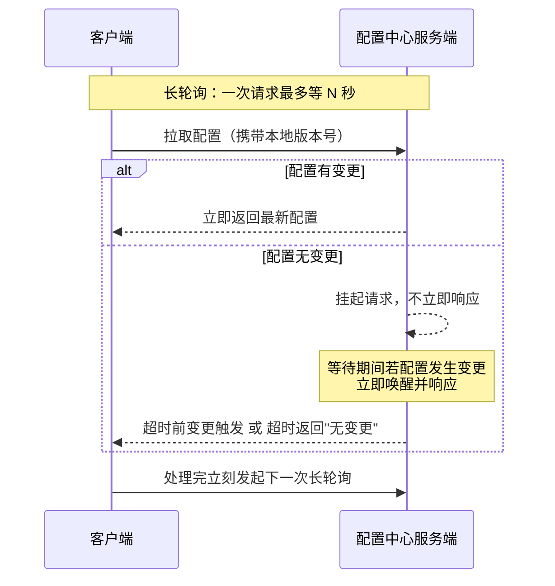
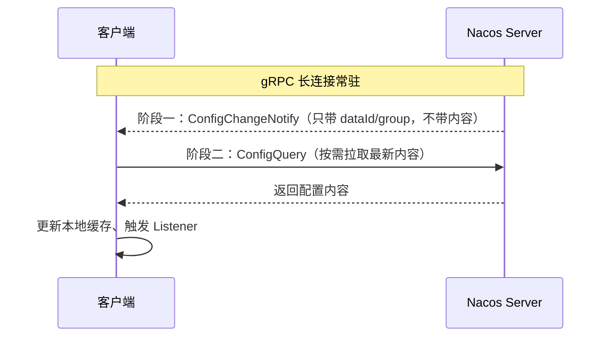
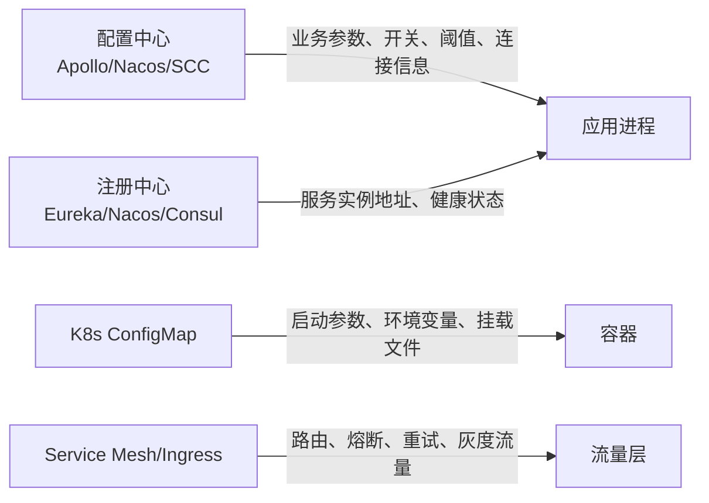

> 面试官问"配置中心解决什么问题"，很多人第一反应是"改配置不用重启"。这只答对了三分之一——真正的痛点是多环境配置管理、敏感信息隔离、配置变更和代码发版解耦。这篇把推拉模型、Apollo/Nacos 的实现差异、选型和客户端容灾一次讲透。

## 配置文件 + 重启为什么不够？

单体应用时代，`application.yml` 改完重启一下没什么成本。到了微服务，同一个配置项要在开发、测试、预发、生产、多个机房里各存一份，服务实例可能有几十上百个，这时候纯配置文件会暴露三个问题：

1. **多环境配置爆炸**：每套环境一份文件，人肉维护容易改错、改漏，环境之间还经常"配置漂移"（生产改了测试没同步）。
2. **敏感信息裸奔**：数据库密码、第三方 Key 写进代码库，一旦仓库权限没控制好就是泄露风险；配置中心至少能做到集中加密存储和分级授权。
3. **和发版强耦合**：配置放代码里，改配置就得走一次完整的构建、测试、上线流程，没法单独灰度、单独回滚，一次改错影响面等于一次全量发布。

配置中心本质上就是把"配置"这个变化频率、变化主体（运维/开发/业务方）都和代码不一样的东西，从代码库里拆出来，单独管生命周期。除了免重启，它通常还带版本管理、灰度发布、审计日志这些代码库天然给不了的能力（下文详细展开）。

## 配置怎么"实时"推给客户端：推、拉、长轮询

配置变更之后怎么让成百上千个客户端感知到，是配置中心的核心设计问题，本质是推送模型的取舍：

| 模式   | 实时性          | 服务端压力                     | 实现复杂度 | 说明                   |
| ------ | --------------- | ------------------------------ | ---------- | ---------------------- |
| 推模式 | 高（毫秒级）    | 高：要维护海量长连接           | 高         | 强实时场景，如交易开关 |
| 拉模式 | 低（秒~分钟级） | 高：轮询间隔越短无效请求越多   | 低         | 变更极少的静态配置     |
| 长轮询 | 中高（秒级）    | 中：挂起请求占用连接和内存资源 | 中         | 目前主流方案           |

原始资料把拉模式和推模式的服务端压力都标成"高"，容易让人以为压力来源一样，其实完全不是一回事：拉模式的压力来自**无效轮询的请求数**（哪怕配置没变也要处理），推模式的压力来自**要一直维护住的连接数**。长轮询是这两者的折中：客户端发请求，服务端有变更立即回，没变更就先"挂着"（hold 住连接，不立刻返回），等超时或者有变更再响应——比短轮询省资源，但海量客户端同时挂起，服务端的连接和内存开销也不能忽视。



**Apollo** 走的就是这套 HTTP 长轮询：服务端默认挂起约 60 秒，客户端 read timeout 设得比这个更长（避免服务端还没超时客户端先断了），一旦有变更立即响应，理想情况下客户端能在秒级感知到变化。要注意"1 秒内必达"这种说法偏理想化——网络抖动、GC 停顿、服务端排队都可能让感知延迟到几秒，面试时说"通常秒级"比说"保证 1 秒"更严谨。

**Nacos 2.x** 换了个思路：服务发现和配置变更通知都升级到了 gRPC 双向流，但配置这条链路更准确的描述是**"变更通知 + 客户端拉取"两阶段**，而不是服务端直接把配置内容推过来：



这么设计的好处是通知链路很轻，不会把大配置内容硬塞进推送通道，也方便客户端做本地快照。

## 选型：Apollo、Nacos、Spring Cloud Config、K8s ConfigMap 怎么选

先说结论，再看细节：

- 只要配置中心、不需要服务发现 → **Apollo**（治理能力更细）或 **Nacos**（单机部署更轻，一个 Jar 就能跑）
- 配置中心 + 服务发现要一起解决 → **Nacos**
- 纯 Spring Cloud 体系、团队本来就重度用 Git 做审核流程 → **Spring Cloud Config**
- 纯 Kubernetes 环境、不想引入额外中间件 → **K8s ConfigMap**，配合应用内文件监听或 Spring Cloud Kubernetes 做刷新

> 版本说明：下表基于 Apollo 2.x、Nacos 2.x、Spring Cloud Config 4.x/5.x。Spring Boot 3 对应 Spring Cloud Config 4.x，Spring Boot 2 体系对应的是 3.x，别拿旧版本的能力表现套新版本。

| 功能点   | Apollo                                    | Nacos                                                      | Spring Cloud Config                                |
| -------- | ----------------------------------------- | ---------------------------------------------------------- | -------------------------------------------------- |
| 管理界面 | 支持，权限/审计/发布流程较完整            | 支持                                                       | 无，通常靠 Git 平台的 MR 流程                      |
| 实时生效 | 支持，HTTP 长轮询，通常秒级               | 支持，gRPC 通知 + 拉取                                     | 半实时，需手动 `/refresh` 或 Spring Cloud Bus 广播 |
| 版本管理 | 原生支持                                  | 原生支持                                                   | 依赖 Git 的提交历史                                |
| 权限管理 | 支持，应用/命名空间/环境多层粒度          | 支持                                                       | 依赖 Git 平台自身权限                              |
| 灰度发布 | 支持，规则较细（可按 IP/集群等）          | 支持（1.1.0+ 的 Beta 发布，指定 IP 列表，能力偏基础）      | 不支持，只能靠分支/Profile 变相模拟                |
| 依赖组件 | MySQL（注册中心内嵌在 Config Service 里） | 生产推荐外部 MySQL；嵌入式 Derby + JRaft 仅建议测试/小规模 | Git + 可选消息队列（做批量刷新）                   |
| 多语言   | 支持，Open API + 多语言 SDK               | 支持，Open API + 多语言 SDK                                | 偏 Spring 生态                                     |

几个容易被面试忽略的细节：

- **Apollo 的"灰度"和 Nacos 的"Beta 发布"不是一个量级**。Apollo 可以按集群、按分组配规则，Nacos 的 Beta 发布本质是"先推给指定 IP 列表"，没有分组标签能力，选型时如果强依赖精细灰度规则，Apollo 更合适。
- **Nacos 的嵌入式存储不建议在生产集群用**。官方明确嵌入式 Derby + JRaft 更适合快速体验、测试环境，生产集群应该配外部 MySQL，很多人只知道 Nacos"开箱即用"，忽略了生产模式其实还是要接数据库。
- **Spring Cloud Config 没有内置灰度和告警**，团队想要这些能力得自己在 CI/CD 流程里补，选型时不要指望它开箱即有。
- **K8s ConfigMap** 以 Volume 方式挂载时会被 kubelet 周期性同步过去，具体多久生效跟 kubelet 同步周期和本地缓存机制有关，不是"改完立刻生效"；用环境变量注入或 `subPath` 挂载的方式，容器起来之后**根本不会自动更新**，这是很多人踩过的坑。

## 治理能力：版本、审计、灰度、回滚

配置中心比配置文件多出来的价值，主要就在这几项治理能力上：

- **版本管理**：每次发布生成一个版本号，记录改了什么、谁改的、什么时候改的，出问题能一键回滚到任意历史版本，而不是翻 Git log 手动 revert。
- **审计日志**：谁在什么时间把哪个 Key 从什么值改成了什么值，完整留痕，这在金融、合规要求高的场景是硬指标。
- **灰度发布**：新配置先推给一部分实例（按 IP、按集群、按标签），观察没问题再全量，本质和代码灰度发布是一个思路，只是作用对象换成了配置项。
- **回滚**：既然有版本号，回滚就是"发布一个历史版本"，理论上和正常发布走同一条链路，不需要特殊操作，这也是为什么强调"回滚"要和"版本管理"绑在一起设计，而不是单独搞一套应急脚本。

## 客户端容灾：断了配置中心，应用还能不能启动？

配置中心是基础设施，一旦挂了不能让所有依赖它的应用跟着挂，所以客户端侧的容灾设计跟服务端的可用性同等重要：

- **多级缓存**：优先读内存里的配置；配置中心连不上时，退化到读本地磁盘快照（Apollo、Nacos 客户端都会把拉到的配置异步落盘）；如果本地快照也没有，要么用代码里写死的兜底默认值，要么直接拒绝启动——这个策略要按配置的重要程度分开定：非关键开关配置可以先拿本地快照顶着跑，等异步连上配置中心再刷新；数据库地址、加密密钥这类**关键配置**建议"没有配置就不启动"，宁可启动失败也不能带着错误配置跑起来。
- **断线重连要带退避**：长轮询/长连接断了之后如果所有客户端同时立刻重连，配置中心刚恢复就可能被瞬时流量打死，重连需要加随机退避。
- **启动顺序**：客户端一般是先拿本地缓存把服务跑起来，再异步连配置中心刷新，而不是阻塞在"必须连上配置中心才能启动"这一步——除非该配置被标记为强依赖项。

## 动态刷新的边界：`@RefreshScope` 不是万能的

"动态刷新"经常被理解成"改完配置所有相关的值都会自动变"，实际上这只在特定条件下成立。以 Spring 生态为例：

```java
// 错误示范：普通单例 Bean 里直接注入，改配置这里不会自动更新
@Component
public class OrderProperties {
    @Value("${order.timeout}")
    private long timeout; // 值在 Bean 初始化时确定，之后不会自动刷新
}

// 正确做法：加 @RefreshScope，配置变更后该 Bean 会被销毁重建
@RefreshScope
@Component
public class OrderProperties {
    @Value("${order.timeout}")
    private long timeout;
}
```

几个真正会踩坑的边界情况：

- 被标记 `final` 的字段，或者在构造函数/静态代码块里就用配置值算好的派生变量，`@RefreshScope` 也救不了，因为它的机制是销毁重建 Bean，不是"改内存里某个字段的值"。
- 用配置驱动条件装配的 Bean，比如 `@ConditionalOnProperty`，装配结果是在启动阶段就定死的，运行时改配置不会让 Spring 重新跑一遍条件判断。
- 复杂对象如果已经被别处持有了引用（比如被塞进了某个缓存或者被别的 Bean 在构造时复制了一份值），`@RefreshScope` 只保证这个 Bean 本身重建，不保证所有引用它的地方都跟着变。

所以拿到"配置支持动态刷新"这句话，正确的反应是追问一句：刷新的是配置中心到客户端内存这一层，还是客户端内存到具体业务对象这一层——这两层经常被混为一谈，也是原始资料容易让人误解的地方。

## Apollo / Nacos 架构速览：多一个"注册中心内嵌"的细节

面试如果深挖到架构层，容易被问懵的点其实就一个：**Apollo 里的 Eureka 是不是要单独部署？**

Apollo 的核心组件：

| 组件           | 作用                                         | 说明                                       |
| -------------- | -------------------------------------------- | ------------------------------------------ |
| Portal         | Web 管理界面，配置的可视化增删改查、发布     | 独立部署                                   |
| Config Service | 提供配置读取和长轮询通知接口，供 Client 调用 | 内嵌了注册中心（默认 Eureka）              |
| Admin Service  | 提供配置管理接口，供 Portal 调用             | 独立部署                                   |
| Meta Server    | 服务发现入口，与 Config Service 同进程       | Client/Portal 靠它找到 Config Service 地址 |
| MySQL          | 存储配置数据和元数据                         | 多环境物理隔离时每套环境各一份数据库       |

答案是：**不需要**。默认部署模型里，Eureka 作为注册中心是内嵌在 Config Service 进程里的，随 Config Service 一起启停，不需要单独运维一套 Eureka 集群。Apollo 2.0+ 也支持通过 SPI 把这个内嵌注册中心换成 Nacos、Consul、Polaris 等，但这属于进阶用法，默认部署不用关心这层。

Nacos 这边的核心概念是三层定位模型，配置中心视角下用来唯一确定一份配置：

- **Namespace**：环境或租户隔离，比如 dev / test / prod 各一个 Namespace。
- **Group**：业务域或应用分组，不设置时默认 `DEFAULT_GROUP`。
- **DataId**：具体的配置文件标识，比如 `order-service.yaml`。

`Namespace + Group + DataId` 三者组合唯一确定一份配置，这也是 Nacos 面试里最常考的"怎么定位一份配置"送分题。要注意 Nacos 的多环境隔离默认是**逻辑隔离**（同一套集群里靠 Namespace 区分），Apollo 的多环境隔离通常是**物理隔离**（每套环境单独部署一套 Config Service + Admin Service + 数据库），这也是两者运维成本差异的根源之一——Nacos 上手快是因为不用为每个环境单独拉一套集群，但物理隔离的安全边界通常比逻辑隔离更硬。

## 常见踩坑：排障时容易被忽略的细节

结合上面的设计要点，实际项目里最容易踩的坑集中在这几处：

1. **改了配置，日志显示已推送，业务代码却没生效**：先排查是不是命中了"动态刷新边界"——普通 `@Value` 字段没加 `@RefreshScope`，或者值在构造阶段就被复制/计算完了。这是配置中心排障里最高频的一类问题，很多人第一反应是怀疑配置中心没推送成功，其实客户端早就收到了，只是没反映到业务对象上。
2. **K8s 环境变量方式注入的配置，改了 ConfigMap 没生效**：环境变量只在容器创建时注入一次，之后 ConfigMap 怎么改都不会影响已运行的容器，必须走 Pod 重建或者滚动更新；只有 Volume 挂载方式才有可能被 kubelet 周期同步到。
3. **配置中心集群刚从故障恢复，瞬间又被打挂**：客户端重连没有做退避策略，故障恢复瞬间所有客户端一拥而上重新建长连接/长轮询，这在故障演练里很常见，验收配置中心方案时应该单独测这一条。
4. **本地开发环境和生产用了同一个 Namespace/命名空间**：Nacos 逻辑隔离场景下如果 Namespace 配错，本地调试有可能读到生产配置，后果比配置文件误提交更隐蔽也更严重，上线前要单独检查环境隔离配置是否正确。
5. **只关注了配置内容对不对，没关注发布流程是否走了灰度**：治理能力（灰度、审计）不是自动生效的，是需要在发布时主动选择灰度策略的，团队规范没跟上，配置中心的治理能力形同虚设。

## 配置中心 ≠ 注册中心 ≠ Mesh 配置

这三个概念面试经常被问混，边界其实很清楚，按"管什么类型的东西"来区分就不会搞错：



- **配置中心**：管应用内部的业务参数（超时时间、开关、限流阈值），核心诉求是集中管理、审计、灰度、动态刷新。
- **注册中心**：管"这个服务现在有哪些实例、健康状态如何"，核心诉求是服务发现和健康检测。Nacos 把两者做在一个产品里，但职责边界没变——不要因为一个产品能做两件事，就觉得这两件事是一回事。
- **K8s ConfigMap**：管容器运行时需要的启动参数、环境变量、挂载文件，它不天然提供发布审批、灰度规则，也不会主动帮应用内的某个对象刷新——这些能力要么自己在应用层实现，要么就是配置中心该干的事，ConfigMap 更像是"文件系统层面的配置分发"。
- **Service Mesh / Ingress 配置**：管的是流量怎么走（路由、熔断、重试、超时、灰度流量比例），配置对象通常是 CRD 或者控制面资源，跟应用业务参数不是一类东西。

## 是不是所有系统都要上配置中心？

不是。单体应用、单环境、配置项少且变更频率低的场景，`application-{profile}.yml` 加环境变量，或者 K8s ConfigMap 配合滚动重启，通常就够用。配置中心会带来额外的部署成本（多组件、多存储）、新的故障域（配置中心自己也可能挂）、更长的排障链路（配置到底是本地缓存过期还是没推送成功）。团队规模小、配置变更不频繁的时候硬上配置中心，往往是给自己增加运维负担而不是降低。

## 小结

1. 配置中心解决的是**配置与发版解耦**：集中管理、动态刷新、灰度与回滚，而不是再多存一份 yml。
2. 主流推送是**长轮询 / 通知 + 拉取**；实时性通常秒级，别承诺“保证 1 秒必达”。
3. 选型看治理深度：Apollo 偏细粒度治理，Nacos 配置+注册二合一，ConfigMap 只覆盖容器侧。
4. 客户端必须有**本地快照与刷新边界**意识：`@RefreshScope` 不是万能的。
5. 小团队低频变更可以不上；上了就要把灰度、审计和故障恢复重连当成验收项。

## 参考

综合自仓库内分布式配置中心参考材料，并对照 Nacos / Apollo / Spring Cloud Config / Kubernetes ConfigMap 官方文档做了推送模型与隔离方式的交叉验证；对“1 秒必达”、灰度能力量级差异做了纠偏。

- [Nacos 官方文档](https://nacos.io/docs/latest/what-is-nacos/)
- [Apollo 官方文档](https://www.apolloconfig.com/#/zh/README)
- [Spring Cloud Config 官方文档](https://cloud.spring.io/spring-cloud-config/)
- [Kubernetes ConfigMap 官方文档](https://kubernetes.io/docs/concepts/configuration/configmap/)
