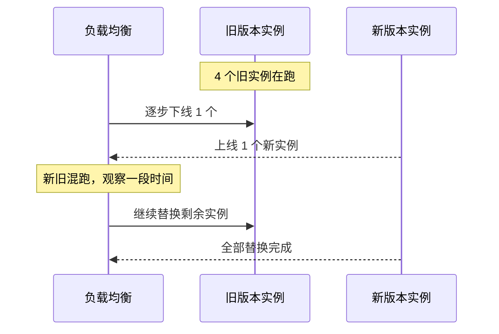
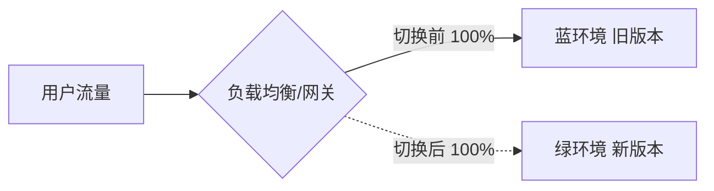
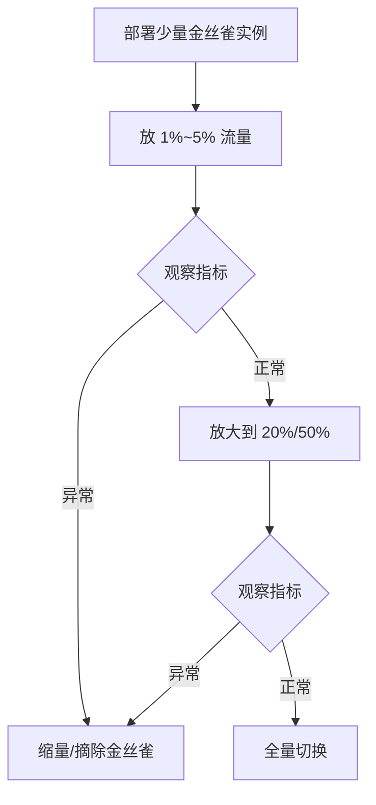
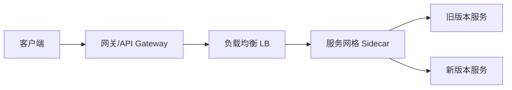

# 灰度发布、金丝雀和蓝绿怎么落地？

> 面试里问“说说灰度发布”，考的从来不是背出滚动、蓝绿、金丝雀这三个名词，而是：**新版本出问题时，你能不能把影响面控制在很小的范围内，并且快速、干净地退回去。**

先说一个很常见的误解：

- “灰度发布就是先部署两套机器，切一半流量过去。”

这句话只说对了“物理部署”那一半，漏掉了更关键的另一半：**流量怎么精确切、观察什么指标、数据层能不能兼容新旧版本同时跑。** 少了后面这些，所谓灰度只是一次没有安全带的蓝绿切换。

## 先把几个名词摆在一张表里

滚动发布、蓝绿发布、金丝雀发布，本质上都是“怎么把流量从旧版本挪到新版本”的具体手段；灰度发布是更上层的概念，指的是**渐进、可控地把流量从旧版本切到新版本，出问题能立刻止损**的一整套发布策略。金丝雀往往是灰度里最常用的一种实现方式，蓝绿和滚动也可以是灰度策略下的具体部署形态。

| 策略           | 部署方式                           | 流量切换方式                          | 回滚速度                 | 资源成本                 | 适合场景                         |
| -------------- | ---------------------------------- | ------------------------------------- | ------------------------ | ------------------------ | -------------------------------- |
| **滚动发布**   | 逐个/逐批替换旧实例为新版本        | 随实例替换自然过渡，无独立切流控制    | 慢，需要反向逐批回滚     | 低，不需要双倍资源       | 常规迭代、变更风险低的版本       |
| **蓝绿发布**   | 新旧两套完整环境同时存在           | 一次性整体切流（通过 LB/DNS/网关）    | 快，切回旧环境即可       | 高，长期需要双倍资源     | 需要整体快速切换、验证充分的发布 |
| **金丝雀发布** | 先部署少量新版本实例，与旧版本共存 | 按比例/按规则逐步放量                 | 快，缩量或摘除金丝雀即可 | 中，只多出少量新版本资源 | 想先小范围验证效果和稳定性再放量 |
| **灰度发布**   | 可以是蓝绿也可以是金丝雀的部署形态 | 按用户/地域/Header/比例等维度精细控制 | 快，关闭对应灰度规则即可 | 视具体形态而定           | 需要按业务规则精细控制影响面     |

看这张表最容易记混的一点是：**滚动发布关注的是“怎么替换实例”，蓝绿关注的是“怎么切换整体环境”，金丝雀和灰度关注的是“怎么控制流量比例和范围”。** 三者不是互斥选项，实际工程里经常组合使用，比如用蓝绿把新版本部署好，再用金丝雀规则从蓝环境里放一小部分真实流量过去验证。

## 滚动发布：最朴素，但回滚慢

滚动发布是最常见的默认发布方式，Kubernetes 的 `Deployment` 默认策略就是滚动更新：按批次逐步用新版本 Pod 替换旧版本 Pod，整个过程中新旧版本会短暂共存。

滚动发布的问题不在“能不能发布成功”，而在**出问题以后不好办**：

- 如果新版本有缺陷，此时新旧版本已经混合对外提供服务，很难说清楚“这个问题只影响多少流量”。
- 回滚等于反向再滚动一遍，同样需要时间，不是秒级的。
- 没有天然的流量比例控制能力，很难说“只放 5% 流量验证”。

所以滚动发布更适合日常小改动、风险可控的版本迭代，不太适合需要严格控制影响面的核心链路变更。

## 蓝绿发布：整体切换，回滚快但资源贵

蓝绿发布准备两套完全独立、规模对等的环境：蓝环境（当前生产）和绿环境（新版本）。绿环境部署完成、验证通过后，通过负载均衡或网关把流量整体切过去。

蓝绿发布的核心优势是**回滚快**：一旦发现问题，把流量指回蓝环境即可，几乎是秒级的。但代价也很直接：

- 需要两倍的机器资源，哪怕只是短暂的验证窗口。
- 是一次性整体切换，没有金丝雀那种精细的比例控制，出问题时受影响的是全量用户（除非结合金丝雀先放一小部分流量到绿环境）。
- 数据库、缓存等有状态组件如果不能双写兼容，切换瞬间容易出现数据错乱。

## 金丝雀发布：先小范围验证，再逐步放量

金丝雀发布这个名字来自矿工带金丝雀下矿井探测瓦斯的做法——先用少量、可牺牲的“先头部队”去验证环境是否安全。

做法是先部署 1~2 个新版本实例，只放一小部分真实流量过去（比如 1%），观察指标没问题后再逐步扩大比例，直到 100%。

金丝雀发布最大的价值在于：**新版本有缺陷时，影响面天然被控制在一个很小的比例内**，不需要等到全量切换才发现问题。它对流量控制精度要求更高，通常需要网关或服务网格配合按比例、按规则分流。

## 灰度发布的维度：不是只有“按比例”

很多人把灰度和金丝雀划等号，只记得“按百分比放量”，但真实业务里灰度维度远不止这一种：

| 维度           | 怎么切                            | 典型场景                                     |
| -------------- | --------------------------------- | -------------------------------------------- |
| **按用户**     | 按用户 ID、白名单、标签分流       | 只对特定测试账号、种子用户开放新功能         |
| **按地域**     | 按 IP、机房、城市分流             | 先在某一个城市或某个机房验证，观察一天再扩大 |
| **按 Header**  | 按请求头、Cookie、App 版本号分流  | 只对灰度版本的客户端请求路由到新服务         |
| **按百分比**   | 按用户 ID 哈希、随机数分流        | 金丝雀最常用的方式，1% → 10% → 50% → 100%    |
| **按内部员工** | 按员工账号、内网 IP、专属域名分流 | 先在公司内部“吃自己的狗粮”，再对外部用户开放 |

这些维度经常组合使用。一个真实的灰度流程可能是：先对内部员工全量开放 → 观察几天没问题 → 按地域选一个流量较小的城市放 5% → 再按用户 ID 哈希扩大到 20%、50% → 最后全量。**维度选择的核心原则是：优先选能快速定位问题、又能把影响面锁定在小范围内的维度**，内部员工和小流量地域通常是最安全的起点。

## 流量怎么切：四个层面，各有取舍

流量切分可以发生在链路上的不同层面，选哪一层直接决定了灰度规则能做到多细、多灵活。

| 切流层面     | 典型实现                                      | 优点                                           | 局限                                                   |
| ------------ | --------------------------------------------- | ---------------------------------------------- | ------------------------------------------------------ |
| **网关**     | Spring Cloud Gateway、Kong、APISIX 按规则路由 | 规则集中管理，支持按 Header/用户/比例灵活匹配  | 只能覆盖经过网关的入口流量，服务间调用覆盖不到         |
| **负载均衡** | Nginx 按权重分流、云 LB 加权路由              | 部署简单，适合蓝绿这种整体切换                 | 灰度维度较粗，通常只支持按权重或按机器分组             |
| **服务网格** | Istio/Envoy 基于 VirtualService 做流量规则    | 可以覆盖服务间调用链路，规则最细，支持故障注入 | 引入 Sidecar 后运维复杂度和延迟都会增加                |
| **客户端**   | App/SDK 侧按开关拉取的灰度规则请求不同接口    | 可以做到端上按用户维度精细控制                 | 依赖客户端升级，规则下发有延迟，覆盖不了服务端内部调用 |

真实项目里这四层往往是叠加使用的：网关层做粗粒度的用户/地域灰度，服务网格在内部调用链路上做更细的按比例灰度，客户端再配合功能开关做前端表现层面的灰度。**只在一层做灰度、却指望覆盖全链路，是很多“灰度翻车”事故的根源**——网关层切流很干净，但服务间调用还是全量走的默认路由，新版本的下游依赖问题照样会被放大。

## 数据兼容：灰度真正难的地方

如果说流量切分是“表面功夫”，数据兼容才是灰度发布里真正的硬骨头。**新旧版本共存意味着同一份数据要同时被两套代码逻辑读写**，这才是灰度最容易翻车的地方。

常见的坑：

- **字段增删不兼容**：新版本给某张表加了字段并且写入逻辑依赖它，但旧版本代码还在跑，读到这行数据时如果没有做好默认值兼容，可能直接报错或者数据语义错乱。
- **序列化协议变更**：新版本改了消息体结构，旧版本消费者按老 schema 解析新消息，字段错位或者直接反序列化失败。
- **业务语义变更**：比如订单状态枚举新增了一个值，旧版本的状态机没有对应分支，可能进入未定义行为。

工程上通常靠这几件事来兜底：

1. **先兼容，后清理**：新版本上线时，新字段要允许为空、有默认值，旧版本代码不依赖新字段也能正常跑。等灰度全量完成、确认旧版本彻底下线后，再做字段清理和强约束收紧。
2. **双写过渡**：涉及存储结构变更时，先让新旧逻辑都写入新旧两份结构（双写），读仍然读旧结构，验证新结构写入没问题后，再切读，最后下线旧结构写入。
3. **配置开关配合**：用配置中心的开关（Feature Flag）控制新逻辑是否生效，而不是靠部署两套代码硬切。这样即使流量已经切到新版本实例，出问题时也能通过关开关秒级降级，不需要重新发布。
4. **接口版本化**：对外/对内接口尽量保证向后兼容，新增字段而不是修改语义，删除字段要走弃用期。

一句话总结这部分：**灰度发布不是只解决“流量怎么切”，更要解决“新旧版本能不能同时正确地读写同一份数据”，后者往往才是决定灰度能不能顺利推进的关键。**

## 回滚条件和观察指标

灰度的每一步放量之间，都要有明确的“继续还是回滚”的判断依据，不能靠感觉。常见的观察指标可以分三类：

| 指标类别         | 具体指标                                  | 触发回滚的典型阈值思路                           |
| ---------------- | ----------------------------------------- | ------------------------------------------------ |
| **错误率**       | HTTP 5xx 比例、RPC 调用失败率、异常日志量 | 相比基线（旧版本同期）明显上升，比如翻倍         |
| **延迟**         | P95/P99 响应时间、下游调用超时率          | 相比基线明显劣化，且持续一段观察窗口而非瞬时抖动 |
| **核心业务指标** | 下单成功率、支付成功率、核心页面转化率    | 相比历史同期出现明显异常波动                     |

需要强调的是：**观察窗口不能太短**。刚放量的几分钟数据噪音很大，容易出现假阳性或假阴性；同时也不能太长，等到用户大量投诉才回滚，灰度就失去了意义。比较务实的做法是设定一个最小观察时长（比如 15~30 分钟）加上样本量下限（比如至少累积多少请求），两者都满足才做“继续放量”或“回滚”的判断。

回滚本身也要提前设计好路径，理想情况下应该是**配置层面的操作，而不是重新走一遍发布流程**：关闭灰度规则、把流量权重调回 0、或者直接关掉对应 Feature Flag，都应该是秒级生效的。如果回滚还要走完整的 CI/CD 流水线，那前面的灰度控制基本白做了。

## 容易踩的坑

### 以为灰度只是部署两套机器

这是最常见的误区。物理上部署新旧两套实例只是灰度的前提条件，真正决定灰度成不成立的是流量能不能精细切、指标能不能实时观察、出问题能不能秒级回滚。只做了部署、没做流量控制和观察机制，本质上还是一次风险不可控的强行发布。

### 数据库 schema 不兼容还硬灰度

如果新版本对数据库做了破坏性变更（比如删字段、改字段类型、改约束），而旧版本代码还在同时对外提供服务，灰度期间旧版本很可能直接报错或写出脏数据。灰度发布的前提是新旧版本都要能正确处理当前的数据结构，schema 变更必须走“先兼容、后收紧”的多阶段发布，不能和业务逻辑变更一起“一步到位”。

### 只看整体指标，不看灰度分组对比

如果只盯着全局错误率，金丝雀那一小部分流量的问题很容易被稀释掉，看不出异常。正确做法是把灰度流量单独打标、单独统计指标，和基线（旧版本或全量前的历史数据）做对比，而不是和总体均值比。

### 灰度规则和真实发布流程脱节

有的团队把灰度规则配置在网关或配置中心，但代码发布本身还是走全量部署，等于灰度规则形同虚设——所有实例其实都已经是新版本了，切流规则控制的只是“哪些请求打新逻辑分支”，这时候如果新逻辑有缺陷，物理上没有旧版本实例可以兜底，风险控制的层次感就丢了。

## 小结

- 滚动、蓝绿、金丝雀是具体的部署与切流手段，灰度发布是更上层的策略目标：渐进、可控地把流量切到新版本，出问题能快速止损。
- 灰度维度不止“按比例”，还包括按用户、地域、Header、内部员工等，实际项目里往往组合使用，优先从影响面小、定位问题快的维度开始。
- 流量切分可以发生在网关、负载均衡、服务网格、客户端等不同层面，只在单一层面做灰度很容易漏掉服务间调用链路。
- 数据兼容是灰度真正的难点：字段变更要先兼容后清理，存储结构变更要考虑双写过渡，业务开关要能独立于部署流程秒级生效。
- 每一步放量都要有明确的错误率、延迟、核心业务指标作为回滚依据，并且回滚路径要设计成配置层面可秒级生效，而不是重新走一遍发布流程。

## 参考

综合工程实践中蓝绿发布、金丝雀发布、滚动更新与灰度流量控制相关公开资料，并结合 API 网关灰度路由、服务网格流量治理与数据库兼容性变更的常见工程实践整理。

<!-- @include: @article-footer.snippet.md -->
