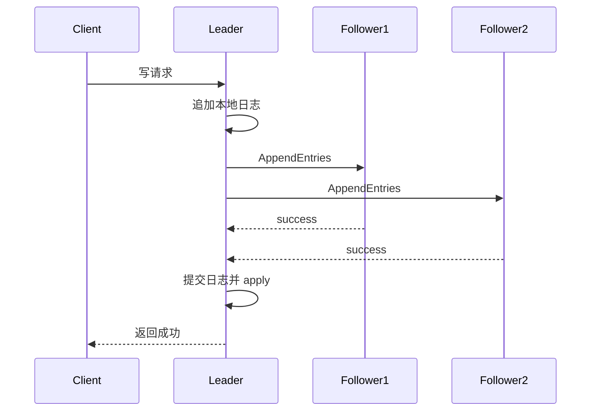

# Raft 解决了什么问题？为什么比 Paxos 更容易落地？

> Raft 真正解决的，不只是“多个节点怎么选个 Leader”这么简单，而是**在非拜占庭故障场景下，怎么让一组节点像一台可靠的状态机一样，对外维护同一份日志和同一份决策结果。**

先看一个典型场景：

- 你有 3 台配置中心节点
- 客户端发来一条“把某个配置改成新值”的请求
- 其中一台机器突然重启
- 两台机器之间还有一段时间网络不稳

这时系统最怕的不是“请求慢一点”，而是：

- 有的节点写成新值
- 有的节点还停在旧值
- 后面重新选主时，把已经对外答应过的结果又覆盖掉

Raft 这类一致性协议，就是在解决这个问题。

## 先抓一句话：Raft 管的是复制日志，不是复制数据库表

Raft 的论文开头就把目标说得很清楚：

**它是一个用于管理 replicated log 的一致性算法。**

也就是说，Raft 核心维护的不是“当前数据库最后长什么样”，而是：

```text
命令 1
命令 2
命令 3
...
```

这串命令日志只要：

- 顺序一致
- 内容一致
- 提交点一致

那每个节点本地再按同样顺序执行这串命令，最终状态机就会收敛到一样的结果。

所以最稳的理解方式是：

**Raft 先保证“大家记账本一致”，再由状态机保证“大家最后结果一致”。**

## Raft 假设自己面对的是什么故障？

这点最好先讲，不然后面很容易把它说成“什么场景都能兜住”。

Raft 论文的前提是假设：

**非拜占庭故障（non-Byzantine / crash fault）**

翻成人话就是：

- 节点可能宕机
- 可能断网
- 可能消息丢失、重复、乱序、延迟
- 但不会故意伪造恶意消息

所以如果有人问：

> Raft 能不能防恶意节点作恶？

那答案就不是它主战场了。
它主要面向的是工程里更常见的 crash / partition 场景，而不是拜占庭容错。

## Raft 为什么会被发明出来？

Raft 论文把目标说得很直接：

**他们想做一个比 Paxos 更容易理解、也更适合工程实现的一致性算法。**

这里面有两个关键词：

1. understandability
2. practical systems

这也是为什么回答“Raft 为什么更容易落地”时，不能只说“它有 Leader”。
真正的原因在于它在设计上做了几件很强的约束。

## Raft 把复杂问题拆成了哪几块？

论文里明确说，Raft 把一致性问题拆成了几个相对独立的子问题：

1. Leader election
2. Log replication
3. Safety
4. Membership changes

这个拆法非常重要，因为它正是“比 Paxos 更好理解”的核心来源之一。

你可以先把它理解成：

```text
先决定谁负责发号施令
 -> 再决定命令怎么复制
 -> 再决定什么时候算真正提交
 -> 最后再讨论集群怎么扩缩容
```

这种分层会让工程师脑子里先建立清晰主线，而不是一上来就陷进一堆抽象提案/承诺状态里。

## Raft 集群里有哪三种角色？

这是最基础但也是必须答稳的一层。

一个节点在任意时刻只会处于三种角色之一：

| 角色      | 职责                                |
| --------- | ----------------------------------- |
| Follower  | 被动接收 Leader 或 Candidate 的请求 |
| Candidate | 竞选 Leader                         |
| Leader    | 接收客户端写请求，负责复制日志      |

这里最关键的一句是：

**Raft 是强 Leader 模式。**

论文专门强调了这一点：日志条目只从 Leader 流向其他节点。

这和很多初学者脑子里的“大家平等协商”不一样。
Raft 的做法是：

- 先把谁说了算定出来
- 然后绝大多数写路径都围绕这个 Leader 展开

这就是它比 Paxos 更容易工程化的第一层原因。

## 什么叫“强 Leader”？

强 Leader 的意思不是“Leader 很重要”这种废话，而是：

**新的日志只由 Leader 产生和下发，Follower 不自行对外承诺写入结果。**

这带来几个直接好处：

1. 写入方向单一，日志流动更简单
2. 冲突处理时以现任 Leader 账本为准
3. 工程实现里不需要每个节点都跑一套复杂对等协商逻辑

所以如果有人问“Raft 为什么比 Paxos 更容易让工程师接受”，强 Leader 一定要提。

## 谁有资格成为 Leader？

Raft 不是谁先超时、谁 term 更大，谁就一定能当 Leader。

一个 Candidate 发 `RequestVote` 时，除了带上自己的任期，还会带上自己最后一条日志的：

- `lastLogTerm`
- `lastLogIndex`

投票节点会检查候选人的日志是不是至少和自己一样新：

1. `lastLogTerm` 更大，说明候选人日志更新
2. `lastLogTerm` 相同，再比较 `lastLogIndex`
3. 候选人日志更旧，就拒绝投票

这条限制非常关键。
因为 Raft 要保证：

**已经提交过的日志，必须能被带进后续 Leader 的任期里。**

如果一个缺日志的节点也能轻易当 Leader，它就可能用自己的旧日志覆盖别人已经确认过的历史。
所以选举限制不是“附加细节”，而是 Raft 安全性的核心之一。

## Raft 一次正常写入大致怎么走？

假设客户端发来一条命令：

```text
set x = 10
```

Raft 的主线大概是：

1. 客户端把请求发给 Leader
2. Leader 把命令追加到自己的日志
3. Leader 用 `AppendEntries` RPC 把这条日志复制给 Follower
4. 当多数节点都复制成功后，Leader 推进 `commitIndex`
5. 各节点按顺序把已提交日志 apply 到状态机
6. Leader 再向客户端确认成功

可以画成：



这条路径里最核心的一句是：

**客户端成功，不代表只写到 Leader 本地，而是写到多数派并进入提交点。**

Follower 也不会自己拍脑袋决定“我提交到哪了”。
Leader 后续发送 `AppendEntries` 时会带上 `leaderCommit`，Follower 根据这个值更新自己的提交点：

```text
follower.commitIndex = min(leaderCommit, follower.lastLogIndex)
```

然后再按顺序把已提交日志 apply 到状态机。
这能避免 Follower 因为本地多了某条日志，就提前把它当成已提交结果执行。

## Raft 为什么说自己“更容易理解”？

论文里专门讲了两种设计手法：

1. problem decomposition
2. state space reduction

翻成人话就是：

- 把问题拆成更小的模块
- 主动减少系统可能出现的混乱状态

这两点正是它相对 Paxos 更容易落地的根因。

### 1. 拆问题

前面已经说了，Raft 不把共识问题一股脑丢给你，而是拆成：

- 选主
- 复制
- 安全
- 成员变更

工程上这意味着你在排查问题时，也能按这条线分层思考。

### 2. 减状态

Raft 尽量减少那种“多个节点各自持有一堆互相难以推理的状态”的情况。
最典型的就是它让日志流动方向更单一，并且用任期、日志匹配规则去收紧状态空间。

这会让实现和排障都更直接。

## Raft 为什么比 Paxos 更容易落地？

如果只回答“因为它更好理解”，还不够。
更工程化的回答应该至少落到这 4 个点：

### 1. 它是围绕日志而不是围绕单次提案来设计的

Paxos 的经典表述先从单次决策讲，再扩成多次决策。
而 Raft 一上来就围绕 replicated log 设计，这和真实系统更贴近。

### 2. 它用强 Leader 降低了写路径复杂度

日志单向流动，工程实现更直接。

### 3. 它把核心流程拆得更清楚

选主、复制、安全、成员变更，模块边界很清晰。

### 4. 工业实现更多，经验更成熟

像 etcd、Consul、TiKV 这些大家常见的系统里，都有成熟的 Raft 变体或实现。
这意味着你不是在一套纯理论算法上从零落地，而是能借鉴一大批工业经验。

## 任期（term）为什么重要？

任期可以理解成“这一轮领导期编号”。

它最关键的作用是：

- 给选主和日志条目都加上时间序号语义
- 帮节点判断自己是不是过时了

最典型的规则是：

- 如果收到更大 term 的消息，当前节点就得承认自己落后了
- Leader / Candidate 发现自己 term 过期，会退回 Follower

所以 term 的价值在于：

**让集群里所有节点对“谁更新、谁过期、谁该让位”有统一判断依据。**

## 日志复制为什么不会无限分叉？

因为 Raft 有很强的日志一致性约束。

论文里的核心逻辑可以概括成：

1. 复制前先检查前一条日志位置和 term 是否匹配
2. 如果不匹配，就拒绝这次追加
3. Leader 再回退并重试，直到找到共同前缀
4. 后面的冲突日志由现任 Leader 视图覆盖

所以 Raft 不是“大家随便 append，最后赌同步”，而是：

**每次复制都带前缀校验，确保大家最终朝同一条日志线收敛。**

## 为什么多数派这么重要？

Raft 论文对可用性的要求写得很清楚：

**只要多数节点还能互相通信并对外服务，系统就还能继续工作。**

这意味着：

- 3 节点集群，允许挂 1 个
- 5 节点集群，允许挂 2 个

多数派的意义，不只是容灾数，而是它保证：

**任何两个合法多数派一定有交集。**

这个交集是安全性的关键，因为它能把“之前已经达成过的提交事实”带进下一轮领导期。

拿 5 节点集群举例：

```text
分区一：{A, B, C}
分区二：{D, E}
```

如果 `{A, B, C}` 里选出了 Leader，它可以拿到 3 票，形成多数派并继续提交。
而 `{D, E}` 即使保留着一个旧 Leader，也只有 2 个节点，拿不到多数确认。

这意味着：

- 多数派分区可以继续对外提供安全写入
- 少数派分区不能安全提交新日志
- 网络恢复后，少数派要追随新 Leader 的日志线

所以 Raft 抗脑裂不是靠“大家都相信自己”，而是靠多数派交集把合法历史串起来。

## Raft 的“提交”为什么不是复制成功就完了？

这是很多人第一次看日志复制时最容易漏掉的点。

更准确地说：

- 复制到少数节点，不算安全提交
- 通常要多数派确认后，Leader 才推进 `commitIndex`

而且论文里还有一个更细的限制：

**Leader 推进提交点时，要特别注意当前任期日志和历史任期日志的关系。**

这也是为什么实际工程实现里，经常会提到 Leader 当选后提交一条 no-op 日志，帮助把提交语义拉齐。

## Raft 为什么还要随机选举超时？

因为如果每个节点选举超时都一模一样，就很容易同时发起选举，长期 split vote。

随机化超时的目的就是：

- 让某个节点更可能先超时
- 先发起选举
- 在其他节点来得及抢之前拿到多数票

这是一种非常“工程味”的设计：

**不用更复杂的数学协调，直接靠随机化把冲突概率压下去。**

这也是它“更容易落地”的又一个体现。

## Raft 不是没有边界问题

这点最好主动讲出来，显得回答更完整。

Raft 虽然比 Paxos 更容易实现，但不代表没有坑。

真实工业实现里常见扩展或优化就包括：

- Pre-Vote
- Joint Consensus 成员变更
- 快速回退（fast backup）
- Leader lease / read optimization

这些都说明：

**标准 Raft 是很好的主线，但真正落地到生产，还要继续补工程细节。**

其中 Pre-Vote 很适合在面试里主动提一嘴。

标准 Raft 有一个边界：少数派节点隔离期间收不到心跳，可能不断自增 term 发起选举。
等它恢复网络后，带着更大的 term 回到集群，健康 Leader 收到更高 term 的请求会被迫退位。

这会造成很尴尬的结果：

```text
健康多数派本来跑得好好的
  -> 隔离节点恢复
  -> 高 term 干扰现任 Leader
  -> 集群无意义切主
```

Pre-Vote 的思路是：

**真正增加 term 之前，先问一圈“如果我发起正式选举，你们会不会支持我”。**

如果它拿不到多数预投票，就不进入正式选举，也不把 term 往上抬。
这样少数派节点隔离期间就不容易把 term 刷高，恢复后也不会轻易打断健康 Leader。

## Raft 和 Paxos 最值得怎么对比？

不要只说“Raft 更简单，Paxos 更难”。
更稳的对比是：

| 维度     | Raft                           | Paxos / Multi-Paxos                         |
| -------- | ------------------------------ | ------------------------------------------- |
| 思考入口 | 围绕复制日志                   | 常从单次提案出发，再扩展到多次决策          |
| 写路径   | 强 Leader 是协议主线           | Leader 更像常见工程优化，不是最初表述的主线 |
| 日志处理 | 按序追加、前缀校验、提交点清晰 | 工程实现里更容易遇到日志空洞和补齐问题      |
| 可理解性 | 更强调模块拆分与状态收敛       | 学习和实现门槛更高                          |
| 工程直觉 | 更贴近真实系统实现             | 理论上经典，但实现经常要大量工程补充        |

最关键的一句可以这样落：

**Raft 不是在数学上“打败” Paxos，而是在工程可理解性和实现直觉上更友好。**

## 一个更稳的排障视角

如果线上遇到 Raft 类系统异常，先别一上来就说“协议出 bug 了”。

更稳的收敛顺序通常是：

```text
1. 多数派还在不在？
2. 当前有没有稳定 Leader？
3. 任期是不是频繁抖动？
4. 日志复制是不是卡在少数慢节点或冲突回退？
5. 提交点是不是推进不了？
6. 是标准选举问题，还是工程实现里的 Pre-Vote / lease / 成员变更问题？
```

很多“写不进去”“一直换主”的问题，本质上都是多数派、超时或网络抖动带出来的，而不是 Raft 主逻辑本身坏了。

## 容易踩的坑

### 把 Raft 说成“就是一个选主算法”

不对。
选主只是它的一部分，它真正管理的是复制日志和提交语义。

### 把“多数派复制成功”和“状态机已应用”说成一回事

两者有关，但不是同一瞬间。
提交、应用、返回客户端，在实现上是有顺序层次的。

### 把 Raft 说成“任何故障都能扛”

不对。
它主要面向非拜占庭故障，只要多数派丢了，可用性也会掉。

## 小结

- Raft 解决的是非拜占庭故障场景下的复制日志一致性问题，让多节点集群对外表现得像一台可靠状态机。
- 它通过强 Leader、随机选举超时、日志前缀校验和多数派提交，把选主、复制和安全逻辑收成了更容易工程实现的主线。
- 相比 Paxos，Raft 更容易落地，不是因为它更“高级”，而是因为它更贴近工程师理解和实现分布式日志系统的方式。
- 多数派、term、日志匹配、commitIndex 是理解 Raft 的四个关键抓手。
- 真实生产系统通常还会在标准 Raft 之上叠加 Pre-Vote、快速回退、成员变更优化等工程增强。

## 参考

基于 Raft 论文、Raft 扩展论文与主流工程实现中选举、日志复制、安全性、Pre-Vote、成员变更相关内容整理，并对比 Paxos / Multi-Paxos 的工程落地差异做了校验。
