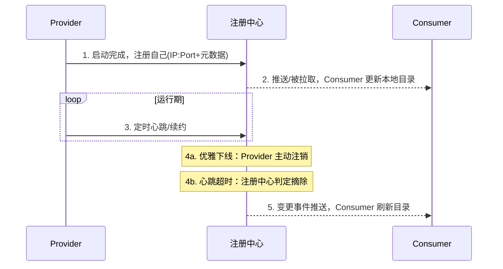
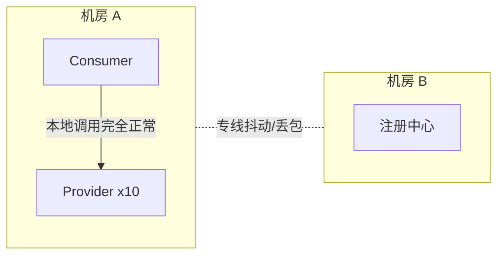

# 服务注册发现解决什么问题？心跳、摘除、保护阈值怎么设计？

> 服务发现要解决的核心问题只有一句话：**调用方怎么知道现在有哪些实例活着、地址是什么，并且这份名单要能随时间自动更新。** 围绕这句话，才有心跳、摘除、保护阈值这些具体机制。

## 先从一个真实的坑说起：硬编码 IP 为什么走不通

假设你负责订单服务，要调库存服务，库存服务部署了 3 台机器。最朴素的做法是配置文件里写死这 3 个 IP：

```yaml
inventory:
  hosts:
    - 10.0.0.1:8080
    - 10.0.0.2:8080
    - 10.0.0.3:8080
```

这样能跑，但只要遇到下面任何一种情况就会出问题：

- **扩容**：库存服务从 3 台加到 8 台，新的 5 台不在名单里，永远分不到流量。
- **发布**：滚动发布时某台机器重启，订单服务不知道，请求照样打过去，直接报错。
- **宕机**：一台机器物理故障，配置里的 IP 还在，调用方要么超时要么拿到连接拒绝。
- **迁移**：库存服务换了机房、换了 IP 段，所有依赖方都要跟着改配置、重启。

问题的本质是：**"谁在提供这个服务"这件事本身是动态的，但硬编码把它当成了静态数据。** 服务越多、发布越频繁，这种脱节就越致命——这也是为什么资料里常说"服务越多，人工维护地址列表的成本会指数级上升"。

服务注册中心做的事情，其实就是把这份"名单"从人工维护的配置文件，变成了一个**自动更新、可订阅的动态目录**：Provider 上线自己去注册，下线/宕机自动从目录里摘掉，Consumer 只订阅目录、不用关心地址从哪来。

## 服务发现的完整生命周期

一个实例从注册到最终被摘除，通常会经过下面这几个阶段：



拆开看每一步：

1. **注册**：Provider 启动完成、确认自己能对外服务后，向注册中心上报自己的地址和元数据（版本、权重、分组、健康检查方式等）。**注意是"启动完成"才注册，不是进程一起来就注册**——不少线上事故就是因为提前注册，流量打进来时应用还没初始化完。
2. **发现/订阅**：Consumer 从注册中心拉取或订阅自己关心的服务列表，在本地建立一份可用实例目录（Dubbo 里这个概念叫 `Directory`，可以参考 [Dubbo 的注册发现、负载均衡和容错怎么配合？](/distributed-system/rpc/dubbo-discovery-loadbalance-faulttolerance.html)）。
3. **心跳/续约**：Provider 运行期间要不断证明自己"还活着"，具体靠什么证明，下一节详细展开。
4. **摘除**：分两种——**优雅下线**（进程收到停止信号，主动向注册中心注销，这是可控的）和**心跳超时摘除**（注册中心一段时间收不到心跳，判定实例失联，被动剔除，这是不可控的、需要容忍误判的）。
5. **变更通知**：不管哪种摘除方式，注册中心都要把变更推送给订阅了这个服务的所有 Consumer，Consumer 刷新本地目录，后续负载均衡才不会选到已经下线的实例。

## 谁来判断"死了"：心跳上报 vs 主动健康检查

这是服务发现里最容易被问到、也最容易答浅的一块。核心是两种完全不同的探活模式：

| 模式           | 谁发起                                                    | 典型代表                           | 特点                                                                      |
| -------------- | --------------------------------------------------------- | ---------------------------------- | ------------------------------------------------------------------------- |
| 客户端心跳上报 | Provider 主动定时上报"我还活着"                           | Eureka、Nacos 临时实例             | 实现简单，服务端压力小；依赖 Provider 应用层线程正常调度                  |
| 服务端主动探测 | 注册中心/探活组件主动去连 Provider（TCP/HTTP/自定义协议） | Nacos 持久化实例、部分网关健康检查 | 探测更主动、更贴近真实可用性；探测方要维护和每个实例的连接/请求，开销更大 |

区别在什么场景下会显出来？举个例子：Provider 进程发生了一次长时间 Full GC，或者业务线程池被打满、卡死，但操作系统层面进程和端口都还活着。

- 如果是**服务端主动探测**（比如探测方发一个 HTTP 健康检查请求），大概率会探测超时，很快判定不健康。
- 如果是**客户端心跳上报**，要看心跳线程是不是被同一个线程池/同一次 GC 影响——如果心跳用的是独立线程且优先级高，即便业务卡死，心跳可能还能正常发出去，这时候注册中心会认为它是健康的，但实际请求可能全部超时。这也是为什么很多团队会在应用层健康检查里加业务自检逻辑，而不是只判断进程存活。

## 临时节点 vs 心跳上报，到底差在哪

这两者经常被混着说，但机制层面并不是一回事：

- **ZooKeeper 临时节点（ephemeral node）**：Provider 和 ZK 之间建立一个 session，节点的存活跟这个 TCP 会话强绑定。只要 session 没过期，节点就在；一旦客户端进程崩溃或者网络断开、session 超时，ZK 服务端**自动**删除这个临时节点。这里的"心跳"是 ZK 客户端库自己在维护的连接保活 ping，业务代码基本感知不到，也插不了手。
- **应用层心跳上报（Eureka 这类）**：由业务进程内的一个定时任务主动调用注册中心的续约接口，比如 Eureka 默认每 30 秒续约一次，注册中心如果一段时间（默认 90 秒）没收到续约就摘除。这是**业务代码显式参与**的心跳，好处是可以在心跳逻辑里加自定义的健康判断，坏处正是上一节说的——如果心跳线程本身被拖慢，会掩盖真实的不可用状态。

一句话总结这个区别：**ZK 临时节点的"生死判定"绑定在连接会话上，是框架层面的强保证；应用层心跳的"生死判定"绑定在业务进程能否按时调用接口，弹性更好但也更容易"假活"。**

## 保护阈值（自我保护）解决了什么、又带来什么风险

先说这个机制要防的是什么场景：**注册中心和一大批 Provider 之间发生了网络分区**（比如某个机房到注册中心的专线抖动），并不是这些 Provider 真的挂了。如果注册中心机械地执行"心跳超时就摘除"，后果是：

1. 短时间内大量健康的实例被误判下线，服务目录瞬间"清空"；
2. 剩下少数几个还连着的实例，要扛住原本该分摊到一大批实例上的全部流量；
3. 流量瞬间集中导致这几个实例被压垮，引发连锁雪崩——本来只是网络抖动，最后演变成一次真正的服务不可用。

Eureka 的自我保护机制就是为了防这种情况：当单位时间内收到的心跳数量低于某个阈值（Eureka 默认按 85% 算），它就认为"现在网络可能有问题，不是实例真的大批量挂了"，于是**暂停摘除操作**，把当前已知的实例列表原样保留，不再清空。

代价也很直接：**保护期间，注册中心里可能真的躺着一些已经彻底死掉的实例**，Consumer 仍然可能选到它们，调用失败。所以这个机制换来的是"避免雪崩式误摘除"，用的是"短期内可能调到死实例"的代价。工程上一般靠两点补：

- 负载均衡 + 重试/熔断兜底，单次调用失败换一台重试；
- 保护阈值只是"减少误判"，不是"消灭误判"，业务侧要接受这一层不完美。

Nacos 里也有类似的思路（可配置的健康检查阈值和保护逻辑），本质上都是在"及时摘除"和"避免误摘除引发雪崩"之间找平衡点，没有绝对正确的答案，只有更贴合业务场景的取舍。

## AP 型（Eureka 思路）vs CP 型（ZK）vs Nacos 双模式，怎么选

这是服务发现选型时绕不开的一个对比：

| 维度              | AP 型（Eureka 思路）                     | CP 型（ZooKeeper）                                 | Nacos                                          |
| ----------------- | ---------------------------------------- | -------------------------------------------------- | ---------------------------------------------- |
| 一致性取舍        | 优先可用性，允许短暂看到不一致的实例列表 | 优先一致性，选举/同步期间可能拒绝读写              | 按实例类型选：临时实例走 AP，持久化实例走 CP   |
| 网络分区时表现    | 各节点继续对外提供（可能过期的）服务列表 | 少数派分区可能无法写入，甚至整体不可用直到选主完成 | 临时实例侧仍可用；持久化实例侧遵循 CP 语义     |
| 典型心跳/摘除方式 | 客户端心跳上报 + 保护阈值                | 临时节点 + session 超时                            | 心跳（临时实例）/ 主动探测（持久化实例）皆支持 |

选型时的判断标准很简单，先问自己一个问题：**"注册中心短暂返回一份过期数据"和"注册中心在选主期间直接不可写"，哪个对我的业务伤害更大？**

- 服务发现场景下，**多数团队会更倾向 AP**：宁可偶尔调用到一个已经下线但还没摘除干净的实例（靠重试兜底），也不希望注册中心自己因为选主/同步而短暂拒绝服务，导致新实例上线注册不进去、整个发现链路卡住。这也是为什么服务发现领域 AP 型设计更主流，而 ZK 这种强一致协调服务更常被用在选主、分布式锁这类必须保证强一致的场景。
- 这里要提醒一个容易被资料带偏的点：**Eureka 目前处于维护模式**，官方已经不再积极添加新特性，面试里拿它讲清楚"AP 型注册中心的设计思路"完全没问题，但如果是聊新项目技术选型，现在更常见的答案是 Nacos 或者云厂商的注册中心产品，照抄旧资料里"业界都用 Eureka"这种表述会显得脱节。
- **Nacos 的双模式**是个更实用的设计：同一个注册中心，临时实例（默认模式，走心跳 + 自动摘除，AP 语义）适合大部分互联网业务的弹性伸缩场景；持久化实例（走主动健康检查 + Raft 协议保证的强一致，CP 语义）适合那种"哪怕暂时不可用也不能被误摘除"的场景，比如一些需要稳定接入的边缘服务、DB 代理层。选型边界就是：**默认无脑用临时实例；只有当"误摘除的代价远大于短暂不可用的代价"时，才考虑持久化实例。**

## 心跳参数怎么调，本质是在权衡什么

面试里经常会追问一句："心跳间隔和超时时间怎么设置比较合理？" 这个问题没有标准答案，但背后的权衡逻辑是固定的：

- **心跳间隔** 决定了注册中心多快能"察觉"到一次心跳；间隔越短，感知越灵敏，但 Provider 和注册中心之间的心跳流量也越大，实例数一多，这个开销会被放大。
- **判定超时的心跳缺失次数**（比如"连续 3 次没收到心跳才摘除"）决定了容忍网络抖动的能力；容忍次数越多，越不容易误摘除，但一个真正已经宕机的实例留在目录里的时间也越长。

拿 Eureka 举例，默认心跳间隔 30 秒、90 秒未续约判定过期，相当于"容忍 3 次心跳缺失"。这组默认值明显是偏向**稳定优先于灵敏**的——它宁可一个真死的实例在目录里多待一分钟，也不想因为一两次网络抖动就把健康实例错杀。如果业务对"摘除要快"有更高要求（比如金融支付这种对错误率极度敏感的场景），可以调短间隔、减少容忍次数，但要清楚这是在用"更容易误摘除、需要更强的重试兜底"换"更快的故障感知"，没有免费的午餐。

## 客户端本地缓存与推空保护

服务发现还有一个经常被忽略、但排障时特别关键的设计：**Consumer 不是每次调用都去问注册中心要地址，而是在本地维护一份缓存目录，注册中心只负责推送变更。**

好处很直接：

- 注册中心哪怕短暂不可用，Consumer 靠本地缓存的旧目录依然能继续发起调用——这一点在 [Dubbo 的注册发现、负载均衡和容错怎么配合？](/distributed-system/rpc/dubbo-discovery-loadbalance-faulttolerance.html) 里也提到过，注册中心更像"控制面/目录服务"，不是每次调用都参与的转发节点。
- 减轻了注册中心的读压力，注册中心只需要在变更时推送一次，而不是被所有 Consumer 高频轮询。

但本地缓存会带来一个新问题：**如果某次推送/拉取拿到的是一个空列表，Consumer 该怎么办？** 直接清空本地缓存是很危险的操作——如果这个"空列表"是因为注册中心自身故障、网络抖动、或者某次数据同步异常导致的误判，而不是这个服务真的所有实例都下线了，那清空缓存等于让 Consumer 主动把自己"打瞎"，本来还能用旧地址正常调用，结果因为一次误判直接全部失败。

这就是**推空保护**要解决的问题：**收到空列表时不要无条件覆盖本地缓存，而是保留旧数据、只做告警，或者要求多次确认全部为空才真正清空。** 这是很多注册中心客户端（包括 Nacos、Dubbo 的注册中心适配层）都会内置的一条保护规则，属于"宁可信息滞后，也不要因为一次异常抖动就自毁"的思路，和前面讲的保护阈值本质上是同一个工程哲学。

## 一个具体场景：网络分区下，三种注册中心各自会怎么表现

光讲概念容易空对空，具体带一个场景过一遍，三种设计的差异会更直观。

场景：一个机房 A 里跑着 10 个 Provider 实例，注册中心部署在机房 B，两个机房之间的专线突然抖动、丢包率飙升，但机房 A 内部的实例之间、以及机房 A 到 Consumer 之间网络完全正常。



- **如果是 ZooKeeper（CP）**：Provider 和 ZK 之间维护的 session 因为专线丢包大量断开，session 超时后临时节点被删除。这 10 个实例会被批量摘除，即便它们本身完全健康、Consumer 到它们的调用一切正常。这是 CP 型设计的代价——为了保证目录的强一致，宁可暂时把"实际健康但暂时连不上注册中心"的实例也判定成不可用。
- **如果是 Eureka（AP，开了自我保护）**：注册中心统计到收到的心跳数量骤降，触发自我保护，暂停摘除操作，10 个实例继续留在目录里。Consumer 该怎么调还怎么调，业务完全无感——这正是自我保护机制设计的初衷。
- **如果是 Nacos**（假设这 10 个实例是默认的临时实例模式）：行为和 Eureka 的思路类似，主要靠客户端心跳判活，短暂的专线抖动不会立刻导致大规模摘除；如果是持久化实例模式，则更接近 ZK 的表现，会更严格地按照健康检查结果处理。

这个场景也直观回答了"为什么服务发现更偏向 AP"：**注册中心到 Provider 之间的网络问题，不代表 Consumer 到 Provider 之间也有问题。** CP 型设计没法区分这两种情况，只能保守地摘除；AP 型设计通过保护阈值这类机制，把"我搞不清楚，先别乱摘"当成默认策略。

## 和网关、配置中心的边界

这三个概念经常被放在一起问，容易混，一句话分开：

- **注册中心**回答的是："这个服务当前有哪些实例、地址是什么？"——它是一份动态更新的地址目录。
- **网关**回答的是："这一次请求应该被转发到哪个服务、要不要做鉴权/限流/协议转换？"——它是流量的入口层，内部做路由决策时通常也要依赖注册中心拿到的服务实例列表，但网关本身关注的是"这一次请求"，而不是维护地址目录本身。
- **配置中心**回答的是："这个服务现在应该用什么参数运行？"——比如限流阈值、开关、超时时间这些会变化但不属于"地址"范畴的动态参数，和注册中心管的东西完全不是一类数据。

简单记：**注册中心管"在哪"，网关管"这次请求怎么走"，配置中心管"用什么参数跑"。** 三者经常协作（网关查注册中心拿实例列表、服务运行时从配置中心拉参数），但各自的数据模型和职责边界是清晰分开的。

## 容易踩的坑

### 误区一：注册中心挂了，所有服务调用都会挂

不对。前面讲过，Consumer 有本地缓存目录，注册中心更多是承担发现和变更通知的角色，不是每次调用都参与转发的中间节点。注册中心挂了之后，真正受影响的是：新实例上不了线、下线的实例摘不掉、路由和权重变更推不出去——这些是"目录进入只能用旧视图"的状态，不等于"调用链路全部中断"。

### 误区二：心跳超时就等于服务真的死了

心跳超时只能说明"注册中心一段时间没收到证明"，原因可能是进程真死了，也可能是网络抖动、GC 停顿、心跳线程被拖慢。这也是保护阈值存在的原因——不做任何缓冲的话，网络抖动会被直接放大成大规模误摘除。

### 误区三：摘除是瞬时全局生效的

从"注册中心判定某个实例该摘除"到"所有订阅了这个服务的 Consumer 都刷新完本地目录"，中间存在一个推送/拉取的传播延迟。这个窗口期内，个别 Consumer 仍然可能选到已经被判定下线的实例——这也是为什么负载均衡 + 失败重试/熔断这层兜底不能省。

## 小结

1. 服务发现的本质是把"谁在提供服务"从人工维护的静态配置，变成自动更新、可订阅的动态目录，解决的是硬编码 IP 在扩容、发布、宕机场景下的维护成本问题。
2. 完整生命周期是注册 → 心跳/续约 → 优雅下线或超时摘除 → 变更推送，探活手段分客户端心跳上报和服务端主动探测两条路线，各有代价。
3. 保护阈值是用"短期内可能调到已死实例"换"避免网络抖动引发的雪崩式误摘除"，没有绝对正确答案，靠重试和熔断兜底不完美。
4. 服务发现场景整体更偏向 AP：Eureka 代表 AP 思路但已进入维护模式，Nacos 的临时/持久化双模式是目前更实用的工程选择，本地缓存和推空保护则是客户端侧对抗注册中心短暂异常的关键防线。
5. 注册中心、网关、配置中心职责边界清晰：分别管"在哪"、"这次请求怎么走"、"用什么参数跑"，注册中心挂了不等于服务全挂。

## 参考

综合自仓库内 Dubbo / RPC 服务发现参考材料，并结合 Eureka 自我保护机制、ZooKeeper 临时节点、Nacos 双模式注册的公开工程实践整理校验。
