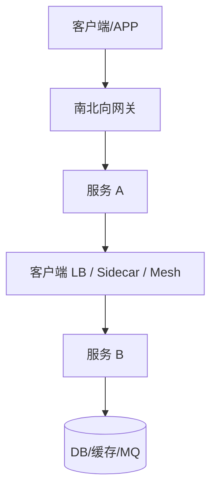

# 超时、重试、熔断应该放在哪一层？

> 稳定性策略不是“每层都开一遍就更稳”，乱叠会把一次故障放大成重试风暴。

## 先分清四层

| 层           | 典型组件                | 适合放什么                           | 不适合放什么                     |
| ------------ | ----------------------- | ------------------------------------ | -------------------------------- |
| 入口网关     | Nginx / Gateway         | 全局限流、鉴权、粗粒度熔断、路由灰度 | 细业务补偿、领域规则             |
| 服务调用方   | SDK / OpenFeign / Dubbo | 针对下游的超时、有限重试、舱壁隔离   | 无预算无限重试                   |
| Service Mesh | Sidecar / Istio 类      | 统一 mTLS、默认超时重试、流量镜像    | 替代业务幂等                     |
| 业务代码     | Service                 | 幂等、状态机、降级返回值、补偿       | 到处手写 socket 超时细节且不一致 |

## 超时：离调用点越近越好配

超时要回答的是：**我最多愿意等下游多久**。

更稳的做法：

1. **业务接口有总预算**（例如 2s）
2. 下游调用超时 < 总预算
3. 网关超时 ≥ 后端总预算，避免网关先断、后端还在跑

常见翻车：

- 网关 1s、服务调下游 3s：用户已失败，线程还在占着
- 所有下游共用一个超大超时：一个慢依赖拖死线程池

## 重试：只放一层，且可重试错误才重

规则：

- **读多可重试，写必须幂等后才重试**
- 优先在**调用方**做有限次 + 退避 + 抖动
- 网关与 Mesh 不要再默认各重试 3 次，否则变成乘法

详见 [重试为什么可能放大故障](/high-availability/high-availability-retry-storm.html)。

## 熔断与舱壁：保护调用方线程

熔断解决的是“下游持续坏时，别再用请求去喂它”。

- 调用方熔断：保护自己的线程池和 RT
- 网关熔断：保护整个入口不被某一路由拖死
- Mesh 熔断：适合统一默认策略，但仍要按依赖覆盖

舱壁（线程池/信号量隔离）通常在**调用方或容错组件**里最有效，因为要隔离的是“本进程资源”。

## Mesh 到底替你挡了什么

Service Mesh 的价值主要是：

- 统一收口超时/重试/限流的默认策略
- mTLS、可观测、流量染色

它**不自动**解决：

- 业务幂等
- 分布式事务
- 合理的接口总预算
- 下游本身的慢 SQL

把 Mesh 当成“上了就高可用”会失望。它是治理平面，不是业务正确性平面。

## 一张放置建议表

| 策略            | 首选位置           | 备注                         |
| --------------- | ------------------ | ---------------------------- |
| 全局限流        | 网关               | 保护集群入口                 |
| 用户/API 级限流 | 网关或 BFF         | 带用户维度时注意状态存储     |
| 依赖超时        | 调用方 / Mesh 覆盖 | 必须小于接口预算             |
| 重试            | 调用方唯一主位置   | 网关/Mesh 默认关掉或严格限制 |
| 熔断            | 调用方 + 关键入口  | 症状恢复要半开探测           |
| 降级内容        | 业务代码           | 需要业务语义                 |
| 幂等            | 业务 + 存储约束    | 任何重试的前提               |

## 一个反例：三层都开了重试

假设：

- 网关对 5xx 重试 2 次
- Mesh 默认重试 2 次
- 业务 SDK 再重试 2 次

一次下游故障，最坏会变成 \(3 \times 3 \times 3 = 27\) 倍放大（含首次）。  
集群看起来“很努力重试”，实际上是在**自己制造雪崩**。

更稳的配置原则：

1. 只保留**一层**主重试（通常是调用方 SDK）
2. 网关/Mesh 重试默认关闭，或仅对幂等 GET 且次数=1
3. 全链路有**总时间预算**，重试必须吃预算而不是无限加时
4. 写操作无幂等键则禁止自动重试

详见 [重试风暴](/high-availability/high-availability-retry-storm.html)。

## 落地检查清单

上线前问自己：

| 检查项     | 通过标准                           |
| ---------- | ---------------------------------- |
| 接口总超时 | 网关 ≥ 服务预算 ≥ 下游超时之和     |
| 重试层数   | 主路径只有一处自动重试             |
| 熔断阈值   | 按依赖分别配置，不是全局一个值     |
| 降级开关   | 业务有可返回的降级内容/默认值      |
| 幂等       | 支付、下单、扣减有唯一键           |
| 观测       | 能区分网关失败、自身失败、下游失败 |

## 什么时候值得上 Mesh

适合：

- 多语言服务，需要统一 mTLS 与默认治理
- 平台团队能运维控制面
- 已有清晰的服务身份与证书体系

不适合作为第一优先级：

- 团队还在补网关限流、超时预算、幂等这些基本功
- 只有少数 Java 服务且已有成熟 SDK 治理

Mesh 是“把默认策略做对”的放大器；基本功不对，上了只会放大错误默认值。

## 和现有专题怎么串

- 组合动作：[熔断降级隔离超时重试](/high-availability/high-availability-resilience-composition.html)
- 入口能力：[API 网关](./distributed-api-gateway.html)
- 发现与实例变化：[服务注册发现](./distributed-service-discovery.html)
- 灰度与流量切分：[灰度发布](./distributed-gray-release.html)

## 小结

1. 超时按**接口总预算**自上而下分配，避免网关短、后端长。
2. 重试尽量只在一层做，写路径先幂等。
3. 熔断/舱壁优先保护调用方资源，网关做入口级保护。
4. Mesh 适合统一默认治理，不能替代业务正确性。
5. 每层都开满策略，常常比少开更危险。

## 参考

综合自仓库内高可用韧性组合、重试风暴、网关与服务发现相关笔记，并结合微服务调用链治理的常见工程实践整理；强调策略放置与乘法效应，而不是组件清单。
