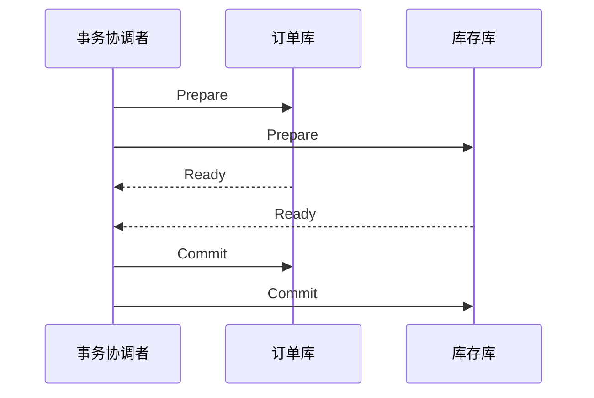

# 分布式事务怎么选：2PC、TCC、Saga、本地消息表？

> 分布式事务不是“把单库事务搬到多服务里”，而是在一致性、可用性、性能和业务改造成本之间做取舍。

## 分布式事务到底在解决什么？

单库事务里，订单和库存可能都在同一个数据库里：

```text
BEGIN
  创建订单
  扣减库存
COMMIT
```

数据库可以用 undo log、redo log、锁和 MVCC 帮你保证事务边界。但微服务拆分后，订单服务和库存服务通常各有自己的数据库：

```text
[订单服务 + 订单库]  ----RPC---->  [库存服务 + 库存库]
```

这时本地事务只能保证自己库里的操作，要让“创建订单”和“扣减库存”最终保持一致，就进入了分布式事务问题。

面试里要先把目标说清楚：**不是所有场景都要强一致**。有的业务必须同步确认，比如账务入账；有的业务可以最终一致，比如订单创建后异步发积分。目标不同，方案就不同。

可以先把一致性要求分成三档：

| 一致性要求 | 含义                                 | 典型场景                       |
| ---------- | ------------------------------------ | ------------------------------ |
| 强一致     | 操作完成后，各方必须马上看到同一结果 | 账务入账、资金冻结、核心库存   |
| 最终一致   | 允许短暂中间状态，但必须可收敛       | 下单后发积分、发通知、同步画像 |
| 最大努力   | 尽量通知成功，失败后靠重试和对账兜底 | 支付回调、物流通知、外部通知   |

这张表决定了后面的方案选择。
如果业务只是发消息通知下游，却强行上 XA，通常是把系统做重了。
如果业务是资金入账，却只说“发 MQ 最终一致”，又会显得不够稳。

## 2PC 和 XA 为什么强但重？

2PC 是两阶段提交：先问所有参与者能不能提交，再统一通知提交或回滚。



XA 可以理解为 2PC 在数据库资源层面的标准化落地：事务管理器协调多个资源管理器，数据库负责 prepare、commit、rollback。

它适合短事务、强一致、并发量不高的场景，比如金融账务里确实不能接受最终一致的局部链路。

但代价也很硬：

- Prepare 后资源会被长时间占用，容易持锁阻塞。
- 协调者故障、网络分区时，参与者可能卡在不确定状态。
- 性能和可用性通常不如本地事务 + 补偿类方案。

所以不要把 2PC/XA 答成“万能强一致方案”。它更像一把重工具，只适合短、关键、强一致的链路。

2PC 最容易被忽略的是“不确定状态”。
参与者已经 Prepare 成功后，本地资源可能已经锁住，接下来如果协调者宕机、网络分区或提交指令丢失，参与者并不知道全局事务最终该提交还是回滚。

可以这样理解：

| 阶段               | 参与者知道什么               | 风险                             |
| ------------------ | ---------------------------- | -------------------------------- |
| Prepare 前         | 本地事务还没进入就绪         | 可以安全失败                     |
| Prepare 成功后     | 自己已经准备好，等协调者指令 | 可能长时间占锁，处于不确定状态   |
| Commit/Rollback 后 | 本地结果明确                 | 需要保证协调者和参与者状态可恢复 |

所以 XA/2PC 的工程重点不只是“能两阶段提交”，还包括协调者高可用、事务日志恢复、超时处理和人工修复能力。

### 3PC 为什么面试可以提，但工程上很少选

3PC 把 2PC 的准备阶段继续拆成 `CanCommit`、`PreCommit`、`DoCommit` 三段，并引入超时机制，试图缓解 2PC 里协调者故障导致参与者长时间阻塞的问题。

但它并不是“完美 2PC”。

关键问题在于：

- 阶段更多，网络交互更多，性能更差。
- 超时默认提交可能在网络分区下引入新的不一致。
- 工程上更常见的方向是共识协议、事务协调器高可用、柔性事务和补偿，而不是直接落地 3PC。

所以回答时可以这样说：

**3PC 是理解 2PC 阻塞问题的补充，但真实业务选型里很少把它作为首选。**

## AT 模式解决什么问题？

AT 模式常见于一站式分布式事务框架里，它的目标是：

**尽量少改业务代码，让框架自动记录回滚信息并做二阶段补偿。**

可以把它理解成：

```text
一阶段：
  执行业务 SQL
  记录 before image / after image
  提交本地事务

二阶段提交：
  删除回滚日志

二阶段回滚：
  根据 before image 生成补偿 SQL
```

它适合大量常规关系型数据库 CRUD 场景。
但别把 AT 说成“自动解决所有分布式事务”。

它的边界也很清楚：

| 关注点   | AT 模式要面对的问题                        |
| -------- | ------------------------------------------ |
| SQL 范围 | 复杂 SQL、特殊语法、批量更新不一定都好支持 |
| 表结构   | 通常要求有主键，且要维护 `undo_log`        |
| 全局锁   | 热点行竞争时可能降低并发                   |
| 脏写防护 | 回滚时要确认数据没有被其他事务改成新状态   |
| 资源类型 | 主要面向关系型数据库，不适合所有外部资源   |

所以 AT 更适合“数据库 CRUD 多、业务不想写 TCC 三套逻辑”的场景。
如果业务资源不是简单数据库行，比如调用外部支付、发券、发货，AT 就很难自动补偿。

AT 还有一个隔离边界要主动说清。
一阶段本地事务已经提交，其他事务理论上可能看到中间结果；框架再通过全局锁和回滚镜像降低脏写风险。
如果某行数据在全局事务回滚前已经被其他本地事务改过，回滚就不能粗暴套用 before image，否则可能覆盖别人的新写入。

所以 AT 不是“自动版 XA”，而是：

**用本地事务先提交换取性能，再靠 undo log、全局锁和脏写校验做二阶段补偿。**

## TCC 适合什么业务？

TCC 是 Try、Confirm、Cancel：

| 阶段    | 做什么         | 转账例子           |
| ------- | -------------- | ------------------ |
| Try     | 检查并预留资源 | 冻结转出账户金额   |
| Confirm | 真正提交       | 扣减冻结金额并入账 |
| Cancel  | 释放预留资源   | 解冻金额           |

它的关键不是框架名字，而是**业务资源预留**。库存可以先冻结，优惠券可以先锁定，账户余额可以先冻结，这类场景适合 TCC。

TCC 比 XA 更灵活，因为它不需要数据库一直持有长事务锁；但它要求业务写三套逻辑，侵入性很高。

落地 TCC 时一定要提三个坑：

1. **幂等**：Confirm/Cancel 可能被重复调用，必须多次执行结果一致。
2. **空回滚**：Try 没真正执行，Cancel 先到了，也要能安全返回成功。
3. **悬挂**：Cancel 先到，后续迟到的 Try 不能再预留资源。

如果这三个问题答不出来，只说“Try、Confirm、Cancel 三阶段”，会显得停留在概念层。

TCC 还要靠事务状态表把异常挡住。
一个简化状态可以这样设计：

```text
TRYING -> CONFIRMED
   │
   └──> CANCELED
```

Confirm 或 Cancel 进来时，先查事务状态：

| 当前状态  | Confirm 到达           | Cancel 到达           |
| --------- | ---------------------- | --------------------- |
| 不存在    | 拒绝或等待 Try 记录    | 记录空回滚并返回成功  |
| TRYING    | 执行确认并置 CONFIRMED | 执行取消并置 CANCELED |
| CONFIRMED | 幂等返回成功           | 拒绝反向取消          |
| CANCELED  | 拒绝悬挂 Try / Confirm | 幂等返回成功          |

这张表背后的原则是：

**TCC 的正确性不只靠三段方法，还靠状态机、防重、空回滚和悬挂控制。**

业务表也最好体现“预留”和“确认”的区别。
比如库存不要在 Try 阶段直接扣成最终库存，而是拆成：

```text
available_stock
frozen_stock
```

Try 先把可用库存转成冻结库存，Confirm 再真正扣掉冻结库存，Cancel 再把冻结库存释放回可用库存。
如果业务资源没有办法表达“预留态”，硬套 TCC 会非常别扭。

## Saga 为什么适合长流程？

Saga 把一个长事务拆成多个本地事务，每一步都有对应补偿动作。

```text
T1 创建订单  ->  T2 扣库存  ->  T3 发优惠券
 |               |              |
C1 取消订单  <-  C2 退库存  <-  C3 回收优惠券
```

它有两种常见恢复思路：

- **反向补偿**：某一步失败后，按相反顺序补偿已经成功的步骤。
- **正向重试**：某一步失败后持续重试，直到成功再继续。

Saga 适合链路长、步骤多、每一步都可以设计补偿的业务，比如履约、审批流、旅行预订、跨系统开通流程。

它的弱点是隔离性不强。因为每一步本地事务都会直接提交，中间状态可能被其他请求看到。比如订单已创建但库存扣减还没成功，这段时间系统必须能识别“处理中”状态，不能把它当成最终成功。

所以 Saga 的关键工程能力是：

- 状态机清晰，知道当前执行到哪一步。
- 每个补偿动作幂等，失败后能重试。
- 有事务日志，服务重启后能继续推进或补偿。
- 有人工介入入口，补偿超过阈值后能对账处理。

Saga 常见有两种组织方式：

| 方式   | 怎么推进                     | 适合场景                     |
| ------ | ---------------------------- | ---------------------------- |
| 编排式 | 有一个协调器按流程驱动每一步 | 流程明确、需要集中观察和控制 |
| 协同式 | 各服务通过事件触发下一步     | 服务自治更强、链路较松散     |

编排式更容易看清当前走到哪一步，但协调器复杂度更高。
协同式更解耦，但排障时要把事件链路串起来，否则容易不知道失败卡在哪一段。

因此 Saga 这类方案里最该说的不是“它适合长事务”，而是：

**长流程一定要有可观测状态机，否则补偿、重试、人工介入都没抓手。**

还要注意：Saga 的补偿不是数据库意义上的 rollback。
补偿动作本身也是一笔新的业务操作。
比如“创建订单”已经对用户可见，后续库存失败时，补偿通常是把订单改成“已取消”，而不是让这条订单像从未存在过。

所以 Saga 系统的查询、运营后台和用户提示都要能表达中间态、取消态和补偿失败态。

## 本地消息表和事务消息解决什么？

很多业务并不需要“多个库同时提交”，只需要保证：**本地业务成功后，消息一定能发出去；消费者重复收到也不会出错**。

本地消息表的做法是把业务数据和待发送消息放在同一个本地事务里：

```text
本地事务：
  1. 创建订单
  2. 插入 outbox_message(status = NEW)

后台任务：
  1. 扫描 NEW 消息
  2. 投递 MQ
  3. 成功后标记 SENT
```

这个方案的优点是 MQ 短暂不可用时，本地业务仍可提交，后续由后台任务继续投递。代价是你要维护消息表、扫描任务、重试策略、消费幂等和对账。

RocketMQ 事务消息是另一种思路：先发送对消费者不可见的半消息，再执行本地事务，最后根据本地事务结果提交或回滚半消息。Broker 后续还可以反查本地事务状态。

它们都不是传统 XA 语义下的强一致，而是在解决“本地事务结果”和“消息可见性”的最终一致。

两者的依赖差异可以这样记：

| 方案       | 本地事务前是否依赖 MQ 可用 | 核心兜底                      |
| ---------- | -------------------------- | ----------------------------- |
| 本地消息表 | 不依赖，消息先写本地库     | 扫表投递、重试、死信、对账    |
| 事务消息   | 通常要先发送半消息         | 本地事务回查、半消息提交/回滚 |

所以不要把事务消息答成“MQ 版 XA”。
它保证的是本地事务结果和消息可见性的最终一致，消费者侧仍然必须幂等。

本地消息表最好补一下落地字段，否则容易讲得太虚：

```text
outbox_message
  id
  biz_type
  biz_id
  payload
  status        NEW / SENDING / SENT / FAILED
  retry_count
  next_retry_at
  created_at
  updated_at
```

投递线程要做的也不只是“扫表发送”：

1. 扫描到期的 `NEW/FAILED` 消息。
2. 抢占发送权，避免多个实例重复投递同一条。
3. 发送 MQ 成功后标记 `SENT`。
4. 失败后增加重试次数并计算下一次投递时间。
5. 超过阈值进入异常表或人工处理。

消费者侧仍然必须幂等。
因为投递线程可能重复发送，MQ 也可能至少一次投递。
所以真正闭环是：

```text
本地事务写 outbox
 -> 后台可靠投递
 -> 消费者幂等处理
 -> 死信 / 异常表 / 对账兜底
```

## 最大努力通知适合什么？

最大努力通知比本地消息表更轻。
它常见于“我把结果尽量通知你，你要保证收到后幂等处理”的场景。

典型例子：

- 支付平台回调商户支付结果。
- 物流平台通知订单物流状态。
- 第三方系统回传审核结果。

它的基本模型是：

```text
发起方完成本地事务
 -> 调接收方回调接口
 -> 失败则按退避策略重试
 -> 超过次数进入人工处理或对账
```

它不适合强依赖实时成功的核心链路。
接收方也不能假设“只会通知一次”，必须用业务单号、事件 ID 或幂等表去重。

## 怎么选方案？

可以按“强一致要求、链路长度、业务侵入、依赖可用性、能否补偿”来判断。

| 场景                               | 推荐方案              | 关键理由                                | 主要代价                     |
| ---------------------------------- | --------------------- | --------------------------------------- | ---------------------------- |
| 短链路、强一致、并发不高           | XA / 2PC              | 数据库资源层面协调，业务侵入低          | 持锁、阻塞、性能和可用性成本 |
| 常规数据库 CRUD，想少改业务        | AT                    | 自动记录回滚日志，二阶段补偿            | SQL 和全局锁边界要评估       |
| 账户、库存、优惠券这类可预留资源   | TCC                   | Try 阶段先冻结资源，Confirm/Cancel 收口 | 业务侵入高，状态机复杂       |
| 履约、审批、跨系统开通这类长流程   | Saga                  | 拆成本地事务，用补偿和状态机推进        | 隔离性弱，中间状态多         |
| 下单成功后发消息、发积分、通知下游 | 本地消息表 / 事务消息 | 保证本地事务与消息最终一致              | 要维护投递、重试、死信、对账 |
| 支付回调、物流通知这类外部通知     | 最大努力通知          | 重试 + 幂等 + 对账即可                  | 不保证强实时成功             |

一个务实的回答是：

1. 核心账务链路优先保证一致性，能短就短，必要时考虑 XA/TCC。
2. 常规 CRUD 可评估 AT，但要确认 SQL、全局锁和 `undo_log` 边界。
3. 普通业务链路优先拆成本地事务，用消息、状态机和补偿保证最终一致。
4. 长流程一定要有事务日志、状态机、重试和人工处理入口。
5. 所有最终一致方案都必须有幂等、重试、死信/异常表、对账和告警。

最终一致系统必须有证据链。
只说“失败会重试”是不够的，还要能回答：

- 当前事务处于哪个状态
- 下一次重试什么时候发生
- 已经重试了几次
- 哪个步骤最后成功，哪个步骤最后失败
- 消费者是否已幂等处理
- 死信、异常表和对账任务能不能定位差异

没有这些证据，最终一致就会退化成“线上慢慢猜”。

## 一个下单链路怎么拆

假设下单链路包括：

```text
创建订单 -> 扣库存 -> 锁优惠券 -> 发积分 -> 发短信
```

不要一上来就说“全都用分布式事务包起来”。
更合理的拆法可能是：

| 环节     | 一致性要求             | 可能方案              |
| -------- | ---------------------- | --------------------- |
| 创建订单 | 本地强一致             | 订单库本地事务        |
| 扣库存   | 需要防超卖，可预留资源 | TCC、库存冻结或状态机 |
| 锁优惠券 | 可预留，可补偿         | TCC 或本地事务 + 补偿 |
| 发积分   | 可最终一致             | 本地消息表 / 事务消息 |
| 发短信   | 可最大努力             | MQ 通知或最大努力通知 |

这里体现的是分层设计：

- 主链路只保必要的一致性。
- 可异步的动作从主事务里拆出去。
- 每个异步动作有自己的幂等、重试和补偿。

这比“一个方案打所有场景”更像真实工程。

## 出问题时怎么排查

分布式事务排障要先问：**卡在哪个阶段？**

| 现象                | 常见方向                                |
| ------------------- | --------------------------------------- |
| XA / 2PC 长时间卡住 | 协调者状态、参与者 prepare 状态、锁等待 |
| AT 回滚失败         | `undo_log`、脏写、SQL 支持范围、全局锁  |
| TCC 重复扣减        | Confirm 幂等、事务状态表、防重键        |
| TCC 空回滚异常      | Try 是否真正执行、Cancel 是否识别空回滚 |
| Saga 卡在处理中     | Saga log、当前步骤、补偿任务和重试次数  |
| 消息最终一致不收敛  | outbox 状态、MQ 投递、消费幂等、死信    |
| 外部通知失败        | 重试策略、对方接口幂等、对账任务        |

排查时不要只看业务表。
还要看事务日志、消息表、异常表、死信队列、重试次数和对账结果。

## 什么时候不该上分布式事务框架

不是所有跨服务流程都需要框架化分布式事务。

这些场景要谨慎：

- 只是非核心通知，用普通 MQ + 幂等就够。
- 查询链路不涉及写一致性。
- 业务不能补偿，却强行套 Saga。
- 外部系统没有幂等接口，却直接做最大努力通知。
- 链路本身可以通过业务重排，改成本地事务 + 异步事件。

很多时候，更好的设计不是“选一个更强的事务框架”，而是：

**缩小强一致边界，把能异步和能补偿的部分从主链路里拆出去。**

## 容易踩的坑

### 把最终一致说成不一致

最终一致不是“错了以后随缘修”，而是有明确状态、重试、补偿、对账和告警的工程闭环。

### 只讲框架不讲业务语义

TCC 的难点不是接入框架，而是资源能不能冻结、Confirm/Cancel 能不能幂等。

### 把 MQ 当成事务数据库

MQ 能帮你传递事件，但不能替你保证消费者业务一定正确。消费者仍要做幂等、重试和异常处理。

### 忽略中间状态

Saga 和消息最终一致都会出现处理中状态，查询接口、运营后台、用户提示都要能表达这个状态。

### 以为有框架就不需要对账

对账不是兜底可选项，而是最终一致系统的最后一道证据链。
只要涉及跨系统、异步、重试和人工介入，就要有能比对业务结果的对账任务。

## 小结

1. 分布式事务的本质是在一致性、可用性、性能和业务侵入之间取舍。
2. XA/2PC 偏强一致但性能重；AT 侵入低但受 SQL、全局锁和回滚日志边界影响。
3. TCC 适合可预留资源的短链路，必须处理幂等、空回滚、悬挂和事务状态机。
4. Saga 适合长流程，用本地事务、补偿动作、Saga log 和状态机实现最终一致。
5. 本地消息表、事务消息和最大努力通知都要靠投递重试、消费幂等、异常处理和对账兜底。

## 参考

综合自仓库内分布式事务参考材料，并结合 Apache Seata、Apache RocketMQ 等公开文档中关于 XA、AT、TCC、Saga、事务消息、本地消息表、最大努力通知、事务状态和异常补偿边界的说明整理。
