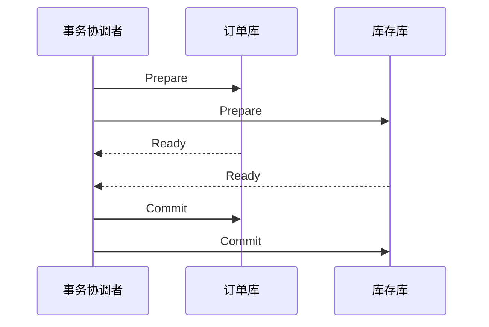

# 分布式事务怎么选：2PC、TCC、Saga、本地消息表？

> 分布式事务不是“把单库事务搬到多服务里”，而是在一致性、可用性、性能和业务改造成本之间做取舍。

## 分布式事务到底在解决什么？

单库事务里，订单和库存可能都在同一个数据库里：

```text
BEGIN
  创建订单
  扣减库存
COMMIT
```

数据库可以用 undo log、redo log、锁和 MVCC 帮你保证事务边界。但微服务拆分后，订单服务和库存服务通常各有自己的数据库：

```text
[订单服务 + 订单库]  ----RPC---->  [库存服务 + 库存库]
```

这时本地事务只能保证自己库里的操作，要让“创建订单”和“扣减库存”最终保持一致，就进入了分布式事务问题。

面试里要先把目标说清楚：**不是所有场景都要强一致**。有的业务必须同步确认，比如账务入账；有的业务可以最终一致，比如订单创建后异步发积分。目标不同，方案就不同。

## 2PC 和 XA 为什么强但重？

2PC 是两阶段提交：先问所有参与者能不能提交，再统一通知提交或回滚。



XA 可以理解为 2PC 在数据库资源层面的标准化落地：事务管理器协调多个资源管理器，数据库负责 prepare、commit、rollback。

它适合短事务、强一致、并发量不高的场景，比如金融账务里确实不能接受最终一致的局部链路。

但代价也很硬：

- Prepare 后资源会被长时间占用，容易持锁阻塞。
- 协调者故障、网络分区时，参与者可能卡在不确定状态。
- 性能和可用性通常不如本地事务 + 补偿类方案。

所以不要把 2PC/XA 答成“万能强一致方案”。它更像一把重工具，只适合短、关键、强一致的链路。

## TCC 适合什么业务？

TCC 是 Try、Confirm、Cancel：

| 阶段    | 做什么         | 转账例子           |
| ------- | -------------- | ------------------ |
| Try     | 检查并预留资源 | 冻结转出账户金额   |
| Confirm | 真正提交       | 扣减冻结金额并入账 |
| Cancel  | 释放预留资源   | 解冻金额           |

它的关键不是框架名字，而是**业务资源预留**。库存可以先冻结，优惠券可以先锁定，账户余额可以先冻结，这类场景适合 TCC。

TCC 比 XA 更灵活，因为它不需要数据库一直持有长事务锁；但它要求业务写三套逻辑，侵入性很高。

落地 TCC 时一定要提三个坑：

1. **幂等**：Confirm/Cancel 可能被重复调用，必须多次执行结果一致。
2. **空回滚**：Try 没真正执行，Cancel 先到了，也要能安全返回成功。
3. **悬挂**：Cancel 先到，后续迟到的 Try 不能再预留资源。

如果这三个问题答不出来，只说“Try、Confirm、Cancel 三阶段”，会显得停留在概念层。

## Saga 为什么适合长流程？

Saga 把一个长事务拆成多个本地事务，每一步都有对应补偿动作。

```text
T1 创建订单  ->  T2 扣库存  ->  T3 发优惠券
 |               |              |
C1 取消订单  <-  C2 退库存  <-  C3 回收优惠券
```

它有两种常见恢复思路：

- **反向补偿**：某一步失败后，按相反顺序补偿已经成功的步骤。
- **正向重试**：某一步失败后持续重试，直到成功再继续。

Saga 适合链路长、步骤多、每一步都可以设计补偿的业务，比如履约、审批流、旅行预订、跨系统开通流程。

它的弱点是隔离性不强。因为每一步本地事务都会直接提交，中间状态可能被其他请求看到。比如订单已创建但库存扣减还没成功，这段时间系统必须能识别“处理中”状态，不能把它当成最终成功。

所以 Saga 的关键工程能力是：

- 状态机清晰，知道当前执行到哪一步。
- 每个补偿动作幂等，失败后能重试。
- 有事务日志，服务重启后能继续推进或补偿。
- 有人工介入入口，补偿超过阈值后能对账处理。

## 本地消息表和事务消息解决什么？

很多业务并不需要“多个库同时提交”，只需要保证：**本地业务成功后，消息一定能发出去；消费者重复收到也不会出错**。

本地消息表的做法是把业务数据和待发送消息放在同一个本地事务里：

```text
本地事务：
  1. 创建订单
  2. 插入 outbox_message(status = NEW)

后台任务：
  1. 扫描 NEW 消息
  2. 投递 MQ
  3. 成功后标记 SENT
```

这个方案的优点是 MQ 短暂不可用时，本地业务仍可提交，后续由后台任务继续投递。代价是你要维护消息表、扫描任务、重试策略、消费幂等和对账。

RocketMQ 事务消息是另一种思路：先发送对消费者不可见的半消息，再执行本地事务，最后根据本地事务结果提交或回滚半消息。Broker 后续还可以反查本地事务状态。

它们都不是传统 XA 语义下的强一致，而是在解决“本地事务结果”和“消息可见性”的最终一致。

## 怎么选方案？

可以按“强一致要求、链路长度、业务侵入、依赖可用性”来判断。

| 场景                               | 推荐方案              | 关键理由                                |
| ---------------------------------- | --------------------- | --------------------------------------- |
| 短链路、强一致、并发不高           | XA / 2PC              | 数据库资源层面协调，业务侵入低          |
| 账户、库存、优惠券这类可预留资源   | TCC                   | Try 阶段先冻结资源，Confirm/Cancel 收口 |
| 履约、审批、跨系统开通这类长流程   | Saga                  | 拆成本地事务，用补偿和状态机推进        |
| 下单成功后发消息、发积分、通知下游 | 本地消息表 / 事务消息 | 保证本地事务与消息最终一致              |
| 支付回调、物流通知这类外部通知     | 最大努力通知          | 重试 + 幂等 + 对账即可                  |

一个务实的回答是：

1. 核心账务链路优先保证一致性，能短就短，必要时考虑 XA/TCC。
2. 普通业务链路优先拆成本地事务，用消息、状态机和补偿保证最终一致。
3. 所有最终一致方案都必须有幂等、重试、死信/异常表、对账和人工处理。
4. 不要只从框架出发选型，要先看业务能不能补偿、能不能暴露中间状态。

## 容易踩的坑

**把最终一致说成不一致。** 最终一致不是“错了以后随缘修”，而是有明确状态、重试、补偿、对账和告警的工程闭环。

**只讲框架不讲业务语义。** TCC 的难点不是接入框架，而是资源能不能冻结、Confirm/Cancel 能不能幂等。

**把 MQ 当成事务数据库。** MQ 能帮你传递事件，但不能替你保证消费者业务一定正确。消费者仍要做幂等、重试和异常处理。

**忽略中间状态。** Saga 和消息最终一致都会出现处理中状态，查询接口、运营后台、用户提示都要能表达这个状态。

## 小结

1. 分布式事务的本质是在一致性、可用性、性能和业务侵入之间取舍。
2. XA/2PC 偏强一致但性能重，适合短事务和关键链路。
3. TCC 适合可预留资源的短链路，必须处理幂等、空回滚和悬挂。
4. Saga 适合长流程，用本地事务、补偿动作和状态机实现最终一致。
5. 本地消息表和事务消息适合业务成功后通知下游，核心闭环是投递重试、消费幂等和对账。

## 参考

基于 Apache ZooKeeper、Apache Dubbo、gRPC、Apache RocketMQ、Apache Seata 官方文档，以及 Raft 扩展论文中一致性、RPC、分布式锁、分布式事务和服务治理相关内容整理。
