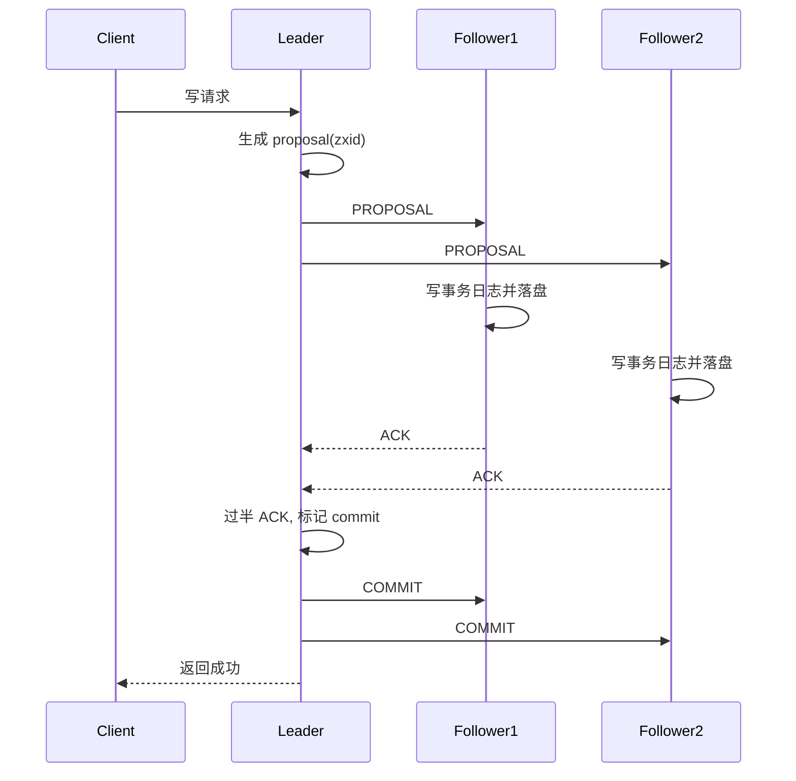

# ZooKeeper 和 ZAB 是什么关系？

> 很多人知道 ZooKeeper 能做注册中心、分布式锁、配置中心，但一问它底层靠什么保证多节点副本不乱，第一反应还是“是不是 Paxos”。更准确的答案是：**ZooKeeper 的核心复制协议是 ZAB，它是为 ZooKeeper 量身定做的原子广播协议。**

先看一个典型场景：

- 3 台 ZooKeeper 节点组成集群
- 客户端发来一个写请求
- 其中一台 follower 正好短暂断网
- 旧 leader 还可能因为长时间 GC 看起来像“假死”

这时系统最怕的是：

- 各副本提交顺序不一致
- 新 leader 选出来后把已经对外承诺过的数据推翻
- 少数派节点恢复后又把旧提案塞回来

ZAB 就是在处理这类问题。

## 先抓一句话：ZooKeeper 用的是“原子广播 + 主备复制”

ZooKeeper 官方 internals 文档写得很明确：

**At the heart of ZooKeeper is an atomic messaging system that keeps all of the servers in sync.**

翻成人话就是：

- 所有写请求最终都要进一条全局有序的消息流
- 所有副本要按相同顺序交付这些消息
- 只要消息顺序一致，状态机结果就不会分叉

所以更稳的理解方式是：

**ZooKeeper 的本质不是“多机共享内存”，而是“多个副本按完全一致的顺序处理同一串事务消息”。**

而承载这套原子广播语义的协议，就是 ZAB。

## ZAB 和 Paxos、Raft 的关系怎么讲？

这题最容易答成一句“ZAB 类似 Paxos / Raft”，但这太粗了。

更准确地说：

- Paxos 是更通用的一致性理论与算法家族
- Raft 是更强调可理解性和工程实现的复制日志协议
- ZAB 是 **ZooKeeper 专用** 的崩溃可恢复原子广播协议

所以：

**ZAB 不是一个拿来普遍套各种系统的通用协议，而是紧贴 ZooKeeper 这类协调服务写路径定制出来的。**

它和 Raft 看起来很像：

- 都有 leader
- 都靠多数派
- 都要处理 leader 崩溃和日志恢复

但 ZAB 更强调的是：

**保证原子广播顺序和 leader 崩溃恢复之后的历史延续性。**

## ZAB 解决的核心问题是什么？

可以先收成一句话：

**在 leader-based 主备模型下，让所有写请求按同一顺序被大多数节点持久化和提交，并在 leader 崩溃后恢复出一条不自相矛盾的历史。**

这句话可以拆成 3 个子目标：

1. 正常广播时，写请求全局有序
2. 过半节点确认后，提交才算成立
3. 崩溃恢复后，新 leader 不能把已提交历史搞丢

## ZooKeeper 集群里的角色，和 Raft 有点像

从工程视角看，可以先把角色记成：

| 角色     | 职责                                    |
| -------- | --------------------------------------- |
| Leader   | 接收并排序写请求，发 proposal，推进提交 |
| Follower | 接收 proposal，落盘 ACK，参与投票       |
| Observer | 接收同步流量，但不参与投票              |

这里最关键的一句是：

**真正参与法定人数（quorum）投票的是 Leader + Followers，Observer 不算票。**

这也是 ZooKeeper 为什么能用 Observer 扩读而不改变写一致性机制。

角色边界可以再说细一点：

- Leader 可以处理读写，并负责给写请求排序
- Follower 可以直接处理读请求，收到写请求时转发给 Leader
- Observer 也可以处理读请求并接收同步流，但不参与选举，也不参与写入过半确认

所以 Observer 的价值是扩展读能力，而不是扩展写能力。
如果把 Observer 加进 quorum 计算，写入要等待的节点反而会变多，整体写吞吐会更差。

## `zxid` 是什么？为什么它很关键？

ZAB 里最重要的抓手之一就是：

```text
zxid
```

官方 internals 文档明确说：

- proposal 会带一个全局事务 id
- 这个 id 体现全局顺序

并且 `zxid` 是一个 64 位编号，两段式拆分：

1. 高 32 位是 epoch
2. 低 32 位是事务计数器

翻成人话就是：

- epoch 用来标识“这是谁的领导期”
- counter 用来标识“在这个领导期里的第几条事务”
- 新 Leader 上位时，epoch 增加，低 32 位从新领导期重新计数

所以 `zxid` 的价值不是单纯编号，而是：

**同时把领导期变化和事务全序顺序编码进去了。**

这也是为什么恢复时大家会特别在意“谁见过更高的 zxid”。

你在 ZooKeeper 数据模型里看到的 `cZxid`、`mZxid`、`pZxid`，本质上也是 `zxid` 在不同语义下的体现：

- `cZxid`：节点创建时对应的事务
- `mZxid`：节点数据最后一次修改对应的事务
- `pZxid`：子节点列表最后一次变化对应的事务

这些字段不是业务版本号，而是 ZooKeeper 用来表达事务顺序和数据变化历史的线索。

## ZAB 为什么要分成两个阶段？

ZooKeeper 官方 internals 文档把原子广播流程拆成两段：

1. Leader activation
2. Active messaging

对应到更好理解的话，可以翻成：

### 1. 崩溃恢复 / Leader 激活阶段

目标是：

- 选出新的 leader
- 让新 leader 和多数节点对齐一份“可信历史”
- 确认新 leader 真能代表后续写入

### 2. 正常消息广播阶段

目标是：

- leader 接受新写请求
- 把它们按顺序 proposal 给 followers
- 过半 ACK 后提交

所以 ZAB 不是一个永远都在“只广播”的协议，它有很强的恢复阶段语义。
这也是它和很多简化版“主从同步”最大的不同。

## 正常写请求在 ZAB 里怎么走？

先看一条写请求的主线：

1. 客户端把写请求发给 leader
2. leader 生成新的 proposal，并分配新的 `zxid`
3. leader 把 proposal 广播给 followers
4. follower 收到后先写本地事务日志并落盘
5. follower 落盘成功后回 ACK
6. leader 收到过半 ACK 后，认为这条事务 committed
7. leader 再广播 commit，副本把事务应用到内存状态

可以画成：



这里最关键的一句是：

**ACK 不是“我收到了”，而是“我已经把 proposal 持久化到本地日志了”。**

这也是为什么 ZooKeeper 对事务日志 I/O 很敏感，事务日志盘慢，P99 会直接恶化。

还有一个容易被漏掉的顺序细节：

**Leader 会为每个 peer 维护 FIFO 发送队列，配合 TCP 连接顺序和递增的 `zxid`，保证 proposal 按顺序交付。**

如果 proposal 可以乱序到达，Follower 即使都落了盘，也无法保证状态机按同一条全局事务流执行。
所以 ZAB 的顺序性不是只靠一个编号字段，而是 `zxid`、Leader 单点排序、FIFO 队列、TCP 顺序传输共同配合出来的。

## 为什么说它“像两阶段提交，但又不完全一样”？

ZooKeeper 官方 internals 文档自己就提到：

**Active messaging operates similar to a classic two-phase commit.**

但它又不是普通业务 2PC，因为：

- 它有严格的全局顺序要求
- 所有 proposal 都要进入一条全序消息流
- 恢复阶段和 leader 领导期也要一起参与安全性约束

所以更稳的说法是：

**ZAB 的正常广播阶段看起来像 2PC，但它是放在一条全序事务流和 leader 恢复语义里运行的。**

## 为什么 ZooKeeper 写一定要走 leader？

官方 overview 文档里说得很清楚：

- 写请求最终会被转发到一个 leader
- followers 接收 proposal 并达成一致交付

这点非常关键，因为它决定了：

**ZooKeeper 是 leader-based write path，不是多主写。**

这带来的好处是：

1. 写顺序来源唯一，更容易推理
2. proposal 编号和提交点推进更容易统一
3. 崩溃恢复时更容易围绕 leader 历史收敛

代价也很明显：

- leader 成为写瓶颈
- 写吞吐天然不如“本地随便写”

这也是为什么 ZooKeeper 更适合协调类场景，而不是高写吞吐 OLTP 主库。

## 崩溃恢复阶段到底在保证什么？

这是 ZAB 和普通主从复制最容易拉开差距的地方。

恢复阶段最核心的目标不是“赶紧选个主”，而是：

1. 找到拥有足够新历史的 leader
2. 让过半节点承诺追随它
3. 清理掉那些没有真正提交过的旧 proposal

ZooKeeper 官方 internals 文档有两个特别关键的要求：

- 新 leader 要见过最高的 `zxid`
- 过半节点要承诺 follow 它

这两条一起用，才保证了：

**新 leader 不会在不知道最新历史的情况下接管写入。**

如果按恢复流程再拆细一点，可以理解成三段：

1. **Discovery**：找到新 Leader，并收集各节点最后看到的历史
2. **Synchronization**：让 Follower 和新 Leader 的历史对齐
3. **Broadcast**：恢复正常写入广播

同步阶段常见有三种处理方式：

| 方式    | 什么时候用                         | 做什么                     |
| ------- | ---------------------------------- | -------------------------- |
| `DIFF`  | Follower 只落后一点                | 给它补齐缺失事务           |
| `TRUNC` | Follower 有未提交的多余旧 proposal | 截断到新 Leader 认可的位置 |
| `SNAP`  | 差距太大或日志不足                 | 直接发快照做全量同步       |

这里有两个关键边界：

- 已经被 quorum 提交、只是还没广播到所有节点的 proposal，恢复后必须保留
- 只留在旧 Leader 或少数派节点本地、没完成 quorum 的 proposal，恢复后必须丢弃

ZAB 的恢复阶段就是在把这两类历史分清楚。
否则要么丢掉已经承诺过的写入，要么把没真正提交过的旧 proposal 带进新历史。

## 为什么少数派旧 leader 恢复后不会把历史写乱？

这就是 epoch + quorum 共同工作的意义。

如果旧 leader 只是短暂假死，等它回来时：

- 多数派可能已经拥护了新 leader
- 新 leader 的 epoch 更高
- 旧 leader 的 proposal 会因为 epoch / 历史落后被拒绝

所以 ZAB 抵御“脑裂”不是单靠一个字段，而是：

**更高 epoch + 多数派承诺 + 已提交历史不能回滚**
一起起作用。

这点和 Raft 的任期 + 多数派交集有明显相似性。

## ZooKeeper 的一致性到底是什么级别？

这点很容易被讲错。

ZooKeeper 官方 overview 文档给出的保证包括：

- Sequential Consistency
- Atomicity
- Single System Image
- Reliability
- Timeliness

所以最稳的答法不是一口咬死“绝对线性一致”。

更准确地说：

- 写路径在 leader + 原子广播下非常强
- 但读请求默认可以由本地副本直接服务
- 所以某些时刻读到旧数据是有可能的

如果你要求更强的新鲜度，需要借助：

```text
sync
```

或者明确利用它的会话视图保证来推理。

所以可以这样总结：

**ZooKeeper 对写序和全局事务顺序控制很强，但默认读并不是“每次都必须打到全局最新状态”的那种粗暴强一致。**

举个例子：

1. 客户端 A 写入 `/config/version = 2`，写请求已经在 Leader 侧成功提交
2. 客户端 B 连接到一个同步稍慢的 Follower
3. B 立刻普通读 `/config/version`

这时 B 可能暂时读到旧值 `1`。
如果 B 必须读到刚提交的新值，就要先 `sync`，或者把读路由到能满足新鲜度要求的路径上。

所以 ZooKeeper 的读一致性要结合会话、`sync` 和读路由讲，不能简单答成“默认线性一致读”。

## 为什么 ZooKeeper 适合“读多写少”的协调场景？

ZooKeeper 官方 overview 文档也直接说了：

**它特别适合读远多于写的场景。**

原因很简单：

- 读可以本地副本直接服务
- 写必须走 leader、过半落盘、原子广播

所以它很适合：

- 配置中心
- 选主
- 分布式锁协调
- 命名服务

但如果你拿它去扛高频写入主业务数据，就会天然撞上它协议路径的成本。

## ZAB 和 Raft 最值得怎么对比？

不要只说“都像 leader 协议”。
更稳的是这样比：

| 维度     | ZAB                             | Raft                       |
| -------- | ------------------------------- | -------------------------- |
| 核心目标 | ZooKeeper 的原子广播与恢复      | 通用复制日志一致性         |
| 语义侧重 | 崩溃恢复后的历史延续 + 原子广播 | 可理解性 + 复制日志主线    |
| 写路径   | 强 leader                       | 强 leader                  |
| 工程定位 | ZooKeeper 专用                  | 通用型、一致性系统广泛采用 |

一句话落地就是：

**Raft 更像通用复制日志协议，ZAB 更像为 ZooKeeper 量身定做的原子广播协议。**

## 一个更稳的排障顺序

如果线上 ZooKeeper 集群写入抖动、频繁选主或读到旧值，我会按这个顺序看：

```text
1. 现在有没有稳定 leader？
2. 多数派还在不在？
3. fsync / 事务日志盘是不是慢了？
4. proposal 是卡在广播，还是卡在 ACK 过半？
5. 读流量是不是落在了相对旧的 follower？
6. 是正常恢复阶段的短暂不可用，还是出现了长期 quorum 问题？
```

很多时候问题不在“ZAB 逻辑错了”，而在：

- 磁盘刷盘慢
- 网络分区
- 少数派节点抖动
- 读写混着看，误以为系统强一致读没达成

## 容易踩的坑

### 把 ZooKeeper 底层直接说成 Paxos

这不准确。
更稳的说法是：

**ZooKeeper 的核心协议是 ZAB，而不是把 Paxos 原样塞进去。**

### 把 ACK 理解成“收到包就算成功”

也不对。
关键在于：

**Follower 要先持久化 proposal，再回 ACK。**

### 把 ZooKeeper 的读写一致性讲成同一个强度

不对。
它对写顺序控制很强，但默认读语义要分场景讲，不能一句“绝对强一致”带过去。

## 小结

- ZooKeeper 依赖的是 ZAB，这是一套面向 ZooKeeper 原子广播与崩溃恢复场景的 leader-based 协议。
- 正常写路径是 leader 生成 proposal、followers 落盘 ACK、过半后 commit，再对外返回成功。
- `zxid` 把领导期和事务顺序编码在一起，是 ZAB 排序和恢复的关键抓手。
- 崩溃恢复阶段的核心不是“选个主”这么简单，而是要保证新 leader 接手的是一条不会推翻已提交历史的日志线。
- ZAB 和 Raft 有相似的多数派、强 leader 思想，但 ZAB 更紧贴 ZooKeeper 的原子广播需求，而 Raft 更偏通用复制日志协议。

## 参考

基于 ZooKeeper 官方文档、ZAB 原子广播相关论文与 ZooKeeper 读写一致性说明整理，并结合 `zxid`、quorum、Observer、`sync`、`DIFF/TRUNC/SNAP` 等机制做了交叉校验。
