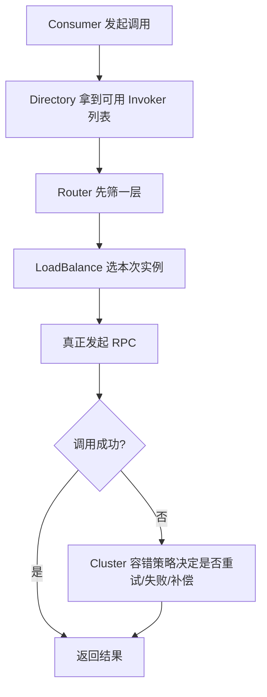

# Dubbo 的注册发现、负载均衡和容错怎么配合？

> Dubbo 真正强的地方，不只是“能调远程服务”，而是它把**服务发现、实例选择和失败处理**这三层治理逻辑串成了一条完整调用链。一次调用失败后，框架不是简单报错，而是按路由、负载均衡、集群容错策略重新做选择。

先看一个最典型的场景：

- 订单服务要调用户服务
- 用户服务有 5 个实例
- 其中 1 个实例突然变慢，另 1 个实例刚好下线

如果只是一个裸 RPC client，调用方通常只能：

- 维护一份地址列表
- 随便选一台打过去
- 失败了自己决定要不要重试

而 Dubbo 这类框架真正做的，是把“调谁、失败后怎么办、地址变了怎么感知”都做成统一机制。

## 先抓一句话：Dubbo 的治理能力发生在“一次调用之前和之后”

很多人把 Dubbo 理解成“比普通 RPC 多一个注册中心”，这太浅了。

更准确地说，Dubbo 在一次调用前后会多出一整圈治理层：

```text
拿服务目录
 -> 路由过滤出子集
 -> 负载均衡选实例
 -> 发起调用
 -> 失败后按集群容错策略处理
```

这也是为什么现有资料和 Dubbo 官方文档里会反复提到几个核心抽象：

- `Invoker`
- `Directory`
- `Router`
- `LoadBalance`
- `Cluster`

它们不是几个零散名词，而是一条完整调用链上的不同层。

## 先把几个核心角色分清

Dubbo 调用链里最值得你先答清的，不是实现类，而是职责边界。

| 组件          | 职责                                              |
| ------------- | ------------------------------------------------- |
| `Invoker`     | Dubbo 对一次可调用服务的抽象                      |
| `Directory`   | 一组可用 `Invoker` 的动态目录                     |
| `Router`      | 根据规则从目录里筛出候选子集                      |
| `LoadBalance` | 从候选子集里选本次具体实例                        |
| `Cluster`     | 把多个 `Invoker` 包成一个，对上层屏蔽失败处理细节 |

最关键的一句是：

**上层看到的是“我要调一个服务”，底层其实是在一组可变实例上做多轮筛选和失败处理。**

## 服务发现这一层，到底做了什么？

Dubbo 官方文档对服务发现的描述很明确：

**Provider 注册地址，Consumer 订阅地址变化，注册中心负责聚合和推送更新。**

也就是说，服务发现至少做了三件事：

1. Provider 把自己可提供的服务地址注册出去
2. Consumer 拿到自己关心服务的实例列表
3. 实例上下线时，Consumer 侧目录能动态更新

所以它不是“启动时查一下地址”就结束，而是：

**服务目录是动态变化的。**

这也正是为什么 Dubbo 体系里 `Directory` 很重要。
它更像一个动态服务目录，而不是固定 `List<Invoker>`。

## 为什么注册中心宕机了，已运行服务通常还不会立刻挂？

这是 Dubbo 里一个很常见的面试点。

现有资料和官方资料都提到：

- Consumer 会在本地缓存服务列表
- 注册中心更多承担“发现和变更通知”角色

所以如果注册中心挂了：

- 新地址变更没法及时同步
- 但已经拿到目录的 Consumer，通常还能继续按本地目录调用

这点很重要，因为它说明：

**注册中心不是每次调用都同步参与转发，而更像控制面/目录服务。**

## 负载均衡在 Dubbo 里发生在哪一层？

很多人会把它理解成“拿到服务列表后随便选一个”，但官方文档给的视角更细：

**负载均衡发生在 Consumer 侧，由 Consumer 根据算法从候选提供者中选出本次调用实例。**

也就是说，Dubbo 提供的是**客户端负载均衡**。

所以一次请求通常不是“注册中心给你一台机器”，而是：

1. 注册中心给你一批地址
2. Consumer 自己在本地做选择

这比中心化调度更轻，也减少了注册中心的运行时转发压力。

## 路由、负载均衡、容错为什么不是一回事？

这是 Dubbo 这篇最值得讲透的一层。

它们发生在同一条链上，但职责完全不同：

### 1. 路由：先缩小候选范围

比如：

- 同城优先
- 标签路由
- 灰度流量只打某些实例

这一步会从所有实例里先筛出一个子集。

### 2. 负载均衡：再从子集里选一个

比如：

- 加权随机
- 加权轮询
- 最少活跃数
- 一致性 Hash

这一步决定“本次具体打谁”。

### 3. 容错：调用失败后再决定下一步

比如：

- 重试另一台
- 直接失败返回
- 忽略异常
- 异步补偿重发

所以更准确地说：

```text
先路由
 -> 再负载均衡
 -> 最后才是失败后的容错策略
```

这个顺序很关键。Dubbo 官方博客和文档都明确强调了这一点。

## Dubbo 默认负载均衡是什么？

这里要注意版本边界。

资料里很多内容还是 Dubbo2 语境，常见回答是：

- 默认 `random`

而 Dubbo 当前官方文档里，对新版 Java SDK 的表述是：

- 默认是 **weighted random**

所以更稳的答法是：

**Dubbo 的默认思路一直是加权随机，只是不同版本文档和命名表述会有差异。**

核心不是背默认值，而是知道它想解决什么：

- 权重大就多分流量
- 同时避免单纯轮询在动态权重场景下的僵硬问题

## Dubbo 常见负载均衡策略，工程上怎么理解？

官方文档里列得比较全，这里不全背实现，重点讲使用语义。

| 策略        | 更适合什么场景           | 主要代价/风险          |
| ----------- | ------------------------ | ---------------------- |
| 加权随机    | 通用默认场景             | 慢节点可能持续被命中   |
| 加权轮询    | 希望流量更平滑           | 面对突发抖动不一定更优 |
| 最少活跃数  | 请求时延差异大           | 依赖活跃数统计质量     |
| 一致性 Hash | 有状态请求、同参落同实例 | 容易热点倾斜           |

所以负载均衡不是“选个算法就完了”，而是要结合：

- 节点性能差异
- 请求幂等性
- 是否有状态
- 延迟敏感程度

一起看。

## 为什么一致性 Hash 不是“高级默认答案”？

很多人一听一致性 Hash，就觉得很高级。

但它更适合的是：

- 相同参数要尽量落到同一实例
- 例如某些会话粘性、有状态缓存命中场景

它的问题也很明显：

- 热点参数会把请求压到少数实例
- 实例上下线时仍然会有局部抖动

所以在普通无状态服务调用里，它不一定比随机/轮询更合适。

## 容错在 Dubbo 里为什么叫 Cluster？

因为从调用方视角看，它面对的不是一台机器，而是一个服务提供者集群。

Dubbo 的 `Cluster` 抽象做的事情是：

**把一组 `Invoker` 对上层伪装成一个可调用 `Invoker`，并把失败处理逻辑包在里面。**

这点很关键，因为它解释了：

- 为什么业务方看到的还是一次方法调用
- 但底层可以在失败后换实例、重试、忽略或异步补偿

也就是说，容错不是“调用之后额外加个 if”，而是已经被包进了 cluster invoker 这层抽象里。

## Dubbo 默认容错策略是什么？

官方文档当前给出的默认值是：

- **failover**

它的意思是：

- 一次调用失败后
- 自动换别的服务器重试

这通常更适合：

- 读操作
- 幂等操作

但也有明显副作用：

1. 增加调用时延
2. 放大下游压力
3. 非幂等写操作可能出问题

所以这类策略不能脱离业务语义单独看。

## Dubbo 几种常见容错策略，工程上怎么选？

官方文档里最常见的是这些：

| 策略        | 含义                     | 更适合                   |
| ----------- | ------------------------ | ------------------------ |
| `failover`  | 失败自动切换并重试       | 幂等读请求               |
| `failfast`  | 快速失败，不重试         | 非幂等写请求             |
| `failsafe`  | 忽略异常                 | 审计日志、辅助逻辑       |
| `failback`  | 失败后异步补偿重发       | 通知类、弱一致任务       |
| `forking`   | 并行打多台，谁先成功用谁 | 强实时读，但资源贵       |
| `broadcast` | 广播调用所有节点         | 通知所有提供者的特殊场景 |

这张表里最重要的一句不是背选项，而是：

**容错策略要和幂等性绑在一起看。**

比如：

- 扣库存、扣余额这种非幂等写操作
- 用 `failover` 就很危险
- 查询详情、读缓存这种幂等读操作
- `failover` 才更合理

## 注册发现、负载均衡、容错是怎么串成一次调用的？

这是这篇的主问题。

你可以把一次 Dubbo 调用理解成下面这条链：



这条链里，三层配合关系可以压成：

- 注册发现保证“你知道当前有哪些可用实例”
- 负载均衡保证“你知道这次该优先打谁”
- 容错策略保证“如果这次打挂了，下一步怎么处理”

所以 Dubbo 真正强的地方，不是某一个单点能力，而是：

**把这三层连成了一个统一调用框架。**

## 为什么 Dubbo 的容错和超时、重试必须一起看？

因为只讲 `cluster=failover` 没什么意义。

真正影响结果的是：

- timeout
- retries
- loadbalance
- cluster strategy

它们一起决定：

1. 这次调多久算失败
2. 失败后要不要换实例
3. 换哪个实例
4. 最多试几次

举个例子：

- timeout 很短
- retries 很大
- 负载均衡又总能打到慢节点

结果就可能是：

- 消费端不断超时重试
- 下游更雪崩
- 整条链路被放大故障

所以在生产里：

**容错策略不是单独配置项，而是一组联合策略。**

## 为什么说 Dubbo 的“重试”不是无害优化？

官方文档和社区资料都反复提醒过：

- 重试会增加响应时间
- 会增加系统资源消耗
- 还可能把故障放大

尤其对非幂等请求，风险更大。

比如：

- 新增订单
- 扣库存
- 发红包

如果调用其实已经在服务端执行成功，只是响应在网络里丢了，这时 Consumer 再重试，就可能把业务做两遍。

所以一个更成熟的说法是：

**Dubbo 的 failover 更像“读链路友好默认值”，而不是所有调用通用默认值。**

## Dubbo3 在服务发现上，有什么和旧资料不一样的地方？

这个点值得主动提，因为很多资料还是 Dubbo2 时代的表述。

当前官方文档提到：

- Dubbo3 的服务发现模型更强调**应用级聚合**
- 并且还引入了 metadata 通道配合地址发现

所以如果你看到旧资料里很多内容还是：

- 服务级地址模型
- Dubbo2 术语

也别直接照抄到今天。更稳的答法是：

**核心协作关系没变，但 Dubbo3 在服务发现数据模型和大规模集群可扩展性上做了明显演进。**

## 一个更稳的排障顺序

如果线上 Dubbo 调用不稳定，我建议按这个顺序收敛：

```text
1. 服务目录有没有及时更新？
2. 路由规则是不是先把可用实例筛没了？
3. 负载均衡是不是总打到慢节点/热点节点？
4. timeout 和 retries 是否配置得过激？
5. 当前 cluster 策略是否和幂等语义匹配？
6. 是提供者真的挂了，还是消费者本地缓存目录已经脏了？
```

很多“Dubbo 调不稳”的问题，最后其实不是协议错了，而是：

- 目录更新慢
- 负载均衡不合适
- 重试把故障放大

## 容易踩的坑

### 把注册中心理解成调用转发中心

不对。
注册中心主要负责目录服务和变更通知，不是每次请求都帮你中转。

### 把路由、负载均衡、容错当成一回事

它们在一次调用里分属不同阶段：

- 先路由
- 再负载均衡
- 失败后再按容错策略处理

### 觉得 `failover` 天然更高级

也不对。
它更适合幂等读，不适合所有写请求。

## 小结

- Dubbo 一次调用里的治理主线是：服务发现维护实例目录，路由和负载均衡决定本次打谁，容错策略决定失败后怎么办。
- `Directory`、`Router`、`LoadBalance`、`Cluster` 不是零散概念，而是一条完整调用链上的不同层次。
- Dubbo 默认更偏客户端负载均衡和 failover 容错，但这些策略要和超时、重试、幂等性一起看。
- 注册中心主要承担目录发现和变更通知，不是调用链上的实时转发节点。
- Dubbo3 在服务发现模型上相比 Dubbo2 有明显演进，回答时要注意新旧资料边界。

## 参考

综合自 Dubbo/RPC 资料，并结合 Apache Dubbo 官方文档中关于服务发现、负载均衡、集群容错与调用链分层的说明，重写了 Dubbo 在一次调用中的治理协作主线。
