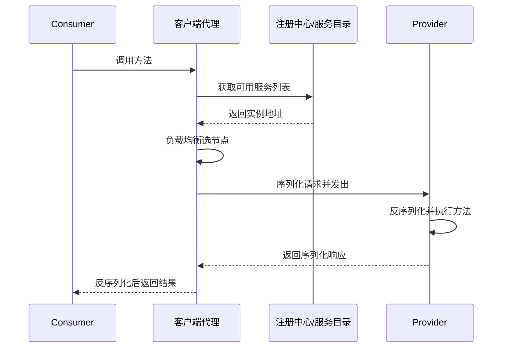

# RPC 一次调用经历了哪些步骤？

> RPC 真正解决的，不是“怎么发个网络请求”这么简单，而是**怎么把一次跨机器的方法调用，包装得尽可能像本地方法调用，同时把服务发现、序列化、网络传输、超时重试这些复杂度藏在框架里。**

先看一个最常见的业务场景：

- 订单服务要查用户信息
- 用户服务部署在另一台机器
- 调用方不想自己手写 socket、序列化、重试、路由

这时如果没有 RPC，你要自己处理：

- 服务地址在哪
- 请求怎么编码
- 网络超时怎么办
- 返回值怎么还原

RPC 就是在把这些步骤统一收口。

## 先抓一句话：RPC 的目标是“像本地调用一样调远程服务”

资料里对 RPC 的定义已经很明确：

**Remote Procedure Call，本质上是远程过程调用。**

它想达到的体验是：

```java
User user = userService.getById(1L);
```

调用方写起来像本地方法，但底层实际发生的是：

- 找服务地址
- 把方法名和参数打包
- 走网络发出去
- 对端执行后再把结果传回来

所以更稳的说法是：

**RPC 的重点不是“远程”，而是“把远程调用包装成本地调用心智”。**

## 一次 RPC 调用，主线可以先拆成 7 步

如果不纠结框架细节，一次典型 RPC 可以先压成：

1. 服务消费者拿到代理对象
2. 代理对象组装请求
3. 从注册中心或本地缓存里拿可用服务地址
4. 负载均衡挑一台实例
5. 请求序列化并通过网络发出
6. 服务端反序列化、执行业务方法
7. 结果再序列化回传，客户端反序列化得到返回值

可以先画成：



下面按工程上最有价值的粒度拆。

## 第一步：消费者拿到的通常不是“真实服务”，而是代理

这是 RPC 里最关键的一层抽象。

调用方代码里看到的是：

```java
userService.getById(1L)
```

但这个 `userService` 在消费者侧大概率并不是一个真实实现类，而是：

- 动态代理
- stub / proxy
- 某种 client invoker

它的工作不是执行业务，而是：

1. 拦截方法调用
2. 收集方法名、参数、接口信息
3. 组装成 RPC 请求对象

所以如果有人问“为什么 RPC 调用看起来像本地方法”，第一反应应该是：

**因为调用点拿到的是代理，不是远程服务真实对象。**

## 第二步：请求要被组装成可传输的消息

代理拦到方法调用后，通常会把这些信息组起来：

- 接口名
- 方法名
- 参数类型
- 参数值
- 请求 id
- 消息类型和协议版本
- 状态码 / 错误码
- 超时、版本、路由标签等元数据

可以简单理解成一个 `RpcRequest`：

```text
serviceName = UserService
methodName = getById
args = [1]
requestId = xxx
```

这里最重要的是：

**网络上传的是一条结构化请求消息，不是“直接把 Java 方法搬过去执行”。**

如果底层走 TCP，还要特别注意：TCP 是字节流，不天然知道“一次 RPC 请求从哪里开始、到哪里结束”。
所以 RPC 协议通常还要定义：

- 魔数或协议标识
- 消息长度
- 请求 id
- 序列化方式
- 压缩方式
- 心跳包类型
- 响应状态码和错误码

这些字段解决的是“怎么拆包、怎么匹配响应、怎么识别异常响应”的问题。
没有这一层，网络连接再可靠，框架也不知道收到的字节应该还原成哪一次方法调用。

## 第三步：服务地址从哪里来？

这是 RPC 和“单纯有个 socket client”差别很大的一层。

在真实分布式系统里，服务提供者往往不是固定一台，而且可能会：

- 扩容
- 缩容
- 下线
- 故障摘除

所以调用方需要先知道“当前可调谁”。

常见有两种方式：

### 1. 直连

地址写死或配置死，比如：

```text
10.0.0.12:20880
```

这种方式简单，但灵活性差。

### 2. 服务发现

通过注册中心、服务目录、本地缓存拿到可用实例列表。

比如 Dubbo 体系里就会有：

- Provider 注册服务
- Consumer 订阅服务
- 注册中心返回可用地址列表

所以更准确地说：

**很多 RPC 框架真正做的不只是“发请求”，而是“先解决服务发现，再发请求”。**

## 第四步：拿到实例列表后，还要做负载均衡

如果有多个实例可调，就不能每次都拍脑袋选。

常见策略比如：

- 随机
- 轮询
- 一致性 Hash
- 最小活跃数
- 按权重选择

这也是为什么现有资料会把负载均衡单独拎出来讲。
因为对 RPC 来说，负载均衡不是附属能力，而是高可用和性能的一部分。

所以一次 RPC 真正到发请求前，通常会多一步：

**先从服务列表里按规则选出这次要打的目标实例。**

## 第五步：序列化和网络传输才真正开始

选好目标实例以后，才能发请求。

这时会发生两件事：

### 1. 序列化

也就是把内存里的请求对象转成字节流。

常见协议/方式包括：

- JDK 序列化
- Hessian
- Protobuf
- Kryo
- JSON

这里的取舍通常要看：

- 性能
- 跨语言需求
- 数据体积
- 可演进性

### 2. 网络传输

然后字节流再通过网络协议发出去。

底层可能是：

- TCP
- HTTP/2
- 自定义二进制协议

比如：

- Dubbo 会有自己的协议栈和服务治理能力
- gRPC 走 HTTP/2 + Protobuf

所以 RPC 的“协议”其实经常是两层概念叠在一起：

1. 应用层消息格式怎么编码
2. 网络层怎么传

## 连接不是每次调用都现建

真实 RPC 框架一般不会每次方法调用都重新建连接。
更常见的是：

- 长连接复用
- 连接池
- 多路复用
- 心跳保活
- 空闲连接清理
- 连接健康检查

这层一旦出问题，表现会很像“下游服务慢”，但根因可能完全不在业务方法里。

比如：

- 连接池耗尽，请求一直排队等待连接
- 空闲连接被中间设备清掉，第一次复用时才发现连接不可用
- 心跳超时，框架把实例判成不健康
- 单连接多路复用时，某个大响应拖慢后续数据处理

所以排查 RPC 延迟时，不能只看服务端方法耗时，还要看连接获取耗时、活跃连接数和心跳状态。

## 第六步：服务端收到请求后，并不是立刻“直接执行业务”

服务端通常也会有一层 server stub / provider invoker。

它要做的事情一般包括：

1. 收到字节流
2. 反序列化成请求对象
3. 找到目标服务实现
4. 定位具体方法
5. 把请求交给业务线程池或调用器执行
6. 反射或框架调用执行业务方法
7. 捕获结果或异常

也就是说，服务端接到的不是一个现成方法调用，而是一条“请你帮我调用这个服务方法”的消息。

这层如果出问题，典型表现就会是：

- 反序列化失败
- 服务找不到
- 方法签名不匹配
- 版本不兼容

还要注意线程边界。很多 RPC 框架不会在网络 I/O 线程里直接跑业务方法，而是把请求解码后投递到业务线程池，执行完再把响应交回网络层写出去。这样做是为了避免慢业务把 I/O 线程卡死，但它也引入了新的排障点：业务线程池满了、队列堆积了、拒绝策略触发了，客户端看到的仍然可能只是“RPC 超时”。

## 第七步：结果要再走一遍“包装 -> 序列化 -> 回传”

执行完成以后，服务端不会直接把 Java 对象瞬移回客户端，而是还要：

1. 把返回值或异常包装成响应对象
2. 序列化
3. 发回客户端
4. 客户端再反序列化

所以最终调用方拿到结果时，其实已经过了两次对称流程：

```text
请求：对象 -> 字节流 -> 对端对象
响应：对象 -> 字节流 -> 本地对象
```

这也是为什么很多 RPC 线上问题最后会落到：

- 序列化兼容性
- 字段新增删除
- 跨版本 schema 不匹配

## 一次失败到底失败在哪里？

RPC 最容易被低估的一点，是错误语义很复杂。

同样是“调用失败”，含义可能完全不同：

| 错误类型       | 典型含义                     | 是否适合重试             |
| -------------- | ---------------------------- | ------------------------ |
| 连接失败       | 请求可能还没发到服务端       | 可以少量重试             |
| 连接重置       | 请求可能没到，也可能响应丢了 | 要结合幂等性判断         |
| 客户端超时     | 不知道服务端是否已经执行     | 写操作不能盲目重试       |
| 服务端业务异常 | 方法执行了，但业务规则不通过 | 通常不该重试             |
| 反序列化异常   | 协议或 schema 不兼容         | 重试通常没意义           |
| 服务找不到     | 路由、版本或注册发现有问题   | 先修配置，不要靠重试掩盖 |
| 权限失败       | 鉴权不通过                   | 不该重试                 |

这里最关键的一句是：

**超时不等于失败，更不等于服务端没执行。**

客户端在超时时刻只知道“我没等到响应”。
服务端可能还没收到请求，也可能已经执行成功，只是响应包丢了，或者响应回来时客户端已经放弃了。

这就是为什么扣库存、创建订单、发券这类写操作必须先设计幂等键和状态机，再谈重试。

## 一次调用真正“复杂”的地方，其实不是方法调用本身

真正复杂的是围绕调用过程的一整圈治理能力。

比如：

- 超时控制
- 重试
- 熔断
- 负载均衡
- 服务发现
- 限流
- 链路追踪

这些能力如果都让业务方自己写，RPC 就失去了价值。
所以成熟 RPC 框架真正值钱的地方，往往不是“能调远程方法”，而是：

**把远程调用的可靠性和治理复杂度也一起打包掉。**

## 为什么说超时、重试不能随便开？

因为它们经常被误当成“默认优化”。

但从调用链角度看，重试其实是在做：

- 再选一次实例
- 再发一遍请求

这会直接带来两个风险：

### 1. 请求被重复执行

如果服务端方法不是幂等的，比如：

- 扣库存
- 发优惠券
- 创建订单

那重试就可能把一次业务操作放大成多次执行。

### 2. 下游故障被放大

如果某个依赖已经很慢，你再叠重试，往往不是恢复能力，而是在把流量雪上加霜地打过去。

所以 RPC 调用链里，超时和重试要和：

- 幂等
- 熔断
- 限流

一起考虑，不能孤立看。

更实用的判断可以收成这样：

| 场景                | 建议                           |
| ------------------- | ------------------------------ |
| 建连失败            | 可以有限次数重试，配合退避     |
| 请求还没写出就失败  | 可以有限次数重试               |
| 已写出后超时        | 写操作先查状态或依赖幂等键     |
| 参数错误 / 权限失败 | 不重试，直接暴露错误           |
| 业务校验失败        | 不重试，修业务输入或状态       |
| 下游整体慢或过载    | 少重试甚至不重试，优先限流熔断 |

重试不是稳定性开关。
它只能处理一部分瞬时失败；遇到非幂等写、持续过载和配置错误时，重试反而会放大故障。

## 一个更贴近工程的例子

假设订单服务调用用户服务：

```java
UserDTO user = userRpcService.getById(userId);
```

底层实际可能发生的是：

1. `userRpcService` 代理拦截 `getById`
2. 组装 `RpcRequest(service=UserService, method=getById, args=[userId])`
3. 从注册中心本地缓存里拿到 3 个用户服务实例
4. 按随机或最小活跃数选 1 台
5. 用 Protobuf 序列化，走 TCP 或 HTTP/2 发出去
6. 用户服务收到后反序列化并调用真实实现
7. 结果封装成 `RpcResponse`
8. 客户端反序列化后返回 `UserDTO`

所以你代码里看起来是一行方法调用，底下其实是一条完整分布式调用链。

## Dubbo、gRPC 这类框架各自把哪部分做强了？

这一层不用展开成框架选型长文，但可以点一下：

### Dubbo

更偏：

- Java 生态
- 服务治理能力完整
- 注册发现、负载均衡、容错这些开箱即用

### gRPC

更偏：

- 高性能
- HTTP/2
- Protobuf
- 跨语言能力强

所以更稳的说法不是“谁更好”，而是：

**不同 RPC 框架在调用主线相同的前提下，把不同环节做得更强。**

## 一个更稳的排障顺序

如果线上遇到“RPC 调用不通/很慢/偶发失败”，我会先按这个顺序收敛：

```text
1. 服务发现阶段：地址有没有拿错/没拿到？
2. 负载均衡阶段：是不是总打到有问题的实例？
3. 连接阶段：连接池、心跳、活跃连接数有没有异常？
4. 网络阶段：超时、RTT、丢包、连接重置有没有异常？
5. 编解码阶段：序列化/反序列化有没有兼容问题？
6. 服务端执行阶段：是真慢，还是根本没执行到？
7. 线程池阶段：业务线程是否耗尽、队列是否堆积、拒绝策略是否触发？
8. 重试与超时策略：是不是把故障放大了？
```

很多看起来像“RPC 框架不稳定”的问题，最后其实是：

- 某个实例抖
- 某个 schema 变更不兼容
- 某个 provider 业务线程池耗尽，I/O 线程能收包但业务请求一直排队
- 重试把下游压死

观测指标也要围绕这条链路采：

- 调用量、成功率、错误类型
- P95 / P99 延迟、超时率
- 重试量、重试成功率
- 连接池等待时间、活跃连接数、心跳失败数
- 服务端业务线程池活跃线程数、队列长度、拒绝次数
- requestId / traceId 在客户端、服务端和注册发现日志里的串联情况

没有这些指标，排查 RPC 问题很容易变成“调用方说下游慢，下游说自己没收到”的互相猜。

## 容易踩的坑

### 把 RPC 理解成“发个 HTTP 请求”

不对。
HTTP 可以作为传输承载，但 RPC 的核心是：

**让方法调用语义、服务发现、编解码和治理能力一起成立。**

### 觉得代理对象只是语法糖

也不对。
如果没有代理这一层，“像本地方法一样调远程服务”的体验根本立不起来。

### 忽略服务发现和负载均衡

很多人只盯序列化和网络，但真实生产里：

**服务地址获取和实例选择，本来就是 RPC 主流程的一部分。**

### 觉得 TCP 可靠就等于 RPC 可靠

不对。
TCP 只能保证一个连接上的字节传输语义，不能保证：

- 服务端一定执行了业务方法
- 客户端一定收到响应
- 超时请求一定没生效
- 重试一定不会重复写

RPC 的业务可靠性要靠超时、错误分类、幂等、补偿和可观测性一起兜住。

## 小结

- 一次 RPC 调用的主线通常是：代理拦截 -> 组装请求 -> 服务发现 -> 负载均衡 -> 序列化 -> 网络传输 -> 服务端执行 -> 响应回包。
- RPC 真正的价值，不只是远程调用，而是把服务发现、序列化、网络通信和治理复杂度统一封装起来。
- RPC 协议要定义消息边界、请求 id、状态码、心跳等内容；TCP 可靠不等于 RPC 业务语义可靠。
- 超时不等于服务端没执行，重试必须结合错误类型、幂等键、状态机、限流和熔断一起判断。
- 排查 RPC 问题时，先按服务发现、实例选择、连接、网络、编解码、服务执行、线程池、重试策略这条链逐层收敛。

## 参考

基于 RPC 基本模型、Dubbo 与 gRPC 官方文档中服务发现、协议编解码、连接管理、超时重试和可观测性相关内容整理，并结合常见线上故障语义做了校验。
