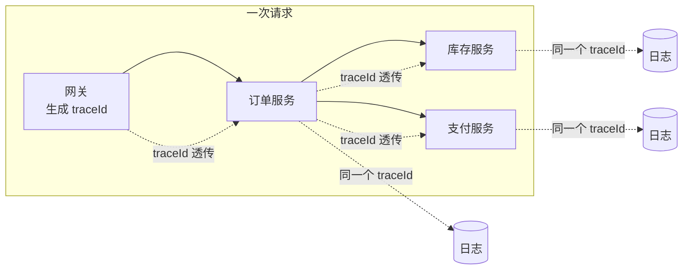
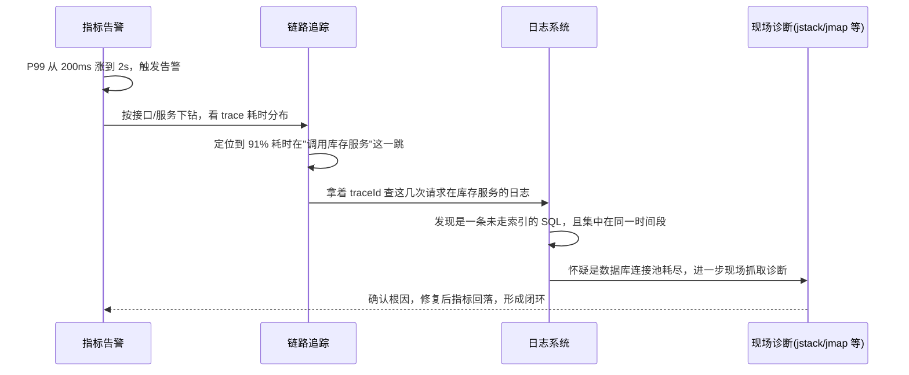

# 日志、指标、链路追踪怎么分工？

> 很多人把日志、指标、链路追踪当成三个可以互相替代的"监控工具"，但它们回答的其实是三个完全不同的问题。

半夜收到一条报警：某个接口 P99 突然从 200ms 涨到 2s。接下来你会做什么？

如果答案是"打开日志系统搜一下"，大概率会卡住——报警只告诉你"慢了"，没告诉你是哪一次请求、卡在哪个下游、是不是所有请求都慢。如果答案是"登上机器抓一下 jstack"，也大概率白抓——问题可能根本不在这台机器的线程栈上，而在下游数据库的一条慢 SQL 上。

这篇要讲清楚的就是：日志、指标、链路追踪各自回答什么问题，为什么谁都替代不了谁，以及一次真实排障应该按什么顺序把三者串起来用。

## 先明确一件事：三支柱不是三个工具，是三种数据形态

"可观测性三支柱"（Logs / Metrics / Traces）说的不是三个具体产品，而是三种从系统里拿到的信号，形态完全不同：

| 维度                 | 日志 Logs                      | 指标 Metrics                     | 链路追踪 Traces                          |
| -------------------- | ------------------------------ | -------------------------------- | ---------------------------------------- |
| 数据形态             | 离散的事件文本，一条记录一件事 | 随时间变化的数值序列（时序数据） | 一次请求在多个服务间的调用树             |
| 典型问题             | "这次请求到底报了什么错"       | "现在系统状态正不正常"           | "这次请求慢在哪一跳"                     |
| 存储/查询成本        | 高（全量文本，检索慢）         | 低（数值 + 聚合，压缩率高）      | 中等（按 trace 采样、按 traceId 检索快） |
| 能不能直接拿来告警   | 不适合（需要先结构化再计数）   | 天然适合（阈值、同比、突增）     | 不适合（更适合下钻，不适合做第一道告警） |
| 能不能看单次请求全貌 | 能（如果日志里带了请求标识）   | 不能（只有聚合后的整体趋势）     | 能（这是它存在的核心价值）               |
| 能不能看长期趋势     | 弱（要额外聚合）               | 强（这是它的强项）               | 弱（trace 一般只保留短期采样）           |

一句话概括三者定位：**指标负责"发现异常"，链路追踪负责"定位异常发生在哪一跳"，日志负责"还原这一跳到底发生了什么"。**

## 指标：回答"现在正不正常"，但说不清"为什么"

指标是把大量事件压缩成几个数字：QPS、RT、P99、错误率、CPU 使用率、GC 次数、线程池活跃数、连接池等待时间……

它的强项是**便宜、能长期存、能直接拿来算阈值和画趋势图**。所以线上报警系统几乎全部建立在指标之上——没有人会拿"日志里出现了多少条 ERROR"去做秒级告警，成本扛不住，但拿"每分钟错误率"去告警完全没问题。

但指标有一个天生的短板：**它只能告诉你"发生了什么量级的异常"，不能告诉你"是哪一次请求、卡在哪个环节"。** P99 涨到 2s，指标能看出来，但看不出是订单服务慢还是它调用的库存服务慢，更看不出是哪个用户的哪次请求触发的。

这也是[压测专题](./high-availability-performance-testing.html)里反复强调"不能只看 QPS"的同一个道理：指标本身没有细节，只有把它分层看（用户体验层、应用资源层、依赖资源层、保护动作层、业务结果层），才能大致判断问题出在哪一层，但具体是哪一跳、哪一行代码，指标给不出答案。

## 链路追踪：回答"慢在哪一跳"，但不负责"为什么慢"

一次请求从网关进来，经过订单服务、库存服务、支付服务、数据库、缓存……链路追踪做的事情就是把这一整条调用路径串起来，记录每一跳（span）的开始时间、结束时间、调用方是谁、被调用方是谁。

它解决的是指标解决不了的问题：**指标只知道"订单接口整体变慢了"，链路追踪能具体指出"这次调用里，91% 的耗时花在了调用库存服务这一跳上"。** 这就把排查范围从"整个系统"收窄到了"某一个服务、某一个下游依赖"。

但链路追踪也有边界：它记录的是"哪一跳耗时多"，不记录"这一跳内部具体发生了什么"。库存服务这一跳耗时 1.8s，是因为一条慢 SQL、一次锁等待，还是一次 Full GC？链路追踪的 span 通常给不出这个细节，最多附带几个关键标签（tag），真正的现场还原要靠日志。

链路追踪能落地，核心是靠一个贯穿全链路的标识——通常叫 `traceId`。网关生成一个 `traceId`，通过 HTTP Header 或 RPC 上下文一路透传到下游所有服务，每个服务在打日志、上报 span 时都带上这个 `traceId`。这也是三支柱之间**唯一的强关联点**：

只要每条日志都打了 `traceId`，链路追踪系统里看到"库存服务这一跳慢"之后，就能拿着这个 `traceId` 直接去日志系统里过滤出这次请求在库存服务里打印的所有日志，不用再去猜是哪一次调用、大海捞针地搜时间段。

## 日志：回答"这一跳具体发生了什么"，但扛不住当监控用

日志是最原始、信息量最大的信号：异常堆栈、SQL 语句、入参出参、业务分支判断……只要打了日志，几乎什么细节都能还原。

正因为信息量大，它也是三者里**成本最高、最不适合直接拿来做全局监控**的一种：

- 日志量随流量线性增长，全量存储和检索的成本远高于指标。
- 没有天然的聚合能力，想知道"今天错误率多少"得先把日志结构化、抽字段、再聚合计数——这其实是把日志硬生生转成了指标。
- 排查未知问题时好用（细节全），但发现"系统是不是在异常"这件事上很弱——没有人会靠肉眼盯着日志流去发现 P99 变高了。

所以日志的正确用法是**"带着明确线索去查"**，而不是"从头到尾盯着看"。这个线索通常就是上面说的 `traceId`，或者是指标/追踪系统给出的时间窗口、服务名、接口名。

## 为什么谁都替代不了谁：三个反例

光说"分工不同"比较抽象，看三个具体反例更直观：

**反例一：想用指标替代链路追踪。** 给每个下游依赖都打上 RT 指标（调用库存服务的 RT、调用支付服务的 RT），是不是就不需要链路追踪了？在链路很浅（比如只有两三层调用）时确实够用。但真实系统里一次请求经常要穿过 5-10 个服务，A 调 B、B 调 C、C 又调 D，每一跳都在正常范围内，但因为是串行调用，累加起来整体就慢了。指标只能看到"A 调 B 平均 50ms"这种局部数字，看不到"这一次具体请求里，B 调 C 花了 800ms 而 A 调 B 只花了 20ms"这种单次调用树全貌。这就是为什么调用链一旦有深度，链路追踪是没法用指标拼出来的。

**反例二：想用日志替代指标做告警。** 把错误日志实时抽取、按分钟计数，理论上也能做出一条"错误率"曲线。但这本质上是把日志现抽成了指标，且这套额外的实时聚合链路本身就要花成本去建、去维护——还不如直接在业务代码里用 Micrometer 之类的库直接打点上报指标，路径更短、延迟更低、也不用依赖日志采集管道是否稳定（大促期间日志采集管道本身也可能积压或丢数据，指标上报通常走独立、更轻量的链路）。

**反例三：想用链路追踪替代日志做细节还原。** 链路追踪的 span 上确实能挂一些 tag（比如 SQL 语句摘要、HTTP 状态码），看起来好像能替代日志。但 span 的数据量和保留时间通常是被严格控制的（下面会讲为什么），塞进去的 tag 数量和长度都有限制，没法把一次调用里完整的入参、出参、异常堆栈都塞进去。真正复杂的现场信息，还是得靠日志。

## 链路追踪为什么要采样，这对排障意味着什么

链路追踪看似"全量记录了每一跳"，但真实系统里几乎不会对 100% 的请求都完整采集 trace——原因很直接：调用链数据量随 QPS 和链路深度指数级增长，全量采集和存储的成本极高，对高 QPS 服务来说往往是不可承受的。

所以实际做法通常是**采样**：只完整记录一部分请求的 trace（比如 1%，或者对失败请求、慢请求做更高比例的采样），其余请求只留最基础的统计信息。这带来一个直接后果：**用户反馈的某一次慢请求，链路追踪系统里不一定正好采样到了。** 这也是为什么排障时经常要退而求其次——按接口名和时间窗口去看同类请求的整体 trace 分布，而不是精确对上用户报的那一次。这也再次说明，指标（覆盖 100% 请求的整体趋势）和链路追踪（采样后的个例样本）是互补关系，不能只依赖一个。

## 三层信号串起来：一次真实排障是怎么下钻的

把三支柱按"发现 → 定位 → 还原"的顺序串起来，就是一次典型的排障路径：

这条链路对应的正是**指标发现异常 → 链路追踪定位是哪一跳 → 日志还原这一跳具体发生了什么**的完整下钻过程。缺了任何一环，排障效率都会明显下降：

- 没有指标：只能等用户投诉才知道系统慢了，发现问题的时间被大幅推后。
- 没有链路追踪：知道"订单接口慢"，但要靠人工经验去猜是哪个下游，跨服务排查全靠口头沟通。
- 没有日志（或日志没带 `traceId`）：知道是库存服务慢，但要靠时间段去日志里"大海捞针"，一次大促期间的日志量能把人淹死。

## 三支柱之外：现场诊断工具是"深度还原"的最后一层

排障走到"确认是某台机器、某个进程有问题"这一步之后，有时还需要更深一层的现场信息，比如：这个进程当前的线程都卡在哪、堆里到底堆积了什么对象、GC 频率是不是异常。这一层工作通常靠 JDK 自带的一批命令行和图形化工具完成：

| 工具                | 用来看什么                               | 典型使用时机                              |
| ------------------- | ---------------------------------------- | ----------------------------------------- |
| `jstat`             | GC 次数、各代内存使用率、类加载数量      | 怀疑 GC 频繁、内存分代不合理              |
| `jstack`            | 当前所有线程的堆栈快照                   | 怀疑线程死锁、卡在某个阻塞调用上          |
| `jmap`              | 堆内存转储（heap dump）                  | 怀疑内存泄漏，需要离线分析对象引用链      |
| `jinfo`             | 查看/动态调整 JVM 参数                   | 怀疑某个 JVM 参数配置有问题，不想重启验证 |
| JConsole / VisualVM | 图形化整合以上信息，还能做方法级性能分析 | 需要边看边操作，或者做更细的 Profiling    |

这批工具容易被误当成"JVM 监控系统"，但它们和前面说的指标系统其实不是一回事，边界要分清楚：

- 它们大多是**手动登录到目标机器、当场执行一次命令**才能拿到结果的"快照型"数据，不会自己持续采集、也不会自动保留历史——机器重启或者进程退出，现场往往就没了。
- 它们不具备告警能力。没有人会指望 `jstat` 在半夜自动把 GC 异常推送给你，这件事只能靠指标系统（Micrometer + Prometheus/Grafana 这类持续采集、可配置阈值告警的体系）来做。
- 它们通常是在**指标已经报警、大致定位到某台机器或某个进程之后**才会用到的"最后一公里"诊断手段，不是排障的起点。

所以更准确的说法是：日志、指标、链路追踪是贯穿全链路、常态运行的三支柱；`jstat`/`jstack`/`jmap` 这类工具是定位到具体进程之后的**现场诊断补充手段**，两者不在同一个层面，也不能互相替代。

## 容易踩的坑

### 只堆日志，觉得"打得够多就能查清一切"

日志确实信息量大，但信息量大不等于好用。一次大促期间几十上百 GB 的日志，如果没有结构化字段、没有 `traceId`、检索也慢，出了问题照样翻不出来。日志需要配合指标（先知道该查哪个时间段、哪个服务）和链路追踪（先知道该查哪个 `traceId`）才真正好用，单靠堆日志量解决不了"怎么快速定位"的问题。

### 只盯 CPU、只看 JVM 层指标，业务是死是活不知道

不少排障习惯是：报警一来先看 CPU、内存、GC，觉得这些绿了就没事。但 CPU 不高不代表业务没问题——线程可能卡在等下游超时上（CPU 空闲），连接池可能已经打满（CPU 依然正常），一条慢 SQL 可能正在拖垮数据库（应用自己的 CPU 完全无感）。JVM 层指标只是"应用资源层"的一部分，不能替代对下游依赖和业务结果的观测。

### 没有业务指标，技术指标全绿但业务已经在出问题

这是[压测专题](./high-availability-performance-testing.html)也强调过的坑：QPS、RT、错误率都正常，不代表下单成功率、支付成功率正常。技术层面"接口返回了 200"和业务层面"这笔订单真的成功了"是两件事，只监控技术指标，业务故障可能要等用户投诉才发现。

### 三支柱各建各的，traceId 没有贯穿

日志系统一套、指标系统一套、链路追踪系统一套，各自独立部署没问题，但如果日志里没有统一打印 `traceId`，链路追踪定位到问题请求之后就没法跳转到对应日志，三套系统事实上是断开的，排障还是得靠人工猜时间段去日志里搜，体系化监控的效率优势基本发挥不出来。

### 把"能采集到"当成"能查得到"

不少团队接了 SkyWalking、Zipkin 之类的链路追踪组件，或者上了 ELK 收日志，就觉得可观测性建设完成了。但采集只是第一步，`traceId` 有没有在所有服务里透传完整（尤其是跨线程池、跨 MQ 消费的场景很容易断链）、日志字段有没有结构化到能被检索、异步调用和定时任务这类没有天然入口的场景有没有被纳入追踪，这些细节没打磨，工具装上了也只是"看起来有监控"。

## 和限流熔断、压测专题的关系

三支柱不是孤立的"监控功能"，而是[限流熔断](./high-availability-resilience-composition.html)和[压测](./high-availability-performance-testing.html)这些高可用手段能不能落地的前提：

- **限流熔断的阈值从哪来**：不是拍脑袋定的，而是从历史指标（正常水位的 QPS、RT、错误率）和压测得到的稳定上限反推出来的。没有指标数据支撑，限流阈值只能瞎猜。
- **限流熔断生不生效，也要靠指标验证**：保护动作触发之后，"限流命中数""熔断状态""降级命中率"本身就是一组指标，报警系统要能看到这些保护动作是不是按预期工作，而不是靠事后翻日志才知道熔断到底开没开。
- **压测报告的核心内容就是这三层信号**：压测时看的 P99、成功率是指标；定位压测过程中的瓶颈节点要靠链路追踪（这条链路里哪一跳先撑不住）；具体报错、慢 SQL 的细节要靠日志。压测能不能给出"稳定上限在哪、瓶颈资源是什么"这种有价值的结论，本质上就是在检验这套可观测性体系是不是真的搭起来了。

反过来说，如果一个系统平时都没有指标、追踪、日志的联动，压测和限流熔断的演练也很难做到位——压是压上去了，但看不清瓶颈在哪、保护动作有没有生效，压测就退化成了"跑了个数字，然后呢"。

## 小结

- 三支柱回答的是三个不同问题：指标回答"现在正不正常"，链路追踪回答"慢/错在哪一跳"，日志回答"这一跳具体发生了什么"，三者互补而非互相替代。
- `traceId` 是把三者串起来的关键：网关生成后透传到全链路，日志和链路追踪的 span 都带上它，才能做到"从告警一路下钻到具体日志"。
- 一次标准排障路径是：指标告警发现异常 → 链路追踪定位是哪个服务/哪一跳 → 日志还原这一跳的具体细节 → 必要时用 `jstack`/`jmap` 这类现场诊断工具做最后一公里的深度还原。
- `jstat`/`jstack`/`jmap`/JConsole/VisualVM 这类 JDK 工具是手动触发的"快照型"诊断手段，不具备持续采集和告警能力，不能当成指标系统的替代品。
- 只堆日志、只盯 CPU/JVM 指标、没有业务指标，是三个最常见的可观测性建设误区，本质都是"只看了一层信号，就以为看到了全貌"。
- 链路追踪一般是采样而非全量记录，用户报的某一次慢请求不一定正好被采样到，这也是它没法单独替代指标（覆盖全量趋势）的原因之一。

## 参考

综合自仓库内 JDK 监控与故障处理工具等公开文档，并结合可观测性、分布式链路追踪和 SRE 相关工程实践，对日志、指标、链路追踪的分工边界、`traceId` 贯穿机制、排障下钻路径以及 JDK 现场诊断工具与指标系统的边界做了交叉验证与改写。
